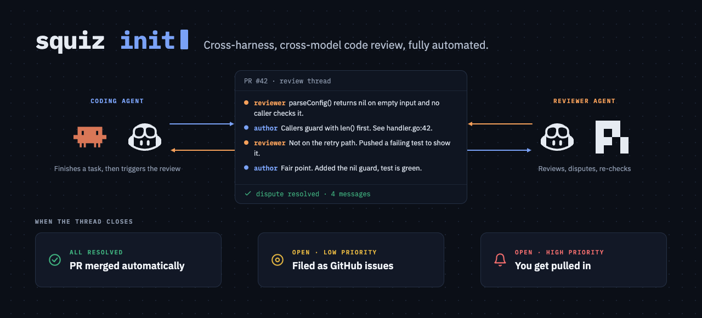

# Squiz



Squiz is a fully automated code review. When your coding agent finishes its
work, a reviewer on a different harness and a different model reviews the pull
request, and the two work every finding out in its review thread. It works as a
plugin for Claude Code and for the GitHub Copilot CLI.

> [!WARNING]
> Squiz is experimental. Expect bugs, and expect commands and settings to change
> between versions. Its Copilot support is experimental too, because it relies on
> Copilot's experimental features.

## Prerequisites

- `git`, and a repository with a GitHub remote.
- `gh`, signed in (`gh auth login`).
- Node 24 or later.
- Claude Code or the Copilot CLI, to run the coding agent.
- [`pi`](https://github.com/earendil-works/pi#readme) or the Copilot CLI, to run
  the reviewer.
- Optionally tmux or Herdr, to watch each review in a pane of its own. Without
  either, a review runs in the background and writes a log.

## Install

Into Claude Code:

```sh
claude plugin marketplace add jacygao/squiz
claude plugin install squiz@squiz
```

Claude Code puts `squiz` on the `PATH` of its own shell, which you reach by
typing a command after `!` in a session. To run `squiz` from your own terminal,
or from Copilot, type `! squiz init` in a Claude Code session. It links
`~/.local/bin/squiz`, or `~/bin/squiz`, to the squiz Claude Code runs. After
each update, start a new Claude Code session and type it there again, because
the link keeps running the old version until you do. `! squiz doctor` warns
until then.

Into Copilot:

```sh
copilot plugin marketplace add jacygao/squiz
copilot plugin install squiz@squiz
copilot --experimental
```

`--experimental` turns Copilot's experimental features on for every later
session, and without them a Copilot session is never woken when its review
ends. `/experimental on` in a session does the same. Copilot does not put
`squiz` on its shell's `PATH`, so link it once on each machine. Where Claude
Code has squiz too, use `! squiz init` as above. Where only Copilot has it, run:

```sh
~/.copilot/installed-plugins/squiz/squiz/bin/squiz init
```

Use your own `COPILOT_HOME` in place of `~/.copilot` if you set one.

## Set up a project

The coding agent runs three commands: `squiz review`, `squiz threads` and
`squiz reply`. Allow those, so it is not asked each time. In Claude Code, put
this in the project's `.claude/settings.json`:

```json
{
  "permissions": {
    "allow": ["Bash(squiz review *)", "Bash(squiz threads)", "Bash(squiz reply *)"]
  }
}
```

In Copilot, start the session with:

```sh
copilot --allow-tool='shell(squiz review:*)' --allow-tool='shell(squiz threads)' --allow-tool='shell(squiz reply:*)'
```

These rules open up those three commands and nothing else. They start reviews
and post replies on GitHub as you. Every other `squiz` command still asks, and
so does a command chained after one of these with `&&` or `;`, because Claude
Code checks each part on its own.

The coding agent needs no instruction. A review starts each time it finishes its
work on a branch with an open pull request.

## Configure squiz

Every setting has a default, so a project needs no configuration file. To change
one, put `.squiz.json` at the root of the repository:

| Setting | Default | Range |
|---|---|---|
| `reviewer` | `pi` | The reviewer CLI, `pi` or `copilot` |
| `rounds` | 3 | The most rounds one review runs, 1 to 8 |
| `timeout` | 900 | Seconds one round's reviewer may run, 60 to 3,600 |
| `tokens` | 10,000,000 | Tokens one round may spend, 100,000 to 10,000,000 |
| `thinking` | `medium` | How hard the reviewer thinks: `off`, `minimal`, `low`, `medium`, `high`, `xhigh` or `max` |
| `model` | none | The model the reviewer runs on, in its CLI's spelling: `openai/gpt-5-mini` for `pi`, `gpt-5-mini` for Copilot. Up to 200 letters, digits and `.` `_` `:` `/` `@` `+` `-`, starting with a letter, a digit or `@`. None runs it on the CLI's own default |

This one reviews with Copilot on a chosen model:

```json
{
  "reviewer": "copilot",
  "model": "gpt-5-mini"
}
```

A value outside its range, or a key not in the table, is refused with an error
naming it. Nothing checks that the reviewer's model differs from the coding
agent's. Where Copilot writes and reviews, or its default model is the one
Claude Code runs, set `model` to one the coding agent does not use.

## Check the setup

Run `squiz doctor` in the repository you want reviewed: `! squiz doctor` in
Claude Code, or `squiz doctor` in a shell once `squiz init` has linked it. It
prints a line for each dependency and exits 1 where a required one is missing
or signed out:

```
git 2.54.0
gh 2.97.0, signed in as jacygao
Claude Code 2.1.292
Node 24.15.0
tmux 3.7b
Herdr 0.9.3
squiz link: none on PATH. Not required in Claude Code, whose own shell runs squiz; for another coding agent, run squiz init
Reviewer copilot 1.0.93, model gpt-6-astra, Copilot's default. Signed in; the check spent one request on gpt-5-mini
```

The last line names the reviewer and the model it will run on, read from
`.squiz.json`. For a Copilot reviewer, it checks the sign-in by sending one
prompt to `gpt-5-mini`, which costs about 0.35 AI credits. Where the Copilot
CLI is installed, a line after Claude Code's says whether its experimental
features are on, and warns where they are off.

## What you see

Each finding is a review thread on the line it is about, or on the whole file.
The coding agent fixes it or answers in the thread, and the reviewer's next
round confirms the fix and resolves the thread. A finding about the change as a
whole has no thread, and goes under "Notes" in the summary comment squiz posts
when the review ends. The summary also says what was fixed, what is still open,
what it cost, and what each round did. What it lists under "Needs a person" and
"Notes" is for you.

[Pull request #690](https://github.com/jacygao/squiz/pull/690) on this
repository shows all of it: three findings, the coding agent's fix for each,
the reviewer confirming each one, and two summaries.

`squiz status` lists the reviews running and finished in every worktree of the
repository.

## Contributing

Contributions are welcome. To work on squiz, load it from a checkout:

```sh
claude --plugin-dir <checkout>
```

Point it at a checkout outside the repository you are working in, because
`--plugin-dir ./` makes auto mode refuse subagent writes. Run `npm run typecheck`
and `npm test` before opening a pull request. The design, with every setting and
what each command prints, is in [`docs/specs/`](docs/specs/).
