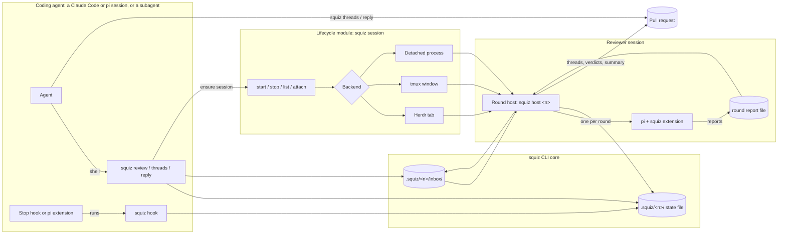

# Multi-Agent Design: Reviewer Sessions, an Agent-Lifecycle Module, and an Agent-to-Agent Protocol

**Version:** 0.1 (draft)
**Status:** For review
**Owner:** TBD

---

## 1. Purpose

**Each reviewer becomes a session of its own, which a person can watch and which
outlives whatever asked it to review.** Today the reviewer is a headless `pi`
that `squiz review` or the `SubagentStop` hook starts as a child, and it runs
inside a coding agent's shell call or a hook. That placement is where every hard
limit of the current design comes from: the 600-second window, the 480-second
time bound, the hand-back that drops a block (#278), and the helper firings
(#265).

This document designs the model #277 sets out:

- **The squiz CLI stays the core.** `squiz review`, `threads`, `reply` and
  `status` do the work, as `review-harness-spec.md` at version 0.56 (#290)
  specifies them. That document is "the harness spec" below.
- **An agent-lifecycle module starts and stops sessions.** It sits beside the
  CLI. The CLI calls it the way it calls `gh`, as a command.
- **Each reviewer is its own `pi` session**, in a Herdr tab or a tmux window,
  and in a detached process where neither exists.
- **Completion of work triggers a review**, whether a subagent finished it or a
  main session did. The trigger asks a reviewer session for a review and does
  not run one itself.
- **Agents talk through a protocol of their own.** GitHub stays the record of
  the review.

Nothing here is built yet. § 10 lists the facts that are not established, and
the spike that settles each one.

## 2. Decisions for the owner

Each has a recommendation, and the section that argues it.

| # | Decision | Recommended | Where |
|---|---|---|---|
| D1 | The protocol: an inbox of files, Herdr's socket, the pull request's threads, or a mix | A mix. Content on the pull request, signals in an inbox of files under `.squiz/`, and each runtime woken through its own hook or extension | § 5 |
| D2 | Where a round runs | In a round host that lives in the reviewer session's pane, outside every caller's process tree | § 3 |
| D3 | Whether a reviewer keeps its context from one round to the next | No. A long-lived pane, and a fresh `pi` for every round | § 5, Independence |
| D4 | Whether the reviewer reviews the coding agent's worktree or a snapshot of the head commit | A snapshot, in a worktree of the reviewer's own | § 6, Confinement |
| D5 | What replaces the time bound | A wall-clock guard the project sets, with no ceiling, and the token bound enforced while the round runs | § 8 |
| D6 | What `squiz review` does when its wait runs out | A new exit status 4, "still reviewing, run the command again", and a rerun attaches to the same round | § 4, `squiz review` |
| D7 | Whether the lifecycle module starts coding sessions, or reviewer sessions alone | Reviewer sessions alone, first. Coding sessions come from a person, firstmate, or a later milestone | § 3 |
| D8 | Whether the reviewer may answer a disputed thread in words | Yes, as an optional reply carried by an `open` verdict | § 5, Disputes |
| D9 | Whether the lifecycle module is its own binary or a subcommand of `squiz` | A subcommand group, `squiz session`, living in its own directory that the core never imports | § 3 |
| D10 | Whether Herdr's own `pi` extension loads into the reviewer | Not decided. It is what makes Herdr show the reviewer's state, and it breaks the rule that only squiz's extension loads | § 6, Visibility |
| D11 | Whether the `SubagentStop` registration stays once sessions exist | Yes, as the trigger for subagent coders, until no supported coordinator dispatches subagents | § 4 |

## 3. Components and boundaries



### The squiz CLI core

Everything the harness spec puts in a round stays in the core: the gate on the
pull request, the state file and its record per pull request state, the round
cap and the token bound, posting findings and applying verdicts, the summary
comment, the failure comment, and the exit statuses. The core owns
`.squiz/<number>/`. The one other writer there is the reviewer's extension,
which appends to the round's report file and the progress log.

The core gains one command, `squiz host <number>`, which is the round host
below. It runs core code and is part of the core. The lifecycle module starts
it, and nothing else does.

### The lifecycle module

`squiz session` starts, lists, attaches to and stops sessions. It knows terminal
backends and processes, and knows nothing about pull requests, findings or
rounds. The core calls it as a subprocess, with a name, a working directory, a
command line and an environment, and gets back a handle. It never imports core
code, and the core never imports it.

```
squiz session start --name squiz-41 --cwd <worktree> -- squiz host 41
squiz session list
squiz session attach squiz-41
squiz session stop squiz-41
```

A session's record lives in `.squiz/sessions/<name>.json`: the backend, the
backend's own identifier for the pane or window, the round host's pid and start
time, and the path of its progress log. A pid with its start time is the
identity, as the harness spec's reviewing record already uses it.

The module starts reviewer sessions. Starting coding sessions, which firstmate
does, is D7.

### The reviewer session

A reviewer session is one pane, or one detached process, per episode. It runs
the round host, and the round host runs one `pi` per round.

- **The round host** waits for requests in the inbox, runs a round for each,
  and writes the outcome. It is the process the harness spec calls the one
  running the round. It is the parent of every `pi` it starts, so the
  process-group handling in the harness spec § 4 Confinement applies to it
  unchanged.
- **The reviewer** is `pi` with squiz's extension, started fresh for each round.
  In a pane it inherits the pane's terminal and draws its interface there, so a
  person sees the review as it happens. Detached, it runs headless.

The pane outlives each `pi`. Between rounds only the round host runs, and it
spends nothing.

### Coding agents

A coding agent is a Claude Code session, a `pi` session, or a Claude Code
subagent. It works the review the way the harness spec § 3 describes: it reads
open threads with `squiz threads` and `squiz review`, replies with
`squiz reply`, and pushes. Nothing about how it works the threads changes. What
changes is how it learns that a review is ready (§ 5).

### Triggers

A trigger tells a reviewer session that a pull request has a state to review. It
never runs a round. § 4 lists them.

### Who talks to whom

| From | To | Through | Carries |
|---|---|---|---|
| Trigger, or `squiz review` | Round host | The inbox | A pointer: the pull request and the state to review |
| Round host | GitHub | `gh` | The findings, the verdicts, the summary and the failure comment |
| Round host | Coding agent | The inbox, then the runtime's wake | A pointer: the outcome and the open thread identifiers |
| Coding agent | GitHub | `squiz reply`, `git push` | Replies and commits |
| Core | Lifecycle module | A subprocess | Start, stop, list |
| Person | Reviewer pane | The terminal | Whatever the person types. § 6 says what that means |

## 4. Triggers

**Every trigger does the same two things.** It resolves the pull request whose
head is the branch checked out in its working directory, and it writes a
`review-ready` message for that pull request's current state. Where no reviewer
session is running for the pull request, it starts one through the lifecycle
module first. The harness spec's one-review-per-state rule makes a trigger that
fires twice for one state cost nothing: the second finds the state reviewing or
reviewed, and writes nothing.

| Trigger | Fires when | Can deliver the outcome |
|---|---|---|
| `squiz review <number>` | The coding agent, a coordinator or a person runs it | Yes, by waiting for it |
| Claude Code `Stop`, registered with `asyncRewake` | A main session's turn ends | Yes, by waking the session (§ 5) |
| Claude Code `SubagentStop` | A subagent's turn ends | Outside auto mode only (#278) |
| squiz's coding-side `pi` extension, on `agent_settled` | A `pi` coding session settles | Yes, by injecting a follow-up (§ 5) |

A turn ending is not work being complete. A turn ends when the agent asks a
question too. A trigger acts only where the branch has an open pull request whose
state has no record, so a turn that pushed nothing starts nothing.

### `squiz review`

`squiz review <number>` gates on the pull request, as the harness spec § 3
step 1 does. It then reads the record for the state:

- **No record, or failed:** it ensures the reviewer session, writes
  `review-ready`, and waits.
- **Reviewing:** it waits.
- **Reviewed:** it prints the result and exits as the harness spec § 6 says.

It waits on the state file's record, not on a process. The wait is bounded by
the caller's shell timeout, and the review is not. Where the wait runs out
before the record is reviewed or failed, the command prints one line and exits 4:

```
Full output: /work/squiz/.squiz/41/review.txt
Squiz is still reviewing PR #41 at 3f9c2e0, in session squiz-41. Run `squiz review 41` again to wait for it.
```

The wait defaults to 540 seconds, under Claude Code's longest shell timeout, so
the command ends on its own before the shell moves it. The exit status is D6.
The harness spec's exit table reads every status outside 0, 2 and 3 as "could
not run", so the skill and the `AGENTS.md` text gain a line for 4.

`squiz review --no-wait <number>` writes `review-ready` and exits 4 at once. A
coordinator uses it, and so do the hooks below.

### Claude Code `Stop`

A Claude Code session that a person or a coordinator started is a main session,
and its turn ending fires `Stop`, not `SubagentStop`. Squiz registers
`squiz hook` on `Stop` with `asyncRewake: true`:

```json
"Stop": [
  {
    "hooks": [
      {
        "type": "command",
        "command": "${CLAUDE_PLUGIN_ROOT}/bin/squiz hook",
        "asyncRewake": true,
        "timeout": 86400
      }
    ]
  }
]
```

Claude Code documents `asyncRewake` as running the hook "in the background" and
waking the session "on exit code 2", with the hook's stderr shown to it. The
hook therefore does three things:

1. Triggers, as above.
2. Waits for the coder's inbox to receive a message about the state it
   triggered, and reads the state file every few seconds in case it missed one.
   The turn has already ended and the agent is idle, so the wait holds nothing
   up.
3. Exits 2 with a pointer where threads are open, and 0 otherwise:

   ```
   Squiz reviewed PR #41 at 3f9c2e0: 2 threads are open. Run `squiz review 41` to read them.
   ```

`squiz review 41` then returns the recorded result and starts no round.

Claude Code does not deduplicate background hooks, so a session that ends three
turns while one round runs has three waiters. Each waits for the state it
triggered. A waiter whose state is no longer the pull request's current state
exits 0 and says nothing, so only the newest wakes the agent.

The `SubagentStop` registration stays, as the harness spec specifies it, for
coordinators that dispatch subagents. It can trigger a review, and in auto mode
it cannot deliver one (#278). Such a subagent learns the outcome by running
`squiz review` itself, as the skill tells it to. Whether it stays is D11.

### `pi` as the coding agent

Squiz ships a second `pi` extension, for coding sessions, beside the reviewer's.
On `agent_settled` it runs `squiz hook --event pi-settled`, which triggers as
above and returns at once. It watches the coding agent's inbox, and on a
`threads-open` message it calls
`pi.sendUserMessage(pointer, { deliverAs: "followUp" })`. firstmate's `pi`
watcher wakes its first mate the same way.

## 5. The agent-to-agent protocol

### The recommendation

**Content goes on the pull request, signals go in an inbox of files, and each
runtime is woken through its own hook or extension.** This is D1.

- **The pull request holds every finding, verdict and reply**, as the harness
  spec § 1 has it. Nothing in the protocol carries a finding's text. A message
  that went missing loses no part of the review.
- **The inbox carries pointers.** A message names a pull request, a state and
  thread identifiers, and nothing else. It wakes an agent and tells it where to
  look.
- **The state file is the truth, locally.** Every message restates something the
  state file already records. A reader that missed a message reads the state
  file and loses nothing. `squiz review` is that reader.
- **The wake is the runtime's own.** Claude Code is woken by an `asyncRewake`
  hook's exit 2, and `pi` by an extension's `sendUserMessage`. Nothing types
  into an agent's terminal.

### What the inbox looks like

`.squiz/<number>/inbox/<recipient>/` holds one file per message, and
`<recipient>` is `reviewer` or `coder`. A message is written to a temporary name
and renamed into place, so a reader never sees half of one. The reader moves a
message into `handled/` once it has acted on it. This is firstmate's steering
inbox, where the move is the acknowledgement.

```
.squiz/41/inbox/reviewer/0007.msg
.squiz/41/inbox/reviewer/handled/0006.msg
.squiz/41/inbox/coder/0004.msg
```

```
schema=squiz-inbox.v1
at=2026-10-03T08:14:02Z
kind=threads-open
pr=41
head=3f9c2e07b1d4a8c6e5f0923b7a1d6c4e8b2f5a90
activity=IC_kwDOL7tYbc6OmQx7a
round=2
threads=PRRT_kwDOL7tYbc5abcd1 PRRT_kwDOL7tYbc5abcd2
```

The round host watches its inbox with a file watch, and reads it again every
few seconds as well, because a watch can miss an event.

### What it carries

| Message | From | To | Means |
|---|---|---|---|
| `review-ready` | A trigger, or `squiz review` | Reviewer | This state of the pull request has no review. Run a round for it. |
| `reply-posted` | `squiz reply` | Reviewer | A reply landed on one of the reviewer's threads. It is a new state under the harness spec § 3, so the round host treats it exactly as `review-ready` for that state. |
| `re-review` | A person, a coordinator, or `squiz review` | Reviewer | Review a state whose last round failed. It never re-runs a state that was reviewed, which stays one review per state. |
| `threads-open` | Round host | Coder | The round left these threads open. Work them. |
| `closed` | Round host | Coder | The episode closed: nothing open, or the round cap or token bound reached with threads open. Stop requesting reviews. |
| `failed` | Round host | Coder | The round failed, with the reason the failure comment gives. |
| `stop` | A person, a coordinator, or the lifecycle module | Reviewer | End the session once the running round ends. `stop --now` ends the running round as a failed one, with a failure comment. |

The harness spec's exit statuses map onto the coder's messages: `threads-open`
is exit 2, `closed` is exit 0 or 3, and `failed` is exit 1.

### Disputes

**A dispute is settled on the pull request, a round at a time, and the round cap
bounds it.** This is how the harness spec § 3 already settles one, and nothing
about sessions changes it.

1. The coding agent replies on a thread with `squiz reply`, to disagree.
2. That reply is a new state, and `reply-posted` asks for a round.
3. The round reads the reply and rules `withdrawn` or `open`.
4. Every such round counts against the cap. At the cap the episode closes, and
   the summary lists the thread as `disputed`, for a person.

Two things bound a dispute, and both stay:

- **The round cap** bounds how many times the two agents exchange. It is the
  only bound on the length of a dispute, and sessions give it no reason to go.
- **The token bound** bounds what one exchange spends. § 8 says how it changes.

Today a reviewer that rules `open` says nothing about why. D8 lets an `open`
verdict carry an optional reply, which the round host posts on the thread, so
the coding agent reads an argument rather than a bare re-open. The reply is part
of the verdict, so it costs no extra round.

### Independence

**Each round starts cold.** The round host starts a fresh `pi` for every round,
and nothing of the last round's conversation reaches it. What it knows of
earlier rounds is the threads it is handed, as the harness spec § 4 sets out.
The protocol carries no content, so nothing the coding agent says reaches the
reviewer except on the pull request.

A warm reviewer, one `pi` session carried across rounds with `--session-id`,
would be cheaper on a large change and no longer reviewing cold. That is D3.

### Alternatives considered

| Protocol | Works without Herdr | Wakes an idle agent | Survives a restart | Why not alone |
|---|---|---|---|---|
| **The inbox of files** | Yes | Only with a per-runtime wake | Yes | It is half of the recommendation. Without a wake it is a mailbox nobody checks. |
| **Herdr's socket API** | No | Yes, by typing into the agent's pane with `agent prompt` | No. Its event history is not durable, and a slow reader gets `events_lost` and is disconnected | It ties the protocol to one pre-1.0 tool whose minor releases still break its socket methods. Typing into a terminal user interface is the least reliable way to deliver text, and firstmate keeps only a constant doorbell line there for that reason. |
| **The pull request's threads** | Yes | No. Every agent would poll GitHub | Yes | It is the record already, and stays so. As the transport it means polling a rate-limited API, and it has no way to wake an idle session. |
| **A mix** | Yes | Yes | Yes | Recommended. Each part does the one thing it is reliable at. |

## 6. Session lifecycle

### Start

The first trigger for a pull request with no live session starts one:

```
squiz session start --name squiz-<number> --cwd <reviewer worktree> -- squiz host <number>
```

The lifecycle module picks a backend:

1. **Herdr**, where `HERDR_SOCKET_PATH` or `HERDR_PANE_ID` is set. It creates a
   tab labelled `squiz #<number>` in the current workspace without focusing it,
   and runs the command in its pane. Herdr's CLI has no flag that creates a pane
   with a command, so the module either calls the socket's `layout.apply`, whose
   pane nodes carry an argv, or creates the tab and sends the command with
   `herdr pane run`.
2. **tmux**, where `$TMUX` is set. It runs
   `tmux new-window -d -n squiz-<number> -c <cwd> '<command>'`, which takes the
   command as an argument rather than typing it.
3. **Detached**, everywhere else, and wherever the configuration asks for it.
   The module starts the round host with a double fork and `setsid` between the
   forks, with its standard streams on `/dev/null`, and records its pid.

**The round host must outlive the trigger that started it.** A trigger runs
inside a coding agent's shell call or a hook, and Claude Code kills both the
command's process tree and its process group when it stops one. A double fork
with `setsid` escaped that kill on Claude Code 2.1.288 on macOS, and nothing
weaker did: a plain `&`, `setsid` alone, `nohup … & disown` and `( nohup … & )`
were all killed (#277's comment of 2026-10-03). A pane that an already-running
Herdr or tmux server creates is a child of that server and not of the command,
so it should escape the same way. That is not measured, and it is spike S1.

### Watch

| Backend | What a person sees | How |
|---|---|---|
| Herdr | `pi`'s own interface, live, in a tab | Switch to the tab. `squiz session attach` focuses it. |
| tmux | The same, in a window | `tmux select-window`, or `squiz session attach`. |
| Detached | A progress log | `tail -f .squiz/<number>/progress.log`. `squiz status` prints the path. |

squiz's reviewer extension writes the progress log in every backend, one line
for each tool call and each finding, so a detached round is followed the same
way a pane is read afterwards. `squiz status` gains a column naming the session
and its backend.

**Visibility in Herdr's agent list depends on D10.** Herdr detects `pi` by
process name and by reports from its own `pi` extension, which holds full
lifecycle authority and switches screen-reading off. The reviewer runs with
`--no-extensions`, so Herdr's extension does not load, and the foreground
process in the pane is the round host rather than `pi`. Setting `HERDR_AGENT=pi`
names the agent for Herdr's process match. Whether Herdr then reports the
reviewer's state, or shows it as unknown, is spike S6.

A person can type into the reviewer's pane, and what they type reaches the
reviewer as `pi` input. It is not a report, it is not recorded, and it can steer
the review. A person who types there has made the review not independent, and
that is theirs to do.

### Stop

The round host ends in four cases:

- The episode closes, which the state file records.
- A `stop` message arrives. It ends after the running round, or at once with
  `--now`.
- The worktree it serves is gone.
- The lifecycle module stops the session.

When the round host ends, it closes its own pane through the backend, where
there is one, so a finished review leaves no tab behind. A setting keeps the
pane open for reading instead.

**A round is stopped the way the harness spec § 4 stops a reviewer.** The round
host signals the reviewer's process group and the groups its shells recorded,
waits a grace, and escalates. It is the reviewer's parent, so nothing about
that changes.

**Closing the pane reaches less than it looks.** Herdr closes a pane by sending
`SIGHUP`, `SIGTERM` and then `SIGKILL` to every process in the pane shell's
session, 250 ms apart. `pi` starts each shell tool in a group of its own, and
whether in a session of its own is not established. A shell that left the
session escapes Herdr's close, so the round host never relies on the pane
close. It signals the groups first, and closes the pane after. What tmux sends
on `kill-window` is not established. Both are spike S4.

### Clean up

- **Kept:** `.squiz/<number>/`, the state file, the round report files, the
  progress log, and `pi`'s session files. They go with the worktree, as the
  harness spec § 3 says.
- **Removed by the round host:** the reviewer's snapshot worktree, where D4
  makes one, and the session record in `.squiz/sessions/`.
- **Removed by the lifecycle module, on `squiz session stop`:** the pane or
  window, and any process still holding the session's identity.

A session record whose round host has gone, by pid and start time, is a dead
session. `squiz session list` reports it, and the next trigger starts a new one.

### Confinement

**At `read` nothing changes.** The tool grant still holds it.

**At `deep` the coding agent is now alive while the reviewer runs.** Today the
coding agent mostly waits inside `squiz review` during a round, so the
tracked-file comparison reads a tree only the reviewer touched. A coding session
woken through a hook can be editing while a round runs. The comparison then
names the coding agent's edits as the reviewer's, and the reviewer reads a tree
that changes under it.

D4 settles this by giving the reviewer a worktree of its own. The round host
adds a detached worktree at the state's head commit before the round, and
removes it after:

```
git worktree add --detach .squiz/41/review-tree 3f9c2e07b1d4a8c6e5f0923b7a1d6c4e8b2f5a90
```

The comparison then runs on that tree alone, which nothing else writes, and the
shared-tree detection has nothing to detect. The cost is that a snapshot has no
build output and no installed dependencies, so the configured test command at
`deep` has to install or build before it tests. What that costs on this
repository and on a larger one is spike S7.

Without D4, the round host runs in the coding agent's worktree as today, and the
skill tells the coding agent not to edit while a round runs. Nothing enforces
that.

## 7. What changes in squiz

Paths are the harness spec's § 8 layout, which #290 adds `src/review/` and
`skills/squiz-review/` to.

### Changed

| Path | Change |
|---|---|
| `src/cli.ts` | Adds `squiz host`, the `squiz session` group, `squiz review --no-wait`, and exit 4. |
| `src/review/` (#290) | `squiz review` writes `review-ready` and waits on the state file's record, not on a child. The wait is bounded; the review is not. The reviewing record names the round host. `squiz status` gains the session column. |
| `src/hook/payload.ts` | Reads `hook_event_name`, so that one entry point serves `Stop` and `SubagentStop`. |
| `src/hook/hook.ts` | The `Stop` path: trigger, wait for the coder's message about the state, exit 2 with the pointer or 0. A waiter for a superseded state exits 0. `SubagentStop` stays as the harness spec specifies it. |
| `hooks/hooks.json` | Adds the `Stop` registration with `asyncRewake`. |
| `src/loop/round.ts` | Runs inside the round host, started by an inbox message rather than by a caller. The three shares of the window go, and posting is bounded by the per-call bound on GitHub alone. |
| `src/loop/window.ts` | Removed, with the window. The wall-clock guard in § 8 replaces it. |
| `src/loop/episode-state.ts` | Records the session, and the outcome each message pointed at. |
| `src/reviewers/round.ts` | Starts `pi` with the pane's terminal, or headless. Reads the round's reports from the report file rather than from stdout. Keeps the deadline, now the wall-clock guard. |
| `src/reviewers/adapter.ts` | `parse(stdout)` becomes a read of the round's report file. An adapter also says how its CLI runs with a terminal and without one. |
| `src/reviewers/pi/argv.ts` | In a pane, drops `--print --mode json` and the `/dev/null` stdin, which interactive `pi` needs to be a terminal. Keeps `--tools`, `--no-extensions`, `--extension`, `--no-approve`, `--thinking` and `--append-system-prompt`. Drops `--no-session` and keeps `--session-dir`, so each round leaves a session a person can reopen with `pi --session`. |
| `src/reviewers/pi/extension.ts` | Appends each accepted report, and the usage of each assistant message, to the round's report file. Writes the progress log. Calls `ctx.shutdown()` after `finish_review`, which `pi` defers until it is idle. Stops the round at the token bound (§ 8). |
| `src/reviewers/pi/stream.ts`, `parse.ts`, `output.ts`, `cost.ts` | Read the report file instead of the JSON stream. The stream's size problem goes with it. |
| `skills/squiz-review/SKILL.md` and the `AGENTS.md` text (#290) | Exit 4 means run the command again. A main session told it will be woken may end its turn. |

### Added

| Path | What it is |
|---|---|
| `src/host/` | `squiz host <number>`: watch the inbox, run a round per request, write the outcome to the state file and the coder's inbox, end when the episode closes. |
| `src/protocol/` | Writing, reading and acknowledging inbox messages, with the format in § 5. |
| `src/sessions/` | The lifecycle module: one backend each for Herdr, tmux and a detached process, and the session records. It imports nothing from the rest of `src/`. |
| `src/reviewers/pi/coder-extension.ts` | The coding-side `pi` extension: trigger on `agent_settled`, and inject a follow-up on `threads-open`. |

### Kept as it is

- **The finding contract**, in `src/findings/`: the three calls, the fields,
  severity, scope and routing.
- **The comment format and every comment**: the threads, the summary comment
  and the failure comment, with their markers.
- **The GitHub client**, in `src/github/`, including the 30-second bound on each
  call.
- **The comparison**, in `src/worktree/` and `src/loop/confinement.ts`, and the
  record of shell groups in `src/reviewers/groups.ts`.
- **The refusals**, in `src/reviewers/pi/refusals.ts` and `words.ts`.
- **The settings directory** in `src/reviewers/pi/settings.ts`, which works the
  same in every `pi` mode.
- **#290's CLI**: `squiz review`, `threads`, `reply`, `status` and `init`, their
  output, and exits 0, 1, 2 and 3. One review per state, a reply as a new state,
  and the round cap.
- **The charter.**

## 8. What it removes

| Limit | Today | In this design |
|---|---|---|
| The 600-second window | A round must end inside the caller's shell call or the hook | **Gone.** No caller holds the round. |
| The time bound's 480-second ceiling | `timeout` is settable from 1 to 480 | **Moves.** It becomes a wall-clock guard on a runaway round, with no ceiling. The project sets it, and its default is a choice, not a fit to a window. |
| The three shares of the window | 60 seconds before, the review, at most 120 to post | **Gone.** Posting is bounded by the per-call bound on GitHub alone. |
| #291's 540-second question | Which window the round fits | **Gone** for the round. 540 seconds survives as the default wait of `squiz review`, which bounds the wait and not the review. |
| The stall watchdog | Fails a subagent held by a hook | **Does not apply** to main sessions, whose hook runs in the background. It still applies to a subagent held by `SubagentStop`. |
| #278, a block that reaches no agent | The hand-back drops the `SubagentStop` block | **Gone** for main sessions, which are woken by `asyncRewake`. A subagent in auto mode still cannot be blocked, and still learns the outcome by running `squiz review`, as under #290. |
| #265, helpers starting rounds | Each helper's `SubagentStop` triggers | **Harmless** since #290, which reviews a state once. **Gone** where coding agents are main sessions and `SubagentStop` is dropped (D11). |
| #264's remainder, a subagent working by path | The hook resolves the session's directory | **Gone** for sessions, which the lifecycle module or a person starts in their own worktree, so `Stop` fires there. It stays for a subagent dispatched by path. |
| #276, an invisible reviewer | Headless child of a hook | **Gone.** The reviewer runs in a pane, or writes a progress log. |
| The token bound | Read before a round and when it records its spend. It detects a runaway round and does not stop one | **Moves.** The extension sees each assistant message's usage as it ends, and stops the round once the bound is reached. The overshoot shrinks to one message. Whether an extension can stop a turn in flight, or only after it, is spike S5. |
| The round cap | Bounds the exchanges in a dispute | **Kept.** It is the only bound on a dispute's length. |

## 9. Migration

Each step keeps today's Claude Code plus `pi` path working, and each one can
ship and stop there. `.squiz.json` gains `"reviewer": "child" | "session"`,
which is `"child"` until step 6.

1. **#290 lands as specified.** `squiz review` runs the reviewer as a child
   inside the caller's call, and the `SubagentStop` hook triggers it. This is
   the base every later step keeps working.
2. **The extension writes a report file.** It appends every report and every
   usage to `.squiz/<number>/rounds/<k>/reports.jsonl`, and also returns them on
   the JSON stream as today. The adapter reads the file. A test holds the two
   readings equal on the recorded run. Nothing a user sees changes.
3. **The round host, detached.** `squiz host` and the inbox ship. With
   `"reviewer": "session"`, `squiz review` writes `review-ready`, a detached
   round host runs the round, and the command waits on the record and exits 4
   when its wait runs out. The window and its shares go for this setting only.
   `"child"` behaves exactly as in step 1.
4. **Panes.** The lifecycle module's Herdr and tmux backends, the interactive
   `pi`, and the progress log. A session with neither backend stays detached,
   as in step 3.
5. **Main-session triggers.** The `Stop` registration with `asyncRewake`, and
   the coding-side `pi` extension. `SubagentStop` stays.
6. **The default flips to `"session"`.** `"child"` stays as a setting for one
   release, and is removed once dogfooding on this repository has run on
   sessions for a milestone.

Coding sessions started by the lifecycle module (D7) are not a step. They follow
if the owner decides squiz should start coding agents rather than leave that to
a person or to firstmate.

## 10. Open questions and spikes

Cheapest first. Each records its result in `docs/notes/`.

| | Question | Spike | Decides |
|---|---|---|---|
| S1 | Does a tmux window, or a Herdr tab, created from inside a Claude Code shell call or hook outlive the runtime stopping that call? With the multiplexer's server running already, and with the command starting it. | Rerun #277's detach probe with the child replaced by `tmux new-window -d` and by `herdr tab create` plus `pane run`. Minutes. | Whether panes need the double fork as well |
| S2 | Does an interactive `pi` in a pane, started with squiz's grant, `--no-extensions --extension`, and a positional prompt, run the prompt at once, register the three calls, apply the refusals, and exit on `ctx.shutdown()` after `finish_review`? On the installed 0.85.1 and on 1.0.0. | A tmux window running the step 2 extension against a fixture pull request. An hour. | Step 4, and whether interactive `pi` is usable as the reviewer at all |
| S3 | Does a `Stop` hook with `asyncRewake` wake an idle interactive Claude Code session after ten minutes, in auto mode and outside it? What happens to three concurrent firings? Is the exit 2 of a background hook at its timeout dropped, as firstmate measured on 2.1.278 and 2.1.281? | A probe plugin whose `Stop` hook sleeps, then exits 2, in an interactive session in tmux. An hour. `-p` sessions exit at turn end and cannot test this. | Step 5, and whether main sessions need `squiz review` to wait at all |
| S4 | Which processes do Herdr's pane close and tmux's `kill-window` reach? Does a shell tool `pi` starts leave the pane's session? | A pane whose `pi` runs a shell tool that sleeps, with every process logging the signals it gets. An hour. | Whether the round host's group signals are the only reliable stop, as § 6 assumes |
| S5 | Can a `pi` extension stop a turn in flight, or only between messages? How far past the token bound does a round run? | Read `pi`'s extension API for an abort, then measure against a low bound. An hour. | Whether the token bound becomes prevention, or stays detection |
| S6 | Does Herdr show the reviewer as working and idle with `HERDR_AGENT=pi` and without Herdr's extension? What does loading Herdr's extension by path, beside squiz's, cost the rule that only squiz's extension loads? | A Herdr tab running the round host. An hour. | D10 |
| S7 | What does a snapshot worktree cost at `deep`, where the tests need dependencies installed? | Time `git worktree add` plus install and test on this repository and on one larger one. Half a day. | D4 |
| S8 | Is a warm reviewer worth having? Compare cold and warm rounds on a three-round dispute, by tokens, time, and whether the warm reviewer's verdicts drift toward the coding agent. | Two episodes on the same fixture. A day. | D3 |

These are not established, and nothing above designs around a guess about them:

- **What happens on Linux.** The detach probe ran on macOS alone.
- **Whether `pi` 1.0.0 and the installed 0.85.1 differ in what this design
  uses.** `agent_before_settle` exists only in 1.0.0, and nothing here uses it.
  The rest was checked by searching 0.85.1's built code, not by running it.
- **What a person's input in the reviewer pane does to a round.** It reaches
  `pi`. Whether squiz should notice it, or refuse it, is not designed.

## 11. What it rests on

Read from the source rather than from summaries.

| Source | Version read | What this design uses |
|---|---|---|
| Claude Code | 2.1.288, and the hooks reference at code.claude.com/docs/en/hooks | `Stop` and `asyncRewake`: "runs in the background and wakes Claude on exit code 2". The kill of a command's tree and group, from #277's comment and from `docs/notes/the-runtime-kills-the-reviewer-too-but-only-sigterm-is-certain.md`. The hand-back, from #283's note. The shell timeout and the moved command, from #291's note. |
| `pi` | `earendil-works/pi` at `a276dab` (1.0.0), and 0.85.1 installed | Interactive mode needs a terminal on stdin and stdout. Extensions load in every mode, and `registerTool` and `tool_call` do not depend on it. `sendUserMessage` with `deliverAs`. `ctx.shutdown()` waits until `pi` is idle. Sessions are append-only files that one process holds, and nothing outside a running `pi` can add to one except through RPC or an extension. |
| Herdr | `ogulcancelik/herdr` at `5da0a01` (0.9.3), now `herdrdev/herdr` | Newline-delimited JSON over a Unix socket at `~/.config/herdr/herdr.sock`. `tab create`, `pane run`, `pane read`, `layout.apply`, `events.subscribe`. State is read from the screen for Claude Code and from its own extension for `pi`. Closing a pane signals the pane shell's session. The server outlives a detached client and loses its panes when it stops. Pre-1.0, with breaking changes in minor releases. |
| firstmate | `kunchenguid/firstmate` at `1f3e769` | Backends for tmux, Herdr, zellij, cmux and orca; none for wezterm or kitty. A steering inbox of files whose move into `handled/` is the acknowledgement, with only a constant doorbell line typed into the pane. A `Stop` hook with `asyncRewake` that rewakes its Claude Code first mate. A `pi` extension that rewakes with `sendUserMessage` as a follow-up. No review between agents and no dispute protocol: firstmate leaves review to a separate tool, no-mistakes, whose source is not part of it. |
