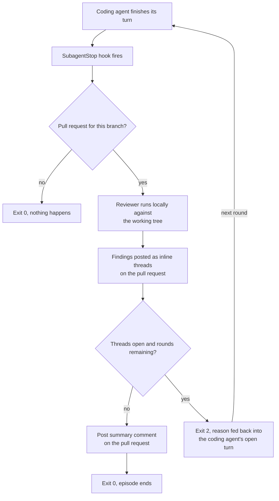
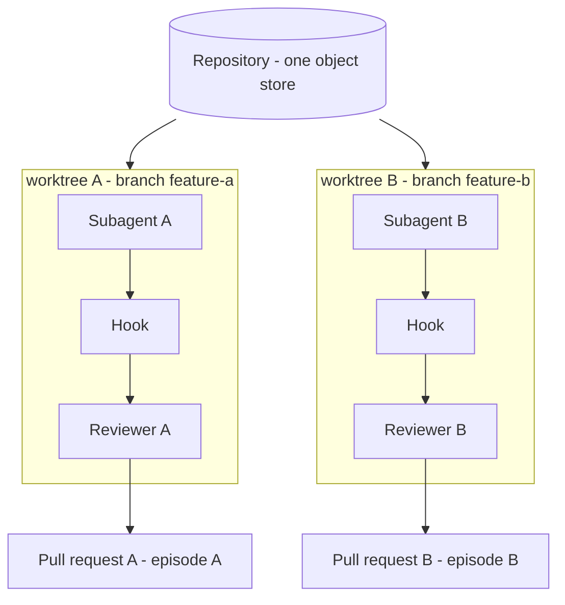

# Review Harness Specification: A Local Review Loop That Lives on the Pull Request

**Version:** 0.3 (draft)
**Status:** For review
**Owner:** TBD

---

## 1. Purpose

**Squiz is a local harness that automates code review between a coding agent and
a reviewing agent backed by different models, in a GitHub pull request.**

Agents write code faster than any person can read it, which breaks review in
two directions at once:

1. **It does not scale.** A person who reviews every change an agent produces is
   the constraint on the whole workflow.
2. **It becomes a rubber stamp.** A person who cannot keep up approves what they
   have skimmed, which is the same failure arriving quietly.

A reviewing agent reads the change and leaves its findings on the pull request,
and the two agents work through them there. A person opens a pull request that
has already been reviewed.

## 2. Dependencies

Squiz runs on the developer's machine. Four things must be installed, and every
one of them is required.

| Role | Today | Needed for |
|---|---|---|
| Git repository | `git` | The review runs against a working tree and a merge base. The repository needs a remote for a pull request to exist against. |
| Runtime | Claude Code | Fires the completion hook the loop is built on, and distributes the harness as a plugin. |
| Reviewer | `pi` | The agent that reads the change and reports what is wrong with it. It must run a different model from the coding agent. |
| Forge | GitHub, through an authenticated `gh` | The pull request is where the review is conducted and recorded. |

### Verified against

The versions the design was checked against, and the command that re-checks
each.

| | Version | Re-check with |
|---|---|---|
| `git` | 2.50.1 | `git --version` |
| `gh` | 2.97.0, authenticated against github.com | `gh --version`, `gh auth status` |
| `pi` | 0.84.2 | `pi --version` |
| Claude Code | 2.1.261 | `claude --version` |

Two behaviours were established rather than assumed:

- **`gh pr comment` and `gh pr review` take a body only.** Neither accepts a
  path or a line, so every inline comment goes through `gh api`. Re-check with
  `gh pr review --help`.
- **Claude Code gives a command hook 600 seconds.** Read out of the 2.1.228
  binary; the published documentation does not cover the Stop and SubagentStop
  events.

### GitHub access

Permission to post comments is not enough on its own. The harness must be able
to do all of the following:

- Read a pull request: its diff, its description, and its base and head refs
- List the existing review threads and whether each one is resolved
- Create a review comment anchored to a file and a line
- Reply inside an existing review comment thread
- Resolve a review thread, and re-open one
- Post an issue-level comment on the pull request, for the summary

Resolving and re-opening a review thread is available only through GitHub's
GraphQL API. REST has no equivalent, so those two operations go through GraphQL.

### Identity

Every comment is posted with the credentials `gh` holds, so all of them appear
under the account that authenticated it. The reviewer, the coding agent and the
harness share one GitHub identity.

Each comment names its own author on its first line:

| Written by | Begins |
|---|---|
| The reviewer | `**Squiz reviewer**` |
| The coding agent | `**Squiz coding agent**` |
| The harness, at close | `**Squiz review**` |

A comment without one of those markers was written by a person.

## 3. The loop

The loop runs the review from end to end. A coding agent finishes its work, the
reviewer reads the change, findings go back as comments on the pull request, and
the two agents work through them until every finding is settled or the round cap
is reached.

### Terminology

| Term | What it is |
|---|---|
| **Round** | One pass: gate, review, post, decide. A round either blocks the coding agent and starts another round, or ends the episode. |
| **Episode** | Every round belonging to one pull request. The round cap, the local state file and the summary comment are all per-episode; the review itself is per-round. |

An episode is keyed by the subagent's id from the hook payload, which is the
same every time that subagent stops. Its state lives in `.squiz/<episode>/`
inside the worktree, and holds the round count, the pull request number, the
cost of each round, the reviewer's session directory, and its scratch space.

### End-to-end workflow



### A round, step by step

1. **Gate on the pull request.** The hook looks for a pull request whose head is
   the current branch. If there is none it exits 0, and no review runs and
   nothing is posted.
2. **Run the reviewer.** The harness spawns the reviewer as a separate local
   agent process, hands it the pull request for scope and intent, and lets it
   read the working tree directly: files the diff did not touch, callers, and
   git history. At depth `deep` it also runs the tests. The reviewer never edits
   the code it is reviewing.
3. **Post the findings, and act on the verdicts.** Each new finding opens a new
   inline review comment thread anchored to a file and a line. Each verdict the
   reviewer returned is applied to the thread it names: `fixed` and `withdrawn`
   close the thread, `open` re-opens it or leaves it open.
4. **Block, or stop.** If threads are still open and the round cap has not been
   reached, the hook exits 2. The blocking reason names the open threads and the
   commands that work them, and goes back into the coding agent's still-open
   turn. The agent keeps working, and the next round starts when it finishes
   again.
5. **Close the episode.** Otherwise the harness posts one summary comment on the
   pull request and exits 0. This happens whether or not threads are still open,
   and what remains open is what the summary reports and what a person then
   looks at.

From round 2 on, the coding agent works the existing threads before it finishes
its turn. It resolves a thread when it made the change as asked, and replies on
the thread when it disagrees, has a question, or did something different.
Resolving is a claim, and the reviewer's re-read in the next round is what
settles it.

### The round cap

The cap defaults to 3 and is settable from 1 to 8. A cap of R blocks the coding
agent at most R−1 times, because the last round exits 0 rather than blocking. A
cap of 1 reviews once and never blocks.

### Parallel subagents

Each subagent that opens a pull request works in its own git worktree on its own
branch. A branch can be checked out in only one worktree at a time, so the two
go together.



The worktrees share one object store and nothing else. Each hook resolves its
own working directory, so one reviewer sees one subagent's change and posts to
one pull request. One worktree, one branch, one pull request, one episode.

The worktrees are created by whatever dispatches the subagents.

A worktree lives exactly as long as its episode. The harness removes it when the
episode closes, whether or not the pull request has been merged. Work that
arrives later, such as a person's review comments, starts a new episode in a new
worktree on the same branch. The episode's state goes with the worktree. Nothing
in it outlives the episode, because the pull request holds the findings.

Removal requires a clean tree and a pushed branch. Where either is untrue the
worktree stays, and the hook's stderr names it.

Where a tree is shared, the harness detects it by resolving
`git rev-parse --show-toplevel` and comparing it against the live episodes. Two
live episodes on one toplevel means a shared tree. The round still runs, the
summary comment names the other episodes that were in flight, and the
tracked-file comparison under Confinement is disabled for that round.

## 4. The reviewer

The reviewer is a second agent that reads the code the coding agent has just
written and reports what is wrong with it. It has no GitHub access of its own:
it returns findings, and the harness turns each one into a comment on the pull
request.

### Invocation

The reviewer is a subprocess the harness spawns once per round. It returns
findings, and a cost where its CLI reports one. It never edits the code it is
reviewing, and it holds no state between rounds: each round is a fresh process,
and everything it knows about earlier rounds arrives in what it is handed.

Four things are handed to it:

| | |
|---|---|
| **A working directory** | The git work tree holding the change under review. The reviewer process runs with this as its current directory. |
| **The pull request** | Its number, its base and head refs, its description, and every review thread already on it with the replies and resolved state of each. The harness fetches all of this and passes it in. |
| **A charter** | The standing instructions describing what a good review is. It ships with the harness and is the same every round. |
| **A depth** | How much the reviewer is allowed to do, `read` or `deep`. The two values are set out under Depth below. |

**There is no file-selection or budgeting stage.** The reviewer decides what to
open, one read at a time.

### Depth

Depth is a configuration setting controlling how much the reviewer is allowed to
do. It has two values, and `edit` and `write` are granted at neither. The tool
names below are `pi`'s; another adapter maps the same two values onto its own
CLI's names.

| Depth | Tools granted | What it can answer |
|---|---|---|
| `read` *(default)* | `read`, `grep`, `find`, `ls` | Anything the code can be read for. |
| `deep` | the above, plus `bash` | Also whether the tests actually pass, whether a line was deliberate (`git log -S`, `git blame`), and whether a hypothesis holds when run. |

`deep` depends on the tracked-file comparison described under Confinement, which
is the only mechanism that catches a write made through the shell.

### Confinement

The reviewer must not change anything the coding agent would commit. Writes to
gitignored paths and to locations outside the repository are permitted, which is
what running a build and a test suite requires.

What holds this depends on the depth.

**At `read` the tool grant holds it.** The reviewer is given no tool that
writes: `edit` and `write` are withheld, and so is the shell. Nothing it can
reach for touches the tree.

**At `deep` the grant includes `bash`, which is itself a write primitive.** A
reviewer at `deep` can write to a tracked file, and three mechanisms bound what
follows. None is configurable, and each applies where the third column says.

| Mechanism | Guards against | Applies |
|---|---|---|
| **Scratch space.** `TMPDIR` points at `.squiz/<episode>/scratch/`, which is gitignored and goes with the worktree. | A probe script or temporary file landing in the tree, where it appears in `git status` and may be committed as the coding agent's own work. | Always |
| **A non-mutating test invocation**, named in configuration. | A snapshot runner rewriting its snapshots, which turns a failing test green by editing the code under review. | Where a test command is configured |
| **A comparison of `git status` and the hashes of tracked files**, taken before the reviewer starts and again when it exits. | Everything else, including a write made through the shell. | Except in a shared worktree, where nothing detects such a write |

The first two prevent, and the third detects. A tracked file that changed during
a round is named in the summary comment.

### Adapters

An adapter is the code that knows how to drive one reviewer CLI. `pi` has the
first one. A second reviewer means writing a second adapter and changing nothing
else. A new adapter implements three things:

| | |
|---|---|
| `argv(opts)` | Build the command line from a working directory, a charter file, a prompt, a session directory, and the depth. |
| `parse(stdout)` | Return the findings, and the run's cost where the CLI reports one. |
| `grants` | Which tools the CLI is given at each depth. |

The harness passes `read` or `deep`, and the adapter turns that into the right
flags for its CLI. The adapter must not choose for itself.

### The `pi` adapter

The adapter that ships. It builds this command line:

```bash
pi --print --mode json --no-session \
   --session-dir .squiz/<episode>/session \
   --tools read,grep,find,ls \
   --append-system-prompt <charter-file> \
   <task-prompt> < /dev/null
```

`< /dev/null` is required. With stdin inherited, `pi` blocks forever and emits
nothing: no output, no error, no exit. This holds whether or not any tool is
enabled.

`--no-session` is what keeps each round stateless, and `--session-dir` contains
what `pi` writes so it lands under `.squiz/` rather than in interactive history.

The JSONL stream is large, so the adapter reads it incrementally and never holds
it in memory. The largest lines are the ones carrying whole messages, above all
`agent_end`, which grows with the entire transcript.

The adapter reads `tool_execution_start` and `tool_execution_end` for progress,
and every `message_end` whose message is from the assistant for the round's
cost. Cost arrives once per assistant message rather than once per run, and a
round's cost is the sum of them. `pi` prices the run itself from a local
catalogue, so a model the catalogue does not cover reports a zero cost against a
non-zero token count. The adapter returns the token count alongside the cost,
which is what tells that case apart from a round that cost nothing.

`pi` discovers and loads `AGENTS.md` and `CLAUDE.md` on its own, so the host
project's conventions reach the reviewer without the charter carrying them.

`--tools` sets the grant. The list above is `read`; `deep` adds `bash`.

### Charter

The standing rules:

- Read the pull request description for the intent and the declared scope of the
  change. A finding that contradicts something the description declares out of
  scope is not a finding.
- Report correctness bugs, convention violations, security problems, and tests
  that assert nothing.
- Do not report formatting, naming, import order, anything the compiler catches,
  or speculation. "Consider whether" means there is no finding.
- Verify before reporting. Read the file, grep the callers, and run the test
  where the depth grants a shell. A finding that could have been checked with
  the tools you were given and was not is not reportable.
- Read what the project treats as authoritative. `AGENTS.md` names it, and it is
  the authority on intended behaviour. It extends what counts as a finding; it
  does not change these rules, the requirement to verify, or the shape of a
  comment.
- **From round 2 on:** return a verdict on every thread you were handed. The
  coding agent's replies say where to look; they never settle anything. Re-read
  the code as it now stands and rule from that.
- The suggested fix is one way to address a finding. Rule on whether the defect
  is gone, not on whether the suggestion was taken.
- Scope a finding to `change` only when it is about the change as a whole and no
  single line owns it. Everything else is scoped to `line` and anchored to a line
  the change touched. Where the defect is somewhere the change did not touch,
  anchor to the changed line that caused it and name the other location in the
  body.

### Findings

The reviewer returns two things each round: the findings it made, and a verdict
on every thread it was handed.

The pull request holds the record, so a finding carries only what composes a
comment and what the harness needs in order to route it:

- `scope` — `line` or `change`, which decides inline versus general.
- `file` and `line` — the changed line the comment is anchored to. A finding
  scoped to the change as a whole carries neither.
- `severity` — `high`, `medium`, or `low`.
- The body fields, which are the parts of the comment format below.

| Severity | |
|---|---|
| `high` | Wrong now, or a security problem, or it breaks a written convention. |
| `medium` | Wrong under conditions this change makes reachable, or a test that would pass with the code under it deleted. |
| `low` | Real, narrow, and survivable. |

Every finding holds the work whatever its severity. Severity orders the
findings; it does not decide whether they count.

From round 2 on the reviewer is handed the threads already on the pull request,
and returns one verdict for each. It rules by reading the code as it now stands.

| Verdict | What it means | The harness |
|---|---|---|
| `fixed` | The defect is gone. | Closes the thread |
| `withdrawn` | There was no defect. The coding agent's argument was accepted. | Closes the thread |
| `open` | The defect is still there. | Re-opens the thread, or leaves it open |

A thread the reviewer returns no verdict for is treated as `open`.

Every finding posted as a thread ends its episode in one of four states. The
reviewer names the first two; the harness reads the last two off the thread when
the episode closes.

| Status | What it means | Needs a person |
|---|---|---|
| `fixed` | The defect was there and is gone. | No |
| `withdrawn` | There was no defect. | No |
| `open` | Still unresolved at the close of the episode, with no reply from the coding agent. | Yes |
| `disputed` | Still unresolved at the close of the episode, and the coding agent replied. There is a disagreement for a person to settle. | Yes |

A thread the coding agent resolved and the reviewer then ruled `open` is counted
separately. It is a counter and not a status: such a thread still ends its
episode in one of the four above.

### The comment format

Every comment follows one template: the marker and a headline naming the problem
with the severity visible, the reasoning as bullets rather than paragraphs, and
a suggested fix.

```markdown
**Squiz reviewer · high — Card can be placed off-screen once the explanation expands**

- `placeCard()` clamps against `window.innerHeight` before the expand animation
  runs, so a card that grows past the fold keeps its pre-expansion offset.
- Triggers at 150% zoom or above, on an entry with three or more senses.

**Suggested fix:** re-run `placeCard()` from the animation's completion
callback, and clamp against the card's measured height rather than its initial
height.

> `AGENTS.md`: re-run placement whenever the card's height changes.
```

The reference at the end is optional: a quoted convention, or a note about
something the reviewer could not check. Delete it and the comment must still
stand.

### Pull request comments

A finding's `scope` decides where its comment goes. The reviewer sets it,
because it is a judgement about what the finding is about rather than about
where a line falls.

- **Inline**, for a finding scoped to `line`. It becomes a review comment thread
  anchored to a file and a line that the change touched. This is the normal case
  and the preferred one.
- **General**, for a finding scoped to `change`. It is about the change as a
  whole rather than about any line of it — that the feature duplicates one the
  project already has, or that the approach is wrong. It goes into the summary
  comment.

The reviewer reads beyond the diff by design: untouched files, callers, history.
A finding it makes there is still scoped to `line`, and it is anchored to the
changed line that caused it, with the affected file and line named in the body.
The reviewer does not go looking for the affected line to anchor to, and GitHub
would refuse an anchor outside the diff in any case.

An anchor the harness cannot place is reported as a general finding, with
`file:line` written in the text, and the summary's Notes records that it could
not be anchored.

A general finding is reported once and then forgotten. It is a line of text in
the summary comment rather than a thread, so nothing records whether it was
fixed, and no later round rules on it.

## 5. The summary

One comment is posted on the pull request when an episode closes. It carries the
status of every finding and the cost of the review.

The comment is never edited or replaced. A second episode on the same pull
request posts a second comment, and the comments accumulate as a history of the
review passes.

### What the comment carries

Three blocks, in this order.

1. **The counts and the cost.** Rounds run, findings raised, how many ended
   `fixed`, `withdrawn`, `open` and `disputed`, how many threads were re-opened,
   and the cost of each round with the total for the episode and the tokens it
   consumed. Findings raised counts the general findings too, which carry no
   status.
2. **The findings that need a person.** Every `open` finding and every
   `disputed` one, each with its `file:line` and its headline. When there are
   none, the comment says so in one line.
3. **Notes.** Anything else a person reviewing the pull request should know:
   findings about the change as a whole, each with its headline; a finding whose
   anchor the harness could not place, with its `file:line`; a tracked file that
   changed while the reviewer ran; a round whose review did not run; other
   episodes that shared the worktree; and a cap or bound that ended the episode
   early.

### The format

```markdown
**Squiz review — 3 rounds, 6 findings**

Fixed 2 · Withdrawn 1 · Open 1 · Disputed 1 · 2 re-opened
Cost $0.0134 over 3 rounds: $0.0061, $0.0044, $0.0029 · 48,200 tokens

**Needs a person**

- `packages/sync/src/queue.ts:134` — Retry backoff resets on every enqueue (open)
- `packages/sync/src/session.ts:57` — Clock skew is read as token expiry (disputed)

**Notes**

- About the change as a whole: the retry queue duplicates the scheduler already
  in `packages/sync/src/scheduler.ts`, which nothing calls
- The review ran against uncommitted changes in `packages/sync/src/queue.test.ts`
```

Notes is omitted when there is nothing to report.

The cost of each round is written to the episode's local state file as the round
finishes, with the token count beside it. The comment reports both.

A round the time bound killed reports its **last tracked cost**, which is the
cost of the assistant messages that completed. The message in flight when the
reviewer was killed is spent and never reported, so the figure is lower than the
round truly cost, and the episode's total carries the same understatement.

Where the reviewer's CLI reports no cost at all, the comment gives that round's
cost as unknown rather than as zero. Two situations produce it, and they are
reported differently. A round killed before its first assistant message
completed has no tracked cost, which is a fact about that round. A reviewer model
the CLI cannot price reports no cost for every round of every episode, which is a
setup problem: the comment says once that cost is unavailable for the model, and
Notes records that the cost bound was not enforced.

## 6. Commands

Everything the harness ships to be run. One binary and one slash command.

### The `squiz` binary

A plugin's `bin/` is added to the Bash tool's `PATH` while the plugin is
enabled, so the binary is on the path of any agent with a shell, and the hook
registration names it directly rather than an install path.

| Command | Run by | What it does |
|---|---|---|
| `squiz hook` | Claude Code | The `SubagentStop` entry point, named in `hooks.json`. Runs one round. |
| `squiz threads` | The coding agent | Lists the open threads on the pull request for the current branch, each with its identifier. |
| `squiz reply <id> <text>` | The coding agent | Replies in a thread. |
| `squiz resolve <id>` | The coding agent | Marks a thread resolved. |

`<id>` is whatever `squiz threads` printed for that thread. It round-trips
between the two commands, and is short enough for an agent to copy.

### The setup check

`/squiz doctor` is a slash command, run by a person. It reports which of the
dependencies is missing or unauthenticated.

## 7. Failure modes

**Every failure the harness controls exits 0.** It may fail in any way except by
preventing the coding agent from finishing. The one case outside its control is
the runtime killing the hook, which the review budget exists to stay below.

**A failure is always announced.** Silence must never read as a clean review.
The summary comment carries it whenever GitHub can be reached; the hook's stderr
carries what could not be posted.

| Failure | Behaviour |
|---|---|
| The reviewer is not installed, or has no API key | Exit 0, nothing posted, and stderr names the check that failed. This recurs every round until someone fixes it, so it is reported as a setup problem rather than as a bad round. |
| The model API is unavailable or rate-limited | Exit 0 and nothing is posted. stderr says the review did not run. |
| The reviewer returns output the adapter cannot parse | Retried once, then treated as an unavailable API. A failed parse and an honest finding of nothing are distinguished before anything is posted. |
| The reviewer exceeds the review budget | The reviewer process is killed and the round records no findings. The round is recorded as a failed round rather than a clean one. |
| The reviewer exceeds the hook timeout | The runtime kills the hook and the turn ends with nothing posted. |
| GitHub is unreachable | Exit 0 and nothing is posted. A later round reads the same code and makes the same comments, so nothing is stored to retry. Where the episode ends having posted nothing, stderr says so. |
| Some comments post and others fail | The comments that landed stay. A later round makes the rest again. |
| The local state file cannot be written | The harness stops reviewing and surfaces the underlying error rather than the word "failed". The subagent still finishes. |
| The harness itself throws | Trapped at the top level, exit 0. |
| The round cap is reached | Exit 0. Findings still unresolved stay open, and the summary comment reports them. |
| The cost bound is reached | Exit 0. The episode closes without starting another round, and the summary comment reports that the bound was reached. |

### The hook's stderr

Claude Code surfaces the hook's stderr, and two different things are written
there. They stay apart.

**The blocking reason**, written when a round exits 2. It names the open threads
and the commands that work them, and the coding agent reads it as its next
instruction.

**The failure pointer**, written when a round exits 0 having failed. One line,
naming what failed:

```
squiz: round 3 found 3 findings and could not post them to PR #142
```

The pointer is a pointer rather than a report, and it must not grow into a
second output format.

### The review budget

The review budget bounds a review two ways. Both are configurable.

| Bound | Default | When it is reached |
|---|---|---|
| **Time**, per round | 420 seconds | The reviewer process is killed and the round records no findings. |
| **Cost**, per episode | $0.10 | The episode closes without starting another round. |

Killing the reviewer yields no findings rather than a partial review, because
the findings arrive in the last message of the run. It does yield a cost: the
assistant messages that completed carry their own, and the round records that
sum as its last tracked cost.

The hook gets 600 seconds from Claude Code, and the harness posts the round's
comments inside that. The time bound sits below the hook's ceiling.

The cost bound is checked when a round records its cost, so it stops the next
round rather than the running one. A round already running is never killed for
cost. An episode that reaches the bound closes with the findings it has, and the
summary comment reports that the bound was reached.

The bound is enforced against the reviewer CLI's own arithmetic rather than
against a provider's invoice, and it cannot be enforced at all for a model the
CLI cannot price.

## 8. The project

Squiz is its own repository, not a directory inside a host project.

### Language

Squiz is written in TypeScript and runs on Node. Node strips the types and runs
the `.ts` files as they are, so there is no build step and no compiled output.

- **Erasable syntax only.** No `enum`, no parameter properties, no namespaces. A
  union of string literals stands where an enum would.
- **Types are checked by `tsc --noEmit` in CI.** Stripping does not check them.
- **Node 24 or later.** The setup check reports the version.
- **`bin/squiz` is a shell shim.** Node decides to strip types from the `.ts`
  extension, so the entry point cannot be an extensionless Node file. The shim
  execs the real one.

There are no runtime dependencies. Everything outside the process is a
subprocess: `git`, `gh`, and the reviewer's own CLI.

### Structure

The layout is a Claude Code plugin, which is also how it is distributed. The
plugin is the package, so there is no separate packaging step.

```
.claude-plugin/plugin.json   manifest: name, version, description
hooks/hooks.json             the SubagentStop registration
commands/                    slash commands; the setup check is the first
bin/                         the CLI, on PATH whenever the plugin is enabled
charter.md                   the standing review instructions, shipped as one file
src/
  hook/                      the SubagentStop entry point and its translation
  loop/                      episode state, round cap, verdict decisions
  worktree/                  toplevel resolution, shared-tree detection, removal
  reviewers/                 one adapter per reviewer CLI; pi/ is the first
  github/                    threads, replies, resolve and re-open, summary comment
  findings/                  the finding contract, severity, inline versus general
docs/specs/                  this document
docs/notes/                  durable facts learned by building
```

### What ships

**P0** has to exist for the harness to do its job at all. **P1** is expected,
and the loop works without it. **P2** is possible, and nothing is built for it
until something asks.

| | | |
|---|---|---|
| **P0** | The hook and the loop | The `SubagentStop` registration, the pull request gate, the round cap, the exit-code decisions, and the time bound on the reviewer |
| **P0** | The `pi` adapter | The command line, the parse of its output, and the `read` grant |
| **P0** | Scratch space | `TMPDIR` points at `.squiz/<episode>/scratch/` |
| **P0** | The charter | The standing rules handed to the reviewer every round |
| **P0** | The finding contract | `file`, `line`, `severity`, the body fields, the rule routing a finding inline or general, and the per-thread verdicts |
| **P0** | The GitHub client | Creating a thread anchored to a file and a line, reading the threads already on a pull request with their replies and resolved state, resolving and re-opening through GraphQL, and posting the summary comment |
| **P0** | The coding agent's commands | `squiz threads`, `squiz reply` and `squiz resolve`, which are how the coding agent works the threads |
| **P0** | The summary comment | The counts, the cost, what needs a person, and the notes, composed when the episode closes |
| **P0** | The hook's stderr channel | The one line that carries a failure GitHub could not be told about. Without it a round that cannot reach GitHub exits silently |
| **P0** | The episode state file | Round count, pull request number, per-round cost, keyed by the subagent's id and living in the worktree |
| **P1** | Depth `deep` | The `bash` grant. It ships with the tracked-file comparison or not at all |
| **P1** | The tracked-file comparison | `git status` and the hashes of tracked files, taken before the reviewer starts and again when it exits. What `deep` depends on |
| **P1** | A non-mutating test invocation | Named in configuration, so running the tests cannot rewrite the code under review. Reachable only at `deep` |
| **P1** | Shared-tree detection | Two live episodes on one toplevel, which disables the tracked-file comparison for that round |
| **P1** | The cost bound | $0.10 per episode, checked when a round records its cost |
| **P1** | Worktree removal at episode close | Requires a clean tree and a pushed branch; otherwise the worktree stays and the summary names it |
| **P1** | The setup check | A slash command that names which of the dependencies is missing or unauthenticated |
| **P2** | A GitHub App identity | The harness posts as its own bot rather than as the account that authenticated `gh`. Configured by the host project, which installs the App and holds its key |
| **P2** | A second reviewer adapter | A second CLI means a second adapter and no other change |
| **P2** | The main session as a trigger | Today the loop runs for subagents only |
| **P2** | Tracking findings scoped to the change as a whole | Today they are reported in the summary comment and carried no further |

Nothing at P2 gets an interface built for it in advance.

### Prerequisites

Facts the design rests on that have not been established. Each is settled before
implementation starts, and each result is written as a finding in
`docs/notes/`.

**A spike, first and on its own.** Run it with `claude --plugin-dir <plugin-root>`,
which loads a plugin without installing it. It confirms end to end that:

- `SubagentStop` fires, exit 2 feeds the reason back, and the subagent resumes
  its turn
- the hook's working directory resolves the right worktree
- two subagents running concurrently each get their own worktree, and
  `git rev-parse --show-toplevel` separates them
- `gh api` can create a review comment thread anchored to a file and a line,
  reply inside that thread, and resolve and re-open it

Four smaller checks, each deciding a behaviour already written down:

- **Whether the hook payload carries the subagent's id**, and whether it is the
  same every time that subagent stops. An episode is keyed on it. If it is not
  there, the key is the worktree toplevel, the branch, or the pull request
  number, since there is one of each per episode.
- **Whether `stop_hook_active` is set when the hook re-enters.** The loop blocks
  the same subagent repeatedly on purpose, and the runtime counts consecutive
  blocks for its own reasons.
- **Whether `pi --tools` actually withholds `edit` and `write`.** A CLI that
  ignores an unrecognised flag and runs with every tool enabled would leave the
  reviewer able to edit the code it is reviewing.
- **Whether `pi` reports cost during a run or only at the end.**

## 9. Adoption

### Installing

Squiz is a Claude Code plugin and installs from a marketplace, which is a
`.claude-plugin/marketplace.json` in a git repository. A private repository
works.

```
/plugin marketplace add <owner>/<repo>
/plugin install squiz@<marketplace>
```

`/plugin uninstall squiz` removes it.

### Getting started

Four things in the host project, the last two optional.

1. Add `.squiz/` to `.gitignore`. It holds each episode's state file and the
   reviewer's session storage.
2. Allow `squiz` in the project's Claude Code permissions, so the coding agent
   is not prompted every time it works a thread.
3. **Optional.** `.squiz.json`, to change any of the settings below. Every one
   has a working default, so a project that writes none still runs. The `test`
   setting is read only at depth `deep`, where it names the non-mutating command
   the reviewer runs instead of one it infers for itself.
4. **Optional.** `AGENTS.md`, to have the reviewer enforce rules of the
   project's own. It carries the conventions a reviewer cannot derive from
   reading code, and it can point at whatever else the project treats as
   authoritative. Without it the review still finds correctness bugs, security
   problems and tests that assert nothing, and reports no convention violations.

Then run `/squiz doctor`.

A project that dispatches subagents in parallel gives each one its own worktree
on its own branch. Squiz does not create them.

### Configuration

`.squiz.json`, at the root of the repository.

| Setting | Default | |
|---|---|---|
| `rounds` | 3 | The round cap, settable 1 to 8 |
| `depth` | `read` | `deep` adds the shell, and requires the tracked-file comparison |
| `test` | none | The non-mutating command that runs the tests |
| `timeout` | 420 | Seconds one round's reviewer may run |
| `budget` | 0.10 | Dollars an episode may cost |
