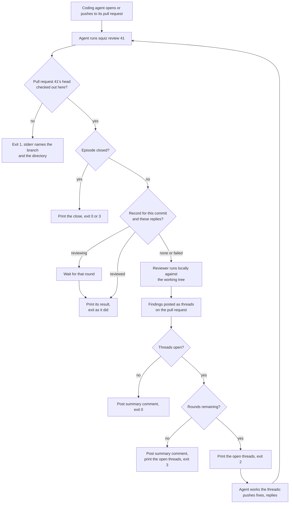
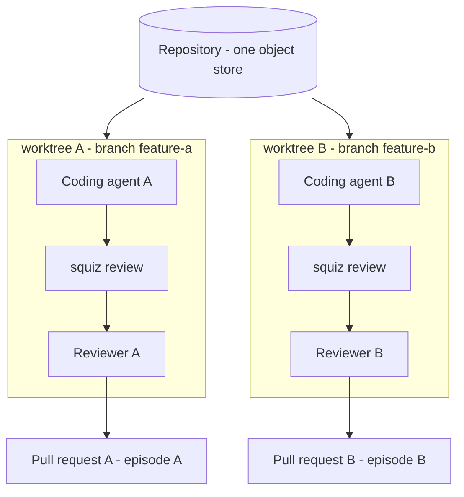

# Review Harness Specification: A Local Review Loop That Lives on the Pull Request

**Version:** 0.56 (draft)
**Status:** For review
**Owner:** TBD

---

## 1. Purpose

**Squiz is a local harness that automates code review between a coding agent and
a reviewing agent backed by different models, in a GitHub pull request.**

Agents write code faster than any person can read it, which breaks review in
two directions at once:

1. **It does not scale.** A person who reviews every change an agent produces is
   the constraint on the whole workflow.
2. **It becomes a rubber stamp.** A person who cannot keep up approves what they
   have skimmed, which is the same failure arriving quietly.

A reviewing agent reads the change and leaves its findings on the pull request,
and the two agents work through them there. The coding agent asks for each
review by running one command, and reads the findings off the pull request. A
person opens a pull request that has already been reviewed.

## 2. Dependencies

Squiz runs on the developer's machine. Four things must be installed, and every
one of them is required.

| Role | Today | Needed for |
|---|---|---|
| Git repository | `git` | The review runs against a working tree and a merge base. The repository needs a remote for a pull request to exist against. |
| Runtime | Claude Code | Runs the coding agent, whose shell tool runs `squiz review`. Fires the `SubagentStop` hook, which is one trigger for a review. Distributes the harness as a plugin. |
| Reviewer | `pi` | The agent that reads the change and reports what is wrong with it. It must run a different model from the coding agent. |
| Forge | GitHub, through an authenticated `gh` | The pull request is where the review is conducted and recorded. |

### Verified against

The versions the design was checked against, and the command that re-checks
each.

| | Version | Re-check with |
|---|---|---|
| `git` | 2.50.1 | `git --version` |
| `gh` | 2.97.0, authenticated against github.com | `gh --version`, `gh auth status` |
| `pi` | 0.84.2 | `pi --version` |
| Claude Code | 2.1.261 | `claude --version` |

Six behaviours were established rather than assumed:

- **`gh pr comment` and `gh pr review` take a body only.** Neither accepts a
  path or a line, so every inline comment goes through `gh api`. Re-check with
  `gh pr review --help`.
- **Claude Code runs a shell command under a timeout, and moves a command that
  reaches it to the background rather than stopping it.** The timeout is 120
  seconds where the agent passes none, and at most 600 where it passes one, read
  from `BASH_DEFAULT_TIMEOUT_MS` and `BASH_MAX_TIMEOUT_MS`. The agent is told the
  command moved, with the file its output goes to. Where background tasks are
  disabled the command is stopped instead, and a command a foreground subagent
  moved stops when that subagent's run ends. Documented, in Claude Code's tools
  reference under the Bash tool.
- **A foreground subagent often ends its run while its moved command is still
  running, and the command is stopped with it.** The runtime tells the subagent
  not to end its turn; three of five foreground subagents ended it anyway.
  Background subagents waited. Measured against 2.1.288.
- **A command stopped from outside gets `SIGTERM`, and so does every process
  under it, in the same instant**, including one started in a session of its
  own. `SIGKILL` follows one to two seconds later for whatever ignored it.
  Moving a command to the background sends nothing. Measured against 2.1.288.
- **Claude Code fails a subagent that makes no progress for 600 seconds, and a
  subagent waiting on a shell command is making progress.** A hook that holds a
  subagent is not. The threshold is read from
  `CLAUDE_ASYNC_AGENT_STALL_TIMEOUT_MS`. Measured against 2.1.270 and 2.1.288.
- **A failing command's output reaches the agent truncated to about 10,000
  characters.** Claude Code reads every exit status but 0 as a failure for
  `squiz`, and keeps a head-and-tail excerpt of a failing command's output, with
  no path to the rest. Documented, in the tools reference's output limits.

### GitHub access

Permission to post comments is not enough on its own. The harness must be able
to do all of the following:

- Read a pull request: its diff, its description, and its base and head refs
- List the existing review threads and whether each one is resolved
- Create a review comment anchored to a file and a line
- Create a review comment on a file as a whole, carrying no line
- Reply inside an existing review comment thread
- Resolve a review thread, and re-open one
- Post an issue-level comment on the pull request, for the summary and for a
  round that failed

Resolving and re-opening a review thread is available only through GitHub's
GraphQL API. REST has no equivalent, so those two operations go through GraphQL.

### Identity

Every comment is posted with the credentials `gh` holds, so all of them appear
under the account that authenticated it. The reviewer, the coding agent and the
harness share one GitHub identity.

Each comment names its own author at the start of its first line, inside that
line's bold span. What follows the marker differs from comment to comment, so
the marker is the opening of the span rather than the whole of it.

| Written by | Begins |
|---|---|
| The reviewer | `**Squiz reviewer · ` |
| The coding agent | `**Squiz coding agent` |
| The harness, at close | `**Squiz review — ` |
| The harness, when a round fails | `**Squiz review failed — ` |

A comment without one of those markers was written by a person.

`**Squiz review` is itself a prefix of `**Squiz reviewer`, so the character
after the name is what separates the summary, the failure comment and a review
comment. A test for the summary that stops at the name matches every finding the
reviewer posted, and every failure.

## 3. The loop

The loop runs the review from end to end. The coding agent opens its pull
request and runs `squiz review <number>`. The command runs one round: the
reviewer reads the change, and its findings go onto the pull request as threads.
The command waits for the round to end and prints what is still open. The agent
works the threads, pushes, and runs the command again, until nothing is open or
the round cap is reached.

**`squiz review <number>` is the harness's one entry point.** Anything that wants
a pull request reviewed calls it: the coding agent's own shell, a coordinator, a
CI job, or the Claude Code hook set out below. Each of those is
a trigger, and the review is the same whichever one called it.

**The loop closes only where the coding agent runs the command itself.** A
trigger can start a review, but only the coding agent can work what it found.
The coding agent reads the review off the pull request, and nothing has to be put
into its session from outside, so any coding agent that can run a shell command
can be reviewed.

### Terminology

| Term | What it is |
|---|---|
| **Round** | One review of one state of a pull request, its head commit and the replies on the reviewer's threads: gate, review, post, decide. A round either leaves threads open for the coding agent, which starts the next round by pushing or replying and running the command again, or ends the episode. |
| **Episode** | Every round belonging to one pull request in one worktree. The round cap, the local state file and the summary comment are all per-episode; the review itself is per-round. |

An episode is **live** from its first round until it closes, and its reviewer is
reviewing or its coding agent is working on what the review said. It closes for
one of three reasons: nothing is left open for another round to work, the round
cap is spent, or a round reached the token bound. A round that failed closes
nothing — it posts a failure comment under § 7, the episode stays live, and the
next run of the command on that state runs another round.

A live episode is one whose close has not been recorded. Nothing else makes an
episode live or over: not whether a round is running at this instant, because
between two rounds the coding agent is working and no round exists, and not how
long ago anything happened.

### The state file

**An episode is keyed by the number of its pull request.** Its state lives in
`.squiz/<number>/` inside the worktree. The state file holds the round count, the
cost of each round, what the episode spent on attempts that were no round,
whether the episode has reported its close and what was open at that close, and
what its rounds established about the worktree. The directory also holds the
reviewer's session directory and its scratch space.

**The state file also holds one record for each state of the pull request the
episode has reviewed.** A state is two things, read when the command starts:

- **The head commit**, as GitHub reports it for the pull request.
- **The latest activity on the reviewer's threads.** Activity is a reply from
  anyone other than the reviewer, on a thread the reviewer opened: a comment after
  the first in that thread, carrying no `**Squiz reviewer · ` marker. The coding
  agent's replies are activity, and so is a person's. A thread a person opened
  holds no activity, whatever is said on it. The latest activity is the GitHub
  identifier of the newest such reply on the pull request, or none. An edited
  reply keeps its identifier and changes nothing. A deleted one can change which
  reply is newest, and that is a change like any other.

A new commit or a new reply is a new state. Either one means the review on record
no longer covers what the pull request now says.

Each record is in one of three states:

| State | What it records |
|---|---|
| Reviewing | The process running the round, and when that process started. A pid alone is reused, so the start time is what tells the round that holds it now from one that held it before. |
| Reviewed | The result the round reached: its exit status, and the threads it left open. |
| Failed | The reason the round failed. |

**A run reads the record for the pull request's state before it starts a
reviewer.** It has looked up the pull request and listed its threads by then,
because the state is read from them.

- **Reviewing**, by a process that is still running: the run waits for that round
  to end and returns its result. It starts no round of its own.
- **Reviewing**, by a process that has gone: the round was killed. The run starts
  a round.
- **Reviewed**: the run returns that result, and starts no round. The threads it
  prints are read from the pull request as they stand now.
- **Failed**, or no record: the run starts a round.

**Every trigger therefore gets one review per state.** A second trigger for a state
already under review waits for the same round rather than running a second one, so
two firings for one commit and the same replies post one set of threads and at
most one summary. A run for a new state while a round of an older one is running
waits for that round to end, then reviews its own state. One episode runs one round
at a time.

**A reply is ruled on even where no commit follows it.** A coding agent that
disputes a finding and pushes nothing runs the command again on a new state, and
the round reads its reply and rules on the thread: `withdrawn` where the argument
holds, `open` where it does not. A reply posted while a round runs is not in that
round's state, so the next run reviews again.

**Every round counts against the round cap, whatever started it.** A round that a
reply started is a round, exactly as one a commit started. A coding agent that
answers every finding with a dispute spends the cap doing so, and the episode
closes at the cap with the disputes for a person. A run that returns a recorded
result is no round and spends nothing.

**A closed episode stays closed in its worktree.** A run on a state the episode
never reviewed starts no round once the close is recorded; it prints the close,
as § 6 shows. A second episode on the same pull request starts in another
worktree on the same branch, which holds no state for it.

What the rounds established about the worktree is four lists: the tracked paths
any round found changed, the other episodes any round found in the worktree, why a
round could take no comparison, and why a round could not tell who else was there.
The summary comment's Notes are composed from all four.

Each list holds an entry once, however many rounds gave it, and stops at
sixty-four entries. One round can reach that on its own, because one reading can
name more than sixty-four changed paths. An attempt that is no round spends none of
the round cap and can fail the same way on every run, so nothing bounds how many
times one episode adds to these lists either.

**A full list keeps the entries recorded first.** A later round adds to a list with
room left and adds nothing to a full one, so what an earlier round established is in
the comment the closing round posts.

The state file is gitignored with the rest of `.squiz/`, so the comparison of
tracked files under Confinement never reads it as a change.

**The reviewing record is what makes an episode's first round visible.** It is
written before the reviewer starts, so a second episode starting during a first
round finds it and does not read the worktree as its own.

### End-to-end workflow


```mermaid
flowchart TD
    A[Coding agent opens or pushes to its pull request] --> B[Agent runs squiz review 41]
    B --> C{Pull request 41's head<br/>checked out here?}
    C -->|no| L[Exit 1, stderr names the branch<br/>and the directory]
    C -->|yes| K{Episode closed?}
    K -->|yes| D[Print the close, exit 0 or 3]
    K -->|no| R{Record for this commit<br/>and these replies?}
    R -->|reviewing| W[Wait for that round]
    W --> P
    R -->|reviewed| P[Print its result,<br/>exit as it did]
    R -->|none or failed| E[Reviewer runs locally against<br/>the working tree]
    E --> F[Findings posted as threads<br/>on the pull request]
    F --> G{Threads open?}
    G -->|no| I[Post summary comment, exit 0]
    G -->|yes| H{Rounds remaining?}
    H -->|no| J[Post summary comment,<br/>print the open threads, exit 3]
    H -->|yes| M[Print the open threads, exit 2]
    M --> N[Agent works the threads:<br/>pushes fixes, replies]
    N --> B
```

### A round, step by step

1. **Gate on the pull request.** The command looks up pull request `<number>`
   and checks that its head branch is the branch checked out in the directory it
   was run in. If the pull request is not open, or that directory has another
   branch or a detached HEAD, it exits 1, no review runs, and nothing is posted.
   stderr names what it found:

   ```
   squiz: no review ran: PR #41's head is "feature-a", and "/work/squiz" has "main" checked out
   ```
2. **Gate on the episode and the commit.** The command reads the episode's state
   file. An episode that has reported its close is over: the command prints the
   close and exits as the close did, and no reviewer runs. The round cap and the
   token bound are not consulted, because an episode that is over stays over
   whatever a bound would now allow. Otherwise the command lists the threads, and
   the record for the pull request's state decides, as The state file sets out,
   whether a round starts here.
3. **Run the reviewer.** The harness spawns the reviewer as a separate local
   agent process, hands it the pull request for scope and intent together with
   the threads the reviewer itself opened on it, and lets it read the working
   tree directly: files the diff did not touch, callers, and git history. At
   depth `deep` it also runs the tests. The reviewer never edits the code it is
   reviewing.
4. **Post the findings, and act on the verdicts.** Each new finding opens a new
   review comment thread, anchored to a file and a line or to a file as a whole.
   Each verdict the reviewer returned is applied to the thread it names: `fixed`
   and `withdrawn` close the thread, `open` re-opens it or leaves it open.
5. **Print the open threads, or close.** If threads of this review are still open
   and the round cap has not been reached, the command records the result,
   prints the open threads, and exits 2. The coding agent works them and runs the
   command again. A thread a person opened is counted by neither the arithmetic
   nor the output, so it never keeps the loop going and an episode ends with one
   still open. § 6 shows what is printed.

   Where the round's comparison found that `HEAD` moved while the reviewer ran,
   the output ends with a paragraph naming both ends of the move, as Notes does
   under § 5. A move to a detached `HEAD`, or to another branch, ends the next run
   at the gate, before it reads anything the episode recorded. Unless `HEAD`
   returns to the pull request's branch, no later round of this episode runs and
   no summary comment is posted, so this paragraph is the move's one report. A
   round that failed reports its move in its failure comment, under § 7.
6. **Close the episode.** Otherwise the harness posts one summary comment on the
   pull request and records the close in the episode's state. It exits 0 where
   nothing of this review is open, and 3 where the round cap or the token bound
   closed it with threads still open, which it prints. What remains open is what
   the summary reports and what a person then looks at.

Where the command prints open threads, the coding agent works them before it runs
the command again. It replies on a thread to say what it changed, to disagree, or
to ask a question. It does not close threads. A thread closes when the reviewer's
verdict closes it, so a closed thread means the reviewer read the code as it now
stands and accepted it.

### The round cap

The cap defaults to 3 and is settable from 1 to 8. A cap of R hands open threads
back to the coding agent at most R−1 times, because round R closes the episode
whatever is still open. A cap of 1 reviews once and closes.

### What starts a round

**A round starts only when something runs `squiz review <number>`.** The coding
agent runs it once it has opened its pull request, and again after each push that
works the threads. A coordinator or a CI job may run it as well, from a checkout of
the pull request's branch, and is handed the same result the coding agent is.

**The instruction to run it reaches the coding agent two ways.**

- **In Claude Code, a skill the plugin ships.** Its description has the coding
  agent load it when it opens or updates a pull request. A Claude Code project
  needs nothing in its own files for this.
- **For any other agent, a section of the host project's `AGENTS.md`**, which
  `squiz init` adds.

§ 9 gives the text of both. Nothing forces an agent to follow either. Claude Code
loads a skill when its description matches what the agent is doing, and does not
promise to. An agent that never runs the command, in a runtime with no other
trigger, leaves a pull request no round has read. Such a pull request carries no
comment with any of § 2 Identity's markers.

The command runs inside the caller's own tool call or process, and the caller
waits on it. While a round runs, a coding agent that called it is not editing the
tree, unless its tool moved the command to the background. The review budget under
§ 7 says how long a round may take, and what the coding agent's own tool timeout
does to it.

### The Claude Code hook

**The `SubagentStop` hook is a trigger for Claude Code, and holds no logic of its
own.** When a subagent stops, the hook resolves the pull request whose head is the
branch checked out in its working directory, and runs the same review as
`squiz review <number>`. Where it finds no pull request it exits 0, with the line
under step 1 naming the branch and the directory.

| The review | The hook |
|---|---|
| Exits 2 | Exits 2. The open threads, as § 6 prints them, are the blocking reason, which the runtime hands the subagent as its next instruction. |
| Exits 0 or 3 | Exits 0. It drops the outcome the review printed on stdout, and writes the review's stderr lines, where there are any. |
| Could not run | Exits 0, and writes the review's stderr lines. |

A stderr line is a failure the review could not put anywhere else, such as a
summary comment GitHub refused, so the hook passes every one on whatever the
review's status.

**In auto mode the hook can start a review, and cannot get it worked.** A subagent
in auto mode ends by handing back to its parent, and the runtime drops a block that
arrives after the hand-back. The subagent is gone by the time the round's threads
are posted, and nobody works them. So the loop closes only where the coding agent
runs `squiz review` itself and works what it prints. Outside auto mode the block
resumes the subagent, which works the threads and stops again.

Because a run returns the result for a state already reviewed, a hook firing after
the coding agent has run the command itself starts no second round. The same holds
for a subagent the session did not dispatch: its firing for a state under review
waits for that round and posts nothing of its own. Such a firing holds that
subagent until the round ends.

The hook's own timeout is 600 seconds, the same as the window under § 7. Its shell
does not have the plugin's `bin/` on its `PATH`, so the registration names the
binary through `${CLAUDE_PLUGIN_ROOT}`.

### Parallel coding agents

Each coding agent that opens a pull request works in its own git worktree on its
own branch. A branch can be checked out in only one worktree at a time, so the two
go together.

**The command reviews the worktree it is run in.** It resolves the toplevel with
`git rev-parse --show-toplevel` from its own working directory, which is the
caller's. A coding agent working in a worktree by path runs the command from that
path, and that worktree is the one reviewed. The hook runs in the subagent's
working directory, which is fixed when the subagent is dispatched.

In this repository a Claude Code subagent that opens a pull request is dispatched
with `isolation: "worktree"`, and its first command switches to its own branch:

```bash
git switch -c <area>/<short-name> origin/main
```


```mermaid
flowchart TD
    R[(Repository - one object store)]

    subgraph WA [worktree A - branch feature-a]
        AS[Coding agent A] --> AH[squiz review] --> AR[Reviewer A]
    end

    subgraph WB [worktree B - branch feature-b]
        BS[Coding agent B] --> BH[squiz review] --> BR[Reviewer B]
    end

    R --> WA
    R --> WB
    AR --> PA[Pull request A - episode A]
    BR --> PB[Pull request B - episode B]
```

The worktrees share one object store and nothing else. Each run of the command
resolves its own working directory, so one reviewer sees one coding agent's change
and posts to one pull request. One worktree, one branch, one pull request, one
episode.

**The harness does not remove a worktree.** The coding agent is still in it when
the command returns. Whatever created the worktree removes it. The episode's state
goes with the worktree, and nothing in it outlives the worktree, because the pull
request holds the findings.

Where a tree is shared, the harness detects it by resolving
`git rev-parse --show-toplevel` and comparing it against the live episodes. Two
live episodes on one toplevel means a shared tree. Under the key above they are
two pull requests' episodes, which one tree holds when its `HEAD` moved to another
branch while the first episode was live. The round still runs, the summary comment
names the other episodes that were in flight, and the tracked-file comparison
under Confinement is disabled for that round.

An episode whose round died without recording a close is live by the definition
above, so it counts. A worktree holding one therefore has the comparison disabled
for every episode after it, until that episode's directory is gone. This is the
direction to be wrong in: the comparison reports a tracked file that changed, and
reading a live episode as over runs it against a tree another coding agent is
editing, which names a file the reviewer never touched. Reading an abandoned
episode as live only means nothing is detected that round.

**Two coding agents on one branch in one tree share one episode, and nothing tells
them apart.** They spend one round cap between them, and a round's comparison is
taken while the other agent may be editing, which names that agent's work as the
reviewer's. Nothing detects this.

## 4. The reviewer

The reviewer is a second agent that reads the code the coding agent has just
written and reports what is wrong with it. It has no GitHub access of its own:
it reports each finding as it confirms it, and the harness turns each one into a
comment on the pull request.

### Invocation

The reviewer is a subprocess the harness spawns once per round. It reports its
findings as it makes them, and a cost where its CLI reports one. It never edits
the code it is reviewing, and it holds no state between rounds: each round is a
fresh process, and everything it knows about earlier rounds arrives in what it
is handed.

Five things are handed to it:

| | |
|---|---|
| **A working directory** | The git work tree holding the change under review. The reviewer process runs with this as its current directory. |
| **The pull request** | Its number, its base and head refs, its description, and the threads the reviewer opened on it, each with its replies and whether it is resolved. The harness fetches all of this and passes it in. |
| **A charter** | The standing instructions describing what a good review is. It ships with the harness and is the same every round. |
| **A depth** | How much the reviewer is allowed to do, `read` or `deep`. The two values are set out under Depth below. |
| **A thinking level** | How hard the reviewer thinks. The harness sets it every round, so the level never comes from the reviewer CLI's own configuration. The levels are listed under Configuration. |

**A configured test command reaches the reviewer in the prompt, and only at depth
`deep`.** The prompt is the only channel a project's own text arrives through:
the charter ships with the harness, and the command line is flags and tool names.
It is named there as the only test command the reviewer may run, because a
command offered as one option among several leaves the reviewer inferring one,
which is what naming it prevents. At `read` it is absent, because there is no
shell to run it with.

**There is no file-selection or budgeting stage.** The reviewer decides what to
open, one read at a time.

### Depth

Depth is a configuration setting controlling how much the reviewer is allowed to
do. It has two values, and `edit` and `write` are granted at neither. The tool
names below are `pi`'s; another adapter maps the same two values onto its own
CLI's names.

| Depth | Tools granted | What it can answer |
|---|---|---|
| `read` *(default)* | `read`, `grep`, `find`, `ls` | Anything the code can be read for. |
| `deep` | the above, plus `bash` | Also whether the tests actually pass, whether a line was deliberate (`git log -S`, `git blame`), and whether a hypothesis holds when run. |

**The calls the reviewer reports through are granted at both depths**, alongside
the tools in the table. Depth decides how much the reviewer may read and run.
Reporting is not a depth: a reviewer with no way to report returns nothing
whatever it was allowed to look at. The three calls are named under Findings.

`deep` depends on the tracked-file comparison described under Confinement, which
is the only mechanism that catches a write made through the shell.

### Confinement

The reviewer must not change anything the coding agent would commit. Writes to
gitignored paths and to locations outside the repository are permitted, which is
what running a build and a test suite requires.

What holds this depends on the depth.

**At `read` the tool grant holds it.** The reviewer is given no tool that
writes: `edit` and `write` are withheld, and so is the shell. Nothing it can
reach for touches the tree, the reporting calls included: what a report reaches
is the round that is reading the reviewer's output, and nothing on disk.

**At `deep` the grant includes `bash`, which is itself a write primitive.** A
reviewer at `deep` can write to a tracked file, and five mechanisms bound what
follows. None is configurable, and each applies where the third column says.

| Mechanism | Guards against | Applies |
|---|---|---|
| **Scratch space.** `TMPDIR` points at `.squiz/<number>/scratch/`, which is gitignored and goes with the worktree. | A probe script or temporary file landing in the tree, where it appears in `git status` and may be committed as the coding agent's own work. | Always |
| **A non-mutating test invocation**, named in configuration. | A snapshot runner rewriting its snapshots, which turns a failing test green by editing the code under review. | Where a test command is configured |
| **Refused calls.** The reviewer's own calls are refused before they run: the `edit` and `write` tools, and the shell commands that change which commit the work sits on. | A reviewer that moves `HEAD` — `git commit`, `git commit --amend`, `git reset --soft`, `git checkout -B`, `git update-ref` — or pushes with `git push`. The comparison names a moved `HEAD` once the reviewer has exited, and a refused call never moves it. | At `deep`, where a shell is granted |
| **A comparison of `git status`, the hashes of tracked files, and `HEAD`**, taken before the reviewer starts and again when it exits. | A write that shows in `git status` or changes what a tracked file holds, including one made through the shell, and a `HEAD` that names another branch or another commit. | Except in a shared worktree, where nothing detects such a write |
| **The process group each shell records for itself**, signalled when the round ends. | A tool the reviewer started outliving the round, where the signal to the reviewer's own group does not reach it. | Where the reviewer CLI starts a shell in a group of its own |

The first three prevent, the fourth detects, and the fifth reaches what the
round's own signal does not. A tracked file that changed, and a `HEAD` that
moved, during any round of the episode are named in the summary comment. A round
that exits 2 or 3 also names its own move of `HEAD` in what the command prints,
as § 6 shows.

**A refused call never reaches a shell**, and the reviewer reads the refusal as
that call's own error while it is still there to choose something else.

A name counts where a command runs: `grep 'git commit' file` searches and is not
refused. A word the shell builds out of quoting is left alone: `git "com"mit`
runs. So the refusals hold a reviewer acting in good faith, not one working
around them.

**A command that moves `HEAD` and is not refused is detected, and not
prevented.** `git "com"mit` is such a command. The comparison reads `HEAD` as the
branch it names and the commit that branch is at, or as the commit a detached
`HEAD` is at. A commit, an amend, a reset and a switch to another branch are each
named, though every tracked file is left exactly as it was. The round reports the
move and does not undo it.

| `HEAD` | Read as |
|---|---|
| On a branch | The branch's full ref name and its commit |
| On a branch with no commit yet | The branch's full ref name, with no commit |
| Detached | The commit |

A `HEAD` that cannot be read makes the comparison one that could not be taken,
as a tracked file that cannot be read does.

`git push` changes the remote and leaves `HEAD` where it was, so the comparison
does not see it.

Every shell the reviewer starts writes the group it leads into a file the round
names, before it runs the command it was given, so a tool started in the last
instant before the reviewer exits is recorded like any other. The file lives in
`.squiz/<number>/`, under a name that round alone uses, and it goes when the
round ends. Nothing is recorded at `read`, where no shell is granted.

**A recorded group is signalled only where the system says it is still the
round's own.** The identifier is the shell's own and is free the moment that
shell is reaped, and the space of identifiers turns over in well under one round,
so a number left unheld comes to name something else. Each shell therefore leaves
a process of the round's own in its group, under a name no other round uses, and
the round signals a group where it holds one of those and where nothing in it
predates the round.

**The round reads each group again before it kills anything outright**, because a
`SIGKILL` cannot be taken back. That reading asks something different. The group
has been signalled by then, so the process that named it as the round's own may
have answered and gone, and the processes the first reading found stand in its
place. A number cannot be handed out while anything still holds it, so a group
that still holds one of them never emptied and is the group that was signalled.

A group whose every process began after the round signalled it is left alone, so
a tool that answers `SIGTERM` by leaving a fresh process behind and exiting is not
killed outright.

A group nothing could be established about is left alone: a stranger's process
killed over a reused identifier is worse than a tool left running. Both readings
are bounded, and one cut short establishes nothing, so a system that will not
answer about a process leaves a tool running rather than holding the round open.

### Adapters

An adapter is the code that knows how to drive one reviewer CLI. `pi` has the
first one. A second reviewer means writing a second adapter and changing nothing
else. A new adapter implements four things:

| | |
|---|---|
| `argv(opts)` | Build the command line from a working directory, a charter file, a prompt, a session directory, and the depth. |
| `confine(opts)` | Put in place whatever the CLI is handed outside its command line, and return what to add to its environment. A CLI handed nothing returns an empty environment and writes no file. |
| `parse(stdout)` | Report each finding and each verdict as the run makes it, and return the run's cost where the CLI reports one. A run the CLI reports as failed is told apart from one that reported no findings. |
| `grants` | Which tools the CLI is given at each depth, the calls the reviewer reports through among them. |

The harness passes `read` or `deep`, and the adapter turns that into the right
flags for its CLI. The adapter must not choose for itself.

**An adapter may ship a file its CLI loads**, where that is what turns reporting
a finding into a call the CLI validates. Such a file is the adapter's own, it is
named on the command line `argv` builds, and the names it registers are in
`grants`. Nothing above the adapter knows it exists. The `pi` adapter ships one;
a CLI that validates a reporting call without being handed anything ships none.

**A finding reaches the harness as `parse` reads it out of the run.** An adapter
whose CLI has no way to report a finding before the run ends reports them all at
the end, which is a working adapter whose rounds keep nothing when they are
killed.

**A reviewer CLI must exit on `SIGTERM`, and so must every process it starts.**
That is what the time bound rests on: the round signals the reviewer's process
group and waits a grace before escalating, and a command stopped from outside
may never reach its own escalation. A CLI that ignores `SIGTERM` runs on
after the round that started it, spending against the model API with no episode
left to record it. An adapter for such a CLI is not one this harness can hold.

**A CLI that starts a shell tool in a group of its own puts that tool outside
that signal.** The round signals the reviewer's group, and a shell the CLI
detached leads a group that is not it. `confine` is where such an adapter
delivers the line its CLI runs inside every shell, which is what has each shell
record the group it leads. What the round then does with those groups is under
Confinement.

### The `pi` adapter

The adapter that ships. It builds this command line:

```bash
pi --print --mode json --no-session \
   --session-dir .squiz/<number>/session \
   --no-approve \
   --no-extensions --extension <reporting-extension> \
   --tools read,grep,find,ls,report_finding,report_verdict,finish_review \
   --thinking medium \
   --append-system-prompt <charter-file> \
   <task-prompt> < /dev/null
```

`< /dev/null` is required. With stdin inherited, `pi` blocks forever and emits
nothing: no output, no error, no exit. This holds whether or not any tool is
enabled.

`--no-session` is what keeps each round stateless, and `--session-dir` contains
what `pi` writes so it lands under `.squiz/` rather than in interactive history.

`--extension` names the file that registers the three reporting calls. It ships
with the adapter, and `pi` compiles it and the modules it imports when it loads
it. The call refuses a report the harness could not compose a comment or a
mutation from, and the refusal reaches the reviewer as that call's error.

`--no-extensions` turns off discovery, so the extension named on the command
line is the only one loaded. An extension installed on the machine or sitting in
the tree under review could otherwise register a tool under a reporting call's
name and take the round's reports.

**The line every shell runs before its command is a setting rather than a flag**,
so the adapter writes `pi`'s settings itself. It makes a directory of its own
under `.squiz/<number>/` and points `PI_CODING_AGENT_DIR` at it. Every entry of
the user's own configuration directory is linked into that one, and
`settings.json` alone is written afresh: the user's, with the recording line
added.

The whole of `pi`'s configuration resolves against that variable, not the
settings alone: its credential, its model catalogue, and the binaries it puts on
the shell's path. A directory holding the settings alone would be a reviewer with
no credential, reviewing on a model nobody chose. The links are followed rather
than replaced, so a token `pi` refreshes through one lands in the user's own file.
Nothing is written at `read`, where no shell is granted and there is nothing to
record.

`--no-approve` untrusts the tree under review, so none of its own `.pi/`
configuration reaches `pi`. Without it `pi` merges a trusted project's
`.pi/settings.json` over the user's global settings, and a trust decision saved
against any directory above the worktree trusts the worktree. What a tree could
set there is the model the review runs on and the prompt the charter is appended
to. A shell command prefix of its own replaces the recording line outright, and
then no shell records anything.

A shell command prefix the project configured still runs. The adapter resolves it
the way `pi` resolves it — the project's where the tree sets one, the user's own
otherwise — and writes the recording line in front of it. Nothing else of the
project's applies.

The JSONL stream is large, and its length follows the round rather than the size
of the diff: it grows with every tool call the reviewer makes and every token it
thinks.

Its volume and its largest line are in different events. Almost all of the volume
is `message_update`, a stream of small deltas. Almost none of the size of any one
line is: the largest is `agent_end`, which carries the whole transcript.

So the adapter reads the stream incrementally, accumulates nothing, and never
holds a line it does not need. `agent_end` is the line it must not hold.

The adapter reads `tool_execution_end` for the reports, and every `message_end`
whose message is from the assistant for the round's cost. Cost arrives once per
assistant message rather than once per run, and a round's cost is the sum of
them. `pi` prices the run itself from a local
catalogue, so a model the catalogue does not cover reports a zero cost against a
non-zero token count. The adapter returns the token count alongside the cost,
which is what tells that case apart from a round that cost nothing.

**A report is read out of the `tool_execution_end` of the call that made it**,
where the extension put it. The event carries the call's own answer, and the
answer carries the report as the extension accepted it. The arguments the model
sent are in the earlier `tool_execution_start` and are not what the adapter
reads: `pi` converts an argument to the type the schema declares before the call
runs, so the two differ wherever a conversion rescued a report, and reading the
arguments would drop a finding the reviewer was told had landed. A call the
event marks as an error reported nothing, and the reviewer has been told so.

The adapter passes each report on as it reads it, so the round holds what the
reviewer has at every moment of the run rather than only at the end of it.

An assistant message carries a `stopReason`, and a value of `error` on one of
them does not mean the run failed: `pi` retries a failed request, so a round that
completes a review can carry errored messages among its working ones. Each
carries zero usage, and the cost sum is unaffected.

The run reached no reviewer where no assistant message carries a `stopReason` of
`stop` and no review was finished. `pi` exits 0 and writes nothing to stderr
either way, and the reason sits in the errored message's `errorMessage`. The
adapter reports that rather than a review it could not read, and does not spawn
a second run, because `pi` has already retried the request itself.

A finished review is a review whatever the messages around it stopped for, so
the run of a completed review need carry no assistant message that stopped for
an answer.

**The run ends itself, and the round reads its output to the end.** A reviewer
that has reported its review complete writes one more message and closes its
output about two seconds later. What arrives in those two seconds is part of the
review: `pi` answers the calls of one message in whatever order they complete,
so a report of the message that finished the review can be answered after the
call that finished it.

**The round's time bound is the only thing that ends a run the reviewer does
not.** A reviewer that reports its review complete and then does not stop is
killed at the bound, exactly as one that reported nothing is.

**A round holding the reviewer's declaration is the review it declared, whatever
ended the run.** The declaration is read before any stop reason, and on the path
where the bound ended the run as well as the path where the output closed. A
reviewer that finishes a moment before the deadline and writes its closing
message past it has reviewed, and a round that read the stop instead would keep
the findings and throw the review away.

**A report the call accepted and the adapter could not read back fails the
round, declaration or not.** The two ends of one report disagreeing is not a
review that came back one finding short: the reviewer was told that finding had
landed. It is read as output the adapter could not read, on the path where the
bound ended the run as much as on the path where the output closed, so the same
output comes to the same thing whether the run stopped or hung. The reports that
were read stand either way.

`pi` discovers and loads `AGENTS.md` and `CLAUDE.md` on its own, so the host
project's conventions reach the reviewer without the charter carrying them.

`--tools` sets the grant, and it filters the extension's calls the same way it
filters the built-in tools. The list above is `read`; `deep` adds `bash`. A name
the grant does not carry is dropped with exit status 0 and an empty stderr, so a
grant short of a reporting call leaves the reviewer no way to report and says
nothing about it.

`--thinking` sets the reasoning effort, and is on every command line at both
depths. Without it `pi` takes the level from the user's own settings, and the
review a change gets depends on the machine it ran on. A level `pi` does not
recognise is not taken silently: it warns on stderr and is otherwise ignored,
which leaves the round thinking at the level those settings hold.

### Charter

The standing rules:

- Read the pull request description for the intent and the declared scope of the
  change. A finding that contradicts something the description declares out of
  scope is not a finding.
- Report correctness bugs, convention violations, security problems, and tests
  that assert nothing.
- Do not report formatting, naming, import order, anything the compiler catches,
  or speculation. "Consider whether" means there is no finding.
- Verify before reporting. Read the file, grep the callers, and run the test
  where the depth grants a shell. A finding that could have been checked with
  the tools you were given and was not is not reportable.
- Read what the project treats as authoritative. `AGENTS.md` names it, and it is
  the authority on intended behaviour. It extends what counts as a finding; it
  does not change these rules, the requirement to verify, or the shape of a
  comment.
- Report each finding with the call for it, as soon as it is confirmed. A
  finding held back until the end of the review is a finding lost if the review
  is cut short.
- Finish the review with the call for that, once, after the last finding and the
  last verdict, and finish it even where there was nothing to report.
- **On every thread you were handed:** return a verdict, one call each. The coding agent's replies say where to look; they never settle
  anything. Re-read the code as it now stands and rule from that.
- The suggested fix is one way to address a finding. Rule on whether the defect
  is gone, not on whether the suggestion was taken.
- Scope a finding to `line` where a single line owns the defect, and anchor it to
  a line the change touched. This is the normal case. Where the defect is
  somewhere the change did not touch, anchor to the changed line that caused it
  and name the other location in the body.
- Scope a finding to `file` only where no single line owns the defect, or where
  the change touched the file but left no line to anchor to. It carries the file
  and no line.
- Scope a finding to `change` only where no single file owns the defect. It
  carries neither a file nor a line.

### Findings

The reviewer reports two things each round: each finding as it confirms it, and
a verdict on every thread it was handed. It makes three calls, and returns
nothing any other way. A last message is not read.

| Call | |
|---|---|
| Report a finding | One finding, carrying the fields below. Made as soon as the finding is confirmed. |
| Report a verdict | One ruling on one thread, naming the thread by the identifier it was handed under. One ruling per thread: a second on the same thread is refused. |
| Finish the review | The review is complete. Made once, after the last finding and the last verdict, and made even where there was nothing to report. |

**A call whose arguments are not the shape a finding takes is refused where it
is made**, and the reviewer is told what was wrong with it. The round keeps
every other report of that round: one malformed finding costs that finding and
nothing else. What the reviewer does after a refusal is its own: the call can be
made again.

**A round keeps every finding reported before it ended, however it ended.** A
round killed at its time bound keeps what it was told; so does a round whose
reviewer never finished its review, and so does one whose reviewer reported three
findings and then could not reach its model again. None of them is a review: what
the reviewer never got to is not a thing the round has, and § 7 records each as
the failure it was.

**The call that finishes the review is what tells an empty review from an
unfinished one.** A round that reported nothing and finished found nothing,
which is a result. A round that reported nothing and did not finish reached the
end of nothing, which is a failure. No count of findings separates the two.

The pull request holds the record, so a finding carries only what composes a
comment and what the harness needs in order to route it:

- `scope` — `line`, `file` or `change`, which decides inline, file-level or
  general.
- `file` and `line` — the changed line the comment is anchored to. A finding
  scoped to a file carries the file alone, and one scoped to the change as a
  whole carries neither.
- `severity` — `high`, `medium`, or `low`.
- `headline` — the problem, named in one line.
- `reasoning` — the bullets beneath the headline, one point each.
- `suggestedFix` — what to do about it.
- `reference` — optional. A quoted convention, or something the reviewer could
  not check.

| Severity | |
|---|---|
| `high` | Wrong now, or a security problem, or it breaks a written convention. |
| `medium` | Wrong under conditions this change makes reachable, or a test that would pass with the code under it deleted. |
| `low` | Real, narrow, and survivable. |

Every finding holds the work whatever its severity. Severity orders the
findings; it does not decide whether they count. The order runs `high` to
`low`, and findings of one severity keep the order the reviewer reported them
in.

Every round hands the reviewer the threads the reviewer itself opened, and it
reports one verdict for each. It rules by reading the code as it now stands.

A thread is the reviewer's own when the comment that opened it carries the
reviewer's marker from § 2. A thread a person replied to is still the reviewer's
own, because the comment that opened it is the finding. The reviewer's resolved
threads go over beside its open ones, because re-opening a thread is a verdict
and a verdict only reaches a thread that was handed over.

The threads are the whole of what the reviewer knows about the rounds before it,
so they go over in every round rather than from the second round on. A pull
request carries the threads of every episode that has run on it, and the first
round of a second episode is handed them. The first round of a first episode is
handed none, because there are none yet.

A thread a person opened is left alone. It is not handed over, no verdict is
applied to it, and nothing in the loop reads or answers it.

| Verdict | What it means | The harness |
|---|---|---|
| `fixed` | The defect is gone. | Closes the thread |
| `withdrawn` | There was no defect. The coding agent's argument was accepted. | Closes the thread |
| `open` | The defect is still there. | Re-opens the thread, or leaves it open |

A thread the reviewer returns no verdict for is treated as `open`, where the
reviewer finished its review. Where the review did not finish, such a thread is
left in the state it was handed over in. The reviewer was silent about every
thread it never reached, and the default would read that silence as a ruling on
code it had not read.

Every finding posted as a thread ends its episode in one of four states. The
reviewer names the first two; the harness reads the last two off the thread when
the episode closes.

| Status | What it means | Needs a person |
|---|---|---|
| `fixed` | The defect was there and is gone. | No |
| `withdrawn` | There was no defect. | No |
| `open` | Still unresolved at the close of the episode, with no reply from the coding agent. | Yes |
| `disputed` | Still unresolved at the close of the episode, and the coding agent replied. There is a disagreement for a person to settle. | Yes |

### The comment format

Every comment follows one template: the marker and a headline naming the problem
with the severity visible, the reasoning as bullets rather than paragraphs, and
a suggested fix.

```markdown
**Squiz reviewer · high — Card can be placed off-screen once the explanation expands**

- `placeCard()` clamps against `window.innerHeight` before the expand animation
  runs, so a card that grows past the fold keeps its pre-expansion offset.
- Triggers at 150% zoom or above, on an entry with three or more senses.

**Suggested fix:** re-run `placeCard()` from the animation's completion
callback, and clamp against the card's measured height rather than its initial
height.

> `AGENTS.md`: re-run placement whenever the card's height changes.
```

The reference at the end is optional: a quoted convention, or a note about
something the reviewer could not check. Delete it and the comment must still
stand.

### Pull request comments

A finding's `scope` decides where its comment goes. The reviewer sets it,
because it is a judgement about what the finding is about rather than about
where a line falls.

- **Inline**, for a finding scoped to `line`. It becomes a review comment thread
  anchored to a file and a line that the change touched. This is the normal case
  and the preferred one.
- **File**, for a finding scoped to `file`. It is about a file rather than any
  line of it, or about a file the diff carries without a line to anchor to. It
  becomes a review comment thread on the file, carrying no line.
- **General**, for a finding scoped to `change`. It is about the change as a
  whole rather than about any line of it — that the feature duplicates one the
  project already has, or that the approach is wrong. It goes into the summary
  comment.

The reviewer reads beyond the diff by design: untouched files, callers, history.
A finding it makes there is still scoped to `line`, and it is anchored to the
changed line that caused it, with the affected file and line named in the body.
The reviewer does not go looking for the affected line to anchor to, and GitHub
would refuse an anchor outside the diff in any case.

An anchor is one line. A finding about several lines names the one a reader
would point at when explaining the defect, which is where it is visible rather
than where the construct begins or ends. The charter carries that instruction,
since it is a judgement the reviewer makes.

An anchor the harness cannot place is posted on the file instead, with
`file:line` written in the text. Where the diff does not carry the file either,
the finding is reported as general and the summary's Notes records that it could
not be anchored.

A finding scoped to `file` is reported general on the same terms: where the diff
does not carry its file, the finding goes to Notes carrying the file alone. What
the diff carries decides where a comment can hang, and the scope the reviewer
chose does not change that.

A file-scoped comment is a thread. It is resolved, re-opened and ruled on the
way an inline one is, and it carries across rounds.

A general finding is reported once and then forgotten. It is a line of text in
the summary comment rather than a thread, so nothing records whether it was
fixed, and no later round rules on it.

## 5. The summary

One comment is posted on the pull request when an episode closes. It carries the
status of every finding and the cost of the review.

The comment is never edited or replaced. A second episode on the same pull
request posts a second comment, and the comments accumulate as a history of the
review passes.

**An episode reports its close once.** The round that closes it posts the
comment, and then writes the close to the episode's state. Every path that ends an
episode writes it, the paths that end one with no comment included.

That record is what ends the episode. A later run of the command in the same
worktree, on the same pull request, reads it after the gate on the pull request
and runs no round: no reviewer runs, nothing more is asked of GitHub, and the
command prints the close. The bounds are not consulted there. A cap raised
between runs would otherwise let a closed episode review again, and it would post
a second comment for one episode.

A round that leaves threads open for the coding agent posts no summary and records
no close, because the comment is the close of the episode rather than the end of a
round. A round the reviewer failed posts no summary either: it reached no decision
about the episode, and counts taken from a review that did not finish would read
as counts from one that did. It posts the failure comment under § 7 instead.

The comment goes up after the round's findings and its verdicts, inside the
window the round reserves for posting. Nothing is attempted past the end of that
window. Where the window is gone before the comment can be sent, no comment is
posted and the command's stderr says the episode closed without its summary.

A run that finds the round cap or the token bound already spent closes the
episode without running a reviewer. A bound lowered between runs reaches this: the
episode reviewed, its last round left threads open, and the next run ends it. The
run lists the episode's threads, posts the summary comment from them and from what
the episode recorded, and prints the open ones. It exits 3 where any are open and 0
where none are, as any close does.

An episode that ran no round at all reaches this too, when its failed attempts
spent the token bound. Such an attempt may still have posted the findings it
salvaged, so the run lists the threads the same way. Where any of the reviewer's
threads are on the pull request, it posts the summary, prints the open ones, and
exits 3 or 0 as any close does. Only where there are none does it post no summary,
exit 0, and say on stderr that the episode closed before any round ran.

### What the comment carries

Three blocks, in this order.

1. **The counts and what the review spent.** Rounds run, findings raised, how
   many ended `fixed`, `withdrawn`, `open` and `disputed`, and the tokens each
   round spent with the episode's total, followed by the dollars where the
   reviewer's CLI priced the model. Findings raised counts every thread of the
   episode, and every finding of the closing round that no thread holds. The
   findings that no thread holds carry no status. Every thread of the episode is
   counted because the threads persist on the pull request. Only the closing
   round's findings that no thread holds are counted, because nothing carries one
   of those from one round to the next.
2. **The findings that need a person.** Every `open` finding and every
   `disputed` one, each with its headline and where it sits: `file:line` for a
   thread anchored to a line, and the file alone for one anchored to the file.
   When there are none, the comment says so in one line.
3. **Notes.** Anything else a person reviewing the pull request should know:
   findings about the change as a whole, each with its headline; a finding the
   harness could anchor to neither a line nor a file, with its `file:line`; a
   finding whose comment could not be posted at all, with the location the
   finding carries; a tracked file that changed while the reviewer ran; a `HEAD`
   that moved while the reviewer ran, with what it was and what it became; other
   episodes that shared the worktree; a round that could not tell whether the
   worktree was shared or what changed in it; a round whose review the time
   bound cut short, with the round's number and the bound; and a cap or bound
   that ended the episode early.

A finding whose comment could not be posted is in Notes because nothing else on
the pull request holds it. The reviewer confirmed it and the harness lost it, so
a comment that left it out would read as a review that found nothing there.

A round that could not tell says so, rather than saying nothing. Both answers it
gives have three values and not two: the worktree was shared, was not, or could
not be established; and a tracked file changed or `HEAD` moved, neither
happened, or no comparison could be taken. A comment that renders "none" and
"could not tell" alike reports a review nothing checked as a review that found
nothing wrong.

**The Notes items about the worktree cover every round of the episode, not the
round that closed it.** A round that leaves threads open posts no summary, so a
file it found changed, or a `HEAD` it found moved, is named in the closing round's
comment or nowhere. Each round adds what its readings found to the episode's state, and the
closing round composes Notes from all of it. The closing round finding nothing
changed is not the episode finding nothing changed, and an earlier round's answer
stands in Notes beside it.

Each move of `HEAD` a round found is a line of its own, naming both ends as the
comparison read them:

```markdown
- `HEAD` moved while the reviewer ran: from refs/heads/feature-a at 3f9c2e07b1d4a8c6e5f0923b7a1d6c4e8b2f5a90 to refs/heads/feature-a at 8d21a4f6c3b9e0d7a5f2c8b1e4d9a6c3f7b0e258
```

**A round whose review the time bound cut short is a line of its own.** Its
findings are on the pull request like a finished review's, so nothing else tells
a person that the reviewer stopped before it had read everything it meant to.
The round is a failed one and closes no episode, so the line is written by the
round that closes the episode later, from the episode's state:

```markdown
- The review was cut short by the 480-second time bound in round 2, and the round kept only the findings it had reported by then
```

A review that finished on its own has no such line, however close to the bound
it ran. So has one that reported its review complete before the bound and was
stopped writing its closing message after it.

A round whose review did not run closes no episode, so no summary reports one.
The round's failure comment reports it, under § 7.

### The format

```markdown
**Squiz review — 3 rounds, 7 findings**

Fixed 2 · Withdrawn 1 · Open 2 · Disputed 1
48,200 tokens over 3 rounds: 20,100, 16,400, 11,700 · $0.0134

**Needs a person**

- `packages/sync/src/queue.ts:134` — Retry backoff resets on every enqueue (open)
- `packages/sync/src/session.ts:57` — Clock skew is read as token expiry (disputed)
- `packages/sync/src/retry.ts` — Every path here is dead once the queue lands (open)

**Notes**

- About the change as a whole: the retry queue duplicates the scheduler already
  in `packages/sync/src/scheduler.ts`, which nothing calls
- The review ran against uncommitted changes in `packages/sync/src/queue.test.ts`
```

Notes is omitted when there is nothing to report.

Each round is written to the episode's local state file as the round finishes,
before anything is posted:

```json
{ "dollars": 0.0134, "tokens": 20100, "messages": 9, "elapsedSeconds": 481.2, "cutShortAtSeconds": 480 }
```

- `dollars` and `tokens` are what the round spent, the dollars being zero where
  the reviewer's CLI did not price the model. `messages` is how many assistant
  messages the two cover.
- `elapsedSeconds` is the wall clock from starting the reviewer to having it
  stopped, to a tenth of a second. A round that ran the reviewer twice counts
  both runs.
- `cutShortAtSeconds` is the time bound the round ran under, present only where
  the bound ended a review the reviewer had not finished.

A state file written before the last two fields existed has neither, and reads
back as rounds with no timing and no cut. A field that is there and does not
hold a number of the right kind makes the file unreadable, like any other.

The comment leads with the tokens, because every reviewer reports them and not
every reviewer is priced. A model run on a subscription has no dollar figure at
all, and the line carries none for it. Where some rounds were priced and others
were not, the dollar total covers the rounds that carry one.

A round the time bound killed reports its **last tracked spend**, which covers
the assistant messages that completed. The message in flight when the reviewer
was killed is spent and never reported, so the figures are lower than the round
truly spent, and the episode's totals carry the same understatement.

A round that completed no assistant message is given as unknown rather than as
zero. Nothing it spent was reported, and zero would say it spent nothing.

## 6. Commands

Everything the harness ships to be run: one binary, one slash command, and one skill.

### The `squiz` binary

A plugin's `bin/` is added to the Bash tool's `PATH` while the plugin is
enabled, so a coding agent in Claude Code runs the binary by name. How `squiz`
reaches the `PATH` of any other coding agent is not specified.

| Command | Run by | What it does |
|---|---|---|
| `squiz review <number>` | The coding agent, a coordinator, a CI job | Reviews pull request `<number>` once for each head commit and each new reply on the reviewer's threads, waits for the review, and prints what is open. |
| `squiz status` | A person, a coordinator | Lists the reviews running and finished in every worktree of the repository. |
| `squiz init` | A person | Adds the review section under § 9 to the host project's `AGENTS.md`, for coding agents other than Claude Code. |
| `squiz hook` | Claude Code | The `SubagentStop` entry point, named in `hooks.json`. Resolves the pull request for its working directory and runs `squiz review` on it, as § 3 sets out. |
| `squiz threads` | The coding agent | Lists the open threads on the pull request for the current branch. Each line carries the thread's identifier, where the thread is, and the severity and headline of the finding on it. |
| `squiz reply <id> <text>` | The coding agent | Replies in a thread. |

```
2 open threads on #185
PRRT_kwDOUEd2qM6mPuUP scratch/paging/pages.ts:26 high — pageCount drops the partial last page
PRRT_kwDOUEd2qM6mPuVO scratch/paging/pages.ts:34 high — pageAt starts every page one page too far
```

A thread whose first comment carries none of § 2 Identity's markers was opened by
a person rather than by the reviewer. It is no finding, and its line is the
identifier and the location alone.

`<id>` is whatever `squiz threads` printed for that thread. It round-trips
between the two commands, and is short enough for an agent to copy. It leads the
line and is printed undecorated, so a line splits into the identifier and the
rest of it at the first space.

### `squiz review`

`squiz review <number>` runs from the worktree pull request `<number>`'s branch is
checked out in. Where the pull request's state, its head commit and the replies on
the reviewer's threads, was already reviewed, it prints that review's result and
exits as it did, without starting a round. Where a review of that state is
running, it waits for that review and does the same. The exit status says what
the coding agent does next:

| Exit | What it means | What the coding agent does |
|---|---|---|
| 0 | Nothing of this review is open. The episode is closed. | Finishes. |
| 2 | Threads are open, and rounds remain. | Works the threads, pushes what it changed and replies, and runs the command again. |
| 3 | The round cap or the token bound closed the episode with threads still open, and they are printed. | Finishes, and says what is open. A person takes it from here. |
| Anything else | The review could not run. | Reports the lines on stderr. |

Exit 1 is the status for a review that could not run. Every other status outside
the table reads the same way, so a command that could not be started, or that
crashed past the harness's own trap, is never read as a result.

**stdout carries the outcome and stderr carries what failed.** A run that exits 0,
2 or 3 prints its outcome on stdout, and adds a line on stderr only for something
that failed without changing the outcome, such as a summary comment that could not
be posted. A run that exits 1 prints nothing on stdout.

**The first line names a file holding the whole output.** A run that exits 0, 2
or 3 writes everything it prints on stdout to `.squiz/<number>/review.txt`, and
prints that path first. Claude Code reads every status but 0 as a failure and
cuts the output it hands the agent to about 10,000 characters, with no path to
the rest, so several open threads can be lost from the middle of it. The file is
replaced on every run.

Each open thread is printed as its `squiz threads` line, followed by the thread's
comments indented by two spaces. The first comment is given without its first
line, which the `squiz threads` line already carries. That is the whole of what the
coding agent needs to work the thread.

Threads open, exit 2:

```
Full output: /work/squiz/.squiz/41/review.txt
Squiz reviewed PR #41 at 3f9c2e0: round 1 of 3, 2 new findings.

2 threads are open:

PRRT_kwDOL7tYbc5abcd1 packages/sync/src/queue.ts:134 high — Retry backoff resets on every enqueue
  - `enqueue()` calls `resetBackoff()` on every call, so a busy queue never backs off.
  - Reachable whenever a retry is pending and a new item arrives.

  **Suggested fix:** reset the backoff only when the queue was empty.

PRRT_kwDOL7tYbc5abcd2 packages/sync/src/session.ts:57 medium — Clock skew is read as token expiry
  - `isExpired()` compares the server's `exp` against the local clock with no margin.

  **Suggested fix:** allow the skew the server documents before reading a token as expired.

  **Squiz coding agent**

  The server bounds skew at two seconds, and `clock.ts:12` already allows for it.

Fix what applies, and reply on each thread with `squiz reply <id> <text>` to say
what you changed or why you disagree. Commit and push what you changed, then run
`squiz review 41` again.
```

A run handed a result it did not produce says so in the line after the path, and
prints the threads as they stand on the pull request now:

```
Full output: /work/squiz/.squiz/41/review.txt
Squiz already reviewed PR #41 at 3f9c2e0: round 1 of 3, 2 new findings.
```

Nothing open, exit 0:

```
Full output: /work/squiz/.squiz/41/review.txt
Squiz reviewed PR #41 at 8d21a4f: round 2 of 3, no new findings.

Nothing is open. The review is closed, and its summary is on the pull request.
```

Closed with threads open, exit 3:

```
Full output: /work/squiz/.squiz/41/review.txt
Squiz reviewed PR #41 at 77e0f19: round 3 of 3, no new findings.

The round cap is reached. The review is closed with 1 thread open, and its summary
is on the pull request. A person takes it from here.

PRRT_kwDOL7tYbc5abcd2 packages/sync/src/session.ts:57 medium — Clock skew is read as token expiry
  …
```

Where the token bound closed the episode, the second paragraph begins "The token
bound is reached" instead.

A run on an episode that has already closed, exit 0 or 3 as the close was:

```
Full output: /work/squiz/.squiz/41/review.txt
Squiz's review of PR #41 closed after 2 rounds, with nothing open. No round runs again in this worktree.
```

The review could not run, exit 1, on stderr. A round that failed prints the
reason its failure comment gives, then each thing the comment lists, then where
the comment went:

```
squiz: review failed: the reviewer was stopped at the time bound of 480 seconds, after reporting 2 findings
squiz: `HEAD` moved while the reviewer ran: from refs/heads/feature-a at 3f9c2e07b1d4a8c6e5f0923b7a1d6c4e8b2f5a90 to a detached HEAD at 3f9c2e07b1d4a8c6e5f0923b7a1d6c4e8b2f5a90
squiz: the failure is posted on PR #41
```

A run that failed before any round, or could not reach GitHub, prints one line:

```
squiz: no review ran: PR #41's head is "feature-a", and "/work/squiz" has "main" checked out
squiz: no review ran: PR #41 is closed
squiz: round 2 found 3 findings and could not post them to PR #41
```

Where the round's comparison found that `HEAD` moved while the reviewer ran, the
output of a run that exits 2 or 3 ends with a paragraph naming both ends:

```
`HEAD` moved while the reviewer ran: from refs/heads/feature-a at 3f9c2e07b1d4a8c6e5f0923b7a1d6c4e8b2f5a90 to a detached HEAD at 3f9c2e07b1d4a8c6e5f0923b7a1d6c4e8b2f5a90. Squiz did not move it back. The next round reviews the branch `HEAD` is on when it starts, and only where that branch has a pull request.
```

Every number and every thread in the output is computed from what the round read
back from the pull request, so the coding agent can check each one there.

### `squiz status`

`squiz status` lists every review recorded in any worktree of the repository, one
line per pull request state, newest first. Replies is the latest activity the
state was read with, as the last characters of its identifier, or `—` for none. It
is read by a person watching the reviews, and by a coordinator deciding whether to
wait. It starts nothing and asks nothing of GitHub.

```
PR    Commit   Replies  State      Started   Elapsed  Result                                      Worktree
#41   8d21a4f  OmQx7a   reviewing  07:13:05  3m 12s   —                                           .claude/worktrees/agent-a5336e10
#41   3f9c2e0  OmQx7a   reviewed   07:06:02  2m 40s   1 thread open                               .claude/worktrees/agent-a5336e10
#41   3f9c2e0  —        reviewed   06:58:40  6m 31s   2 threads open                              .claude/worktrees/agent-a5336e10
#38   a1b2c3d  —        failed     06:40:02  8m 00s   the reviewer was stopped at the time bound  .claude/worktrees/agent-a077fff7
#36   77e0f19  —        reviewed   05:54:13  6m 24s   closed, nothing open                        .claude/worktrees/i258
```

Elapsed is the time so far for a review that is running, and the time it took for
one that finished. A reviewing record whose process has gone is listed as
`killed`. The result of a review that failed is the reason its failure comment
gives.

### `squiz init`

`squiz init` adds the review section § 9 gives to the `AGENTS.md` at the root of
the repository, creating the file where there is none. Where the section is
already there it changes nothing and says so. It is for a project whose coding
agents are not Claude Code, which read the instruction from `AGENTS.md` rather
than from the plugin's skill.

```
squiz: added the review section to AGENTS.md
squiz: AGENTS.md already has the review section; nothing changed
```

### The setup check

`/squiz doctor` is a slash command, run by a person. It reports which of the
dependencies is missing or unauthenticated, and how the instruction to run
`squiz review` reaches a coding agent: whether the plugin's skill is loaded, and
whether `AGENTS.md` has the review section. Where neither is there, it says no
coding agent is told to run the command.

## 7. Failure modes

**Every failure the harness controls ends the command with a status the coding
agent can read.** A run that could not review exits 1. A failure that leaves the
round's outcome standing keeps the outcome's status, 0, 2 or 3, and adds a line on
stderr. The one end outside the harness's control is the command being stopped
from outside, which the window exists to stay inside.

**A failure is always announced, on the pull request where GitHub can be
reached.** Silence must never read as a clean review. A round that fails posts a
failure comment, and a closing round's problems go into the summary comment. The
command's stderr carries the same reason, and is the only channel for what could
not be posted.

**What ran and answered is reported by its answer.** Where `gh` ran and said what
was wrong, that is what the round reports: the status it exited with, and the
first line of what it wrote. A `gh` that could not be run at all is a different
failure with a row of its own, and the two are never collapsed into one.

**A call whose request never arrived did nothing that was asked of it.** A call's
body reaches `gh` on its standard input, and `gh` can answer before it has read
all of it. A call that ends that way is a failure and never a call that did what
was asked. Where `gh` exited non-zero, the failure reported is what `gh` said.
Where it exited 0, the failure reported is GitHub not having been reached. A
comment the harness only believes it created is a finding lost for good, because
nothing retries one.

| Failure | Behaviour |
|---|---|
| The reviewer is not installed | Exit 1, and the failure comment and stderr name the reviewer that could not be started. This recurs every round until someone fixes it, so it is reported as a setup problem rather than as a bad round. |
| The reviewer runs, exits cleanly, and completes no message | Exit 1, and what the reviewer reported before its provider gave out is posted. A credential the provider refuses arrives here rather than above, because the reviewer starts and answers. The failure comment and stderr carry the reason the reviewer gave. Not retried, because the reviewer already retried the request itself. Reported as a setup problem rather than as a bad round. An errored message in a round that completed others is a retry rather than a failure. |
| The reviewer's output cannot be read, and no retry recovers it | Exit 1, and what the reviewer reported before its output stopped being readable is posted. The failure comment and stderr say the review did not run. A retry whose output cannot be read either and a first attempt that left no time for a retry both arrive here. |
| The reviewer stops without finishing its review | Retried once, where the round has time left for one. Both attempts post what the reviewer reported before it stopped. A review that was never finished and an honest finding of nothing are distinguished before anything is posted. Exit 1 where the retry does not finish either, with a failure comment saying the review was never finished. |
| The reviewer exceeds the review budget | Exit 1, unless the round holds the reviewer's declaration, as the end of this row says. The reviewer process is killed, what it reported before the kill is posted, and the failure comment and stderr say how many findings arrived. The round is recorded as a failed round rather than a clean one, whatever it posted. A round that already holds the reviewer's declaration is the review it declared instead, because the review was finished before the bound was reached, unless one of its reports could not be read back. That round posts no failure comment, and exits 0, 2 or 3 as its outcome says. |
| The command is stopped from outside | The coding agent's tool or a person ends the command before the round ends. What reaches the reviewer and its tools depends on the signal sent, which is not established for any coding agent. Where it is `SIGKILL`, none of the round's own cleanup runs. The reviewing record is left naming a process that has gone, so the next run on that commit starts a round, and the episode stays live. No failure comment is posted, because nothing of the round is left to post it. |
| GitHub is unreachable | Exit 1 and nothing is posted, the failure comment included. stderr is the channel. A later round reads the same code and makes the same comments, so nothing is stored to retry. Where the episode ends having posted nothing, stderr says so. |
| `gh` cannot be run at all | Exit 1, nothing posted, the failure comment included, and no review runs. stderr names the call that needed it and says `gh` could not be run. A `gh` that is missing fails this way every round until someone installs it. |
| The calls before the review run out of time | Exit 1, and no review runs. The failure comment and stderr say which call had nothing left, where the posting share can still reach GitHub. A lookup that ran out of time is never read as a branch with no pull request. |
| The threads on the pull request cannot all be listed | Exit 1, and no review runs. The failure comment and stderr say so. The pages that arrived are dropped with the rest. A reviewer handed a subset of the threads rules on a subset, and the round then applies verdicts that close nothing while reading as a round that settled everything. |
| Some comments post and others fail | The comments that landed stay, the round exits as its outcome says, and stderr says how many could not be posted. A later round makes the rest again. |
| The window is gone before the findings are posted | Exit 1, and the findings are reported on stderr as unposted rather than as comments that landed. No failure comment is posted, because the window it would be posted in is gone. Nothing is attempted past the end of the window, which is the round's bound on its own run inside the coding agent's tool call. |
| The summary comment cannot be posted | The close is a close still rather than a round the harness failed, and the command exits 0 or 3 as the close does. stderr says the episode closed without its summary, and names what GitHub or the window answered. Nothing is retried: posting is a create, so a second attempt is a second comment. |
| The episode closes before any round ran | An episode whose failed attempts spent the token bound before any round reaches this. It closes as § 5 says: with the summary, the open threads and exit 3 or 0 where those attempts left any of the reviewer's threads, and with exit 0 and a line on stderr where they left none. |
| The close cannot be written to the episode's state | The command exits as the close does, the comment stands as posted, and stderr names the write that failed. The episode then reads as one still open: the next run of the command reviews the pull request again and posts a second comment. Nothing else can be read from a state file that took no close, and a run that guessed the episode was over would drop the only report of a review that did run. |
| The round cannot write its reviewing record | Exit 1, and no review runs. A round nothing records is one a second trigger cannot find, and would run a second time beside. |
| The local state file cannot be read or written | Exit 1. The harness stops reviewing, and the failure comment and stderr give the underlying error rather than the word "failed". A read that fails ends the run before a reviewer starts; a write that fails does so after the review, where it also stops what the round found from being posted. |
| The harness itself throws | Trapped at the top level, exit 1, on stderr only. A throw leaves nothing the round can trust to compose a comment from. |
| The round cap is reached | Exit 3, or 0 where nothing is open. Findings still unresolved stay open, and the summary comment reports them. |
| The token bound is reached | Exit 3, or 0 where nothing is open. The episode closes without starting another round, and the summary comment reports that the bound was reached rather than reporting the round as one the reviewer failed. |

### The failure comment

A round that fails posts one issue-level comment on the pull request saying so. It
names what failed, and lists what else the round established: a tracked file that
changed or a `HEAD` that moved while the reviewer ran, other episodes in the
worktree, and a comparison that could not be taken. A round that salvaged findings
says how many it posted as threads.

```markdown
**Squiz review failed — the reviewer was stopped at the time bound of 480 seconds, after reporting 2 findings**

Both findings are posted as threads. The review is still open, and the next run of `squiz review` reviews again.

- `HEAD` moved while the reviewer ran: from refs/heads/feature-a at 3f9c2e07b1d4a8c6e5f0923b7a1d6c4e8b2f5a90 to a detached HEAD at 3f9c2e07b1d4a8c6e5f0923b7a1d6c4e8b2f5a90
```

The reason on the first line is the reason the command prints on stderr, word for
word, and each item of the list is a line there too, as § 6 shows.

The failure comment is posted in the posting share, after the salvaged findings,
under the same deadline. It is never edited, and each failed round posts its own.
Where GitHub cannot be reached, or the window is gone, nothing is posted, and
stderr is the only channel.

A run that ends at the gate posts no failure comment: a pull request whose branch
is not checked out there is not one this run can say anything about. A run that
waited for another's round, or was handed a result already recorded, posts
nothing of its own.

### The command's stderr

The command writes one line on stderr for each thing that failed: the lines a run
that exits 1 ends on, and the line a run adds where something failed without
changing its outcome. The outcome itself, the open threads included, is on stdout
as § 6 shows. Both reach the coding agent as its shell tool's output.

```
squiz: round 3 found 3 findings and could not post them to PR #142
squiz: no review ran: HEAD is detached in "/work/squiz", so no pull request has it as its head
squiz: the review of PR #142 closed without its summary: GitHub answered 502
squiz: the failure could not be posted on PR #142: GitHub answered 502
```

A run with nothing that failed writes nothing on stderr.

A line is a pointer rather than a report, and stderr must not grow into a second
output format. What a person needs to read about a failure is in the failure
comment.

### The review budget

The review budget bounds a review two ways. Both are configurable.

| Bound | Default | When it is reached |
|---|---|---|
| **Time**, per round | 480 seconds | The reviewer process is killed, the round records that the bound cut it short, and it posts the findings reported before the kill. |
| **Tokens**, per round | 10,000,000 | The episode closes without starting another round. |

Killing the reviewer yields the findings it had reported by then, because a
finding arrives in the call that reports it rather than at the end of the run. A
round killed a second after a finding was confirmed has that finding, and what
the reviewer had not got to is not a thing the round has.

The kill also yields a cost: the assistant messages that completed carry their
own, and the round records that sum as its last tracked cost. The findings and
the figure are read from the same moment of the run, so a round never reports a
cost from one moment beside findings from another.

**The round records that the bound cut it short.** Its entry in the episode's
state carries the bound it ran under, and the summary the episode closes with
names the round and the bound in Notes (§ 5). A killed review and a finished one
both leave findings on the pull request, and that line is what tells them apart.
A reviewer that reported its review complete before the bound is a review that
finished, whenever its process stopped, and records no cut.

**What a failed round salvaged goes on the pull request, and the round is a
failed round still.** The findings the reviewer confirmed are posted and the
verdicts it reported are applied, in the posting share and under the same
deadline a finished review's posting runs under. None of that decides what the
round became. The outcome is the reviewer's own, the cost is the floor the
failure left, and the round neither hands threads back to the coding agent nor
closes the episode over what it managed to put up. A round that posted two findings and
then reported itself as a review that succeeded would be worse than one that
posted nothing at all.

A failed round that confirmed nothing has no findings to post and no verdicts to
apply. It still posts its failure comment under § 7.

**A round runs inside a window of 600 seconds, the longest a coding agent in
Claude Code can ask a foreground shell command to run.** The command runs inside
the coding agent's own tool call, and the agent waits on it. A review takes
several minutes, and Claude Code gives a command 120 seconds unless the agent
asks for more, so the instruction under § 9 tells the agent to pass its tool's
longest timeout.

A command that outruns the agent's timeout moves to the background, and the
instruction tells the agent to wait for it. A foreground subagent often ends its
run instead, which stops the command and every process under it, the reviewer
included (§ 2). The round then ends as a command stopped from outside. A window
equal to the longest timeout leaves the round no room for its stopping overrun or
its own start, so a round that runs long is moved, and often lost.

**The window is not settled.** Two ways out of this are open:

- **A window of 540 seconds**, so that a round, its overrun included, ends inside
  one shell call. The time bound and the shares shrink to fit.
- **A review started detached from the command**, so that the review outlives the
  command, and a rerun of `squiz review` on the same state attaches to the review
  in progress instead of starting one. This rests on something not measured:
  whether a detached process survives the runtime stopping the command's tree.
  The runtime signals a child in a session of its own as well, so it may not.

Until one is chosen, the window is 600 seconds.

The stall threshold does not bound a round. A subagent waiting on a shell command
is making progress, however long the command runs.

The window is stated once, in the code. The hook's registration declares the
same 600 seconds as its own timeout, because the runtime cancels a hook that
outlives it, and a test holds the two together.

A run that waits for another's round waits for that round's end, which its window
bounds. The waiting counts against the waiting caller's own timeout, so a caller
that arrived late in a round waits less than a window.

**A round divides the window into three shares.** The window is one moment the
whole round is measured against, and every share is bounded by what is left of
it rather than by an allowance handed out when the share begins.

| Share | How long | What runs in it |
|---|---|---|
| Before the review | 60 seconds | The pull request lookup, the threads listing and the diff |
| The review | The time bound, and never past what is left of the window | The reviewer |
| Posting | What is left of the window, and never more than 120 seconds | The findings, the verdicts and the summary comment |

The time bound is the most a reviewer may run rather than a promise of that
long: it is given what the project configured or what is left of the window,
whichever is smaller. What the calls before it spend therefore shortens the
review rather than pushing the round past the window. A round left no time to
review in reports that and starts no reviewer, because a reviewer killed the
moment it starts spends a round of the cap on a review nobody could have done.

Stopping the reviewer runs after the moment the review had to be over by, and a
reviewer that ignores the signal spends the grace and the kill there. The
readings it takes of the groups its shells recorded are bounded as well, so
nothing about stopping a round is unbounded. That overrun comes out of the
posting rather than out of the window: a round whose window is gone by the time
it has findings posts nothing and says so.

**A share is one deadline every call inside it runs under, and a call with
nothing left on it is not made at all.** How many calls a share holds is not
known in advance: the threads listing pages, and one finding is a create and up
to twenty pages of read-back. A bound on each call bounds every call and none of
them together, so a share bounded that way is no bound.

**No single call to GitHub may take more than 30 seconds.** A call that hangs
spends the share belonging to every other call in it, and past the share, the
window the coding agent is waiting on. A call that reaches either bound is
treated as GitHub being unreachable, so the round exits 1 and the comments that
landed stay.

This bound is not configurable. It is not a budget a project chooses but a
guard on the window the coding agent waits inside.

**The token bound is on one round rather than on the episode.** A round whose
tokens reached it closes the episode. The episode's own ceiling follows from the
round cap: a cap of R rounds with a bound of B tokens is an episode of R × B,
which is 30,000,000 tokens at the default cap of 3 and 80,000,000 at the largest
cap the configuration accepts.

The tokens an attempt spent count whether or not the attempt was a round. An
attempt that failed before it was a round may still have completed paid
responses, and what it spent is measured against the bound as a ledger of its
own. Without that, a reviewer that burned a bound's worth and reported nothing
would be handed another round to do it again.

The bound is read before a round starts, and again when a round records what it
spent. It stops the next round rather than the running one, because a round
already running is never killed for its tokens. **What the bound does is detect a
round that ran away, not prevent one.** The round that reaches it has already
spent whatever it spent, which may be more than the bound, and the time bound is
the only thing that caps a single round. An episode that reaches the bound closes
with the findings it has, and the summary comment reports that the bound was
reached, so the round it closed does not read as a round the reviewer failed.

The bound counts tokens because tokens are what the reviewer reports for every
model it can run. Dollars are recorded beside them and reported in the summary
comment, and they bound nothing. The reviewer CLI prices a round from a catalogue
that refreshes itself, that catalogue reports no dollars at all against real
tokens for a model it does not cover, and a subscription has no per-round figure
to read.

## 8. The project

Squiz is its own repository, not a directory inside a host project.

### Language

Squiz is written in TypeScript and runs on Node. Node strips the types and runs
the `.ts` files as they are, so there is no build step and no compiled output.

- **Erasable syntax only.** No `enum`, no parameter properties, no namespaces. A
  union of string literals stands where an enum would.
- **Types are checked by `tsc --noEmit` in CI.** Stripping does not check them.
- **Node 24 or later.** The setup check reports the version.
- **`bin/squiz` is a shell shim.** Node decides to strip types from the `.ts`
  extension, so the entry point cannot be an extensionless Node file. The shim
  execs the real one.

There are no runtime dependencies. Everything outside the process is a
subprocess: `git`, `gh`, `ps`, and the reviewer's own CLI. `ps` answers two
questions the runtime has no call for: when a process started, and what is
running in a process group.

### Structure

The layout is a Claude Code plugin, which is also how it is distributed. The
plugin is the package, so there is no separate packaging step.

```
.claude-plugin/plugin.json   manifest: name, version, description
hooks/hooks.json             the SubagentStop registration, the Claude Code trigger
commands/                    slash commands; the setup check is the first
skills/squiz-review/SKILL.md the instruction to run squiz review, for a Claude Code coding agent
bin/                         the CLI, on the Bash tool's PATH while enabled
charter.md                   the standing review instructions, shipped as one file
src/
  cli.ts                     the entry point bin/squiz execs, one subcommand each
  config/                    .squiz.json, its defaults and its ranges
  review/                    the squiz review entry point, what it prints and exits with, and squiz status
  hook/                      the SubagentStop trigger, which resolves the pull request and calls the review
  loop/                      episode state, round cap, verdict decisions
  worktree/                  toplevel resolution, shared-tree detection
  reviewers/                 one adapter per reviewer CLI, and what each hands its CLI; pi/ is the first
  github/                    the pull request, threads, replies, resolve and re-open, summary
  findings/                  the finding contract, how one is read as the reviewer reports it, severity, the anchor validator, and where a finding's comment goes
docs/specs/                  this document
docs/notes/                  durable facts learned by building
```

`src/` is organised by what a thing is about rather than by which command
reaches it. Several commands share `github/`, and `cli.ts` maps a subcommand to
the directory that does the work.

A test sits beside the code it tests, named for it: `src/config/config.ts` is
tested by `src/config/config.test.ts`. One `include` then covers the code and
its tests together, and a directory lists what it holds beside how it is
checked.

### What ships

**P0** has to exist for the harness to do its job at all. **P1** is expected,
and the loop works without it. **P2** is possible, and nothing is built for it
until something asks.

| | | |
|---|---|---|
| **P0** | The command and the loop | `squiz review <number>`, the pull request gate, the record per head commit and latest reply, the round cap, the exit statuses and what is printed with each, and the time bound on the reviewer |
| **P0** | The review skill | The skill that tells a Claude Code coding agent to run `squiz review` and work what it prints |
| **P0** | The Claude Code hook | The `SubagentStop` registration, which resolves the pull request for its worktree and calls the review |
| **P0** | The `pi` adapter | The command line, the extension the reviewer reports through, the read of its output, and the `read` grant |
| **P0** | Scratch space | `TMPDIR` points at `.squiz/<number>/scratch/` |
| **P0** | The charter | The standing rules handed to the reviewer every round |
| **P0** | The finding contract | `file`, `line`, `severity`, the body fields, the rule routing a finding inline, onto its file, or general, and the per-thread verdicts |
| **P0** | The GitHub client | Finding the pull request whose head is a branch, creating a thread anchored to a file and a line or to a file as a whole, reading the threads already on a pull request with their replies and resolved state, resolving and re-opening through GraphQL, and posting the summary comment |
| **P0** | The coding agent's commands | `squiz threads` and `squiz reply`, which are how the coding agent works the threads |
| **P0** | The summary comment | The counts, the cost, what needs a person, and the notes, composed when the episode closes |
| **P0** | The failure comment | What failed and what else the round established, posted by a round that fails, with the same reason the command prints |
| **P0** | The command's stderr | The one line that carries a failure GitHub could not be told about. Without it a round that cannot reach GitHub says nothing about why |
| **P0** | The episode state file | Round count, per-round cost, what the episode spent on attempts that were no round, whether its close has been reported, keyed by the pull request's number and living in the worktree |
| **P1** | Depth `deep` | The `bash` grant. It ships with the tracked-file comparison, and with the record each shell writes of the group it leads, or not at all |
| **P1** | The tracked-file comparison | `git status`, the hashes of tracked files, and `HEAD`, taken before the reviewer starts and again when it exits. What `deep` depends on |
| **P1** | A non-mutating test invocation | Named in configuration, so running the tests cannot rewrite the code under review. Reachable only at `deep` |
| **P1** | `squiz status` | The reviews running and finished in every worktree, for a person and a coordinator |
| **P1** | Shared-tree detection | Two live episodes on one toplevel, which disables the tracked-file comparison for that round |
| **P1** | The token bound | 10,000,000 tokens a round, read before a round starts and again when one records what it spent |
| **P1** | The setup check | A slash command that names which of the dependencies is missing or unauthenticated, and whether the skill or the `AGENTS.md` section tells a coding agent to run `squiz review` |
| **P1** | `squiz init` | Adds the review section to `AGENTS.md`, for coding agents other than Claude Code |
| **P1** | A finding anchored to a range | `start_line` alongside `line`, so a finding about several lines highlights all of them. The anchor validator would have to hold each hunk's span, which it does not today, and the reviewer would have to return a range worth reading |
| **P2** | A GitHub App identity | The harness posts as its own bot rather than as the account that authenticated `gh`. Configured by the host project, which installs the App and holds its key |
| **P2** | A second reviewer adapter | A second CLI means a second adapter and no other change |
| **P2** | Tracking findings scoped to the change as a whole | Today they are reported in the summary comment and carried no further |
| **P2** | A record other than a pull request | The pull request is one implementation behind an interface, and the identity a comment is posted under is the one whatever holds the record supplies |
| **P2** | A person in the review cycle | What the loop does with a thread a person opened, beyond leaving it alone |
| **P2** | Paired sessions | Each coding agent a full session of its own, paired with a reviewer session it talks to directly. Where this design is meant to go; nothing here is designed for it yet |
| **P2** | A check that says a review is in progress | A status on the pull request that is not green while an episode is running, so the change does not read as ready to merge mid-review |

Nothing at P2 gets an interface built for it in advance.

### Prerequisites

Facts the design rests on that have not been established. Each is settled before
`squiz review` is built, and each result is written as a finding in
`docs/notes/`. What was established about the hook, which stays as the Claude
Code trigger, is already in `docs/notes/`.

Five were measured in nested `claude -p` sessions with a stand-in command, and
are settled:

- A subagent waiting on a shell command is not failed by the stall threshold.
- A subagent told to pass the longest timeout passes it.
- A subagent given only the § 9 text runs the command again on exit 2, works the
  threads in between, and stops on 0, 1 and 3.
- A subagent loads the plugin's skill once it opens a pull request, with nothing
  in its brief naming it.
- A command stopped from outside, and every process under it, gets `SIGTERM`, and
  `SIGKILL` one to two seconds later.

Two remain:

- **Whether a process started detached from `squiz review` survives the runtime
  stopping the command.** It decides whether the window's second option under § 7
  is open at all.
- **Whether a subagent handed a long exit-2 output works every thread.** The
  output is cut to about 10,000 characters (§ 2). Measure that a subagent reads
  the file named on its first line, or fetches each thread, when several threads
  overflow it.

## 9. Adoption

### Installing

Squiz is a Claude Code plugin and installs from a marketplace, which is a
`.claude-plugin/marketplace.json` in a git repository. A private repository
works.

```
/plugin marketplace add <owner>/<repo>
/plugin install squiz@<marketplace>
```

`/plugin uninstall squiz` removes it.

### Getting started

Three things in the host project, the last one optional.

1. Add `.squiz/` to `.gitignore`. It holds each episode's state file and the
   reviewer's session storage.
2. Allow `squiz` in the project's Claude Code permissions, so the coding agent
   is not prompted every time it starts a round or works a thread.
3. **Optional.** `.squiz.json`, to change any of the settings below. Every one
   has a working default, so a project that writes none still runs. The `test`
   setting is read only at depth `deep`, where it names the non-mutating command
   the reviewer runs instead of one it infers for itself.

Then run `/squiz doctor`.

**A Claude Code coding agent is told to run `squiz review` by the plugin's skill,**
`skills/squiz-review/SKILL.md`, which the install brings with it:

```markdown
---
name: squiz-review
description: Run squiz's review of a pull request and work what it finds. Load this after opening a pull request and after every push to one, before reporting the work done.
---

# Reviewing a pull request with squiz

Run `squiz review <number>` from the worktree the pull request's branch is
checked out in. It runs a review and waits for it, which takes several minutes.
Give the Bash call a `timeout` of 600000. If the command is moved to the
background anyway, wait for it to finish and read its output before you do
anything else.

- **Exit 0:** nothing is open. You are done.
- **Exit 2:** threads are open, and the command prints them. Its first line names
  a file holding the whole output. Where what you were shown is cut short, read
  that file. Fix what applies, reply on each thread with `squiz reply <id> <text>`
  to say what you changed or why you disagree, commit and push what you changed,
  and run `squiz review <number>` again. A reply is reviewed even with no new
  commit.
- **Exit 3:** the review closed with threads still open. Do not run it again. Say
  in your report which threads are open.
- **Anything else:** the review could not run. Put the lines it printed in your
  report, and do not run it again.
```

**Any other coding agent is told by a section of `AGENTS.md`**, which
`squiz init` adds:

```markdown
## Review

After you open a pull request, and after every push to it, run
`squiz review <number>` from the worktree its branch is checked out in. It runs a
review and waits for it, which takes several minutes, so give the command your
shell tool's longest timeout. If the command is moved to the background anyway,
wait for it to finish and read its output before you do anything else.

- **Exit 0:** nothing is open. You are done.
- **Exit 2:** threads are open, and the command prints them. Its first line names
  a file holding the whole output. Where what you were shown is cut short, read
  that file. Fix what applies, reply on each thread with `squiz reply <id> <text>`
  to say what you changed or why you disagree, commit and push what you changed,
  and run `squiz review <number>` again. A reply is reviewed even with no new
  commit.
- **Exit 3:** the review closed with threads still open. Do not run it again. Say
  in your report which threads are open.
- **Anything else:** the review could not run. Put the lines it printed in your
  report, and do not run it again.
```

`AGENTS.md` also carries the conventions a reviewer cannot derive from reading
code, and it can point at whatever else the project treats as authoritative. The
reviewer reads it for those. Without them the review still finds correctness
bugs, security problems and tests that assert nothing, and reports no convention
violations.

A project that runs coding agents in parallel gives each one its own worktree on
its own branch. Squiz does not create them, and does not remove them.

### Configuration

`.squiz.json`, at the root of the repository.

| Setting | Default | |
|---|---|---|
| `rounds` | 3 | The round cap, settable 1 to 8 |
| `depth` | `read` | `deep` adds the shell, and requires the tracked-file comparison |
| `test` | none | The non-mutating command that runs the tests |
| `timeout` | 480 | Seconds one round's reviewer may run, settable 1 to 480 |
| `tokens` | 10,000,000 | Tokens one round may spend, settable 100,000 to 10,000,000 |
| `thinking` | `medium` | How hard the reviewer thinks, one of `off`, `minimal`, `low`, `medium`, `high`, `xhigh`, `max` |

`timeout` defaults to the most it may be, so a project can lower the time bound
and cannot raise it. The rest of the 600-second window belongs to the calls the
round makes before and after the review, and a reviewer is given what is left of
the window rather than the whole of what is configured. The review budget names
the shares.

`tokens` is the review budget's other bound. The review budget says what it
counts, when it is read, and what an episode's ceiling comes to under a given
round cap.

A setting outside its range, or of a type the table does not give it, is
rejected with an error naming the setting, the value given and what was
expected. A key the table does not name is rejected the same way, with an error
saying it is not a setting and listing the settings there are. A `.squiz.json`
that cannot be read or parsed is a failure the harness controls, so the command
exits 1 and its stderr names it.
