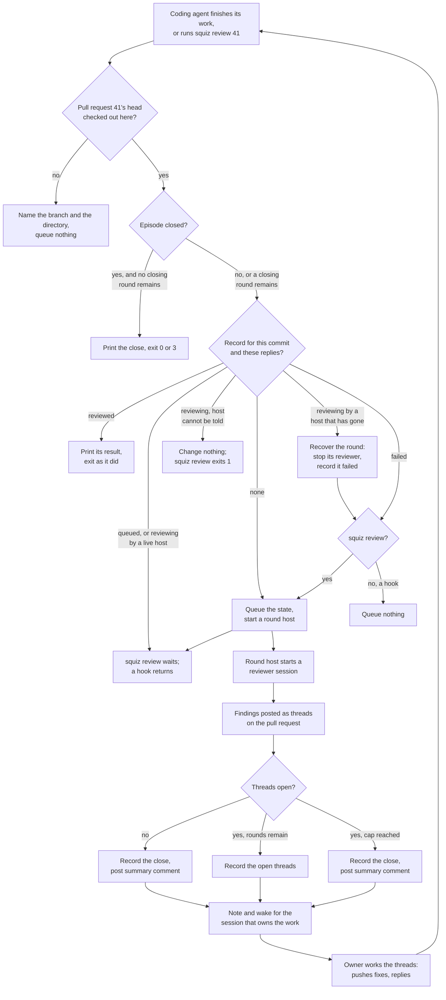
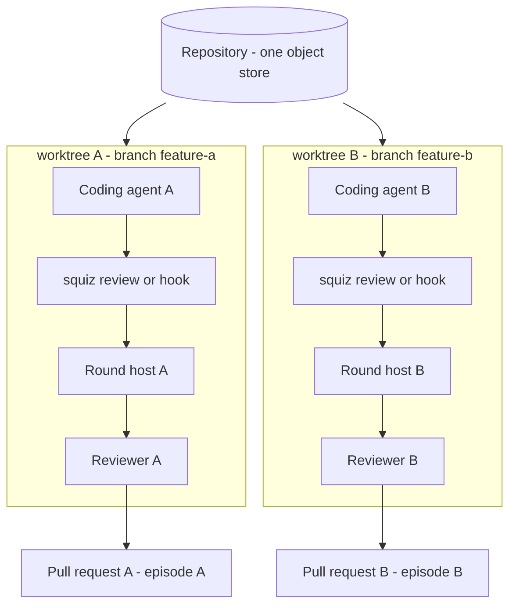

# Review Harness Specification: A Local Review Loop That Lives on the Pull Request

**Version:** 1.29 (draft)
**Status:** For review
**Owner:** TBD

---

## 1. Purpose

**Squiz is a local harness that automates code review between a coding agent and
a reviewing agent backed by different models, in a GitHub pull request.**

Agents write code faster than any person can read it, which breaks review in
two directions at once:

1. **It does not scale.** A person who reviews every change an agent produces is
   the constraint on the whole workflow.
2. **It becomes a rubber stamp.** A person who cannot keep up approves what they
   have skimmed, which is the same failure arriving quietly.

A reviewing agent reads the change and leaves its findings on the pull request,
and the two agents work through them there. A person opens a pull request that
has already been reviewed.

## 2. Dependencies

Squiz runs on the developer's machine. Four things must be installed, and every
one of them is required.

| Role | Today | Needed for |
|---|---|---|
| Git repository | `git` | The review runs against a working tree and a merge base. The repository needs a remote for a pull request to exist against. |
| Runtime | Claude Code, or the GitHub Copilot CLI | Runs the coding agent, whose shell tool runs `squiz review`. Loads the harness as a plugin, and fires its `Stop` and `SubagentStop` hooks, which start a review. Wakes the session that owns the work when the review is done. Copilot does so through the plugin's extension, which it loads only with its experimental features on, so squiz's Copilot support is experimental (§ 9). |
| Reviewer | `pi`, or the GitHub Copilot CLI where `reviewer` names it | The agent that reads the change and reports what is wrong with it. It must run a different model from the coding agent. Only the reviewer the configuration names has to be installed. |
| Forge | GitHub, through an authenticated `gh` | The pull request is where the review is conducted and recorded. |

A terminal multiplexer is optional. Where tmux or Herdr is running, each
reviewer runs in a pane of it, where a person can watch it. Where neither is,
the reviewer runs detached, and a log holds its progress.

### Behaviour the design rests on

- **`gh pr comment` and `gh pr review` take a body only.** Neither accepts a
  path or a line, so every inline comment goes through `gh api`.
- **Claude Code runs a shell command under a timeout, and moves a command that
  reaches it to the background rather than stopping it.** The timeout is 120
  seconds where the agent passes none, and at most 600 where it passes one, read
  from `BASH_DEFAULT_TIMEOUT_MS` and `BASH_MAX_TIMEOUT_MS`. The agent is told the
  command moved, with the file its output goes to. Where background tasks are
  disabled the command is stopped instead, and a command a foreground subagent
  moved stops when that subagent's run ends.
- **A foreground subagent often ends its run while its moved command is still
  running, and the command is stopped with it.**
- **A command stopped from outside gets `SIGTERM`, and so does every process
  under it, in the same instant**, including one started in a session of its
  own. `SIGKILL` follows one to two seconds later for whatever ignored it.
  Moving a command to the background sends nothing.
- **Claude Code fails a subagent that makes no progress for 600 seconds, and a
  subagent waiting on a shell command is making progress.** A hook that holds a
  subagent is not. The threshold is read from
  `CLAUDE_ASYNC_AGENT_STALL_TIMEOUT_MS`.
- **A long command output reaches the agent shortened, in a way that depends on
  the shell call's exit status.**
  - A call that exits non-zero is cut to a head-and-tail excerpt of about 10,000
    characters, with no path to the rest. Over about 30,000 characters it is
    first cut to 30,000, so its real end is lost as well as its middle.
  - A call that exits 0 with a long output is saved to a file, and the agent is
    shown a preview of about 2 KB that names the file.
  - A coding agent that runs `squiz review 41; echo "EXIT=$?"` makes the call
    exit 0, so its output is never cut.
- **A process outlives Claude Code stopping a command or a hook only if it leaves
  both the command's process tree and its process group.** A double fork with
  `setsid` between the forks does. A tmux window, a Herdr pane and an agent
  `herdr agent start` started all outlive it as well, because the multiplexer's
  server is their parent, and so does a tmux server the call itself started.
- **An `asyncRewake` hook's exit 2 and a post to the session's
  `CLAUDE_CODE_MESSAGING_SOCKET` each start a turn in an idle interactive
  session**, ten minutes after its turn ended as well as one. The runtime enforces
  an `asyncRewake` hook's `timeout`, and a hook stopped at it wakes nothing. Every
  socket post reaches the agent as "Another Claude session sent a message".
- **Copilot starts a turn in an idle session when a background shell command
  that session started ends.** The command is in the background where the agent
  ran it in the bash tool's `async` mode, or where it was still running when its
  `sync` call's `initial_wait` ran out. The new turn carries the command's whole
  output and its exit code. It wakes only the session that started the command.

### GitHub access

Permission to post comments is not enough on its own. The harness must be able
to do all of the following:

- Read a pull request: its diff, its description, and its base and head refs
- List the existing review threads and whether each one is resolved
- Create a review comment anchored to a file and a line
- Create a review comment on a file as a whole, carrying no line
- Reply inside an existing review comment thread
- Resolve a review thread, and re-open one
- Post an issue-level comment on the pull request, for the summary and for a
  round that failed

Resolving and re-opening a review thread is available only through GitHub's
GraphQL API. REST has no equivalent, so those two operations go through GraphQL.

### Identity

Every comment is posted with the credentials `gh` holds, so all of them appear
under the account that authenticated it. The reviewer, the coding agent and the
harness share one GitHub identity.

Each comment names its own author at the start of its first line, inside that
line's bold span. What follows the marker differs from comment to comment, so
the marker is the opening of the span rather than the whole of it.

| Written by | Begins |
|---|---|
| The reviewer | `**Squiz reviewer · ` |
| The coding agent | `**Squiz coding agent` |
| The harness, at close | `**Squiz review — ` |
| The harness, when a round fails | `**Squiz review failed — ` |

A comment without one of those markers was written by a person.

`**Squiz review` is itself a prefix of `**Squiz reviewer`, so the character
after the name is what separates the summary, the failure comment and a review
comment. A test for the summary that stops at the name matches every finding the
reviewer posted, and every failure.

## 3. The loop

The loop runs the review from end to end. A coding agent finishes its work on a
pull request, or runs `squiz review <number>`, and a round starts: a reviewer
reads the change in a session of its own, and its findings go onto the pull
request as threads. The session that owns the work is told the result. It works
the threads, replies and pushes, and the next round starts, until nothing is
open or the round cap is reached.

**Every trigger asks for the same review.** `squiz review <number>`, the Claude
Code hooks, a coordinator and a CI job are each a trigger. A trigger queues the
pull request's state for review and makes sure a round host is running, and does
nothing else. The round host runs the round, outside every trigger's process.

**Nothing has to reach into the coding agent's session for the loop to close.**
The pull request holds the review, and `squiz review` prints it, so any coding
agent that can run a shell command can be reviewed. Where squiz knows the
session that owns the work, it also tells that session, as The report sets out
below.

### Terminology

| Term | What it is |
|---|---|
| **Round** | One review of one state of a pull request, its head commit and the replies on the reviewer's threads: gate, review, post, decide. A round either leaves threads open for the coding agent, whose next push or reply starts the next round, or ends the episode. |
| **Episode** | Every round belonging to one pull request in one worktree. The round cap, the local state file and the summary comment are all per-episode; the review itself is per-round. |
| **Closing round** | The one round an episode the round cap closed with threads open may still run, when a new commit or reply follows the close. It rules on the threads still open and raises nothing, and the cap does not count it (The round cap). |

An episode is **live** from its first round until it closes, and its reviewer is
reviewing or its coding agent is working on what the review said. It closes for
one of three reasons: nothing is left open for another round to work, the round
cap is spent, or a round reached the token bound. A round that failed closes
nothing — it posts a failure comment under § 7, and the episode stays live. An
episode the cap closed with threads open is closed, and may still run its closing
round, which closes it again (The round cap).

A live episode is one whose close has not been recorded. Nothing else makes an
episode live or over: not whether a round is running at this instant, because
between two rounds the coding agent is working and no round exists, and not how
long ago anything happened.

### The state file

**An episode is keyed by the number of its pull request.** Its state lives in
`.squiz/<number>/` inside the worktree. The state file holds the round count, the
cost of each round, what it reviewed and ruled, and whether it was the closing
round (§ 5 The format), what the episode spent on attempts that were no round,
whether the episode has reported its close, what was open at that close and
whether that close leaves a closing round, and the reviewer's last ruling on each
thread. The directory also holds:

- `rounds/<k>/`, for each round: `prompt.md`, the task prompt the reviewer is
  handed, the report file the reviewer reports into, the reviewer's session,
  `resume.txt`, the command that resumes that session, and `gh/`, the empty `gh`
  configuration the reviewer runs with (§ 4 Tools). The snapshot the reviewer
  reads is in the temporary directory instead (§ 4 The snapshot).
- `notes/`, the notes for the sessions that own the work, under The report.
- `host.log`, the round host's output.
- `state.lock`, held while the state file is changed.

**Every change to the state file is made under `state.lock`.** A writer takes the
lock, reads the file, changes it, writes it, and releases the lock. A trigger
queueing a state and a round host writing its reviewing record therefore cannot
drop each other's record. The lock is held for one update and never across a
review, and it is a different file from `host.lock`. It names its holder's pid
and start time. A lock whose holder has gone is taken over. A writer that finds
the lock held by a live process, or by one that cannot be told running or gone,
waits up to a deadline of its own and never breaks the lock. A wait that runs out
is a state file that cannot be written (§ 7). Readers take no lock, because every
write replaces the file whole.

**The state file also holds one record for each state of the pull request the
episode has reviewed.** A state is two things, read when a trigger starts:

- **The head commit**, as GitHub reports it for the pull request.
- **The latest activity on the reviewer's threads.** Activity is a reply from
  anyone other than the reviewer, on a thread the reviewer opened: a comment after
  the first in that thread, carrying no `**Squiz reviewer · ` marker. The coding
  agent's replies are activity, and so is a person's. A thread a person opened
  holds no activity, whatever is said on it. The latest activity is the GitHub
  identifier of the newest such reply on the pull request, or none. An edited
  reply keeps its identifier and changes nothing. A deleted one can change which
  reply is newest, and that is a change like any other.

A new commit or a new reply is a new state. Either one means the review on record
no longer covers what the pull request now says.

Each record is in one of five states:

| State | What it records |
|---|---|
| Queued | A trigger asked for a review of this state, and no round has started it yet. |
| Reviewing | The round host running the round, and when that process started. A pid alone is reused, so the start time is what tells the round that holds it now from one that held it before. Also the round's number `k`, from the moment the round starts. Once the reviewer starts, also the reviewer's session: its backend, its pane or window where it has one, its pid and start time, the moment its time bound runs out, and its snapshot. |
| Reviewed | The result the round reached: its exit status, and the threads it left open. A round that left nothing open while a later state was queued behind it reached no close, so it records the result *reviewed clean, episode open*, with no exit status. Also the round's number `k`, which names its directory `rounds/<k>/` and so its `resume.txt`, when the round started and ended, and the reviewer's backend and pane or window. A round that left the episode open also records each of its findings that no thread holds, as the line § 5's Notes would give it. The closing round's record says it was the closing round. |
| Failed | The reason the round failed, and whether its owner has been sent a note about it. Also the round's number `k` and when the round started and ended, where a round started, and the reviewer's backend and pane or window, where a reviewer started. |
| Not reviewed | The episode closed before a round took this state, or a later commit or reply superseded it before its round started, and why. |

A record also names the session that owns the work, where a trigger knew it:
the session's identifier, the subagent that did the work where one did, and the
session's messaging socket where the hook found one. The Claude Code hooks
record it, and `squiz review` records none.

A record also carries the Herdr workspace the trigger ran in, from the
`HERDR_WORKSPACE_ID` in its environment, where it has one. Herdr sets it in every
pane it manages, so a hook or a `squiz review` run from the coding agent's pane
finds the coding agent's workspace. The reviewer's tab opens there (§ 4 The
reviewer session). A workspace id is a `w` and a number, such as `w2`. A value of any other shape
is not recorded, and the tab opens in the focused workspace.

**A trigger reads the record for the pull request's state before it queues
anything.** It has looked up the pull request and listed its threads by then,
because the state is read from them.

- **No record:** the trigger queues the state, and starts a round host where
  none is running.
- **Failed:** a hook queues nothing. `squiz review` queues the state again,
  because running the command is the request to retry it.
- **Reviewing**, by a round host that has gone: the trigger recovers the round, as
  The round host sets out, which records it failed. It then does what it does for
  a failed state.
- **Queued:** the trigger queues nothing, and starts a round host where none is
  running.
- **Reviewing**, by a round host that is running: the trigger queues nothing.
- **Reviewing**, by a round host no one can tell running or gone: the trigger
  recovers nothing, queues nothing and starts nothing, because recovering a round
  whose host may be alive would stop a live reviewer and remove its snapshot.
  `squiz review` exits 1 naming the host it could not check, and a hook returns.
  The next trigger checks again.
- **Reviewed, or not reviewed:** the trigger queues nothing. `squiz review`
  returns that result, with the threads read from the pull request as they stand
  now.

`squiz review` then waits, as § 7 sets out, and the hooks return at once.

**A failed state is retried only on a fresh request.** A new commit or a new
reply is a new state, with no record, and is queued like any other. The same
state is retried only by someone running `squiz review`. A hook firing on a
state that failed queues nothing, so a turn the coding agent spent reading a
failure note does not bring the failure back. Failures that spend no round, such
as a reviewer that will not start or a `gh` that cannot run, follow the same
rule.

**No failure starts a cycle.** A retry by `squiz review` that fails again posts
its failure comment, returns exit 1 to the run that asked for it, and writes no
second note. So every attempt after the first needs someone to run the command,
and a run that gets exit 1 is told not to run it again (§ 9).

**Every trigger therefore gets one review per state.** A second trigger for a state
already queued or under review finds it and queues nothing, so two firings for one
commit and the same replies post one set of threads and at most one summary. One
episode runs one round at a time. A state queued while a round of an older one runs
is reviewed next.

**A state accepted into the queue is never dropped.** It is reviewed, or it is
given a result of its own. Say state A is under review and state B, a later
commit, is queued behind it:

| A's round ends with | What happens to B |
|---|---|
| Threads open, rounds remaining | B is reviewed next, as usual. |
| Nothing open, rounds remaining | The episode does not close. A is recorded as *reviewed clean, episode open*: no exit status, no summary, and no note for its owner. B is reviewed next, and the episode closes from the last round with nothing queued behind it. A run of `squiz review` waiting on A goes on waiting, for the state the queue ends on, and returns that state's result: 0 or 3 with the close, or 2 where B left threads open. It exits 4 where its wait runs out first. |
| The round cap reached, or the token bound | The episode closes, as it must, and posts its summary. Its Notes name the cap or the bound and each state left not reviewed, whether A left threads open or nothing. B is recorded as not reviewed, with the reason. A run of `squiz review` waiting on B is handed the close, exit 0 or 3, with a line saying why B was not reviewed, and B's owner gets a note saying the same. |

The line comes right after the heading of the close the run is handed:

```
Full output, to read where this is cut short: /work/squiz/.squiz/41/review.txt
Squiz reviewed PR #41 at 3f9c2e0: round 3 of 3, no new findings.
Squiz did not review PR #41 at 8d21a4f: the episode closed at the round cap, after reviewing 3f9c2e0.
```

Where the token bound closed the episode, its reason reads "the episode closed at
the token bound, after reviewing 3f9c2e0".

**A round reviews the pull request's newest state, and only that.** When its
round starts, the round host checks that the state it took is still the pull
request's: the same head commit and the same latest activity. A state the pull
request has moved past is superseded. No review runs for it, nothing is posted,
and it is recorded not reviewed with a reason naming the state that superseded
it, in the form § 5's Notes use:

```
superseded by 8d21a4f
superseded by 3f9c2e0 with different replies
```

The newer state is queued by a trigger, and reviewed in its turn. The round host
queues nothing. Usually the trigger that read the newer state queues it. The host
can be the first to read it, though: GitHub can answer a trigger run straight
after a push with the head from before the push, and answer the host a moment
later with the pushed one. A run of `squiz review` waiting on the superseded
state then queues the newer one, as below. A hook does not wait, so a state
superseded after a hook queued it is queued by the next trigger. The state a
round reviews is the one its result is recorded against: the reviewer reads a
snapshot of that state's head commit (§ 4 The snapshot).

The record also holds the head commit and latest activity of the state that
superseded it, because the reason names that state only by its short commit, and
other states can share a commit.

A run of `squiz review` whose own state was superseded goes on waiting, for the
state with that head and activity, and returns that state's result. Where that
state was superseded in turn, the run follows it to the next. Where the state it
follows has no record, the run triggers again: it reads the pull request's state
afresh and acts on its record as any trigger does, which queues a state with no
record and starts a round host. Where it read the state it was following, it goes
on following it. Where it read another, it waits on that one instead. It exits 4
where its wait runs out first, as § 6 shows.

**A round decides its close and records it in one step.** It reads the queue
under `state.lock`, decides from it as the table above sets out, and writes the
close in that same update, before it posts the summary. A trigger that comes
after the close finds it and queues nothing, so no state queued while the
summary is posted is stopped by a close it arrived before. A round that finds
the round cap or the token bound already spent, and closes the episode without
starting a reviewer (§ 5), also writes the close before it posts the summary.

**A state left not reviewed is named by its short head commit, and by its
replies where an earlier state has the same commit.** The earlier states are the
one the round that closed the episode reviewed and those queued ahead of it. A state with the head
of an earlier state differs from it only in its replies: a reply was added or
deleted, and the record cannot say which. Such a state is named "with different
replies". A state whose head two earlier states have is named "with different
replies a second time", one with three "with different replies a third time", and
so on. Where B has A's commit and different replies, the line reads:

```
Squiz did not review PR #41 at 3f9c2e0 with different replies: the episode closed at the round cap, after reviewing 3f9c2e0.
```

**A reply is ruled on even where no commit follows it.** A coding agent that
disputes a finding and pushes nothing asks for a review again on a new state, and
the round reads its reply and rules on the thread: `withdrawn` where the argument
holds, `open` where it does not. A reply posted while a round runs is not in that
round's state, so the next run reviews again.

**Every round counts against the round cap, whatever started it.** A round that a
reply started is a round, exactly as one a commit started. A coding agent that
answers every finding with a dispute spends the cap doing so, and the episode
closes at the cap with the disputes for a person. A run that returns a recorded
result is no round and spends nothing.

**The state file keeps the reviewer's last ruling on each thread it ruled on**,
by the thread's node id: `fixed`, `withdrawn` or `open`. GitHub's resolved state
says a thread is closed and not which verdict closed it, and a close that runs no
reviewer counts the thread by this ruling (§ 5). A round writes its rulings in
the update that records its cost, before it posts anything, each in place of the
one its thread held before. A state file that will not take that update fails
the round with nothing posted, so no verdict reaches a thread unless its ruling
is on record. A thread a finished review gave no verdict is kept as `open`,
which is the verdict it is treated as. A failed round writes the rulings it
salvaged, and leaves every other thread's alone. A ruling is kept whether or not
GitHub then takes it, because the thread's resolved state still says whether it
is closed. A state file with no rulings holds none.

**A closed episode stays closed in its worktree.** The one exception is the
closing round, which a close at the round cap leaves for the next new state (The
round cap). A second episode on the same pull request starts in another worktree
on the same branch, which holds no state for it.

**A state file an earlier version wrote may also hold what its rounds found by
comparing the snapshot before and after the reviewer ran.** It reads as it would
without that, and nothing reports what it held.

### End-to-end workflow


```mermaid
flowchart TD
    A[Coding agent finishes its work,<br/>or runs squiz review 41] --> C{Pull request 41's head<br/>checked out here?}
    C -->|no| L[Name the branch and the directory,<br/>queue nothing]
    C -->|yes| K{Episode closed?}
    K -->|yes, and no closing<br/>round remains| D[Print the close, exit 0 or 3]
    K -->|no, or a closing<br/>round remains| R{Record for this commit<br/>and these replies?}
    R -->|reviewed| P[Print its result,<br/>exit as it did]
    R -->|queued, or reviewing<br/>by a live host| W[squiz review waits;<br/>a hook returns]
    R -->|reviewing, host<br/>cannot be told| U[Change nothing;<br/>squiz review exits 1]
    R -->|none| Q[Queue the state,<br/>start a round host]
    R -->|reviewing by a<br/>host that has gone| V[Recover the round:<br/>stop its reviewer,<br/>record it failed]
    V --> X
    R -->|failed| X{squiz review?}
    X -->|yes| Q
    X -->|no, a hook| Y[Queue nothing]
    Q --> W
    Q --> H[Round host starts a<br/>reviewer session]
    H --> F[Findings posted as threads<br/>on the pull request]
    F --> G{Threads open?}
    G -->|no| I[Record the close,<br/>post summary comment]
    G -->|yes, rounds remain| M[Record the open threads]
    G -->|yes, cap reached| J[Record the close,<br/>post summary comment]
    I --> N[Note and wake for the<br/>session that owns the work]
    M --> N
    J --> N
    N --> O[Owner works the threads:<br/>pushes fixes, replies]
    O --> A
```

### A round, step by step

1. **Gate on the pull request.** The trigger looks up pull request `<number>`
   and checks that its head branch is the branch checked out in the directory it
   was run in, and the round host checks again when the round starts, together
   with whether a later state has superseded the one it took (The state file).
   If the pull request is not open, or that directory has another branch or a
   detached HEAD, no review runs and nothing is posted. `squiz review` exits 1, and stderr names
   what it found:

   ```
   squiz: no review ran: PR #41's head is "feature-a", and "/work/squiz" has "main" checked out
   ```
2. **Gate on the episode and the commit.** The trigger reads the episode's state
   file. An episode that has reported its close is over: `squiz review` prints the
   close and exits as the close did, and no reviewer runs. The round cap and the
   token bound are not consulted, because an episode that is over stays over
   whatever a bound would now allow. An episode whose closing round remains is
   the one exception, and a new state is queued for that round (The round cap). Otherwise the trigger lists the threads, and
   the record for the pull request's state decides, as The state file sets out,
   whether the state is queued.
3. **Run the reviewer.** The round host starts the reviewer as a session of its
   own (§ 4), hands it the pull request for scope and intent together with
   the threads the reviewer itself opened on it, and lets it read directly its
   snapshot of the head commit of the state it took: files the diff did not touch, callers, and git history.
4. **Post the findings, and act on the verdicts.** Each new finding opens a new
   review comment thread, anchored to a file and a line or to a file as a whole.
   Each verdict the reviewer returned is applied to the thread it names: `fixed`
   and `withdrawn` reply on an open thread and then close it, and `open`
   re-opens the thread or leaves it open, then posts the reviewer's reason as a
   reply on it. § 4 Findings gives each reply.
5. **Record the open threads, or close.** If threads of this review are still
   open and the round cap has not been reached, the round records the result. A
   run of `squiz review` waiting on it prints the open threads and exits 2, and the
   round tells the session that owns the work (The report). A thread a person opened is counted by neither the arithmetic
   nor the output, so it never keeps the loop going and an episode ends with one
   still open. § 6 shows what is printed.
6. **Close the episode.** Otherwise, and where nothing is queued behind this
   round or the cap or the token bound is reached, the round records the close in
   the episode's state, in the same update that read the queue, and then posts
   one summary comment on the pull request. A state still queued is handled as
   the table above sets out. A run of
   `squiz review` exits 0 where nothing of this review is open, and 3 where the
   round cap or the token bound closed it with threads still open, which it
   prints. What remains open is what
   the summary reports and what a person then looks at.

Where threads are open, the coding agent works them before it asks for another
review. It replies on a thread to say what it changed, to disagree, or
to ask a question. It does not close threads. A thread closes when the reviewer's
verdict closes it, so a closed thread means the reviewer read the code as it now
stands and accepted it. A thread the reviewer keeps open carries its reply
saying what is still wrong, so a dispute reads on the thread as a conversation:
the reviewer, the coding agent, the reviewer again, until the thread is closed
or the round cap leaves it open.

### The round cap

The cap defaults to 3 and is settable from 1 to 8. A cap of R hands open threads
back to the coding agent at most R−1 times, because round R closes the episode
whatever is still open. A cap of 1 reviews once and closes.

**An episode the cap closed with threads open runs one closing round, when a new
state follows the close.** Round R closes the episode as any close does: it
records the close, posts the summary, and a run of `squiz review` waiting on it
exits 3. The update that records the close also records that the closing round
remains, so a trigger that reads the state while the summary is posted already
finds it. The first new state after that, a new commit or a new reply on the
reviewer's threads, has no record, so a trigger queues it as it queues any state
with no record, and the round host runs it as the closing round. A trigger
that finds the same state as before finds its record, and queues nothing.

The closing round is a round as A round, step by step sets out, with five
differences:

- **It rules only on the threads still open.** It hands the reviewer the
  reviewer's threads that are not resolved, and no others, so no verdict can
  re-open a resolved one. A thread it is not handed keeps its state, and the
  summary counts it by the ruling the state file recorded for it, as a close
  before any review does (§ 5): `fixed` or `withdrawn`, or resolved with its
  ruling unknown where none was recorded.
- **It raises no findings.** Its prompt says so, in a section of its own before
  the threads:

  ```markdown
  ## Closing round

  The round cap is spent, and this is the review's closing round. Return a verdict on every thread below, and report no findings: a finding reported in this round is not posted.
  ```

  The round does not rely on the reviewer to obey. A finding the reviewer reports
  anyway is never posted, and no thread is opened for it. The round names each
  one in its summary's Notes, on `squiz review`'s stderr, and under its line in
  `squiz status`, so a finding dropped this way is never lost without a line
  saying so. A closing round that fails names them in its failure comment
  instead of a summary, and on the other two all the same.
- **The cap does not count it.** Its entry in the state file is marked as the
  closing round. The cap's arithmetic leaves that entry out, and every other
  ledger keeps it: its spend is the episode's, its directory is `rounds/<k>/`
  with the next `k`, and its reviewer's label is `squiz-<number>-r<k>`.
- **It closes the episode for good.** It writes the close again, in the update
  that reads the queue, and posts a second summary comment (§ 5). A run of
  `squiz review` waiting on it exits 0 where it left nothing open, and 3 where it
  left threads open. A state queued behind it is recorded not reviewed, as one
  queued behind a round that reached the cap is, with the reason "the episode
  closed at the round cap, after reviewing" and the closing round's commit.
- **The token bound is checked before it, as before any round.** Where the
  episode's widest attempt has reached the bound, which only a bound lowered
  since the close can bring about, no reviewer runs, nothing is posted, and the
  state is recorded not reviewed with the reason "the episode had closed before a
  round took this state".

**The closing round runs once per episode.** It is spent once its entry is in the
state file, which happens when its reviewer has run, however that review ended.
The entry is written before the round posts, so a trigger for the state the
closing round took finds that state's record still reviewing, and waits on it as
on any state under review. A
closing round the time bound cut short is spent, and so is one whose review
failed after the reviewer reported. After it the episode is over as any closed
episode is: a fix pushed after the closing round queues nothing, the threads it
left open are a person's, and `squiz review` prints the close and exits 3. A
closing round that failed after it was spent posts its failure comment, which
says "The review is closed: its closing round has run. No round runs again." in
place of the retry, and posts no second summary.

**A closing round that spent nothing is a failed state like any other.** A
reviewer that would not start, or a `gh` that could not answer before the
review, records no entry. A hook does not retry that state, and `squiz review`
or a new state does, as The state file sets out.

**Only a round that reviewed and reached the cap leaves a closing round.** A
close at the token bound leaves none, and so does a close before any reviewer
ran (§ 5). A state queued behind the round that reached the cap is recorded not
reviewed at that close, as The state file sets out, and only a state after the
close starts the closing round.

### What starts a round

**A round starts when a trigger queues a state and the round host takes it.**
There are two kinds of trigger:

- **The plugin's hooks**, on `Stop` and `SubagentStop`, which queue the state
  and return at once. Claude Code and the GitHub Copilot CLI both fire them, as
  The Claude Code hooks sets out. In either runtime they start every round, and
  the session that owns the work is woken with the result, as The report sets
  out.
- **`squiz review <number>`**, which waits for the review and prints the result.
  The note that wakes the session names it, and the coding agent runs it to read
  the threads. A coordinator or a CI job may run it as well, from a checkout of
  the pull request's branch.

**Nothing tells a coding agent to run `squiz review` before it is woken.** An
agent that runs it anyway queues the state itself. Copilot fires `Stop` when a
turn ends, and a turn that ran the command ends after the command queued the
state, so that firing finds the state queued or reviewed and queues nothing.

**An agent in a runtime with no hook gets a round only by running the command.**
Squiz does not tell it to. A pull request no round has read carries no comment
with any of § 2 Identity's markers.

### The round host

**The round host runs the rounds of one episode, one at a time, outside every
trigger's process.** It is `squiz host <number>`. A trigger that queues a state
starts one where none is running, by a double fork with `setsid` between the
forks, with its standard input on `/dev/null` and its output in
`.squiz/<number>/host.log`. That is what lets it outlive the shell call or hook
that started it (§ 2).

It takes the oldest queued state, writes the reviewing record naming itself, and
runs the round as the steps above set out. It exits when nothing is left queued,
and when the worktree it serves is gone.

**One round host runs per episode.** It holds `.squiz/<number>/host.lock`, which
names its pid and start time. A host that finds the lock held by a live process
exits at once, so two triggers that each start one leave one running.

**A host that died is found by its pid and start time.** A queued state with no
live host is one no host will take, and the next trigger starts a host for it. A
reviewing record whose host has gone is a killed round, and its reviewer may
still be running: the host and the reviewer are separate processes, and a
reviewer in a pane is not the host's child.

**Recovery stops the orphaned reviewer before anything replaces it.** Every
trigger, and every round host as it starts, recovers each killed round it finds:

1. It reads the reviewer's session from the reviewing record: its backend, its
   pane or window, its pid and start time.
2. Where that reviewer is still running, it stops it as a round host stops a
   reviewer at its bound: the reviewer's process group, then the pane. It does so
   whether or not the reviewer's time bound has passed, so an orphan past its
   bound is always stopped by the first recovery to find it.
3. It confirms that the reviewer is gone, by pid and start time and by asking
   the backend for the pane.
4. Only then does it remove the snapshot and record the round as failed, with
   the reason "the round host died". No failure comment is posted.

A recovery that cannot confirm the reviewer is gone leaves the snapshot and the
record as they are, and starts nothing for that state. `squiz review` exits 1
naming the process it could not stop, and the next recovery tries again.

**Nothing stops an orphan before a recovery runs.** While no host is alive, the
reviewer's time bound is enforced when the next trigger or `squiz review` runs,
and not before.

### The Claude Code hooks

**Squiz registers `squiz hook` on Claude Code's `Stop` and `SubagentStop`.**
`Stop` fires when a regular session's turn ends, and `SubagentStop` when a
subagent's does. Each firing resolves the pull request whose head is the branch
checked out in the payload's `cwd`, records the session that owns the work,
queues the state as The state file sets out, and returns. It never runs a round
and never blocks the agent: it exits 0 whatever it found. Where it finds no pull
request it writes the line under step 1 naming the branch and the directory.

**The worktree comes from the payload's `cwd`, never from the directory the hook
process runs in.** Under Claude Code the two are the same directory. Copilot runs
a plugin's hook in the plugin root, so the hook's own directory is the plugin
checkout. A payload with no `cwd`, or with one that is not an absolute path,
queues nothing, and the hook says so on stderr. So does a `cwd` that is in no git
worktree.

```json
"Stop": [
  { "hooks": [ { "type": "command", "command": "${CLAUDE_PLUGIN_ROOT}/bin/squiz hook", "asyncRewake": true, "timeout": 86400 } ] }
],
"SubagentStop": [
  { "hooks": [ { "type": "command", "command": "${CLAUDE_PLUGIN_ROOT}/bin/squiz hook" } ] }
]
```

| Event | The owner of the work it records |
|---|---|
| `Stop` | The session itself, from the payload's `session_id`, and its `CLAUDE_CODE_MESSAGING_SOCKET` where the hook's environment carries one |
| `SubagentStop` | The session that dispatched the subagent, from the payload's `session_id`, and its `CLAUDE_CODE_MESSAGING_SOCKET` where the hook's environment carries one; and the subagent, from its `agent_id` |

A subagent runs inside its parent's process and has no socket of its own, so the
socket in a `SubagentStop` hook's environment is the parent's.

**GitHub Copilot CLI runs the same two registrations from the plugin, and the
socket the hook records under it is the plugin's extension's.** Copilot fires the
plugin's `Stop` and `SubagentStop` with Claude Code's payload fields, and the
owner and the subagent come from the same fields as in the table. A firing is
Copilot's where the hook's environment carries `COPILOT_CLI` with any value but
the empty string.

- **The socket is `squiz.sock` beside the owner's transcript.** The payload's
  `transcript_path` is `<COPILOT_HOME>/session-state/<session id>/events.jsonl`,
  and the extension listens in that directory. The hook takes the socket from
  there only where the transcript's session is the payload's `session_id`.
- **The hook records it only once a connection to it is accepted, within one
  second.** It connects and closes without writing. A session started without
  experimental features has no extension, and a socket file left by a killed
  extension refuses the connection. Either way the hook records no socket, and
  the owner is recorded with its session id alone.
- **A `CLAUDE_CODE_MESSAGING_SOCKET` in the hook's environment is never
  recorded.** Copilot puts no socket there, so one found there belongs to a
  Claude Code session that started Copilot.

The plugin's manifest names the extension's directory in its `extensions` field,
`"extensions": "extensions"`. Claude Code ignores the field.

Under Claude Code the `Stop` registration runs in the background, so the session
does not wait on it. After it has queued, it stays to deliver a note, as The
report sets out. The `SubagentStop` hook returns as soon as it has queued, and
so does the `Stop` hook under Copilot, which waits for every hook to end before
the session goes idle.

**Nothing the runtime does to a hook bounds a review.** The hook only queues, so
neither the hook's timeout, nor the stall threshold, nor the hand-back that ends a
subagent in auto mode reaches the round.

A turn ending is not work being done. The hook fires on every turn, including one
that ended on a question, and queues only a state that needs a review, so a turn
that pushed nothing starts nothing. A firing for a subagent the session did not
dispatch, for a state already queued or reviewed, queues nothing.

**A `SubagentStop` firing whose `agent_type` is empty is no subagent's work.** In
an interactive session, Claude Code fires several of them after a turn ends, each
with a new `agent_id`, the parent's `session_id`, and no transcript. The hook
does nothing for one: it resolves nothing, records no owner and queues nothing.

**A `Stop` firing whose `session_id` is not the session its `transcript_path`
names is a subagent's turn.** Copilot fires one when a subagent's turn ends, just
before that subagent's `SubagentStop`. It carries the subagent's id as
`session_id` and the parent's transcript, so read as it stands it would make the
subagent the owner. The hook does nothing for one, as for an empty `agent_type`,
and the `SubagentStop` that follows queues the work. Only a Copilot transcript
path, `<COPILOT_HOME>/session-state/<session id>/events.jsonl`, names a session.
Claude Code fires no `Stop` for a subagent, so its transcript path is not read,
and a Claude Code `Stop` is never dropped by this rule.

The hook's shell does not have the plugin's `bin/` on its `PATH`, so the
registration names the binary through `${CLAUDE_PLUGIN_ROOT}`.

### The report

**The result goes to the session that owns the work and is still alive.** For a
regular session's work that is the session itself. For a subagent's work it is
the session that dispatched it: the subagent has ended, and in auto mode it has
handed back, so nothing reaches it.

When a round records its result, the round host writes a note for the owner
recorded on the state, in `.squiz/<number>/notes/<session id>/`, one file per
note, written under a temporary name and renamed into place:

```
to=60517e1f-e1dc-49b1-8e39-6fcbe686f3fb
pr=41
head=3f9c2e07b1d4a8c6e5f0923b7a1d6c4e8b2f5a90
subagent=a402ef8f56c1b2ed1
text=Squiz reviewed PR #41 at 3f9c2e0, the work of subagent a402ef8f56c1b2ed1: 2 threads are open. Run `squiz review 41` to read them.
```

The note points, and carries no finding. `subagent` is there only where a
subagent did the work. A failed state gets one note, however many times it fails,
and a state not reviewed gets one saying why. A state no hook recorded an owner
for gets no note.

For a round that failed, the text gives the reason and names `squiz status`.
Where a round remains under the round cap and the token bound, it says that a new
commit, or running `squiz review` once, retries it:

```
text=Squiz could not review PR #41 at 3f9c2e0: the reviewer could not run: the provider refused the credential. `squiz status` lists it. A new commit, or running `squiz review 41` once, retries it.
```

Where the failed round leaves no round to run, the note says the review is closed
and which bound closed it, in the failure comment's words. Whether a round
remains is read as that comment reads it (§ 7 The failure comment):

```
text=Squiz could not review PR #41 at 3f9c2e0: round 3 found 2 findings and could not post them to PR #41. `squiz status` lists it. The review is closed: it has run 3 rounds, and the round cap allows 3. No round runs again. A new commit, or running `squiz review 41`, posts its summary.
```

A note for an episode that ran no round ends at "No round runs again.", as the
comment does.

**Then it wakes a Claude Code owner, one of two ways.** Whichever delivers a note
moves it into `delivered/` beside it, so the other does not deliver it again.

- **The messaging socket.** Where the hook recorded a socket for the owner, the
  round host posts the text to it, and an idle session starts a turn with it.
  The post is one JSON line,
  `{"type":"user","message":{"role":"user","content":"<text>"}}`, on a
  connection the host ends, and nothing is read back.
- **The `asyncRewake` waiter.** The `Stop` hook, once it has queued, waits while
  any state its session owns is queued or under review. When a note for its
  session arrives it writes the text to stderr and exits 2, which starts a turn.
  It delivers any note already waiting for its session first. Claude Code does
  not deduplicate background hooks, so a session that ends three turns has three
  waiters, and a waiter whose session has ended a later turn exits 0 without
  delivering anything. Only the newest delivers.

**A Copilot owner is woken through the plugin's extension.** Copilot loads
extensions only with its experimental features on, so squiz's Copilot support
is experimental as a whole, and § 9 has the user turn them on. Copilot starts
`extensions/squiz-wake/extension.mjs` in each session. It listens on
`squiz.sock` in the session's state directory, reads the posts the round host
makes to a Claude Code socket, and turns each one into a turn with
`session.send()`, as a system message carrying the note's text. The hook
records that socket as The Claude Code hooks sets out, and the round host posts
to it exactly as it posts to Claude Code's.

- **One socket per session.** The extension removes any file at the path before
  it listens, and removes the socket when the session shuts down and when
  Copilot stops the extension.
- **A post that finds nothing listening fails.** The note goes back to wait for
  a pull, and nothing posts it again.

**A Copilot owner with no socket learns the result only from its own
`squiz review`.** That is a session started without experimental features, which
squiz does not support, or one whose socket path is too long for the extension
to listen on (§ 9). Its reviews still run. Copilot leaves no waiter, so the round
host writes the note and wakes nothing. A `squiz review` that the session ran in
the background, or that Copilot moved there, wakes the idle session when it
exits, with its output and its exit code (§ 2). That is the round's result where
the round ended before the command's deadline. Where the deadline came first the
command exits 4, the agent runs `squiz review` again, and that run's exit is the
next wake. This is a fallback, and § 9 sets up no session to rely on it.

**A subagent's parent decides what follows.** It reads the threads with
`squiz review`, and sends the same subagent back to work them, dispatches
another, or works them itself. Squiz does not choose.

**A note no wake reached stays where it was written.** The owner learns the
result by running `squiz review` or `squiz status`, and the pull request holds it
in any case.

### Not in the first version

- **Delivering notes when a session starts.** A note waiting for a session that
  was closed is delivered only by its next `Stop` waiter, or read by pull.
- **Copilot sessions without experimental features.** Squiz does not support
  them. A note for a round only a hook queued wakes nothing in one, and is read
  by pull.
- **Acknowledgement and retry rules.** A note is delivered at most once, and
  nothing retries one a wake did not reach.
- **A two-way inbox.** The coding agent answers on the pull request, and never
  through a note.

### Parallel coding agents

Each coding agent that opens a pull request works in its own git worktree on its
own branch. A branch can be checked out in only one worktree at a time, so the two
go together.

**The command reviews the worktree it is run in.** It resolves the toplevel with
`git rev-parse --show-toplevel` from its own working directory, which is the
caller's. A coding agent working in a worktree by path runs the command from that
path, and that worktree is the one reviewed. The hook resolves the toplevel from
the payload's `cwd` instead, which is the session's directory. For a subagent it
is fixed when the subagent is dispatched.


```mermaid
flowchart TD
    R[(Repository - one object store)]

    subgraph WA [worktree A - branch feature-a]
        AS[Coding agent A] --> AH[squiz review or hook] --> AX[Round host A] --> AR[Reviewer A]
    end

    subgraph WB [worktree B - branch feature-b]
        BS[Coding agent B] --> BH[squiz review or hook] --> BX[Round host B] --> BR[Reviewer B]
    end

    R --> WA
    R --> WB
    AR --> PA[Pull request A - episode A]
    BR --> PB[Pull request B - episode B]
```

The worktrees share one object store and nothing else. Each run of the command
resolves its own working directory, so one reviewer sees one coding agent's change
and posts to one pull request. One worktree, one branch, one pull request, one
episode.

**The harness does not remove a worktree.** The coding agent is still in it when
the command returns. Whatever created the worktree removes it. The episode's
state goes with the worktree, and nothing in it outlives the worktree, because
the pull request holds the findings.

**A tree two episodes share keeps them apart.** One tree holds two pull
requests' episodes when its `HEAD` moved to another branch while the first
episode was live. Each keeps its state under its own number, and each reviewer
reads a snapshot of its own pull request's head commit.

**Two coding agents on one branch in one tree share one episode, and nothing tells
them apart.** They spend one round cap between them. Nothing detects this.

## 4. The reviewer

The reviewer is a second agent that reads the code the coding agent has just
written and reports what is wrong with it. It has no GitHub access of its own:
it reports each finding as it confirms it, and the harness turns each one into a
comment on the pull request.

### Invocation

The reviewer is a session the round host starts once per round, as The reviewer
session sets out. It reports its findings as it makes them, and a cost where its
CLI reports one. It never edits the code it is reviewing, and it holds no state
between rounds: each round is a fresh session, and everything it knows about
earlier rounds arrives in what it is handed.

Five things are handed to it:

| | |
|---|---|
| **A working directory** | A snapshot of the pull request's head commit, in a clone of its own (The snapshot, below). The reviewer runs with this as its current directory. |
| **The pull request** | Its number, its base and head refs, its description, and the threads the reviewer opened on it, each with its replies and whether it is resolved. The harness fetches all of this and passes it in. |
| **A charter** | The standing instructions describing what a good review is. It ships with the harness and is the same every round. |
| **A thinking level** | How hard the reviewer thinks. The harness sets it every round, so the level never comes from the reviewer CLI's own configuration. The levels are listed under Configuration. |
| **A model** | The model the project configured, in the reviewer CLI's own spelling, or none, which leaves the CLI on the user's default. |

The tools it may call are the same every round, as Tools below sets out.

**The prompt tells the reviewer what the history tools are for.** Every prompt
carries this section between the description and the diff:

```markdown
## History

Call `git_log_search`, `git_blame` and `git_show` to find out whether a line was meant: which commit wrote it, and what that commit said it was for.
```

**There is no file-selection or budgeting stage.** The reviewer decides what to
open, one read at a time.

### The reviewer session

**Each round's reviewer runs as a session of its own, where a person can watch
it.** The round host starts it in the first place that applies:

| Where | How the round host starts it |
|---|---|
| Herdr, where `HERDR_SOCKET_PATH` is set | `herdr tab create --cwd <snapshot> --label squiz-41-r2 --no-focus --workspace <id>` gives a pane, in the workspace the state's record names, and in the focused workspace where it names none, and `herdr pane run <pane> '<gated command line>'` types the reviewer's line into the pane's shell once the shell is at its prompt |
| tmux, where `TMUX` is set | `tmux new-window -d -n squiz-41-r2 -c <snapshot> '<command line>'` |
| Neither | As a child of the round host, with no terminal |

The command line is the one the adapter built: `pi`'s, or the Copilot adapter's
shell line, which starts Copilot. Below, "the reviewer" is that command.

**In Herdr, the start returns once the reviewer is running, and the round's
bound is all that limits the review.** `herdr pane run` types a line and returns
at once. The line is the reviewer's behind a gate, each word single-quoted:

```
'/bin/sh' '-c' '<gate>' '/tmp/squiz-gate-Xa81Qe' '400' 'pi' '--session-dir' …
```

**No line over 512 bytes is typed.** A new pane's shell may not have started its
line editor when the line arrives, and macOS then keeps only 1024 bytes of it. A
line cut inside a quoted word runs nothing. A gated line over 512 bytes is
written to a file named `line` in the gate directory before the tab is created,
and the line typed runs that file:

```
'/bin/sh' '/tmp/squiz-gate-Xa81Qe/line'
```

The file removes itself and then execs the gated line, so the gate's pid is
still the typed command's. Copilot's line is about 1.7 KB, and `pi`'s is about
900 bytes from a worktree, so both run from the file. tmux types nothing: the
command line is `new-window`'s own argument.

The gate writes its pid into the gate directory, waits for a `go` file there,
and then becomes the reviewer with the same pid, group and start time. The
round host reads the pid and the reviewer's group while the gate is shut, and
only then writes `go`. So a reviewer that finishes within a second of starting is
still a review that started, and a start that fails never lets the reviewer run.
A gate left waiting gives up on its own after four times the bound on each
program the start runs, without running the reviewer. Where the reviewer's
command is not on the shell's path, the gate says so and the start fails at
once. Where the reviewer has not started 15 seconds after the line was typed,
the start fails.

**A pane's shell reads the line as typed**, so a control character in an
argument would be a key: a newline would end the line, and a tab would complete.
The round host checks the arguments before it creates the tab, and treats such a
command as a pane Herdr refused: nothing opens, and it goes on to tmux or a
child. Neither adapter's line carries one unless a path in it does.

**The variables the round sets reach the reviewer on every backend, over any
value the pane's shell gives them.** They are the adapter's, and the GitHub
variables under Tools, which come last so that no adapter can undo them. A
child is started with them in its environment. A pane starts its shell with the server's environment rather than
the round host's, so they are passed with Herdr's `--env` and tmux's `-e`. The
shell then runs the person's startup files, which can set any of them again: zsh
reads `.zshenv` even for `-c`. So the line typed into a Herdr pane, and the
command of a tmux window, set each variable once more, as `env` arguments in
front of the gate or the reviewer:

```
'/usr/bin/env' 'SQUIZ_REPORTS=…' 'GH_TOKEN=' 'GH_CONFIG_DIR=…' … '/bin/sh' '-c' '<gate>' …
```

`env` sets them and then becomes the gate or the reviewer, so the pid, group and
start time the round reads are still the reviewer's.

**The pane closes when the review ends, and the session stays resumable.** tmux
closes a window when its command exits. Herdr returns the pane to its shell when
`pi` exits, and the round host then closes it with `herdr pane close`. Each
round's `pi` writes its session to `.squiz/<number>/rounds/<k>/session/`, and the
round host writes the command that resumes it to `rounds/<k>/resume.txt`:

```
pi --session-dir .squiz/41/rounds/2/session --session 0193f2c4-7d1e-7b52-9c1a-5e2f4d8a6b31
```

`squiz status` prints it on the round's line. A person runs it from the coding
agent's worktree, which the paths are relative to. The session ran in the
snapshot, which is gone once the round ends, so `pi` does not resume it in place.
It asks to fork the session into the current directory:

```
Fork this session into current directory? [y/N]
```

Answering yes opens the reviewer's conversation in the worktree, with everything
the reviewer read and said. A conversation resumed after the round is not part
of the review. Copilot's resume line is under The Copilot adapter.

**What a person types into a `pi` reviewer's pane reaches `pi`.** It can steer
the review, and nothing records it. A Copilot reviewer's pane can be watched and
takes no input.

**The round host stops a reviewer in a pane the way it stops one it started
itself.** At the time bound it signals the reviewer's process group, and then it
closes the pane. It reads the reviewer's group from the backend while `pi` runs:

| Backend | Where the reviewer's group comes from |
|---|---|
| tmux | `tmux display -p -t <pane> '#{pane_pid}'`. The window's command is the one the adapter built, `pi` or the `sh` of the Copilot adapter's line, so this is that command's own pid and leads its group. |
| Herdr | The pid the gate wrote, confirmed as `foreground_process_group_id` from `herdr pane process-info`, before and after its identity is read. Its `shell_pid` is the pane's shell, whose group does not hold the reviewer. |

A pane close is not relied on to stop anything. tmux's `kill-window` sends one
`SIGHUP` to the window's command and nothing more, so a command that ignores it
runs on with the window gone. Herdr's `pane close` sends `SIGHUP`, then `SIGTERM`,
then `SIGKILL`, to every process in the pane's shell session. Neither reaches a
process in a session of its own.

### The snapshot

**Every reviewer reads its own snapshot of the head commit.** The coding agent
may be editing its worktree while a round runs, so the reviewer never reads that
worktree. Before the reviewer starts, the round host clones the
repository into the system's temporary directory and checks out the head commit
of the state under review, detached:

```
git clone --quiet --shared --no-checkout --config remote.origin.pushurl=/dev/null /work/squiz/.git /var/folders/x7/T/squiz-501/5e1f0c2a9b3d7e64-41/rounds/2/tree
git -c core.hooksPath=/dev/null checkout --quiet --detach 3f9c2e07b1d4a8c6e5f0923b7a1d6c4e8b2f5a90
```

The source is the repository's shared git directory, which
`git rev-parse --git-common-dir` names from the coding agent's worktree. The
commit is the one GitHub reports as the pull request's head. Where the
repository does not have it yet, because it was pushed from elsewhere, the round
host fetches it into the repository first, writing no ref and no `FETCH_HEAD`.
The fetch, the clone and the checkout run in the part of the round before the
review, under its 30 seconds (§ 7 The review budget).

**The snapshot borrows the repository's objects and shares nothing else.**
`--shared` writes the repository's object directory into the clone's
`objects/info/alternates`, so the clone reads every object the repository has,
without copying one. That includes a head commit the fetch brought, which no ref
points to. The clone's history is the repository's, so `git log`, `git blame`
and `git show` in the snapshot answer as they would in a worktree at the same
commit. Everything else is the clone's own, so the repository's config, hooks
and refs never reach the history tools (Tools):

| The clone's own | What it keeps away |
|---|---|
| Config, `.git/config` | The repository's local config. A diff driver, a `gpg.program` or a `core.fsmonitor` set there is not in the snapshot for a history tool's `git` to read. |
| Hooks, `.git/hooks/` | The repository's hooks, which never run in the snapshot. |
| Refs: branches, tags, `HEAD` | The repository's refs as they move. The snapshot's `HEAD` stays at the commit under review whatever the coding agent's worktree checks out meanwhile. |
| `origin`, which names the repository | The repository itself: its push URL is `/dev/null`, so a push to `origin` fails. |

The clone's refs start as a copy of the repository's branches, under
`refs/remotes/origin/`, and its tags. A branch name given to `git_show` resolves
against those, so it can name a different commit than it would in the coding
agent's worktree. A full commit name or a revision from `HEAD` resolves alike in
both.

The repository's local config reaches the checkout no more than it reaches a
fresh clone's, so a filter or a `core.autocrlf` set there and not in the user's
own config is not applied when the snapshot is checked out.

**The path is `<temporary directory>/squiz-<uid>/<digest>-<number>/rounds/<k>/tree`:**

| Component | What it is |
|---|---|
| `<temporary directory>` | `TMPDIR`, or the system's default where it is unset |
| `squiz-<uid>` | One directory per user, which the round host makes readable and writable by that user alone |
| `<digest>-<number>` | The first 16 hex digits of the SHA-256 of the coding agent's worktree path, and the pull request's number |
| `rounds/<k>/tree` | The round's number within the episode |

Two worktrees reviewing pull requests with the same number never share a path,
and neither do two rounds of one episode. The same worktree, number and round
always give the same path.

**No component the harness adds to the path begins with a dot**, wherever the
coding agent's worktree is. A `TMPDIR` whose own path has such a component is
the user's, and the harness does not change it.

**The round host refuses to make a snapshot where `squiz-<uid>` is not the
user's alone**: a link, a directory another user owns, or one that a group or
other users can write. The temporary directory may be shared, as `/tmp` is, and
another user could make that path first. The round fails before the review, as
any snapshot that cannot be made does.

**The snapshot holds the commit and nothing else.** It carries none of the coding
agent's uncommitted changes, which no state names, and none of its untracked
files, build output or installed dependencies. It is not a worktree of the
repository, so it shows in neither the coding agent's `git status` nor
`git worktree list`.

**The round host removes the snapshot once the round has recorded its result**,
by deleting its directory, whatever the round became. It deletes only a path of
the form above, inside `squiz-<uid>`. It then removes `rounds/<k>/`, `rounds/`
and `<digest>-<number>/` where each is empty. Removal grows with every file in
the snapshot, so it runs after the result rather than before it, and delays nothing a waiting `squiz review`
returns. It takes no part of the round's deadline. The round host takes the next
queued state once it is done. Nothing in the repository refers to the snapshot,
so removing it needs nothing from the repository, and works the same where the
coding agent's worktree has gone.

**A snapshot that cannot be removed stays on disk, and the round's result
stands.** The round host writes a line in `host.log` giving the snapshot's path
and why it could not be deleted. Deleting that directory is how a person gets the
disk back:

```
2026-10-07T04:10:09.623Z round 1: the snapshot at /tmp/squiz-501/44df482132d16163-142/rounds/1/tree could not be removed: EACCES: permission denied, unlink '/tmp/squiz-501/44df482132d16163-142/rounds/1/tree/stuck/left'; it stays on disk until it is deleted
```

**A snapshot a killed round left behind is removed by the recovery that finds
it**, once its reviewer is confirmed gone. The reviewing record names it once the
reviewer has started. Before then, the record's round number gives the same path.

**What it costs:**

- **Time and disk on every round.** Checking out every tracked file grows with
  the size of the repository, not the size of the change. The clone itself, with
  no objects of its own, takes a few hundredths of a second. The disk held at
  once is the checkout's size times the reviews running at once, and it is held
  on the temporary directory's filesystem. Where that filesystem is in memory, as
  `/tmp` is on some Linux systems, so is the snapshot.
- **A snapshot nothing removes stays until the system clears its temporary
  directory, or a person deletes it.** That is a snapshot whose round host was
  killed and which no later trigger or round host for the same episode finds, or
  one its round could not remove.
- **A snapshot that loses its objects if the repository's are pruned.** The
  clone reads the repository's objects in place. A `git gc`, automatic or not,
  keeps an object no ref reaches for two weeks by default, so a head commit the
  fetch brought survives one that runs while the round does. A
  `git gc --prune=now`, a `git prune`, or a `gc.pruneExpire` of `now` deletes it
  at once, and the snapshot then cannot read its own `HEAD`, so the history
  tools fail. The round does not guard against that.
- **A limit on very large repositories.** The checkout runs inside the 30
  seconds before the review, so a repository large enough that it spends them
  cannot be reviewed. A snapshot per round does not scale to such repositories,
  and the first version accepts that.

### Tools

**Every reviewer is granted the same tools, every round.** No setting changes
the grant. It holds three kinds of tool, under each adapter's own names:

| | `pi` | Copilot |
|---|---|---|
| Reading | `read`, `grep`, `find`, `ls` | `view`, `grep`, `glob` |
| Reporting | `report_finding`, `report_verdict`, `finish_review` | `squiz-report_finding`, `squiz-report_verdict`, `squiz-finish_review` |
| History | `git_log_search`, `git_blame`, `git_show` | `squiz-git_log_search`, `squiz-git_blame`, `squiz-git_show` |

The reading tools answer anything the code can be read for. The history tools
answer whether a line was meant: which commit wrote it, and what that commit
said it was for. The reporting calls are how the reviewer returns what it found,
as Findings sets out, and a reviewer with no way to report returns nothing
whatever it read. Copilot names a call an MCP server serves `<server>-<call>`,
and the server the Copilot adapter ships is `squiz`. Nothing else is granted:
no tool that writes, and no shell (Confinement).

**Each history tool runs one `git` subcommand in the snapshot, and no argument
reaches a shell.** Each runs `git` from an argument list, with the reviewer's
arguments as separate words:

| Tool | Takes | Runs |
|---|---|---|
| `git_log_search` | A term | `git log -S<term> HEAD`: the commits that added or removed the term, newest first, each with its message and the files it changed. The term is matched as literal text. |
| `git_blame` | A file and a line | `git blame -L <line>,<line> HEAD -- <file>`: the commit that last changed that line, with its author and date. |
| `git_show` | A commit | `git show` on the one commit the name resolves to: its author, date, message and change. A range, a tree or a file at a revision is refused. |

**The history tools are hardened against the repository they read.** The
snapshot's tracked files are the code under review's to set, so nothing they
hold may turn an argument into an option, make `git` run a program, or put a
file outside the snapshot into what the reviewer reads:

- **No argument reads as an option.** The term is joined to `-S`, a commit is
  resolved to its full name before `git show` is given it, and a file follows
  `--`. An empty argument, and one holding a NUL, are refused.
- **A file is confined to the snapshot.** `git_blame` refuses an absolute path,
  a `..` path that climbs out, and a path whose links resolve outside the
  snapshot.
- **No setting runs a program.** `log` and `show` take `--no-textconv`,
  `--no-ext-diff` and `--no-show-signature`, and `blame` takes `--no-textconv`
  and `--no-ignore-revs-file`. Every call passes `--no-pager` and
  `--literal-pathspecs`, and sets `core.fsmonitor=false`,
  `core.attributesFile=/dev/null`, `log.showSignature=false` and
  `color.ui=false` on its command line.
- **`git_blame` reads the commit, never the working tree**, so no clean filter
  runs and nothing in the snapshot that differs from `HEAD` is blamed.
- **Nothing in the environment names another repository or another config.**
  `git` runs with every inherited `GIT_` variable dropped, and with
  `GIT_CONFIG_NOSYSTEM=1`, `GIT_CONFIG_GLOBAL=/dev/null`, `GIT_ATTR_NOSYSTEM=1`,
  `GIT_NO_LAZY_FETCH=1`, `GIT_TERMINAL_PROMPT=0` and `GIT_OPTIONAL_LOCKS=0`.
- **Output is bounded.** A call hands back at most 65,536 bytes of `git`'s
  output, followed by a line saying it was cut there. `git` is stopped after
  120 seconds.

A refused argument and a `git` that failed are the call's error, which the
reviewer reads and can call again with something else.

**The reviewer's environment carries no GitHub token and no `gh` login, for
either adapter.** The round sets four variables empty and points `gh` at a
configuration of its own:

| Variable | Value |
|---|---|
| `GH_TOKEN`, `GITHUB_TOKEN`, `GH_ENTERPRISE_TOKEN`, `GITHUB_ENTERPRISE_TOKEN` | The empty string, which `gh` reads as no token |
| `GH_CONFIG_DIR` | `.squiz/<number>/rounds/<k>/gh/`, which the round empties before the reviewer starts |

They are set empty rather than left out because a pane's shell starts with its
server's environment, and only a value the round sets replaces one the server
has (The reviewer session). Everything the reviewer starts inherits them, so a
`gh` that its CLI or a tool starts finds no login: `gh auth status` says none,
and `gh api` refuses to run.

The credential each CLI needs for its model is left alone: `pi`'s provider key,
such as `DEEPSEEK_API_KEY`, and Copilot's login. Copilot looks for that login in
three places:

- **`COPILOT_GITHUB_TOKEN`, which is left set where the round host has it.** A
  user who signs Copilot in that way has no other model credential. Only a
  made-up token has been tried. With `gh` off `PATH`, Copilot refuses it with
  `Error: Authentication token found but could not be validated.`; with `gh` on
  `PATH`, it falls back to `gh`'s login and answers. A valid token is untested.
- **A login of Copilot's own, from its `/login` command.** Untested: no machine
  Squiz has run on has had one. Where Copilot keeps it, and whether a reviewer
  finds it under the adapter's `COPILOT_HOME` (Keeping the project and the user
  out), are not known.
- **`gh`'s login, which Copilot reads by running `gh auth token`.** Tested on
  macOS. `gh auth token` prints the login `gh` keeps in the keychain whatever
  `GH_CONFIG_DIR` names, and the round passes its `PATH` on unchanged, so a
  reviewer that finds `gh` on that `PATH` signs in under the variables above.
  With `gh` off `PATH` and the token variables empty, Copilot exits 1 at once
  with `Error: No authentication information found.`

A user who signs Copilot in through `GH_TOKEN` or `GITHUB_TOKEN` alone has no
model credential in the round, because the round sets both empty, and nothing
here handles that.

**The system's credential store stays readable.** On macOS any process running
as the user can read the keychain, and `gh auth token` prints `gh`'s login from
it whatever `GH_CONFIG_DIR` names. That command is how Copilot reads `gh`'s
login, so that login cannot be closed to the reviewer without being closed to Copilot.
The operating-system sandbox under § 8 What ships is what would close it.

### Confinement

The reviewer must not change anything the coding agent would commit, and must
not read anything outside the code under review. Four things hold it there. None
is configurable, and each holds for both adapters, every round.

**No tool writes, and none is a shell.** The grant under Tools is everything the
reviewer can call, and it leaves out `edit`, `write` and every shell tool.
Nothing the reviewer can call touches the tree, the reporting calls included:
what a report reaches is the round that is reading the reviewer's output, and
nothing on disk.

**The reading tools read the snapshot and nothing outside it.** A path is inside
where its real path, every link resolved, is inside the snapshot's real path. So
an absolute path elsewhere, a `..` path, and a link in the tree under review
that points out are each refused before anything is read. A finding is posted
publicly on the pull request, so a file the reviewer reads can end up there.
Each adapter confines its tools differently:

| Adapter | What refuses a read outside the snapshot |
|---|---|
| `pi` | The extension's `tool_call` handler, for `read`, `grep`, `find` and `ls`. It resolves the path as `pi` does: a leading `@` dropped, `~` taken as the home directory, a `file://` URL taken as its path, and the rest resolved against the snapshot. Where the path does not exist, the spelling `read` would open in its place is the one checked. A path that is not a string is refused. The reviewer reads ``squiz refused this call: `<path>` is outside the code under review.`` as the call's error, and the refusal is recorded like any other. |
| Copilot | Copilot's own path check, which refuses any path outside its working directory and the system's temporary directory. `--disallow-temp-dir` removes the temporary directory, where every snapshot is made, so of everything under it the reviewer reads only its own snapshot, which is its working directory. `--allow-all-paths` and `--add-dir` are never passed. |

No tool reads outside the snapshot on purpose. The charter, the prompt and
Copilot's agent file are read by the CLI itself, from its command line and its
`COPILOT_HOME`, and no granted tool reads them.

**The history tools read, and the repository cannot turn them to anything
else.** Each runs one `git` subcommand that reads, hardened as Tools sets out,
and a file `git_blame` is given is confined to the snapshot as a read is. The
snapshot is a clone, so the config, hooks and refs those subcommands read are
the clone's own and never the coding agent's repository's (The snapshot).

**`pi` refuses every call outside the grant.** The extension's `tool_call`
handler refuses a call to any tool `grants` does not name, before it runs. While
`--tools` carries the grant, `pi` offers the model no other tool and the refusal
never fires. It is what holds if the grant ever stops being passed, because `pi`
then falls back to its default tools, a shell among them. The reviewer reads
``squiz refused this call: `<tool>` is not a tool this review grants.`` as the
call's error, and the refusal is recorded like any other. Copilot needs no
refusal of its own: it disables every tool `--available-tools` leaves out, as
The grant under The Copilot adapter sets out.

### Adapters

An adapter is the code that knows how to drive one reviewer CLI. There are two,
for `pi` and for the GitHub Copilot CLI, and `reviewer` in Configuration chooses
between them. A further reviewer means writing a further adapter and changing
nothing else. An adapter implements four things:

| | |
|---|---|
| `argv(opts)` | Build the command line from a working directory, a charter file, a prompt, a session directory, the thinking level and the model. |
| `confine(opts)` | Put in place whatever the CLI is handed outside its command line, check what the CLI cannot be trusted to refuse, and return what to add to its environment. A CLI handed nothing returns an empty environment and writes no file. |
| `read(reports)` | Report each finding and each verdict as the run makes it, from the file the reviewer reports into, and return the run's cost where the CLI reports one, with the models the CLI reported that cost against. A run the CLI reports as failed is told apart from one that reported no findings. |
| `grants` | The tools the CLI is given, as one list in the CLI's own names: the reading tools, the reporting calls and the history tools, as Tools sets out. |

**A configured model runs the round, or the round fails at setup.** The adapter
passes it as an argument of its own, never through a shell's parsing. Where no
model is configured, the command line and the environment are exactly what they
are without the setting. A CLI that falls back to another model when handed one
it does not offer is checked in `confine` first; one that refuses such a model
before its first request is left to refuse it. Either way the round fails as a
setup problem, with no review run and nothing spent, and the reason names
`model` and its value:

```
"model" in .squiz.json is "openai/gpt-5", which is not a model pi offers; it must be a provider and model as pi --list-models lists them, such as "openai/gpt-5-mini"
```

Where a run with a configured model completed no message, the round adds the
model to the reason, because a CLI in a pane that refused the model leaves the
round nothing else to say:

```
the reviewer completed no message; "model" in .squiz.json is "gpt-5-nano", which the reviewer's CLI may not offer
```

**An adapter may ship files its CLI runs**, where reporting a finding or running a
history tool needs one:
an extension the CLI loads, or a server it starts. Each is the adapter's own, it
is named on the command line `argv` builds, and the names it registers are in
`grants`. Nothing above the adapter knows it exists. The `pi` adapter ships an
extension, and the Copilot adapter ships a server.

**Every reporting call is checked by the harness's own report checks, whatever
serves it.** They decide what a report must carry, and refuse one the harness
could not compose a comment or a mutation from. A CLI that validates a call
against its schema first, as `pi` does, may convert an argument before the checks
see it. A CLI that validates nothing, as Copilot does, hands the checks the
arguments exactly as the model sent them, so the checks are the only validation
the call gets. The schema the model is shown guides the model and guards
nothing.

**A finding reaches the harness as `read` reads it out of the report file, and
so does the run's cost.** An adapter whose CLI has no way to report a finding
before the run ends reports them all at the end, which is a working adapter whose
rounds keep nothing when they are killed.

An adapter whose CLI reports its cost only once the run is over writes the cost
into the file then. A run stopped before that writes none, and has no cost.

**A reviewer CLI must exit on `SIGTERM`, and so must every process it starts.**
That is what the time bound rests on: the round signals the reviewer's process
group and waits a grace before escalating, and a command stopped from outside
may never reach its own escalation. A CLI that ignores `SIGTERM` runs on
after the round that started it, spending against the model API with no episode
left to record it. An adapter for such a CLI is not one this harness can hold.

**The exit status does not say how a run ended.** A CLI can exit 0 when it was
stopped, as Copilot does. A run declared its review finished where the report
file holds the finish, and the round knows when it stopped a run itself, because
the stop is its own. Nothing else is read for it.

**The history tools run inside the reviewer's own group**: in the extension `pi`
loads, and in the server the Copilot adapter ships. The `git` each one starts is
in that group too, so the signal that stops the reviewer stops it. No CLI is
granted a shell, so nothing the reviewer starts leads a group of its own.

**Each adapter tells the history tools where the snapshot is**, because they run
in a process the CLI started and the round cannot pass arguments to:

| Adapter | Where the history tools find the snapshot |
|---|---|
| `pi` | The directory `pi` was started in, which is the snapshot, as for the reads the extension confines. |
| Copilot | `SQUIZ_SNAPSHOT`, the snapshot's absolute path, which the adapter puts in the `env` of the reporting server's MCP configuration (The command line, under The Copilot adapter). |

A history tool that finds no snapshot named answers with its error and runs
nothing.

### The `pi` adapter

The adapter `reviewer` chooses by default. It builds this command line:

```bash
pi --session-dir .squiz/<number>/rounds/<k>/session \
   --no-approve \
   --no-extensions --extension <reporting-extension> \
   --tools read,grep,find,ls,report_finding,report_verdict,finish_review,git_log_search,git_blame,git_show \
   --thinking medium \
   --append-system-prompt <charter-file> \
   @.squiz/<number>/rounds/<k>/prompt.md
```

**The task prompt reaches `pi` as a file.** The round writes it to
`rounds/<k>/prompt.md` before `pi` starts, and `pi` reads the file an `@`
argument names into its first message, wrapped in a tag that names the file:

```
<file name="/…/.squiz/41/rounds/2/prompt.md">
# Review pull request #41
…
</file>
```

`pi` exits 1 where the file is missing. The prompt itself has newlines, and a
Herdr pane's shell reads the line as typed, where a newline or a tab is a key,
so no argument on this line carries either.

In a pane `pi` runs interactively, with the pane as its standard input and
output. Detached, the round host adds `--print` and gives it `< /dev/null`. With
stdin inherited, `pi` in print mode blocks forever and emits nothing: no output,
no error, no exit. This holds whether or not any tool is enabled.

`--extension` names the file that registers the three reporting calls and the
three history tools, six tools in all. It ships with the adapter, and `pi`
compiles it and the modules it imports when it loads it. A reporting call
refuses a report the harness could not compose a comment or a mutation from,
and a history tool that refused its arguments or failed throws its error text.
Either way the reviewer reads it as that call's error.

The extension also subscribes the `tool_call` handler that refuses a call to a
tool outside the grant, and a read outside the snapshot, before either runs
(Confinement). The snapshot is the directory `pi` was started in.

`--no-extensions` turns off discovery, so the extension named on the command
line is the only one loaded. An extension installed on the machine or sitting in
the tree under review could otherwise register a tool under a reporting call's
name and take the round's reports.

**The adapter writes none of `pi`'s settings.** `PI_CODING_AGENT_DIR` is left
as the user has it.

`--no-approve` untrusts the tree under review, so none of its own `.pi/`
configuration reaches `pi`. Without it `pi` merges a trusted project's
`.pi/settings.json` over the user's global settings, and a trust decision saved
against any directory above the worktree trusts the worktree.

**The reviewer's reports reach the round through a file, not through `pi`'s
output.** In a pane, `pi`'s output is the screen. The extension appends one line
to `.squiz/<number>/rounds/<k>/reports.jsonl`, which `SQUIZ_REPORTS` names, for
each of these, in the order they happen:

- every report a call accepted, as the extension accepted it;
- every call it refused, with the refusal;
- every assistant message's usage, `stopReason`, `provider` and `model`, with its
  `errorMessage` where it has one;
- the finish, when `finish_review` is called;
- an unfinished end, when the agent settles with no finish recorded.

The adapter reads the file as it grows, so the round holds what the reviewer has
at every moment of the run rather than only at the end of it.

**A report is the value the call accepted.** `pi` converts an argument to the
type the schema declares before the call runs, so the arguments the model sent
and the value the call accepted can differ wherever a conversion rescued a
report. The extension records the accepted value, which is what the reviewer was
told had landed.

A round's cost is the sum of its assistant messages' usage, because cost arrives
once per message rather than once per run. `pi` prices the run itself from a
local catalogue, so a model the catalogue does not cover reports a zero cost
against a non-zero token count. The adapter returns the token count alongside the
cost, which is what tells that case apart from a round that cost nothing.

**A round's models are the ones its messages name.** Each assistant message
names its `provider` and its `model`, and the adapter writes each pair as
`provider/model`, which is how `pi --list-models` lists a model and how `model` in
Configuration names one. A message naming a model and no provider is named by
the model alone, and a blank model names none. The cost carries every model the
run named, in the order it first named each, and a run that named none carries
none. A provider or a model that is not text is a line that cannot be read.

**A round's cost is marked a floor wherever the run's end cannot confirm it as
a total.** A floor is at least what the round spent, and may be less. Three
things leave it unconfirmed:

- **The file's last line is not a message's usage.** Every run ends on an
  assistant message, so a file ending on a report, a refusal or the finish is
  still owed one. A finish proves nothing here. The closing message comes after
  it, and where the file refuses that message's usage, nothing can be written to
  say so.
- **The time bound stopped the reviewer.** A request in flight at the stop was
  spent and is never reported, whatever the file ends on.
- **A line of the file could not be read, or the file could not be read to its
  end.** A last line with no newline is such a line. What was not read may have
  been a message's usage, so the sum may be missing that spend, whatever lines
  follow it.

A round that ran the reviewer twice has a floor where either run does.

An assistant message carries a `stopReason`, and a value of `error` on one of
them does not mean the run failed: `pi` retries a failed request, so a round that
completes a review can carry errored messages among its working ones. Each
carries zero usage, and the cost sum is unaffected.

The run reached no reviewer where no assistant message carries a `stopReason` of
`stop` and no finish was recorded. The reason sits in the errored message's
`errorMessage`. The adapter reports that rather than a review it could not read,
and does not start a second run, because `pi` has already retried the request
itself.

A finished review is a review whatever the messages around it stopped for, so
the run of a completed review need carry no assistant message that stopped for
an answer.

**The extension ends the reviewer.** Interactive `pi` waits for input once its
agent settles, indefinitely, so the extension ends it two ways:

- **After `finish_review`**, it records the finish and calls `ctx.shutdown()`,
  which `pi` defers until it is idle, so the reviewer writes its closing message
  first.
- **On `agent_settled` with no finish recorded**, it records an unfinished end
  and calls `ctx.shutdown()`.

**The round is over when the reviewer's process has exited, or when the time
bound stops it.** What arrives between the finish and the exit is part of the
review: `pi` answers the calls of one message in whatever order they complete, so
a report of the message that finished the review can be answered after the call
that finished it.

**The round's time bound is the only thing that ends a run the reviewer does
not.** A reviewer that reports its review complete and then does not stop is
killed at the bound, exactly as one that reported nothing is.

**A round holding the reviewer's declaration is the review it declared, whatever
ended the run.** The declaration is read before any stop reason, on the path
where the bound ended the run as well as the path where the process exited. A
reviewer that finishes a moment before the deadline and writes its closing
message past it has reviewed, and a round that read the stop instead would keep
the findings and throw the review away.

**A line of the report file the adapter cannot read fails the round, declaration
or not.** The reviewer was told that report had landed, so a line that cannot be
read is not a review that came back one finding short. It is read as output the
adapter could not read, on both paths, so the same file comes to the same thing
whether the run stopped or hung. The reports that were read stand either way.

`pi` discovers and loads `AGENTS.md` and `CLAUDE.md` on its own, so the host
project's conventions reach the reviewer without the charter carrying them.

`--tools` sets the grant, and it filters the extension's calls the same way it
filters the built-in tools. The list above is the whole grant, as § 4 Tools names it. A name
the grant does not carry is dropped with exit status 0 and an empty stderr, so a
grant short of a reporting call leaves the reviewer no way to report and says
nothing about it.

`--thinking` sets the reasoning effort, and is on every command line. Without it `pi` takes the level from the user's own settings, and the
review a change gets depends on the machine it ran on. A level `pi` does not
recognise is not taken silently: it warns on stderr and is otherwise ignored,
which leaves the round thinking at the level those settings hold.

**A configured model is `provider/id`, exactly as `pi --list-models` lists it**,
such as `openai/gpt-5-mini`, and it goes on the line as `--model
openai/gpt-5-mini`, after `--thinking`. With no model configured there is no
`--model`, and `pi` runs on the user's default, `defaultProvider` and
`defaultModel` in its own settings.

`pi --model` does not refuse every name it does not have. A bare name matches
any model whose name contains it, so `flash` runs on whichever model that
happens to be, and a provider with an unknown id is sent to that provider as a
model id of its own. So `confine` runs `pi --no-approve --no-extensions
--list-models` in the snapshot, with no terminal, and prepares the round only
where the configured model is one of the listed `provider/id` names, matched
exactly. A bare id that is listed under one provider is refused with its full
name in the reason. A `pi` that cannot be started, or exits non-zero listing,
fails `confine` too. `--list-models` lists only the models whose provider has a
credential, and makes no model request.

### The Copilot adapter

The adapter for the GitHub Copilot CLI, which a project chooses with
`"reviewer": "copilot"`. It grants the tools § 4 Tools names, as The grant sets
out.

#### The command line

The line the round starts is one shell line, which `argv` builds:

```bash
sh -c 'prompt=$(cat .squiz/<number>/rounds/<k>/prompt.md && printf .) \
       && copilot -p "${prompt%.}" \
         --agent squiz-reviewer \
         --no-ask-user --allow-all-tools \
         --available-tools=view,grep,glob,squiz-report_finding,squiz-report_verdict,squiz-finish_review,squiz-git_log_search,squiz-git_blame,squiz-git_show \
         --disallow-temp-dir \
         --no-custom-instructions \
         --disable-builtin-mcps \
         --additional-mcp-config "$0" \
         --model "$1" \
         --reasoning-effort medium \
         --usage-output-file .squiz/<number>/rounds/<k>/session/usage.json \
       && usage=$(tr -d "\n" < .squiz/<number>/rounds/<k>/session/usage.json) \
       && printf "{\"type\":\"usage\",\"usage\":%s}\n" "$usage" >> <reports-file>' \
  '{"mcpServers":{"squiz":{"type":"local","command":"<node>","args":["<server>"],"env":{"SQUIZ_REPORTS":"<reports-file>","SQUIZ_SNAPSHOT":"<snapshot>"},"tools":["*"]}}}' \
  gpt-5-mini
```

The line is shown wrapped. As `argv` builds it, the script is one argument with
no newline in it, every path is absolute and single-quoted inside the script,
and the MCP configuration travels as the script's `$0`, so its quotes need no
escaping inside the script. `--model "$1"` and the model after the MCP
configuration are there only where `model` is configured, and the model reaches
Copilot as the script's `$1`, which the shell passes on without reading. `<node>` is the Node the harness runs on,
`<server>` is the reporting server the adapter ships, and `<snapshot>` is the
round's snapshot, each by absolute path.

The environment adds three variables:

- `COPILOT_HOME`, pointing at the round's session directory,
  `.squiz/<number>/rounds/<k>/session/`, which `confine` creates holding the
  reviewer's agent file and nothing else;
- `COPILOT_ALLOW_ALL`, set to the empty string, which Copilot reads as off;
- `COPILOT_MODEL`, the user's default model, where the project configures no
  `model` and the user has a default.

**The task prompt is read from its file by the shell, not carried on the line.**
`-p` takes the prompt as one argument, which the shell reads with `cat` as
Copilot starts. The `.` after it keeps the prompt's trailing newlines, which a
command substitution would otherwise drop, and `${prompt%.}` takes the `.` off
again, so Copilot is handed the file's bytes exactly. The quotes keep it one
word and expand nothing inside it. Where the file cannot be read, Copilot is not
started. No newline from the prompt reaches the line a Herdr pane's shell reads.
The prompt must fit in one argument, which Linux limits to 128 KiB, and nothing
here handles a prompt longer than that.

**The charter reaches Copilot's system prompt as a custom agent's
instructions.** `confine` writes the agent file
`<COPILOT_HOME>/agents/squiz-reviewer.agent.md`, whose body is the charter:

```markdown
---
name: squiz-reviewer
description: Reviews a pull request for squiz.
---

<the charter>
```

`--agent squiz-reviewer` chooses it, and Copilot puts its body in the system
prompt as `<agent_instructions>`, under a preamble telling the model to follow
them. A tree's own agent of the same name, in `.github/agents/`, loses to the
one in `COPILOT_HOME`.

**The usage reaches the report file only where Copilot exits 0 by itself and
wrote a usage file.** The file is several lines of JSON. The first `&&` reads it
into `usage` with its newlines taken out, and fails where there is no file to
read. The second appends it as one usage line, written by one `printf`. Copilot
has stopped the reporting server by then, so nothing else is writing the file.

**Copilot runs with `-p` in a pane and detached alike.** In a pane it exits by
itself once the reviewer's last message is written. `-i` is never used: it waits at its prompt
once the work is done, and no flag or extension ends it. Detached, the round
hands the shell `/dev/null` as standard input, as it does `pi`, and Copilot
inherits it.

| Flag | What it does for the round |
|---|---|
| `--agent` | Chooses the agent whose instructions are the charter. |
| `--no-ask-user`, `--allow-all-tools` | Copilot runs to the end with nobody to answer it. `--allow-all-tools` lets the granted tools run without asking, and `-p` requires it. |
| `--available-tools` | The grant. A tool outside it is disabled, and the model is not shown it. |
| `--disallow-temp-dir` | The reading tools reach the snapshot and nothing else, as Confinement sets out. |
| `--no-custom-instructions` | Keeps the tree's `AGENTS.md`, `.github/copilot-instructions.md` and `.github/instructions/` out of the system prompt. These load whether or not the folder is trusted. |
| `--disable-builtin-mcps` | The GitHub MCP server is not started for a reviewer that has no GitHub access of its own. |
| `--additional-mcp-config` | Starts the reporting server. |
| `--usage-output-file` | Where Copilot writes the run's usage as it exits. |
| `--model` | The configured model, only where there is one. |
| `--reasoning-effort` | The thinking level, on every command line. |

The tree's `AGENTS.md` still reaches the reviewer, by the charter's instruction
to read it, which it does with `view`.

`--reasoning-effort` takes `thinking` as it is, except that `off` is `none`.

**The reviewer runs on the configured model, or else the user's default.** A
configured `model` is Copilot's own name for it, such as `gpt-5-mini`, and goes
on `--model`. Copilot refuses a model the user cannot use there, before any
request: it exits 1, spending nothing, with `Model "<name>" from --model flag
is not available.` on stderr. `--model` wins over a `COPILOT_MODEL` in the
environment. `COPILOT_MODEL` is never used for a configured model, because
Copilot runs a round on some other model, and exits 0, when that variable names
one it does not have.

With no `model` configured the adapter passes no `--model`. Copilot keeps the
user's default as `model` in the user's own `settings.json`, under
`~/.copilot/`, or under the `COPILOT_HOME` the user set. `confine` reads that one
setting and returns it as `COPILOT_MODEL`. Nothing is written into the adapter's
`COPILOT_HOME` for it. Where the round host's own environment already carries a
`COPILOT_MODEL`, that is the user's default, and `confine` returns it in place of
the setting, so that a pane, which does not inherit the host's environment, runs
it too. A `settings.json` that is there and cannot be read, or does not hold a
JSON object, fails `confine`. Where the user has neither, the round runs on
whatever Copilot falls back to, and nothing makes sure that is a different model
from the coding agent's, as § 2 requires.

#### Keeping the project and the user out

**`COPILOT_HOME` is the adapter's own, and holds no trusted folders.** Copilot
runs a project's hooks and starts its MCP servers only in a folder it trusts,
and it trusts a folder below any folder it was told to trust, so a user who
trusted any folder above the snapshots would have trusted every one of them.
Under the adapter's `COPILOT_HOME`, Copilot trusts
nothing, and none of the tree's hooks or MCP servers runs. The reviewer still
signs in through `gh`'s login, which is not kept in `COPILOT_HOME` (Tools).
Whether a login from Copilot's own `/login` survives the change is untested.

`COPILOT_ALLOW_ALL` set to exactly `true` trusts the working directory whatever
`COPILOT_HOME` holds. Empty, it trusts nothing, so the adapter sets it to the
empty string rather than leaving whatever the round host inherited. The empty
value reaches the reviewer through a tmux window's `-e` and a Herdr tab's
`--env` as set and empty, over a server environment that carries `true`.

`-p` never opens the folder-trust dialog, so no answer to it is ever needed.
`--add-dir` is never passed, because it loads the skills and agents of the
directory it names as trusted configuration.

**Skills are kept out by the grant.** A tree's `.github/skills/` and
`.claude/skills/` load whether or not the folder is trusted. The grant leaves out
`skill`, and with it disabled no skill reaches the reviewer.

**None of the user's own Copilot configuration reaches the reviewer except its
default model, where the project configures none**: not its effort level, its hooks, its MCP servers or its skills. The harness
sets the reasoning effort on the command line every round, and the user's MCP
servers and hooks are code that would run with the round's environment.

#### The grant

`--available-tools` carries the Copilot column of the grant § 4 Tools sets out:
`view`, `grep` and `glob`, and the reporting calls and history tools under the
reporting server's `squiz-` prefix.

**No shell tool is granted.** Copilot disables every tool that
`--available-tools` leaves out and does not show it to the model, so a grant of
these names alone leaves Copilot no shell. The model is shown `grep` as `rg`.
Nothing is refused by pattern, so the run's refusals are always zero.

Copilot's own path check, with `--disallow-temp-dir`, confines the three reading
tools to the snapshot, as Confinement sets out.

#### The reporting server

**The reporting calls and the history tools are served by an MCP server the
adapter ships.** Copilot starts it from `--additional-mcp-config` and talks to
it over standard input and output, in newline-delimited JSON-RPC. Its answer to
`initialize` carries the file `SQUIZ_CHARTER` names as its `instructions`, where
that is set, and the adapter never sets it.

The server lists the three reporting calls with the schemas the report checks
declare, and answers each as `pi`'s extension does. It writes the same lines to
the report file that `SQUIZ_REPORTS` names, so the round reads the file as it
reads `pi`'s. It lists the three history tools after the reporting calls, and
runs each in the directory `SQUIZ_SNAPSHOT` names, as § 4 Tools sets out. A call
to a tool the server does not serve is a protocol error.

**Copilot hands the server its own environment**, with the configuration's
`env` laid over it. So what the round puts on the reviewer's environment reaches
the server as it reaches Copilot, the emptied GitHub credentials among it.

**The server checks every call itself, because Copilot validates none**, as
Adapters sets out:

- a reporting call meets the report checks;
- a history tool's arguments are checked against that tool's schema before it
  runs, and a call they do not match runs nothing.

Either refusal is answered with `isError: true` and the reason as its text.
Copilot hands that to the model as the call's own error, and the model can make
the call again:

```
MCP server 'squiz': git_blame was not run: line must be an integer.
```

Nothing converts an argument first, so the value a report records is always what
the model sent. A history tool that failed, such as `git_show` given a commit the
repository does not have, is answered the same way.

**The server goes on answering while a history tool runs**, and answers each
call when it ends. A `notifications/cancelled` naming a running history tool
stops its `git`, and that call is not answered.

The server exits when its standard input closes, and on `SIGTERM` and `SIGHUP`.
Copilot sends it `SIGTERM` as it exits, and `SIGHUP` where a signal reached
Copilot's own pid rather than its group.

#### How the run ends and is read back

**Copilot exits by itself whether or not the reviewer finished its review.** The
finish in the report file is what says it did. A run that exits with no finish
recorded is a review that stopped without finishing, as § 7 sets out, unless it
reached no model at all.

**The shell records what the run spent once Copilot has exited 0.** It appends
the usage file Copilot wrote to the report file, whole, as one usage line:

```json
{"type":"usage","usage":{"totalNanoAiu":535970000,"modelMetrics":{"gpt-5-mini":{"requests":{"count":5,"cost":0},"usage":{"inputTokens":60586,"outputTokens":521,"cacheReadTokens":48128,"cacheWriteTokens":0,"reasoningTokens":64}}}, …}}
```

The adapter's read takes four things from that line:

| Figure | Read as |
|---|---|
| Tokens | The sum, over every model in `modelMetrics`, of `inputTokens` and `outputTokens`. `inputTokens` already holds cache reads and cache writes. |
| AI credits | `totalNanoAiu`, at 10⁹ to a credit. |
| Messages | The sum, over every model, of `requests.count`. |
| Models | Each model in `modelMetrics` whose name is not blank and whose `requests.count` is a number above zero, in the order the file lists them. |

A Copilot round has no dollar figure. AI credits are shown where `totalNanoAiu`
is there. A usage line with no model in `modelMetrics`, or with a model that
lacks `inputTokens` or `outputTokens`, reports no usable cost: the round records
no cost for it, and reads the rest of the line as the table below does.

Where Copilot could not be started at all, the shell exits 127 having written
nothing to the report file, and its stderr says `copilot` was not found.
Detached, the round adds that stderr to the reason, as it does for any reviewer
whose run completed no message. In a pane, stderr is the screen, and the reason
names no cause. A run whose model provider refused it exits 1, with the provider's
message on stderr, so it too is read as completing no message, and so is a run
whose configured model Copilot refused.

**What the read concludes:**

| The file holds | The run |
|---|---|
| A finish | Reviewed |
| No finish, and a usage line counting at least one request | Stopped without finishing |
| No finish, and no usage line or one counting no request | Completed no message |

**A Copilot round records a cost only where Copilot ended by itself and its
usage line carried token counts.** That cost is Copilot's own total, and is never
marked a floor. A round with no usage line, one whose line carried no token
counts, and one the round stopped all record no cost: not a floor, and not a
figure. Such a round names no model either, because the usage line is the only
place a Copilot run names one.

#### Stopping

**`sh` leads the reviewer's group.** It is the tmux window's command, the
program Herdr's gate becomes, and the child the round host starts detached.
Copilot is its child, and the reporting server is Copilot's, all in that group.
Nothing on the line traps a signal.

The round stops a Copilot reviewer as it stops any other: `SIGTERM` to that
group, then `SIGKILL` after the grace for whatever is left.

- **`sh` exits on `SIGTERM`**, which it does not trap, so the append after `&&`
  never runs.
- **Copilot exits on `SIGTERM` at once, and exits 0.** It writes its usage file
  and stops the reporting server as it goes. Nothing reads that file.
- **The reporting server exits on the `SIGTERM` that reaches the group.**
- **After `SIGKILL` nothing is written**, by Copilot or by `sh`.

So a round the round stopped, either way, leaves no usage line, and records no
cost.

**Nothing Copilot starts leaves the group.** Copilot starts no shell, and the
`git` a history tool runs is the reporting server's child, so the signal to the
group reaches it.

#### Resuming

Copilot keeps its session under `COPILOT_HOME`, in
`session-state/<session id>/`. The adapter reads the session's
identifier from there, and the round writes the command that resumes it to
`resume.txt`:

```
COPILOT_HOME=.squiz/41/rounds/2/session copilot --resume=99b4a257-0666-4e1f-a9a2-94d9c79b14be
```

### Charter

The standing rules:

- Read the pull request description for the intent and the declared scope of the
  change. A finding that contradicts something the description declares out of
  scope is not a finding.
- Report correctness bugs, convention violations, security problems, and tests
  that assert nothing.
- Do not report formatting, naming, import order, anything the compiler catches,
  or speculation. "Consider whether" means there is no finding.
- Verify before reporting. Read the file, grep the callers, and read the
  history. A finding that could have been checked with the tools you were given
  and was not is not reportable.
- Read what the project treats as authoritative. `AGENTS.md` names it, and it is
  the authority on intended behaviour. It extends what counts as a finding; it
  does not change these rules, the requirement to verify, or the shape of a
  comment.
- Report each finding with the call for it, as soon as it is confirmed. A
  finding held back until the end of the review is a finding lost if the review
  is cut short.
- Finish the review with the call for that, once, after the last finding and the
  last verdict, and finish it even where there was nothing to report.
- **On every thread you were handed:** return a verdict, one call each. The
  coding agent's replies say where to look; they never settle anything. Re-read
  the code as it now stands and rule from that.
- A thread you keep open carries your reason, which is posted as your reply on
  it. The coding agent acts on it, and a person settling the dispute reads it.
  Say what is still wrong, and what change or argument would settle it.
- A finding you withdraw carries your reason too, which is posted as your reply
  before the thread is closed. Say why there was no defect.
- The suggested fix is one way to address a finding. Rule on whether the defect
  is gone, not on whether the suggestion was taken.
- Scope a finding to `line` where a single line owns the defect, and anchor it to
  a line the change touched. This is the normal case. Where the defect is
  somewhere the change did not touch, anchor to the changed line that caused it
  and name the other location in the body.
- Scope a finding to `file` only where no single line owns the defect, or where
  the change touched the file but left no line to anchor to. It carries the file
  and no line.
- Scope a finding to `change` only where no single file owns the defect. It
  carries neither a file nor a line.

### Findings

The reviewer reports two things each round: each finding as it confirms it, and
a verdict on every thread it was handed. It makes three calls, and returns
nothing any other way. A last message is not read.

| Call | |
|---|---|
| Report a finding | One finding, carrying the fields below. Made as soon as the finding is confirmed. |
| Report a verdict | One ruling on one thread, naming the thread by the identifier it was handed under, and for `open` and `withdrawn`, the reason. One ruling per thread: a second on the same thread is refused. |
| Finish the review | The review is complete. Made once, after the last finding and the last verdict, and made even where there was nothing to report. |

**A call whose arguments are not the shape a finding takes is refused where it
is made**, and the reviewer is told what was wrong with it. The round keeps
every other report of that round: one malformed finding costs that finding and
nothing else. What the reviewer does after a refusal is its own: the call can be
made again.

**A round keeps every finding reported before it ended, however it ended.** A
round killed at its time bound keeps what it was told; so does a round whose
reviewer never finished its review, and so does one whose reviewer reported three
findings and then could not reach its model again. None of them is a review: what
the reviewer never got to is not a thing the round has, and § 7 records each as
the failure it was.

**The call that finishes the review is what tells an empty review from an
unfinished one.** A round that reported nothing and finished found nothing,
which is a result. A round that reported nothing and did not finish reached the
end of nothing, which is a failure. No count of findings separates the two.

The pull request holds the record, so a finding carries only what composes a
comment and what the harness needs in order to route it:

- `scope` — `line`, `file` or `change`, which decides inline, file-level or
  general.
- `file` and `line` — the changed line the comment is anchored to. A finding
  scoped to a file carries the file alone, and one scoped to the change as a
  whole carries neither.
- `severity` — `high`, `medium`, or `low`.
- `headline` — the problem, named in one line.
- `reasoning` — the bullets beneath the headline, one point each.
- `suggestedFix` — what to do about it.
- `reference` — optional. A quoted convention, or something the reviewer could
  not check.

| Severity | |
|---|---|
| `high` | Wrong now, or a security problem, or it breaks a written convention. |
| `medium` | Wrong under conditions this change makes reachable, or a test that would pass with the code under it deleted. |
| `low` | Real, narrow, and survivable. |

Every finding holds the work whatever its severity. Severity orders the
findings; it does not decide whether they count. The order runs `high` to
`low`, and findings of one severity keep the order the reviewer reported them
in.

Every round hands the reviewer the threads the reviewer itself opened, and it
reports one verdict for each. It rules by reading the code as it now stands.

A thread is the reviewer's own when the comment that opened it carries the
reviewer's marker from § 2. A thread a person replied to is still the reviewer's
own, because the comment that opened it is the finding. The reviewer's resolved
threads go over beside its open ones, because re-opening a thread is a verdict
and a verdict only reaches a thread that was handed over.

The threads are the whole of what the reviewer knows about the rounds before it,
so they go over in every round rather than from the second round on. A pull
request carries the threads of every episode that has run on it, and the first
round of a second episode is handed them. The first round of a first episode is
handed none, because there are none yet.

The closing round is the exception. It is handed only the reviewer's threads that
are not resolved, and a finding it reports is never posted (§ 3 The round cap).

A thread a person opened is left alone. It is not handed over, no verdict is
applied to it, and nothing in the loop reads or answers it.

A verdict carries three fields:

- `thread` — the identifier the thread was handed over under, copied back.
- `verdict` — `fixed`, `withdrawn` or `open`.
- `reason` — required on `open` and `withdrawn`, and refused on `fixed`. On
  `open` it is the reviewer's feedback to the coding agent: what is still wrong
  in the code as it now stands, and what change or argument would settle it. On
  `withdrawn` it says why there was no defect. A verdict of `open` or
  `withdrawn` with no reason, or with one that is blank, is refused. The shared
  report checks hold this rule, so both reviewers' calls refuse alike.

```json
{
  "thread": "PRRT_kwDOL7tYbc5abcd2",
  "verdict": "open",
  "reason": "`isExpired()` still compares against the local clock with no margin: `clock.ts:12` allows for skew in `now()`, which this path does not call. Call `now()` here, or show where the margin is applied."
}
```

| Verdict | What it means | The harness |
|---|---|---|
| `fixed` | The defect is gone. | Replies on the thread naming the round and the commit, then closes it |
| `withdrawn` | There was no defect. The coding agent's argument was accepted. | Replies on the thread with the reason, then closes it |
| `open` | The defect is still there. | Re-opens the thread, or leaves it open, and replies on it with the reason |

**Every ruling a round gives on a thread is a reply on that thread.** The round
posts the replies in the posting reserve, before the round ends. Each opens with
the reviewer's marker and the verdict, so it is read as the reviewer's own and is
never activity that starts another round. A thread the reviewer keeps open gets
its reason every round it keeps it open, after the thread is put in its state:

```markdown
**Squiz reviewer · still open**

`isExpired()` still compares against the local clock with no margin: `clock.ts:12` allows for skew in `now()`, which this path does not call. Call `now()` here, or show where the margin is applied.
```

A thread the round closes gets its reply before it is resolved. The reply names
the round and the short commit the round reviewed, and a withdrawal carries the
reviewer's reason beneath. The closing round's replies name it as "the closing
round", as `Confirmed in the closing round at 9e01b2c.`:

```markdown
**Squiz reviewer · fixed**

Confirmed in round 2 at 1b86987.
```

```markdown
**Squiz reviewer · withdrawn**

Withdrawn in round 2 at 1b86987.

The retry count is bounded by the caller: `schedule()` in `queue.ts:40` stops at five attempts.
```

A thread that was already resolved when it was handed over gets no reply from a
`fixed` or `withdrawn` verdict. The round still sends the resolve, because the
mutation's report is its only evidence the thread is closed, but it posts
nothing: the thread is handed over and ruled on again every round, and a reply
each time would repeat itself. An attempt that spends no round, such as a setup
problem that salvaged a verdict, names the commit and no round, as
`Confirmed at 1b86987.`, because the next round takes the number it would have
named.

The next `squiz review` prints the replies with the thread's other comments
(§ 6), which is how the coding agent receives a reason.

**A reply that cannot be posted leaves the verdict standing.** The thread is put
in the state the reviewer ruled either way, and a closing reply that fails does
not stop the resolve after it. The round names the thread and what GitHub
answered on `squiz review`'s stderr, and in `squiz status` where the round
reviewed. Where the reply was a reason on a thread kept open, the summary's
Notes name the thread only where the round closes the episode, because the next
round that keeps it open posts a reason of its own. Where the reply was on a
thread the round closed, nothing posts it later: the round's entry in the state
file keeps the line, the summary that closes the episode names it in Notes
(§ 5), and a round that fails lists it in its failure comment instead.

A thread the reviewer returns no verdict for is treated as `open`, where the
reviewer finished its review, and nothing is posted on it, because the reviewer
gave no reason. Where the review did not finish, such a thread is left in the
state it was handed over in. The reviewer was silent about every thread it never
reached, and the default would read that silence as a ruling on code it had not
read.

Every finding posted as a thread ends its episode in one of four states. The
reviewer names the first two; the harness reads the last two off the thread when
the episode closes. A close that runs no reviewer can also find a resolved thread
with none of them, as § 5 sets out.

| Status | What it means | Needs a person |
|---|---|---|
| `fixed` | The defect was there and is gone. | No |
| `withdrawn` | There was no defect. | No |
| `open` | Still unresolved at the close of the episode, with no reply from the coding agent. | Yes |
| `disputed` | Still unresolved at the close of the episode, and the coding agent replied. There is a disagreement for a person to settle, and the thread carries both sides of it. | Yes |

### The comment format

Every comment follows one template: the marker and a headline naming the problem
with the severity visible, the reasoning as bullets rather than paragraphs, and
a suggested fix.

```markdown
**Squiz reviewer · high — Card can be placed off-screen once the explanation expands**

- `placeCard()` clamps against `window.innerHeight` before the expand animation
  runs, so a card that grows past the fold keeps its pre-expansion offset.
- Triggers at 150% zoom or above, on an entry with three or more senses.

**Suggested fix:** re-run `placeCard()` from the animation's completion
callback, and clamp against the card's measured height rather than its initial
height.

> `AGENTS.md`: re-run placement whenever the card's height changes.
```

The reference at the end is optional: a quoted convention, or a note about
something the reviewer could not check. Delete it and the comment must still
stand.

### Pull request comments

A finding's `scope` decides where its comment goes. The reviewer sets it,
because it is a judgement about what the finding is about rather than about
where a line falls.

- **Inline**, for a finding scoped to `line`. It becomes a review comment thread
  anchored to a file and a line that the change touched. This is the normal case
  and the preferred one.
- **File**, for a finding scoped to `file`. It is about a file rather than any
  line of it, or about a file the diff carries without a line to anchor to. It
  becomes a review comment thread on the file, carrying no line.
- **General**, for a finding scoped to `change`. It is about the change as a
  whole rather than about any line of it — that the feature duplicates one the
  project already has, or that the approach is wrong. It goes into the summary
  comment.

The reviewer reads beyond the diff by design: untouched files, callers, history.
A finding it makes there is still scoped to `line`, and it is anchored to the
changed line that caused it, with the affected file and line named in the body.
The reviewer does not go looking for the affected line to anchor to, and GitHub
would refuse an anchor outside the diff in any case.

An anchor is one line. A finding about several lines names the one a reader
would point at when explaining the defect, which is where it is visible rather
than where the construct begins or ends. The charter carries that instruction,
since it is a judgement the reviewer makes.

An anchor the harness cannot place is posted on the file instead, with
`file:line` written in the text. Where the diff does not carry the file either,
the finding is reported as general and the summary's Notes records that it could
not be anchored.

A finding scoped to `file` is reported general on the same terms: where the diff
does not carry its file, the finding goes to Notes carrying the file alone. What
the diff carries decides where a comment can hang, and the scope the reviewer
chose does not change that.

A file-scoped comment is a thread. It is resolved, re-opened and ruled on the
way an inline one is, and it carries across rounds.

A general finding is reported once and then forgotten. It is a line of text in
the summary comment rather than a thread, so nothing records whether it was
fixed, and no later round rules on it.

## 5. The summary

One comment is posted on the pull request when an episode closes. It carries the
status of every finding, what each round did, and the cost of the review.

The comment is never edited or replaced. A second episode on the same pull
request posts a second comment, and the comments accumulate as a history of the
review passes.

**An episode reports its close once, and its closing round reports it again.**
The round that closes it writes the close to the episode's state, and then posts
the comment, as The state file under § 3 sets out. Every path that ends an
episode writes the close, the paths that end one with no comment included. A
closing round (§ 3 The round cap) posts a second comment, composed the same way
from the episode as the closing round leaves it. It is the episode's last, and the
first stays as it was posted.

A round that leaves threads open for the coding agent posts no summary and records
no close, because the comment is the close of the episode rather than the end of a
round. A round the reviewer failed posts no summary either: it reached no decision
about the episode, and counts taken from a review that did not finish would read
as counts from one that did. It posts the failure comment under § 7 instead.

A run that finds the round cap or the token bound already spent closes the
episode without running a reviewer. A bound lowered between runs reaches this: the
episode reviewed, its last round left threads open, and the next run ends it. The
run lists the episode's threads, posts the summary comment from them and from what
the episode recorded, and prints the open ones. It exits 3 where any are open and 0
where none are, as any close does.

An episode that ran no round at all reaches this too, when its failed attempts
spent the token bound. Such an attempt may still have posted the findings it
salvaged, so the run lists the threads the same way. Where any of the reviewer's
threads are on the pull request, it posts the summary, prints the open ones, and
exits 3 or 0 as any close does. Only where there are none does it post no summary,
exit 0, and say on stderr that the episode closed before any round ran.

**A close that runs no reviewer counts each thread by its resolved state and the
last ruling the state file holds for it** (§ 3 The state file):

| The thread | Counted as |
|---|---|
| Unresolved | `open`, or `disputed` where the coding agent replied, as at any close |
| Resolved, last ruled `fixed` | `fixed` |
| Resolved, last ruled `withdrawn` | `withdrawn` |
| Resolved, last ruled `open`, or with no ruling on record | resolved, ruling unknown |

A resolved thread with no ruling on record was resolved by a person, or in an
episode whose state is in another worktree. One last ruled `open` was resolved
after the reviewer kept it open. Neither says whether a defect was fixed, so
neither is counted `fixed` or `withdrawn`. Neither needs a person, because
someone closed the thread.

### What the comment carries

Four blocks, in this order.

1. **The counts, what the review spent, and who reviewed it.** Rounds run, and
   the closing round where one ran, findings raised, how many ended `fixed`, `withdrawn`, `open` and `disputed`,
   and the tokens each round spent with the episode's total, followed by the
   dollars where the reviewer's CLI priced the model, and the AI credits where it
   reported those. Then the reviewer CLI and the model each round ran on, as the
   run reported them. Findings raised counts every thread of the episode, and
   every finding that no thread holds that Notes lists. The findings that no
   thread holds carry no status. A close that ran no reviewer adds a count of
   the threads it found resolved with no ruling to count them by, and only where
   there are any:

   ```markdown
   Fixed 1 · Withdrawn 0 · Open 1 · Disputed 0 · Resolved, ruling unknown 2
   ```
2. **The findings that need a person.** Every `open` finding and every
   `disputed` one, each with its headline and where it sits: `file:line` for a
   thread anchored to a line, and the file alone for one anchored to the file.
   When there are none, the comment says so in one line.
3. **Rounds.** Each round in the order it ran, with the short commit it
   reviewed, how many findings it raised, and the rulings it replied with: each
   thread it closed while the thread was open, and each it kept open. A round
   that raised nothing and ruled on nothing says so in one line, as
   `- Round 4 at 9a0b1c2: found nothing new and ruled on nothing`. The closing
   round is named as one, as `- The closing round at 9e01b2c: raised nothing,
   and ruled 1 fixed and 2 open`. The list is
   read from the episode's state file and never from the pull request, so a
   round whose replies GitHub refused is listed all the same. A round whose entry
   holds none of this, which only a state file an earlier version wrote has, is
   listed as not recorded, and an episode none of whose rounds holds it carries
   no Rounds block.
4. **Notes.** Anything else a person reviewing the pull request should know:
   findings about the change as a whole, each with its headline; a finding the
   harness could anchor to neither a line nor a file, with its `file:line`; a
   finding whose comment could not be posted at all, with the location the
   finding carries; a thread the last round kept open whose reason could
   not be posted, with its location and headline; a thread any round closed
   whose reply could not be posted, with its location, headline and ruling; a
   ruling of the last round that could not be applied, with what the
   reviewer ruled; a finding the closing round reported, which was not posted;
   what the closing round settled; a round whose review the time bound cut
   short, with the round's number and the bound; and a cap or bound that ended
   the episode early, with each queued state it left not reviewed.

**A closing reply that could not be posted is a line naming the ruling.** The
thread is closed with nothing on it saying so, and the round recorded the line
in its entry of the state file, so the close lists it whichever round it was:

```markdown
- `src/queue.ts:134` — Retry backoff resets (ruled fixed, and the reviewer's reply could not be posted on its thread)
```

**A ruling that could not be applied is a line saying what the reviewer ruled.**
Its thread stays as GitHub had it, and the line is what a person reads to apply
the ruling by hand. A ruling on a thread that was handed over names the thread by
its location and headline. One naming a thread that was not handed over names it
by the id the reviewer gave. What GitHub answered is left out:

```markdown
- `src/queue.ts:134` — Retry backoff resets (ruled fixed, and the thread could not be resolved)
- `src/queue.ts:140` — The cap is never read (ruled open, and the thread could not be re-opened)
- `src/cache.ts:12` — The cache is never cleared (given no ruling, which keeps it open, and the thread could not be re-opened)
- `src/cache.ts:30` — The key ignores the locale (ruled open a second time, which was not applied: the first ruling stands)
- A ruling of withdrawn on thread `PRRT_kwDOAbc999`, which was not handed to the reviewer, was not applied
```

**The findings that no thread holds are the last round's, and those an
earlier round left that no later round settled.** A round that leaves the
episode open posts no summary, so its record keeps each of those findings as
its Notes line (§ 3 The state file), and `squiz review` prints each on stderr
for the coding agent working that round (§ 6). A later round whose reviewer
finished its review settles them: the reviewer read the whole change again, and
raised again each one it still found. The earlier findings are therefore listed
only by a close that ran no reviewer, which lists those of the last round that
reached a result. They come first in Notes, before the last round's own. A
closing round's summary does not list them again: the round that reached the cap
listed its own in the first summary.

A failed round settles nothing and posts no summary. The findings it salvaged
that no thread holds are listed in its failure comment instead, as § 7 The
failure comment sets out.

A finding whose comment could not be posted is in Notes because nothing else on
the pull request holds it. The reviewer confirmed it and the harness lost it, so
a comment that left it out would read as a review that found nothing there.

**A round whose review the time bound cut short is a line of its own.** Its
findings are on the pull request like a finished review's, so nothing else tells
a person that the reviewer stopped before it had read everything it meant to.
The round is a failed one and closes no episode, so the line is written by the
round that closes the episode later, from the episode's state:

```markdown
- The review was cut short by the 900-second time bound in round 2, and the round kept only the findings it had reported by then
```

**A closing round is a line of its own, saying what it settled.** It names the
threads it was handed and each one it closed, with its location, its headline and
the ruling that closed it. What it left open is under Needs a person:

```markdown
- The closing round ruled on the 2 threads the round cap left open, and settled 1: `src/queue.ts:134` — Retry backoff resets on every enqueue (fixed)
- The closing round ruled on the 1 thread the round cap left open, and settled none
```

A finding the closing round reported is a line each, given as a finding no
thread holds is, saying it was not posted. Findings raised does not count it,
because nothing on the pull request raised it:

```markdown
- `src/cache.ts:12` — The cache is never cleared (reported in the closing round, which raises no findings, so it was not posted)
```

**A cap or bound that left queued states not reviewed is one line, naming the
bound and each of those states.** It takes the place of the line the bound
writes where nothing was queued. Each state is named as § 3 The state file names
it:

```markdown
- The episode ended at its round cap rather than with nothing left open, and did not review 8d21a4f or 8d21a4f with different replies
- The episode ended at the token bound with nothing left open, and did not review 3f9c2e0 with different replies
```

The second is a last round that left nothing open, with a state queued behind it
that the bound left no round for.

### The format

```markdown
**Squiz review — 3 rounds, 7 findings**

Fixed 2 · Withdrawn 1 · Open 2 · Disputed 1
48,200 tokens over 3 rounds: 20,100, 16,400, 11,700 · $0.0134
Reviewed by `pi` on `openai/gpt-5-mini`

**Needs a person**

- `packages/sync/src/queue.ts:134` — Retry backoff resets on every enqueue (open)
- `packages/sync/src/session.ts:57` — Clock skew is read as token expiry (disputed)
- `packages/sync/src/retry.ts` — Every path here is dead once the queue lands (open)

**Rounds**

- Round 1 at 3f9c2e0: raised 6 findings
- Round 2 at 1b86987: raised nothing, and ruled 2 fixed, 1 withdrawn and 3 open
- Round 3 at 8d21a4f: raised 1 finding, and ruled 3 open

**Notes**

- About the change as a whole: the retry queue duplicates the scheduler already
  in `packages/sync/src/scheduler.ts`, which nothing calls
- The review was cut short by the 900-second time bound in round 2, and the round kept only the findings it had reported by then
```

Notes is omitted when there is nothing to report.

A closing round's summary names it in the heading, in the spend line, where its
tokens come last, and in Rounds:

```markdown
**Squiz review — 3 rounds and a closing round, 6 findings**

Fixed 3 · Withdrawn 1 · Open 1 · Disputed 1
52,500 tokens over 3 rounds and the closing round: 20,100, 16,400, 11,700, 4,300 · $0.0151
Reviewed by `pi` on `openai/gpt-5-mini`

**Needs a person**

- `packages/sync/src/session.ts:57` — Clock skew is read as token expiry (disputed)
- `packages/sync/src/retry.ts` — Every path here is dead once the queue lands (open)

**Rounds**

- Round 1 at 3f9c2e0: raised 6 findings
- Round 2 at 1b86987: raised nothing, and ruled 2 fixed, 1 withdrawn and 3 open
- Round 3 at 8d21a4f: raised nothing, and ruled 3 open
- The closing round at 9e01b2c: raised nothing, and ruled 1 fixed and 2 open

**Notes**

- The closing round ruled on the 3 threads the round cap left open, and settled 1: `packages/sync/src/queue.ts:134` — Retry backoff resets on every enqueue (fixed)
- The episode ended at its round cap rather than with nothing left open
```

Where some rounds have no cost, the spend line counts the closing round among
the rounds, as "over 3 of 4 rounds". Where the time bound cut the closing round
short, its line names it "the closing round" rather than a round's number.

Each round is written to the episode's local state file as the review finishes,
before anything is posted. The closing replies it could not post are added when
it records its end, and its posting time once posting ends:

```json
{ "reviewer": "pi", "dollars": 0.0134, "tokens": 20100, "messages": 9, "models": ["openai/gpt-5-mini"], "elapsedSeconds": 901.2, "cutShortAtSeconds": 900, "postingSeconds": 4.3, "head": "1b86987c4f0e2d6a9b3c5e7f8a1d2c3b4e5f6a7b", "raised": 0, "ruled": { "fixed": 2, "withdrawn": 1, "open": 3 }, "unpostedReplies": ["`src/queue.ts:134` — Retry backoff resets (ruled fixed, and the reviewer's reply could not be posted on its thread)"] }
```

- `reviewer` is the reviewer CLI the round ran, as `reviewer` in Configuration
  names it.

- `dollars` and `tokens` are what the round spent, the dollars being zero where
  the reviewer's CLI did not price the model. `messages` is how many assistant
  messages the two cover, or for Copilot how many model requests. A round with no
  cost, which only a Copilot round can be, carries none of the three.
- `credits` is the AI credits the round spent, where the reviewer's CLI
  reported them, as Copilot does. It is absent for a `pi` round.
- `models` is every model the round's runs reported their spend against, in the
  order they first named each, spelled as the adapter reads them (§ 4). A round
  that ran the reviewer twice names the models of both runs. It is absent where
  no run named a model, and a round with no cost carries none.
- `elapsedSeconds` is the wall clock from starting the reviewer to having it
  stopped, to a tenth of a second. A round that ran the reviewer twice counts
  both runs.
- `cutShortAtSeconds` is the time bound the round ran under, present only where
  the bound ended a review the reviewer had not finished.
- `postingSeconds` is the wall clock from the first call of the posting reserve to
  the last, to a tenth of a second. It is absent where the round posted nothing,
  and where the round was stopped before posting ended.
- `floor` is `true` where the round's cost is a floor (§ 4, The `pi` adapter),
  and absent where it is a total. A Copilot round never carries it.
- `head` is the full head commit of the state the round reviewed.
- `raised` is how many findings the reviewer reported, whether or not their
  comments were posted.
- `ruled` counts the rulings the round set out to reply with, by verdict: a
  `fixed` or `withdrawn` verdict on a thread that was open when it was handed
  over, and every `open` verdict the reviewer gave. A verdict naming a thread
  that was not handed over, and a second verdict on one thread, are not counted.
  The counts are taken before anything is posted.
- `unpostedReplies` is the Notes line of each reply on a thread the round
  closed that GitHub refused, and is absent where none was refused. A round
  that fails records none, and lists them in its failure comment.
- `closing` is `true` on the closing round's entry, and absent on every other.
  The round cap counts the entries that do not carry it. The closing round's
  `raised` is 0, because the findings its reviewer reported were not posted.

A state file written before `elapsedSeconds`, `cutShortAtSeconds`,
`postingSeconds`, `floor`, `credits`, `reviewer`, `models`, `head`, `raised`,
`ruled`, `unpostedReplies` and `closing` existed has none of them, and reads back
as rounds with no timing, no cut, no credits, no reviewer and no model, costs
that are totals, no record of what they reviewed or ruled, and no closing round.
A field that is there and does not hold a value of the right kind makes the file
unreadable, like any other.

The comment leads with the tokens, because every reviewer reports them and not
every reviewer is priced. A model run on a subscription has no dollar figure at
all, and the line carries none for it. Where some rounds were priced and others
were not, the dollar total covers the rounds that carry one.

**A Copilot round carries AI credits in place of dollars**, to two decimal
places. Copilot reports no dollars, so the line shows none for its rounds, and
never shows zero dollars for them:

```markdown
31,400 tokens over 2 rounds: 18,200, 13,200 · 0.84 AI credits
```

Where some rounds carry credits and others dollars, the line gives both totals,
each covering the rounds that carry it.

A round that completed no assistant message is given as unknown rather than as
zero. Nothing it spent was reported, and zero would say it spent nothing.

**A round with no cost has no figure in the line**, neither a zero nor a floor.
The line covers the rounds that have one, and says how many those are:

```markdown
18,200 tokens over 1 of 2 rounds · 0.36 AI credits
```

Where no round of the episode has a cost, the comment carries no spend line.

**A figure that is a floor reads "at least".** That is a round whose cost is a
floor, and every total of an episode holding one, its tokens, its dollars and
its credits alike. An episode none of whose rounds is a floor reads as the format above
shows. Here the second of two rounds is a floor:

```markdown
At least 36,500 tokens over 2 rounds: 20,100, at least 16,400 · at least $0.0105
```

A round the time bound killed is one such round. It reports its **last tracked
spend**, which covers the assistant messages that completed, and the message in
flight when the reviewer was killed was spent and never reported. A Copilot
round the bound stopped has no cost, and so no figure. A floor round
that completed no assistant message is given as unknown, and the totals beside it
are still marked, because what it spent is in none of them.

**The reviewer line names the reviewer CLI each round ran and the model the run
reported.** The model comes from the run: from each assistant message for `pi`,
and from the usage line for Copilot, as § 4 sets out for each adapter. The
`model` that `.squiz.json` configures never stands in for it, because a CLI can
run a model other than the one it was handed. A round whose run reported no
model reads "an unknown model". A Copilot round with no cost is one, and so is a
`pi` round killed before its first message completed.

Where every round ran the same reviewer on the same models, the line names them
once:

```markdown
Reviewed by `pi` on `openai/gpt-5-mini`
Reviewed by `copilot` on `gpt-5-mini` and `claude-haiku-4.5`
```

Where the rounds differ, each model is named with the rounds that ran on it,
under the reviewer that ran them, in the order the rounds first named each. A
round that ran two models is listed under both:

```markdown
Reviewed by `pi` on `openai/gpt-5-mini` in rounds 1 and 3, and on an unknown model in round 2
Reviewed by `pi` on `openai/gpt-5-mini` in rounds 1 and 2, and by `copilot` on `gpt-5-mini` in round 3
```

Each model is one code span on one line, with every run of whitespace in its
name collapsed to a space. A round recorded with no reviewer reads "an unknown
reviewer". An episode that ran no round has no reviewer line.

## 6. Commands

Everything the harness ships to be run is a subcommand of one binary, `squiz`,
run from a shell. Squiz ships no slash command: the setup check is
`squiz doctor`.

### The `squiz` binary

A plugin's `bin/` is added to the Bash tool's `PATH` while the plugin is
enabled, so a coding agent in Claude Code runs the binary by name. A command a
person types after `!` in a Claude Code session gets the same `PATH`, so
`! squiz doctor` and `! squiz init` run by name too. Every other coding agent's
shell, Copilot's included, and a person's terminal outside Claude Code get the
`PATH` they were started with, and run `squiz` by name through the link
`squiz init` makes in a directory already on it.

| Command | Run by | What it does |
|---|---|---|
| `squiz review <number>` | The coding agent, a coordinator, a CI job | Reviews pull request `<number>` once for each head commit and each new reply on the reviewer's threads, waits for the review, and prints what is open. |
| `squiz status` | A person, a coordinator | Lists the reviews running and finished in every worktree of the repository. |
| `squiz init` | A person | Links `squiz` onto `PATH`, for coding agents other than Claude Code. |
| `squiz doctor` | A person | Prints a line per dependency, saying it is present or naming what is missing or unauthenticated, and exits 1 where a required one is not usable (The setup check). |
| `squiz hook` | Claude Code | The `Stop` and `SubagentStop` entry point, named in `hooks.json`. Queues the review of the pull request for the payload's `cwd` and returns, as § 3 sets out. |
| `squiz host <number>` | A trigger, never a person | The round host (§ 3). |
| `squiz threads` | The coding agent | Lists the open threads on the pull request for the current branch. Each line carries the thread's identifier, where the thread is, and the severity and headline of the finding on it. |
| `squiz reply <id> <text>` | The coding agent | Replies in a thread. |

```
2 open threads on #185
PRRT_kwDOUEd2qM6mPuUP scratch/paging/pages.ts:26 high — pageCount drops the partial last page
PRRT_kwDOUEd2qM6mPuVO scratch/paging/pages.ts:34 high — pageAt starts every page one page too far
```

A thread whose first comment carries none of § 2 Identity's markers was opened by
a person rather than by the reviewer. It is no finding, and its line is the
identifier and the location alone.

`<id>` is whatever `squiz threads` printed for that thread. It round-trips
between the two commands, and is short enough for an agent to copy. It leads the
line and is printed undecorated, so a line splits into the identifier and the
rest of it at the first space.

### `squiz review`

`squiz review <number>` runs from the worktree pull request `<number>`'s branch is
checked out in. It acts on the record for the pull request's state as § 3 The
state file sets out, and waits for the review within one deadline for the whole
invocation (§ 7). The exit status says what the coding agent does next:

| Exit | What it means | What the coding agent does |
|---|---|---|
| 0 | Nothing of this review is open. The episode is closed, and its summary is on the pull request. | Finishes. |
| 2 | Threads are open, and rounds remain. | Works the threads, pushes what it changed and replies, and runs the command again. |
| 3 | The round cap or the token bound closed the episode with threads still open, or its closing round left them open, and they are printed. | Finishes, and says what is open. A person takes it from here. |
| 4 | Still reviewing. The run's deadline came before the review of this state was done, before the review of a state queued behind a clean one, or before the review of the state that superseded this one. The round goes on in the round host. | Runs the command again. |
| Anything else | The review could not run. | Reports the lines on stderr. |

Exit 4 is neither an outcome nor a failure: nothing about the pull request was
decided, and nothing went wrong. Exit 1 is the status for a review that could not
run. Every status outside the table reads the same way as 1, so a command that could not be started, or that
crashed past the harness's own trap, is never read as a result.

**stdout carries the outcome and stderr carries what failed.** A run that exits 0,
2, 3 or 4 prints its outcome on stdout, and § 7 The command's stderr sets out what
it adds on stderr. A run that exits 1 prints nothing on stdout.

**The first line names a file holding the whole output, and says to read it
where the output is cut.** A run that exits 0, 2, 3 or 4 writes everything it
prints on stdout to `.squiz/<number>/review.txt`, and prints that path first. The
file is replaced on every run. Claude Code can hand the agent less than the
command printed, as § 2 sets out, so several open threads can be missing from
what the agent sees. The first line is the part every cut keeps.

A file that cannot be written leaves the outcome and its status as they are. The
path line still names it, and stderr adds one line:

```
squiz: the output could not be written to /work/squiz/.squiz/41/review.txt: EACCES: permission denied
```

Each open thread is printed as its `squiz threads` line, followed by the thread's
comments indented by two spaces. The first comment is given without its first
line, which the `squiz threads` line already carries.

Threads open, exit 2:

```
Full output, to read where this is cut short: /work/squiz/.squiz/41/review.txt
Squiz reviewed PR #41 at 3f9c2e0: round 2 of 3, 1 new finding.

2 threads are open:

PRRT_kwDOL7tYbc5abcd1 packages/sync/src/queue.ts:134 high — Retry backoff resets on every enqueue
  - `enqueue()` calls `resetBackoff()` on every call, so a busy queue never backs off.
  - Reachable whenever a retry is pending and a new item arrives.

  **Suggested fix:** reset the backoff only when the queue was empty.

PRRT_kwDOL7tYbc5abcd2 packages/sync/src/session.ts:57 medium — Clock skew is read as token expiry
  - `isExpired()` compares the server's `exp` against the local clock with no margin.

  **Suggested fix:** allow the skew the server documents before reading a token as expired.

  **Squiz coding agent**

  The server bounds skew at two seconds, and `clock.ts:12` already allows for it.

  **Squiz reviewer · still open**

  `isExpired()` still compares against the local clock with no margin: `clock.ts:12` allows for skew in `now()`, which this path does not call. Call `now()` here, or show where the margin is applied.

Fix what applies, and reply on each thread with `squiz reply <id> <text>` to say
what you changed or why you disagree. Commit and push what you changed, then run
`squiz review 41` again.
```

A run handed a result it did not produce says so in the line after the path, and
prints the threads as they stand on the pull request now:

```
Full output, to read where this is cut short: /work/squiz/.squiz/41/review.txt
Squiz already reviewed PR #41 at 3f9c2e0: round 1 of 3, 2 new findings.
```

Nothing open, exit 0:

```
Full output, to read where this is cut short: /work/squiz/.squiz/41/review.txt
Squiz reviewed PR #41 at 8d21a4f: round 2 of 3, no new findings.

Nothing is open. The review is closed, and its summary is on the pull request.
```

Closed with threads open, exit 3:

```
Full output, to read where this is cut short: /work/squiz/.squiz/41/review.txt
Squiz reviewed PR #41 at 77e0f19: round 3 of 3, no new findings.

The round cap is reached. The review is closed with 1 thread open, and its summary
is on the pull request. A person takes it from here, so do not run
`squiz review 41` again.

PRRT_kwDOL7tYbc5abcd2 packages/sync/src/session.ts:57 medium — Clock skew is read as token expiry
  …
```

Where the token bound closed the episode, the second paragraph begins "The token
bound is reached" instead.

The closing round (§ 3 The round cap) is named as one, in place of a round's
number, and exits 0 or 3 as any close does. Its heading gives no count of new
findings, because it raises none. Nothing open, exit 0:

```
Full output, to read where this is cut short: /work/squiz/.squiz/41/review.txt
Squiz reviewed PR #41 at 9e01b2c: the closing round, after 3 of 3 rounds.

Nothing is open. The review is closed, and its summary is on the pull request.
```

Threads still open, exit 3:

```
Full output, to read where this is cut short: /work/squiz/.squiz/41/review.txt
Squiz reviewed PR #41 at 9e01b2c: the closing round, after 3 of 3 rounds.

The closing round is done. The review is closed with 1 thread open, and its
summary is on the pull request. A person takes it from here, so do not run
`squiz review 41` again.

PRRT_kwDOL7tYbc5abcd2 packages/sync/src/session.ts:57 medium — Clock skew is read as token expiry
  …
```

A finding the reviewer reported in the closing round is a line on stderr, as
§ 5's Notes write it:

```
squiz: the closing round did not post this: `src/cache.ts:12` — The cache is never cleared (reported in the closing round, which raises no findings, so it was not posted)
```

Still reviewing, exit 4. A run whose deadline arrived while its state's round
ran:

```
Full output, to read where this is cut short: /work/squiz/.squiz/41/review.txt
Squiz is still reviewing PR #41 at 3f9c2e0. Run `squiz review 41` again to wait for it.
```

A run whose state is queued behind the round of an older one:

```
Full output, to read where this is cut short: /work/squiz/.squiz/41/review.txt
Squiz is reviewing PR #41 at 3f9c2e0 first, and 8d21a4f is next. Run `squiz review 41` again to wait for it.
```

A run whose own state was reviewed clean while a later one was queued, and whose
wait ran out before the episode closed. Exit 0 and the line about the summary
come only with the close itself:

```
Full output, to read where this is cut short: /work/squiz/.squiz/41/review.txt
Squiz found nothing open in PR #41 at 3f9c2e0, and is reviewing 8d21a4f before it closes the review. Run `squiz review 41` again to wait for it.
```

A run whose own state was superseded before a round took it (§ 3 The state
file), and whose wait ran out before the newer state's round ended. The newer
state is named as the reason for superseding names it:

```
Full output, to read where this is cut short: /work/squiz/.squiz/41/review.txt
Squiz is reviewing PR #41 at 8d21a4f instead of 3f9c2e0. Run `squiz review 41` again to wait for it.
```

A run on an episode that has already closed, exit 0 or 3 as the close was:

```
Full output, to read where this is cut short: /work/squiz/.squiz/41/review.txt
Squiz's review of PR #41 closed after 2 rounds, with nothing open. No round runs again in this worktree.
```

Where it closed with threads open, exit 3, the line counts them and the threads
follow, each as exit 3 prints it. Where the episode ran its closing round, the
line says "closed after 3 rounds and its closing round":

```
Full output, to read where this is cut short: /work/squiz/.squiz/41/review.txt
Squiz's review of PR #41 closed after 3 rounds, with 2 threads open. No round runs again in this worktree.

PRRT_kwDOL7tYbc5abcd2 packages/sync/src/session.ts:57 medium — Clock skew is read as token expiry
  …
```

The review could not run, exit 1, on stderr. Every exit-1 output ends with the
line that tells the coding agent to stop:

```
squiz: put these lines in your report rather than running squiz review again
```

A round that failed prints the reason its failure comment gives, then where the
comment went:

```
squiz: review failed: the reviewer was stopped at the time bound of 900 seconds, after reporting 2 findings
squiz: the failure is posted on PR #41
squiz: put these lines in your report rather than running squiz review again
```

A round that left threads open and has findings that no thread holds keeps exit
2, and prints each on stderr as § 5's Notes write it, after the line counting
any it could not post:

```
squiz: round 1 could not post 1 of its 3 findings to PR #41
squiz: round 1 raised this on no thread: About the change as a whole: The retry queue duplicates the scheduler
squiz: round 1 raised this on no thread: `src/cache.ts:12` — The cache is never cleared (raised, and its comment could not be posted)
```

A round that could post none of its findings prints the same way as a failed
round:

```
squiz: review failed: round 2 found 3 findings and could not post them to PR #41
squiz: the failure is posted on PR #41
squiz: put these lines in your report rather than running squiz review again
```

A run that failed before any round, or could not reach GitHub, prints one line
saying why, then the line to stop. The lines saying why:

```
squiz: no review ran: PR #41's head is "feature-a", and "/work/squiz" has "main" checked out
squiz: no review ran: PR #41 is closed
squiz: no review ran: whether round host 4242 for PR #41 is still running could not be told: ps did not answer within 2000ms
```

A round host whose start cannot be told started or not is waited on once a live
process holds `.squiz/<number>/host.lock`. Where none holds it within 10 seconds
of the start, or by the run's deadline where that comes first, the run exits 1
with a second line saying where to look:

```
squiz: no review ran: whether the round host for PR #41 started could not be told, and none has taken the review since: the intermediate process exited 1: spawn node ENOENT
squiz: `squiz status 41` shows whether one takes it later, and .squiz/41/host.log holds what the host wrote
squiz: put these lines in your report rather than running squiz review again
```

Every number and every thread in the output is computed from what the round read
back from the pull request, so the coding agent can check each one there.

### `squiz status`

`squiz status` lists every review recorded in any worktree of the repository,
one line per pull request state, newest first. It starts nothing and asks
nothing of GitHub.

```
PR    Commit   Replies  State      Started           Elapsed  Result                                      Session           Worktree                          Resume
#41   9e01b2c  OmQx7a   queued     —                 —        —                                           —                 .claude/worktrees/agent-a5336e10  —
#41   8d21a4f  OmQx7a   reviewing  07:13:05          3m 12s   —                                           tmux squiz-41-r3  .claude/worktrees/agent-a5336e10  —
#41   3f9c2e0  OmQx7a   reviewed   07:06:02          2m 40s   1 thread open                               tmux squiz-41-r2  .claude/worktrees/agent-a5336e10  pi --session-dir .squiz/41/rounds/2/session --session 0193f2c4-7d1e-7b52-9c1a-5e2f4d8a6b31
#38   a1b2c3d  —        failed     2026-10-04 06:40  8m 00s   the reviewer was stopped at the time bound  detached          .claude/worktrees/agent-a077fff7  pi --session-dir .squiz/38/rounds/1/session --session 0193f1a0-2c4b-7e9d-8f3a-1b6c5d7e9f02
```

Each column holds:

- **Replies:** the latest activity the state was read with, as the last six
  characters of its identifier, or `—` for none.
- **State:** the record's state, with two readings of a reviewing record. One
  whose round host has gone, by its pid and start time, is `killed` until a
  recovery records it failed. One whose host cannot be told running or gone is
  `reviewing`, and its Result is "the round host could not be checked:", then
  why. A state the episode closed before reviewing is `not reviewed`.
- **Started:** when the round started, in local time. A round started today
  shows the time of day, and one started on another day shows the date and the
  minute. A reviewing record shows its reviewer's start once the reviewer has
  started, and its round host's start before then.
- **Elapsed:** the time so far for a review that is running, and the time from
  start to end for one that finished. A killed review, and a record that holds
  no round times, show `—`.
- **Result:** for a failed state, the reason its failure comment gives. For a
  state not reviewed, why not. For a reviewed state, how many of the reviewer's
  threads it left open, and "review closed" where it closed the episode. Where
  the round cap or the token bound closed it with threads open, "review closed
  at the round cap" or "at the token bound". The closing round's record says
  "review closed by the closing round". Where GitHub refused some of the
  round's findings, the count follows, as "2 of 5 findings not posted".
- **Session:** the backend and the label of the reviewer's tab or window,
  `squiz-<number>-r<k>` as § 4 The reviewer session opens it, with `k` the
  round's number its record keeps. A record that keeps no `k` shows the backend
  alone. A detached reviewer is `detached`, and a state with no reviewer
  started is `—`.
- **Worktree:** the worktree's path relative to the main worktree, `.` for the
  main worktree itself.
- **Resume:** the content of the round's `rounds/<k>/resume.txt` once the round
  is over, or `—`.

The order is newest first by what the records carry, because a queued record
carries no time:

1. Episodes with a state queued or under review come first.
2. Then episodes by the latest start or end time any of their records carries.
3. Then by the higher pull request number.

Within an episode, the newest state comes first, in the reverse of the order the
state file keeps them.

Every cell is one line. A line break in a reason, with the whitespace around it,
is printed as one space, so each state keeps its one line.

**A reviewed state's problems follow its line, one line each, indented by two
spaces.** These are what failed without changing the round's outcome, such as a
summary that could not be posted. A failed closing round's line is followed the
same way by each finding it did not post. Each is one line by the same rule as a cell,
and none of them widens a column. A reviewed state with no problems, no
unposted findings and no closing bound prints as the table above shows:

```
PR    Commit   Replies  State     Started           Elapsed  Result                                                                       Session   Worktree                          Resume
#39   77e0f19  —        reviewed  2026-10-04 07:20  4m 05s   1 thread open, review closed at the token bound, 2 of 5 findings not posted  detached  .claude/worktrees/agent-a3c91e07  pi --session-dir .squiz/39/rounds/3/session --session 0193f1b2-4d6e-7a1c-9b3f-2c8d5e7f9a14
  the review of PR #39 closed without its summary: gh: HTTP 502 Bad Gateway
```

The record keeps how many findings were not posted, and not which. Where the
round closed the episode, its summary's Notes lists each one, as § 5 sets out.
Where the round left threads open and the episode with them, nothing lists them.

A state file that cannot be read gets a line of its own on stderr, naming the
pull request, the worktree and what was wrong, and every other worktree is still
listed. A worktree git lists that is gone from disk holds no records and prints
nothing. Where nothing is recorded anywhere, stdout says so:

```
No review is recorded in any worktree of this repository.
```

That line is printed only where every state file was read. Where one could not
be and no other state was listed, stdout is empty, so an unread record is never
taken for none.

### `squiz init`

`squiz init` links `squiz` into a directory already on `PATH`, so that a coding
agent whose shell does not have the plugin's `bin/` on its `PATH` runs `squiz` by
name. Only Claude Code puts the plugin's `bin/` there, and only for its Bash
tool and the commands typed after `!` (The `squiz` binary). It prints a line
for what it did, and exits 0 where the link is in place afterwards and 1
otherwise, with the line on stderr. It writes nothing in
the repository it is run from, and runs outside one as well.

- **The link's target is this squiz:** the real path of the `bin/squiz` that is
  running, every symlink resolved, so the link holds an absolute path.
- **The directory is `~/.local/bin`, or else `~/bin`:** the first of the two
  that is on `PATH`, is a directory, and can be written to. No other directory
  on `PATH` is used, even a writable one. `squiz init` creates no directory and
  edits no shell startup file.
- **Every `squiz` already on `PATH` is read first,** in each of its
  directories, with an empty or relative entry read from the working directory
  as a shell would. One person may run several coding agents on one machine, and
  none of them may change which `squiz` another runs. So nothing named `squiz`
  that is not this squiz is replaced, or shadowed by a link put ahead of it:

| Already on `PATH` | `squiz init` |
|---|---|
| A link to this squiz | Changes nothing, and says so |
| A link to another version of the same plugin-cache install, `plugins/cache/<marketplace>/squiz/<version>/bin/squiz`, whether or not that version is still there | Moves the link to this version, wherever it is on `PATH` |
| This squiz's own `bin/` | Ignores it, as only Claude Code's shell has it |
| A link to another squiz checkout or install | Makes no link, names it, and says to remove it and run `squiz init` again to use this one |
| Another squiz's own `bin/`, as Claude Code puts an enabled plugin's | Makes no link, and says to run `squiz init` by name in that session, so the link points at the squiz Claude Code uses |
| Anything else named `squiz`, or a link to something missing | Makes no link, names it, and leaves it alone |
| Nothing, and neither directory can take the link | Makes no link, and says to add `~/.local/bin` to `PATH` |

A squiz is a `bin/squiz` whose plugin's `.claude-plugin/plugin.json` names it
`squiz`.

```
squiz: linked /Users/ana/.local/bin/squiz to /Users/ana/.claude/plugins/cache/tools/squiz/0.2.0/bin/squiz
squiz: /Users/ana/.local/bin/squiz already links to this squiz; nothing changed
squiz: linked /Users/ana/.local/bin/squiz to /Users/ana/.claude/plugins/cache/tools/squiz/0.2.0/bin/squiz, in place of /Users/ana/.claude/plugins/cache/tools/squiz/0.1.0/bin/squiz, an earlier version of this install
squiz: made no link: /Users/ana/.local/bin/squiz links to another squiz, /Users/ana/dev/squiz/bin/squiz. To use this one instead, remove /Users/ana/.local/bin/squiz and run squiz init again
squiz: made no link: neither /Users/ana/.local/bin nor /Users/ana/bin is a directory on PATH that you can write to. Add /Users/ana/.local/bin to PATH, creating it if it does not exist, then run squiz init again
```

### The setup check

`squiz doctor` is run by a person, from a shell. It prints one line per
dependency on stdout, saying it is present or naming what is wrong with it, and
a line naming the project's `pi` settings a review does not use, where it has
any:

```
git 2.51.0
gh 2.97.0, signed in as ana
Claude Code 2.4.1
copilot 1.0.92, experimental features on
Node 24.6.0
tmux: not found. Not required: without tmux or Herdr, reviews run detached
Herdr 0.9.3
squiz link: /Users/ana/.local/bin/squiz already links to this squiz
Reviewer pi 0.85.1, model deepseek/deepseek-v4-pro, pi's default
```

It exits 0 where every required dependency is usable and 1 otherwise. It runs
outside a repository as well. Every tool it starts, it starts in the directory
it was run from, except Copilot's sign-in prompt. That prompt runs in a temporary
directory, which is the only thing the check writes and which it removes once
the prompt ends.

Each line is one row of a list, in the order printed. A row is at one of three
levels, and only `failed` changes the exit status:

| Level | Meaning | Example |
|---|---|---|
| present | Usable, or an optional tool that is absent | `tmux: not found. Not required: without tmux or Herdr, reviews run detached` |
| warning | Something a person should see, which squiz runs without | `tmux: warning: could not be run: tmux exited 134: dyld: Library not loaded` |
| failed | A required dependency is missing, unusable or unauthenticated | `gh 2.97.0: not signed in. Run gh auth login` |

The rows, in the order they print:

| Row | Required | Read from |
|---|---|---|
| `git` | Yes | `git --version` |
| `gh`, and its sign-in | Yes | `gh --version`, then `gh auth status --json hosts --active` |
| Claude Code | Where `copilot` is missing or cannot be run | `claude --version` |
| Copilot, and its experimental features | No, and printed only where `copilot` is on `PATH` | `copilot --version`, then `<COPILOT_HOME>/settings.json` |
| Node | Yes | The Node running squiz |
| tmux | No | `tmux -V` |
| Herdr | No | `herdr --version` |
| The `squiz` link | No | What `squiz init` finds on `PATH` |
| Copilot's copies of squiz | No, and printed only where `copilot` is on `PATH` and has squiz installed | `.claude-plugin/plugin.json` in each copy under `<COPILOT_HOME>/installed-plugins/` |
| The reviewer, its model, and Copilot's sign-in | Yes | `.squiz.json`, then `pi --version` or `copilot --version`, then the reviewer CLI's own settings, then for Copilot one prompt |
| The project's `pi` settings a review does not use | No | The repository's root, where the reviewer is `pi` |

**Each tool is found on `PATH` and started once to ask its version.** What
starting it came to decides the line, and only a version read from its output
makes it present:

| Starting it | The line |
|---|---|
| No directory on `PATH` holds it | `git: not found` |
| It exits non-zero | `git: could not be run: git exited 1: xcrun: error: invalid active developer path`, with the first line it printed |
| It does not answer within 15 seconds | `git: could not be run: git did not answer within 15 seconds` |
| It prints no version | `Claude Code: could not be run: claude printed no version: hello` |

An optional tool that could be found but not run is a warning rather than a
failure.

**`gh` is signed in where `gh auth status --json` reports an account whose check
succeeded.** That command exits 0 whatever the login's state, and reports each
host's active account with the outcome of checking it against GitHub. `gh auth
token` is not used, because it can print a token from the system's credential
store that `gh` itself does not use.

```
gh 2.97.0, signed in as ana
gh 2.97.0, signed in as ana on github.example.com
gh 2.97.0: not signed in. Run gh auth login
gh 2.97.0: not signed in: the login ana on github.com failed its check: non-200 OK status code: 401 Unauthorized
gh 2.20.0: its sign-in could not be checked: gh exited 1: unknown flag: --json
```

**The Node reported is the one running squiz**, which is the `node` that
`bin/squiz` found on `PATH`. Every subcommand runs on that one, so it is the
version § 8 Language requires. A version below 24 fails:

```
Node 23.6.0: too old. Squiz needs Node 24 or later
```

A Node too old to strip types cannot load squiz at all, and fails before the
check prints anything.

**The `squiz` link row reads `PATH` as `squiz init` reads it** (§ 6 `squiz
init`), measured against the squiz that is running, and names what it finds in
`squiz init`'s words. It is never a failure. Claude Code's own shell runs squiz
with no link, so no link is present rather than missing. Anything `squiz init`
would refuse or change is a warning, as an optional tool that cannot be run is.
Where `PATH` holds more than one `squiz`, the row names the one `squiz init`
would act on: the first that is not squiz or not this squiz, then the first
other version of this install, then a link to this squiz.

| Already on `PATH` | Level | The line |
|---|---|---|
| A link to this squiz | present | `squiz link: /Users/ana/.local/bin/squiz already links to this squiz` |
| No link, or only this squiz's own `bin/` | present | `squiz link: none on PATH. Not required in Claude Code, whose own shell runs squiz; for another coding agent, run squiz init` |
| A link to another version of the same plugin-cache install | warning | `squiz link: warning: /Users/ana/.local/bin/squiz links to /Users/ana/.claude/plugins/cache/tools/squiz/0.1.0/bin/squiz, another version of this install. Run squiz init to move it to this one` |
| A link to another squiz, another squiz's own `bin/`, anything else named `squiz`, or a link to something missing | warning | `squiz link: warning: ` followed by the reason `squiz init` gives, such as `/Users/ana/.local/bin/squiz links to another squiz, /Users/ana/dev/squiz/bin/squiz. To use this one instead, remove /Users/ana/.local/bin/squiz and run squiz init again` |

This squiz's own `bin/` on `PATH`, which Claude Code's Bash tool has, is no
link: another agent's shell does not have it. The squiz that is running is the
real path of its `bin/squiz`, so `squiz doctor` run through the link still
finds the link pointing at itself.

**Each copy of squiz that Copilot keeps is compared with the squiz that is
running.** Copilot's hook runs its own copy (§ 9 Installing), and `squiz review`
run by name runs the one `squiz init` linked. Where the two are different
versions, both write one `.squiz/<number>/state.json`. The row prints one line
per copy, and nothing where `copilot` is not on `PATH` or Copilot has no copy.
None of its lines changes the exit status.

The copies are the directories under `<COPILOT_HOME>/installed-plugins/`, with
`COPILOT_HOME` read as for experimental features:

- `<marketplace>/squiz`, for each marketplace squiz was installed from
- `_direct/<name>`, for a direct install, where its `plugin.json` names squiz,
  or where it has no readable `plugin.json` and holds `bin/squiz`

A copy's version is `version` in its `.claude-plugin/plugin.json`, and this
squiz's is the same field in its own. A directory whose `plugin.json` names
another plugin is not a copy. A plugin installed from a local marketplace is
loaded from that directory and has no copy, so it is not compared.

| Found | Level | The line |
|---|---|---|
| The same version | present | `Copilot's squiz: /Users/ana/.copilot/installed-plugins/squiz/squiz is 0.2.0, as this squiz is` |
| A different version | warning | `Copilot's squiz: warning: /Users/ana/.copilot/installed-plugins/squiz/squiz is 0.1.0, and this squiz at /Users/ana/.claude/plugins/cache/squiz/squiz/0.2.0 is 0.2.0. Copilot's hook runs its own copy, so two versions write one state file. Update Copilot's copy, which is older` |
| A `plugin.json` that cannot be read, is not JSON, is not an object, or names no plugin or no version | warning | `Copilot's squiz: warning: the version of /Users/ana/.copilot/installed-plugins/squiz/squiz could not be read: /Users/ana/.copilot/installed-plugins/squiz/squiz/.claude-plugin/plugin.json is not JSON: Unexpected token` |
| This squiz's own version that cannot be read | warning | `Copilot's squiz: warning: /Users/ana/.copilot/installed-plugins/squiz/squiz is 0.1.0, and the version of this squiz at /Users/ana/dev/squiz could not be read: /Users/ana/dev/squiz/.claude-plugin/plugin.json names no version` |
| An `installed-plugins`, or a `_direct` in it, that exists and cannot be listed. The marketplace copies are still compared where only `_direct` cannot be | warning | `Copilot's squiz: warning: /Users/ana/.copilot/installed-plugins could not be read: EACCES: permission denied, scandir '/Users/ana/.copilot/installed-plugins'` |

The older version is the one whose dotted numbers are lower, read as numbers,
so `0.9.0` is older than `0.10.0`. The line ends `Update this squiz, which is
older` where this squiz is. Where either version is more than dotted numbers,
such as `0.2.0-beta.1`, it ends `Update the older one`.

**The reviewer is the one `reviewer` names in `.squiz.json`** at the root of the
repository the check is run in, which `git rev-parse --show-toplevel` gives.
Outside a repository, or in one with no `.squiz.json`, it is the default, `pi`.
It is outside a repository only where git says `not a git repository`, read
with `LC_ALL=C` so the message is not translated. Where git is missing, or
refuses for any other reason, the row fails with that reason, because a round
would stop on it too:

```
Reviewer: the repository could not be found: git exited 128: fatal: detected dubious ownership in repository at '/work/app'
```

The file is read as a round reads it (§ 9 Configuration). A file that reading
refuses fails the row, with the reason it was refused:

```
Reviewer: .squiz.json refused: /work/app/.squiz.json: "reviewer" is "claude", but it must be "pi" or "copilot"
```

Otherwise the reviewer's CLI is started for its version, as every tool is, and a
missing one fails the row by name:

```
Reviewer pi: not found
Reviewer copilot: not found
```

**The model named is the one a round would run on.** It is `model` from
`.squiz.json` where the file sets it. Otherwise it is the user's default, as
the reviewer CLI's own settings give it:

| Reviewer | The user's default |
|---|---|
| `pi` | `defaultProvider` and `defaultModel`, as `provider/id`, in `settings.json` under `PI_CODING_AGENT_DIR`, or under `~/.pi/agent` where that is unset |
| `copilot` | `COPILOT_MODEL`, or else `model` in the user's own `settings.json`, as `confine` reads it (§ 4 The Copilot adapter) |

A project's own `.pi/settings.json` is not read, because a review runs `pi`
with the project untrusted (§ 4 The `pi` adapter), and Copilot does not use a
project's `.github/copilot/settings.json` for the model. Where neither
`.squiz.json` nor the CLI's settings name a model, the model is unknown:

```
Reviewer pi 0.85.1, model openai/gpt-5-mini, from .squiz.json
Reviewer pi 0.85.1, model deepseek/deepseek-v4-pro, pi's default
Reviewer pi 0.85.1, model unknown: neither .squiz.json nor pi's settings name one
Reviewer pi 0.85.1: warning: model unknown: pi's settings /Users/ana/.pi/agent/settings.json are not JSON: Unexpected token
Reviewer copilot 1.0.93, model gpt-6-astra, Copilot's default. Signed in; the check spent one request on gpt-5-mini
Reviewer copilot 1.0.93: model unknown: the user's Copilot settings /Users/ana/.copilot/settings.json are not an object
```

Settings that cannot be read are a warning for `pi`, which starts without them,
and a failure for Copilot, whose round fails on them before it starts (The
Copilot adapter).

**Copilot's sign-in is checked with one prompt, which spends one request.** No
`copilot` command reports whether it is signed in without reaching the model.
Where `.squiz.json` names Copilot as the reviewer, and its settings do not
already fail the row, the row runs:

```
copilot -p "Reply with the single word OK." --model gpt-5-mini --no-ask-user
```

It runs with the variables a round gives a Copilot reviewer, so it signs in the
way a round does. `COPILOT_HOME` and `GH_CONFIG_DIR` name empty directories in
the prompt's temporary directory, and `COPILOT_ALLOW_ALL` and the four `gh`
token variables are empty (§ 4 Tools, The Copilot adapter). A relative or
empty `PATH` entry is read from the directory the check was run in, so the
prompt reaches the `copilot` whose version the row names. The model is
`gpt-5-mini` whatever model a round would run on. On Copilot CLI 1.0.93 the
prompt cost 0.35 AI credits and took 13 seconds. It is bounded at 60 seconds
rather than the 15 a version is given.

| The prompt | Level | The line ends |
|---|---|---|
| Exits 0 | present | `. Signed in; the check spent one request on gpt-5-mini` |
| Exits non-zero | failed | `. Its sign-in check failed: copilot exited 1: Error: No authentication information found.`, with the first line Copilot printed and the indented lines under it |
| Does not answer within 60 seconds | failed | `. Its sign-in check failed: copilot did not answer within 60 seconds` |
| Its temporary directory cannot be made | failed | `. Its sign-in could not be checked: ` followed by the reason |

Copilot exits 1 before any request when it finds no login, and prints one of
these first:

```
Error: No authentication information found.
Error: Authentication token found but could not be validated.

  Failed to fetch PAT user login (401): GitHub returned: Bad credentials
```

For the second, the line ends `. Its sign-in check failed: copilot exited 1:
Error: Authentication token found but could not be validated. Failed to fetch
PAT user login (401): GitHub returned: Bad credentials`.

No prompt is sent where the reviewer is `pi`, or for Copilot as a coding agent.

**Claude Code is required only where Copilot cannot be the coding agent
instead.** Either can be (§ 2), so where `claude` is not on `PATH` and
`copilot` answers with its version, the row is present. Where `copilot` is
missing too, or cannot be run, the row fails. A `claude` that is installed and
cannot be run fails the row either way.

```
Claude Code: not found. Not required: copilot is installed, and either can be the coding agent
Claude Code: not found
```

**Copilot is reported as a coding agent wherever `copilot` is on `PATH`,** since
`.squiz.json` names the reviewer and nothing names the coding agents. Where it
is not on `PATH`, the check prints nothing about it. Every line of this row is
present or a warning, and none changes the exit status.

The row says whether experimental features are on, because a Copilot session
without them is never woken by its review (§ 9 Getting started). They are on
where `"experimental"` is `true` in the user's own `<COPILOT_HOME>/settings.json`,
under `COPILOT_HOME` or `~/.copilot` where that is unset. The file is read as
the reviewer's model is read from it, with Copilot's `//` lines removed. They
are off where the file is missing, sets no `"experimental"`, or sets it to
`false`. A repository's `.github/copilot/settings.json` is not read, because it
turns nothing on.

| Found | Level | The line |
|---|---|---|
| `"experimental": true` | present | `copilot 1.2.0, experimental features on` |
| No file, no key, or `false` | warning | `warning: copilot 1.2.0 has experimental features off. If Copilot writes your code, it is never woken when a review finishes. Run /experimental on in Copilot, or start it once with copilot --experimental` |
| A file that cannot be read, is not JSON, or is not an object | warning | `warning: copilot 1.2.0: whether experimental features are on is unknown: the user's Copilot settings /Users/ana/.copilot/settings.json are not JSON: Unexpected token` |
| `"experimental"` set to anything else | warning | `warning: copilot 1.2.0: whether experimental features are on is unknown: "experimental" is "yes" in /Users/ana/.copilot/settings.json` |
| A `copilot` that cannot be run | warning | `copilot: warning: could not be run: copilot exited 139: segfault` |

A second line follows where the extension's socket path is too long to listen
on. The path is `<COPILOT_HOME>/session-state/<session id>/squiz.sock`, and a
session id is a 36-character UUID. Its length in bytes is measured against 104
on macOS and 108 on Linux, and a longer one is a warning:

```
warning: copilot's extension cannot listen: its socket /Users/ana/work/tools/copilot-home-of-ana-1/session-state/<session id>/squiz.sock is 105 bytes, over the 104 macOS allows. Set COPILOT_HOME to a shorter directory
```

**Where Copilot is both a coding agent and the reviewer, both rows print, and
each says what the other does not.** The coding agent's row says whether its
experimental features are on and whether its socket fits. The reviewer's row
says its model and its sign-in. A round runs the reviewer under a
`COPILOT_HOME` of its own, so neither the features nor the socket bear on it.

```
copilot 1.0.92, experimental features on
Reviewer copilot 1.0.92, model gpt-6-astra, Copilot's default. Signed in; the check spent one request on gpt-5-mini
```

`copilot --version` is started once, however many rows read it.

**Where the reviewer is `pi`, the row after it names the project's own `pi`
settings, which a review does not use.** A round runs `pi` with `--no-approve`
(§ 4 The `pi` adapter), and `pi` takes none of these from a project it does not
trust:

- `.pi/settings.json`, named with its top-level keys where it is a JSON object
- `.pi/extensions`, `.pi/skills`, `.pi/prompts` and `.pi/themes`
- `.pi/SYSTEM.md` and `.pi/APPEND_SYSTEM.md`
- `.agents/skills`

In their place the review takes the user's own `pi` settings, the ones under
`PI_CODING_AGENT_DIR` or `~/.pi/agent`. The row ends with the context file that
still reaches the reviewer, where the root holds one. `pi` loads a context file
whatever the trust, and only one from a directory: the first of
`AGENTS.override.md`, `AGENTS.md`, `AGENTS.MD`, `CLAUDE.md` and `CLAUDE.MD` that
is there.

```
pi project settings: a review does not use .pi/settings.json (defaultModel, retry), .pi/SYSTEM.md or .agents/skills, and takes your own pi settings instead. AGENTS.md still reaches the reviewer
pi project settings: a review does not use .pi/APPEND_SYSTEM.md, and takes your own pi settings instead
```

The row prints nothing where the root holds none of these, as for a bare `.pi`
directory. Nor does it print where the reviewer is Copilot, outside a
repository, or where the reviewer's row failed on the repository or its
`.squiz.json`. It reads the root the reviewer's row found, and git is not asked
for it again.

**The row reports configuration, not that a review leaves it unused.** It
establishes that the files are there for `pi` to find. It does not establish:

- That `pi` honours `--no-approve`. The flag is on squiz's own command line, so a
  row that checked for it would restate squiz's assumption. A `pi` that renamed
  the flag would leave the row unchanged.
- That a round reads these files at all. The row reads the working tree at the
  repository's root, and a round reads a snapshot of the head commit (§ 4 The
  snapshot), so a file not committed there is named all the same.
- That the list is `pi`'s whole list. It is the list `pi` 0.85.1 requires trust
  for, read from its code, and a later `pi` may add to it.

## 7. Failure modes

**Every failure the harness controls ends the command with a status the coding
agent can read.** A run that could not review exits 1. A failure that leaves the
round's outcome standing keeps the outcome's status, 0, 2 or 3, and adds a line on
stderr.

**No failure path is silent.** Silence must never read as a clean review, so
every path reaches at least one of six surfaces a person reads:

- **The failure comment**, which a round that fails posts on the pull request, as
  The failure comment below sets out.
- **`squiz status`**, which shows a failed state's reason, a killed round, and a
  reviewed state's problems, and prints a line on its stderr for a state file it
  cannot read (§ 6).
- **`.squiz/<number>/host.log`**, where the round host writes a line for each
  thing it did, and where its own stderr goes. It is the only surface for what
  the host does outside a round.
- **`squiz review`'s stderr**, one line for each thing that failed, as The
  command's stderr below sets out.
- **The summary's Notes**, which the round that closes the episode writes (§ 5).
- **The hook's stderr**, one line for what a `Stop` or `SubagentStop` firing
  could not do.

**A failure reaches the pull request once the round has found its pull request
and can read the episode's state.** A round that fails after that posts a failure
comment where GitHub can be reached, and the problems of a round that closes the
episode go into the summary's Notes. A failure before that posts nothing, and is read on the local
surfaces alone.

**A round that fails in the round host is recorded failed, with its reason.**
`squiz status` shows that reason, `squiz review` prints it on stderr, and
`host.log` holds it, so those three carry every failed round beside its failure
comment.

**What ran and answered is reported by its answer.** Where `gh` ran and said what
was wrong, that is what the round reports: the status it exited with, and the
first line of what it wrote. A `gh` that could not be run at all is a different
failure with a row of its own, and the two are never collapsed into one.

**A call whose request never arrived did nothing that was asked of it.** A call's
body reaches `gh` on its standard input, and `gh` can answer before it has read
all of it. A call that ends that way is a failure and never a call that did what
was asked. Where `gh` exited non-zero, the failure reported is what `gh` said.
Where it exited 0, the failure reported is GitHub not having been reached. A
comment the harness only believes it created is a finding lost for good, because
nothing retries one.

The last column names the surfaces each path reaches. A surface followed by an
issue number is one that issue builds. Until it is built, the path reaches only
the other surfaces in its row, and a row whose every surface carries a number is
a path that is silent today.

| Failure | Behaviour | Read on |
|---|---|---|
| The hook's payload cannot be read | Nothing is queued, and the hook exits 0, as it does on every path. | Hook stderr |
| git cannot name the worktree or its branch | Exit 1, and no review runs. A trigger queues nothing. A round that meets it records the state failed and posts no failure comment, because it has found no pull request to post one on. | Hook stderr, `squiz review` stderr, `squiz status`, `host.log` |
| The configuration cannot be read | `squiz review` exits 1 naming the setting it refused, and no review runs. A round host started for the state stops before taking it, and says why. The state stays queued. | `squiz review` stderr, `host.log` |
| The state cannot be queued | The trigger's write of the queued record fails. Nothing is queued and no round host is started, and `squiz review` exits 1. | Hook stderr, `squiz review` stderr |
| The round host cannot be started | The state stays queued with no host to take it, and the next trigger starts one. `squiz review` exits 1. | Hook stderr, `squiz review` stderr |
| The round host's start cannot be told | The process that starts the host failed or answered nothing readable after it may have started the host, or the host's start time could not be read. A live process holding the host lock means the host started, and `squiz review` waits on it. Where no live process holds the lock within 10 seconds of the start, or by the run's deadline where that comes first, `squiz review` exits 1, and stderr names `squiz status` and `.squiz/<number>/host.log`, as § 6 `squiz review` shows. The state stays queued, and the next trigger starts a host for it. | Hook stderr, `squiz review` stderr |
| Whether a round host is running cannot be told | Where a reviewing record names a host that cannot be told running or gone, nothing is recovered, queued or started, and `squiz review` exits 1. `squiz status` shows the state reviewing, with "the round host could not be checked:" and why. A round host that cannot tell whether another holds the lock exits, and the next trigger starts one. | `squiz review` stderr, `squiz status`, `host.log` |
| The command is stopped from outside | The coding agent's tool or a person ends `squiz review` while it waits. The round runs in the round host, outside the command's process tree and group, and goes on. The next run returns its result. | `squiz status` |
| The round host dies | The reviewing record names a host that has gone, so the round reads as killed. The next trigger or round host to find it stops the orphaned reviewer, confirms it is gone, removes the snapshot, and records the round failed, as The round host under § 3 sets out. What the reviewer reported is not posted, and no failure comment is posted. `squiz review` exits 1, saying the host stopped before its round ended. The state is retried by a new commit or reply, or by `squiz review`. | `squiz status`, `squiz review` stderr |
| The state file cannot be read | Exit 1, and no review runs. Every reader of the file reports it with the underlying error rather than the word "failed": the hook queues nothing, `squiz review` exits 1, `squiz status` prints a line for the episode and lists the rest, and the round host exits, leaving the state queued. No failure comment is posted, because whether the episode is closed is in the file, and so is the record that would stop each firing posting another. | Hook stderr, `squiz review` stderr, `squiz status`, `host.log` |
| The round cannot write its reviewing record | Exit 1, and no review runs. A round nothing records is one a second trigger cannot find, and would run a second time beside. The round host records the state failed. Where that write fails too, the host exits, and the state stays queued for the next host. | `squiz review` stderr, `squiz status`, `host.log` |
| The reviewer's session cannot be recorded | The review goes on. Until a later write names it, the record names no reviewer for `squiz status` or a recovery to find. | `host.log` |
| No pane can be opened | Where tmux or Herdr refuses to open a pane, the round host starts the reviewer detached, and the round goes on. `squiz status` shows the session as `detached`. Why the pane was refused is not kept. | `squiz status` |
| The reviewer is not installed | Exit 1, and the failure comment and stderr name the reviewer that could not be started. This recurs every round until someone fixes it, so it is reported as a setup problem rather than as a bad round. A missing Copilot arrives instead as a Copilot adapter run that completed no message, because the line the round starts is `sh`, and is reported as a setup problem by the row below. | Failure comment, `squiz review` stderr, `squiz status`, `host.log` |
| The reviewer runs, exits cleanly, and completes no message | Exit 1, and what the reviewer reported before its provider gave out is posted. A credential the provider refuses arrives here rather than above, because the reviewer starts and answers. The failure comment and stderr carry the reason the reviewer gave. Not retried, because the reviewer already retried the request itself. Reported as a setup problem rather than as a bad round. An errored message in a round that completed others is a retry rather than a failure. | Failure comment, `squiz review` stderr, `squiz status`, `host.log` |
| The reviewer's output cannot be read, and no retry recovers it | Exit 1, and what the reviewer reported before its output stopped being readable is posted. The failure comment and stderr say the review did not run. A retry whose output cannot be read either and a first attempt that left no time for a retry both arrive here. | Failure comment, `squiz review` stderr, `squiz status`, `host.log` |
| The reviewer stops without finishing its review | Retried once, where the round has time left for one. Both attempts post what the reviewer reported before it stopped. A review that was never finished and an honest finding of nothing are distinguished before anything is posted. Exit 1 where the retry does not finish either, with a failure comment saying the review was never finished. | Failure comment, `squiz review` stderr, `squiz status`, `host.log` |
| The reviewer exceeds the review budget | Exit 1, unless the round holds the reviewer's declaration, as the end of this row says. The reviewer process is killed, what it reported before the kill is posted, and the failure comment and stderr say how many findings arrived. The round is recorded as a failed round rather than a clean one, whatever it posted, and the summary that closes the episode notes that the bound cut it short. A round that already holds the reviewer's declaration is the review it declared instead, because the review was finished before the bound was reached, unless one of its reports could not be read back. That round posts no failure comment, and exits 0, 2 or 3 as its outcome says. | Failure comment, `squiz review` stderr, `squiz status`, `host.log`, summary's Notes |
| A reviewer's pane cannot be closed | The reviewer is already stopped, and its pane stays open on the person's screen. | `host.log` |
| A round's snapshot cannot be removed | The snapshot stays on disk, and the round's result stands. `host.log` names its path and why it could not be deleted (§ 4 The snapshot). | `host.log` |
| GitHub is unreachable | Exit 1 and nothing is posted, the failure comment included. A later round reads the same code and makes the same comments, so nothing is stored to retry. Where the episode ends having posted nothing, stderr says so. A trigger whose calls cannot reach GitHub queues nothing. | `squiz review` stderr, `squiz status`, `host.log`, hook stderr |
| `gh` cannot be run at all | Exit 1, nothing posted, the failure comment included, and no review runs. stderr names the call that needed it and says `gh` could not be run. A `gh` that is missing fails this way every round until someone installs it. | `squiz review` stderr, `squiz status`, `host.log`, hook stderr |
| The calls before the review run out of time | Exit 1, and no review runs. A snapshot that the fetch, the clone and the checkout could not make within the part is this row too. The failure comment and stderr say which call had nothing left, where the posting reserve can still reach GitHub. A lookup that ran out of time is never read as a branch with no pull request. | Failure comment, `squiz review` stderr, `squiz status`, `host.log` |
| The threads on the pull request cannot all be listed | Exit 1, and no review runs. The failure comment and stderr say so. The pages that arrived are dropped with the rest. A reviewer handed a subset of the threads rules on a subset, and the round then applies verdicts that close nothing while reading as a round that settled everything. A trigger whose listing fails queues nothing. | Failure comment, `squiz review` stderr, `squiz status`, `host.log`, hook stderr |
| A verdict cannot be applied | A verdict whose mutation GitHub refuses leaves its thread as it was handed over, and the round counts the thread that way. A verdict naming a thread that was not handed over, and a second verdict for one thread, are not sent. The round's outcome stands. stderr names each with its thread, what the reviewer ruled, and why it was not applied, which for a refused mutation is what GitHub answered. `squiz status` does the same for a round that reviewed. The summary that closes the episode, and the failure comment of a round that failed, name each as § 5 What the comment carries shows, without GitHub's answer. Nothing is retried. | `squiz review` stderr, `squiz status`, summary's Notes, failure comment |
| Some comments post and others fail | The comments that landed stay, the round exits as its outcome says, and stderr says how many could not be posted. A later round makes the rest again. A round that closes the episode lists each in its summary's Notes, and a round that fails lists each in its failure comment. | `squiz review` stderr, `squiz status`, summary's Notes, failure comment |
| The reviewer's reason cannot be posted | The verdict stands, and the thread stays in the state the reviewer ruled. The round's outcome stands. stderr names the thread and what GitHub answered, and so does `squiz status` for a round that reviewed. A round that closes the episode names the thread in its summary's Notes, without GitHub's answer. Nothing is retried: the next round that keeps the thread open posts a reason of its own. | `squiz review` stderr, `squiz status`, summary's Notes |
| The reply on a thread the round closes cannot be posted | The thread is resolved all the same, and the verdict stands. The round's outcome stands. stderr names the thread and what GitHub answered, and so does `squiz status` for a round that reviewed. The round records the line in its entry of the state file, and the summary that closes the episode names it in Notes, without GitHub's answer, whichever round it was. A round that fails names it in its failure comment instead. Nothing is retried, because no later round closes the thread again. | `squiz review` stderr, `squiz status`, summary's Notes, failure comment |
| A round that leaves threads open has findings no thread holds | A finding about the change as a whole, one the harness could anchor to neither a line nor a file, and one whose comment could not be posted reach no thread, and a round that leaves threads open posts no summary. The round's record keeps each. `squiz review` prints each on stderr, and the summary that closes the episode lists each that no later round settled (§ 5). | `squiz review` stderr, summary's Notes |
| No finding posts | A round that found findings and posted none of them is a failed round, whatever its verdicts did: exit 1, recorded failed with the reason "round 2 found 3 findings and could not post them to PR #41", and a failure comment where GitHub takes one. It posts no summary and does not close the episode. A new commit, a new reply or a run of `squiz review` retries it where a round remains, and closes the episode where none does, as The failure comment below says. | Failure comment, `squiz review` stderr, `squiz status`, `host.log` |
| The posting reserve runs out before the findings are posted | Exit 1, and the findings are reported on stderr as unposted rather than as comments that landed. No failure comment is posted, because the reserve it would be posted in is spent. Nothing is attempted past the end of the reserve. | `squiz review` stderr, `squiz status`, `host.log` |
| The round's spend cannot be written | Exit 1, and nothing the reviewer found is posted. A round that posted its findings and recorded nothing is one the next round repeats comment for comment. The failure comment and stderr say nothing was posted, and give the underlying error. | Failure comment, `squiz review` stderr, `squiz status`, `host.log` |
| The round's end cannot be written to the episode's state | Exit 1, and no summary is posted, because the end, and the close where the round closes the episode, is written before the summary. The findings and verdicts the round posted stand, and the failure comment and stderr name the write that failed. The episode then reads as one still open: the next run of the command reviews the pull request again. Nothing else can be read from a state file that took no close, and a run that guessed the episode was over would drop the only report of a review that did run. A close reached before any review fails the same way, with nothing posted but the failure comment. | Failure comment, `squiz review` stderr, `squiz status`, `host.log` |
| The round's result cannot be recorded | The round host could not write what the round reached, after the round posted it. The host names the result and the reason, and exits. What the round posted stands. The reviewing record still names the host, so once the host has exited `squiz status` shows the round killed. A `squiz review` already waiting on the round sees no result and exits 4 at its deadline. A later run exits 1 saying the host stopped before its round ended, unless the round had closed the episode, which it then prints as closed. | `host.log`, `squiz status` |
| A round's posting time or resume command cannot be written | The round's result stands. A round with no resume command shows `—` under Resume in `squiz status`. | `host.log` |
| The summary comment cannot be posted | The close is a close still rather than a round the harness failed, and the command exits 0 or 3 as the close does. stderr says the episode closed without its summary, and names what GitHub answered or that the reserve was spent. Nothing is retried: posting is a create, so a second attempt is a second comment. `squiz review` prints the line for the run that waited on the close, and for every later run on the closed episode, whether the close came after a review or before one. `squiz status` prints it under the line of a round that reviewed. `host.log` holds it after the close's own line, for a close before the review as well as after one. | `squiz review` stderr, `squiz status`, `host.log` |
| The episode closes before any round ran | An episode whose failed attempts spent the token bound before any round reaches this. It closes as § 5 says: with the summary, the open threads and exit 3 or 0 where those attempts left any of the reviewer's threads, and with exit 0 and a line on stderr where they left none. | Summary's Notes, `squiz review` stderr |
| The harness itself throws | A throw in a command is trapped at its top level, which writes one line on stderr. A throw inside a round fails the round: it is recorded failed with the throw as its reason, and posts no failure comment, because a throw leaves nothing the round can trust to compose one from. `squiz review` exits 1. The hook exits 0, as it does on every path. A throw in the round host outside a round ends the host, and the round it held reads as killed. | `squiz review` stderr, `squiz status`, `host.log`, hook stderr |
| No wake reaches the owner of the work | The note stays in `.squiz/<number>/notes/`. The owner learns the result from `squiz review` or `squiz status`, and the pull request holds it. A note that cannot be written is reported the same way. | `host.log` |
| The round cap is reached | Exit 3, or 0 where nothing is open. Findings still unresolved stay open, and the summary comment reports them. | Summary's Notes, `squiz status` |
| The token bound is reached | Exit 3, or 0 where nothing is open. The episode closes without starting another round, and the summary comment reports that the bound was reached rather than reporting the round as one the reviewer failed. | Summary's Notes, `squiz status` |

### The failure comment

A round that fails posts one issue-level comment on the pull request saying so. It
names what failed, and says what happens next. A round that salvaged findings
says how many of them it posted as threads. A list follows, holding each
salvaged finding that no thread holds, written as the summary's Notes write it
(§ 5 What the comment carries): a finding about the change as a whole, one the
harness could anchor to neither a line nor a file, and one whose comment could
not be posted at all. Each ruling the round could not apply follows them, also
written as Notes writes it. A failed round posts no summary, so this comment is
the only place on the pull request such a finding or ruling reaches.

Where a round remains under the round cap and the token bound, the comment says
the review is still open and that a new commit or reply, or running
`squiz review`, retries it:

```markdown
**Squiz review failed — the reviewer was killed at its 900-second bound, and the round kept the 3 findings the reviewer had reported**

1 of the 3 findings the reviewer reported is posted as a thread. The review is still open. A new commit or reply, or running `squiz review` again, retries it.

- `src/cache.ts:12` — The cache is never cleared (no thread could be opened for it)
- About the change as a whole: The retry queue duplicates the scheduler
```

**Where the round leaves no round to run, the comment says the review is closed,
and which bound closed it.** That is a failed round that was the last the cap
allows, and a failed attempt whose tokens reached the token bound. Whether a round
remains is read from the episode's state once the attempt has recorded what it
spent, the way the next run reads it before starting a reviewer:

```markdown
**Squiz review failed — the reviewer was killed at its 900-second bound, and the round recorded no findings**

The review is closed: it has run 3 rounds, and the round cap allows 3. No round runs again. A new commit or reply, or running `squiz review`, posts its summary.
```

```markdown
The review is closed: it reached the token bound of 10,000,000 tokens. No round runs again. A new commit or reply, or running `squiz review`, posts its summary.
```

The failed round itself posts no summary, as § 5 says. The next run finds the
bound spent and closes the episode with its summary. An episode that ran no round
may have no thread for a summary to count, so its comment ends at "No round runs
again." The close waits on that next run: until a commit, a reply or
`squiz review` starts one, the pull request carries the failure comment and no
summary.

The reason on the first line is the reason the command prints on stderr, word for
word, as § 6 shows. The findings are not printed there: stderr is a pointer, and
the comment is the report.

The failure comment is posted in the posting reserve, after the salvaged findings,
under the same deadline. It is never edited, and each failed round posts its own.
Where GitHub cannot be reached, or the reserve is spent, nothing is posted, and
stderr is the only channel.

A run that ends at the gate posts no failure comment: a pull request whose branch
is not checked out there is not one this run can say anything about. A run that
waited for another's round, or was handed a result already recorded, posts
nothing of its own.

### The command's stderr

The command writes one line on stderr for each thing that failed: the lines that
say why a run exits 1, and the line a run adds where something failed without
changing its outcome. A run that exits 1 then ends with the line telling the
coding agent to stop, as § 6 `squiz review` shows. The outcome itself, the open threads included, is on stdout
as § 6 shows. Both reach the coding agent as its shell tool's output.

```
squiz: round 3 found 3 findings and could not post them to PR #142
squiz: no review ran: HEAD is detached in "/work/squiz", so no pull request has it as its head
squiz: the review of PR #142 closed without its summary: GitHub answered 502
squiz: the reviewer ruled thread PRRT_kwDOAbc123 fixed, and it could not be resolved: GitHub answered 502
squiz: the failure could not be posted on PR #142: GitHub answered 502
```

A run with nothing that failed writes nothing on stderr.

A line is a pointer rather than a report, and stderr must not grow into a second
output format. What a person needs to read about a failure is in the failure
comment.

### The review budget

The review budget bounds a review two ways. Both are configurable.

| Bound | Default | When it is reached |
|---|---|---|
| **Time**, per round | 900 seconds | The reviewer is stopped, the round records that the bound cut it short, and it posts the findings reported before the stop. |
| **Tokens**, per round | 10,000,000 | The episode closes without starting another round. |

A `pi` reviewer killed at the time bound yields a cost as well as its findings.
The assistant messages that completed carry their own, and the round records
that sum as its last tracked cost. The findings and the figure are read
from the same moment of the run, so a round never reports a cost from one moment
beside findings from another.

**What a failed round salvaged goes on the pull request, and the round is a
failed round still.** The findings the reviewer confirmed are posted and the
verdicts it reported are applied, in the posting reserve and under the same
deadline a finished review's posting runs under. A finding no thread can hold is
listed in the failure comment. None of that decides what the
round became. The outcome is the reviewer's own, the cost is the floor the
failure left, and the round neither hands threads back to the coding agent nor
closes the episode over what it managed to put up. A round that posted two findings and
then reported itself as a review that succeeded would be worse than one that
posted nothing at all.

A failed round that confirmed nothing has no findings to post and no verdicts to
apply. It still posts its failure comment under § 7.

**A round runs in the round host, so no caller's timeout bounds it.** It has
three parts, each bounded on its own:

| Part | How long | What runs in it |
|---|---|---|
| Before the review | At most 30 seconds | The pull request lookup, the threads listing, the diff, and the fetch, clone and checkout that make the snapshot |
| The review | The time bound | The reviewer |
| Posting | A reserve of 60 seconds | The findings, the verdicts, the summary comment and the failure comment |

Stopping the reviewer runs after the moment the review had to be over by, and a
reviewer that ignores the signal spends the grace and the kill there. That overrun comes out of the
posting reserve: a round whose reserve is spent by the time it has findings
posts nothing and says so.

**`squiz review` waits within one deadline of 540 seconds**, counted from the
moment it starts. Claude Code gives a shell command at most 600 seconds, and the
minute between covers the process starting and stopping. Everything the run does
counts against the deadline: the gate, the threads listing and the wait.

- **A run whose state's round ends before its deadline returns that round's
  result**, 0, 2 or 3, or exits 1 with the reason the round recorded where it
  failed. It posts no second failure comment.
- **A run whose deadline arrives first exits 4.** Its state is queued or under
  review, so the round goes on, and the next run returns it.

**A part is one deadline every call inside it runs under, and a call with
nothing left on it is not made at all.** How many calls a part holds is not
known in advance: the threads listing pages, and one finding is a create and up
to twenty pages of read-back. A bound on each call bounds every call and none of
them together, so a part bounded that way is no bound.

**No single call to GitHub may take more than 30 seconds.** A call that hangs
spends the time belonging to every other call in its part. A call that reaches either bound is
treated as GitHub being unreachable, so the round exits 1 and the comments that
landed stay.

This bound is not configurable. It is not a budget a project chooses but a
guard on the part it runs in.

**The token bound is on one round rather than on the episode.** A round whose
tokens reached it closes the episode. The episode's own ceiling follows from the
round cap: a cap of R rounds with a bound of B tokens is an episode of R × B,
which is 30,000,000 tokens at the default cap of 3 and 80,000,000 at the largest
cap the configuration accepts.

The tokens an attempt spent count whether or not the attempt was a round. An
attempt that failed before it was a round may still have completed paid
responses, and what it spent is measured against the bound as a ledger of its
own. Without that, a reviewer that burned a bound's worth and reported nothing
would be handed another round to do it again.

**A reviewer that ran is charged what its report file says, however its attempt
ended.** Two attempts end with no read of the file to its end:

- **A start that failed after the reviewer may have run.** A tmux window runs its
  command as it opens, and a child whose identity could not be read ran until it
  was stopped. A Herdr pane runs nothing until its start succeeds, so its failed
  start spends nothing.
- **An attempt the harness threw out of** after the reviewer started. The
  reviewer's process group is stopped and its pane closed before the attempt
  returns.

The file is read once the reviewer is stopped, so it holds all the reviewer will
write. What it says is a floor, because a request in flight was spent and never
reported. A Copilot usage line is Copilot's own total and is kept as it is. A
reviewer that ran and whose file reports no spend is charged a floor of zero, so
the ledger reads as a floor rather than as a known zero.

The bound is read before a round starts, and again when a round records what it
spent. It stops the next round rather than the running one, because a round
already running is never killed for its tokens. **What the bound does is detect a
round that ran away, not prevent one.** The round that reaches it has already
spent whatever it spent, which may be more than the bound, and the time bound is
the only thing that caps a single round.

**The token bound holds a Copilot round that has a cost as it holds a `pi`
one.** Such a round records what it spent as it ends, which is when the bound is
read again, so the bound stops the next round on the same terms. A Copilot round
with no cost counts nothing against the bound, and the time bound is what caps
it. Its tokens are input and
output together, the input counting cache reads and writes, as `pi`'s total
does, so one bound means the same thing whichever CLI reviews.

The bound counts tokens because tokens are what both reviewer CLIs report for
every model they run. Dollars and AI credits are recorded beside them and
reported in the summary comment, and they bound nothing.

## 8. The project

Squiz is its own repository, not a directory inside a host project.

### Language

Squiz is written in TypeScript and runs on Node. Node strips the types and runs
the `.ts` files as they are, so there is no build step and no compiled output.

- **Erasable syntax only.** No `enum`, no parameter properties, no namespaces. A
  union of string literals stands where an enum would.
- **Types are checked by `tsc --noEmit` in CI.** Stripping does not check them.
- **Node 24 or later.** The setup check reports the version.
- **macOS and Linux.** Squiz detaches its round host, finds its processes again
  and stops them through Unix process calls: `ps`, `setsid`, process groups and
  signals. On Windows it runs under WSL.
- **`bin/squiz` is a shell shim.** Node decides to strip types from the `.ts`
  extension, so the entry point cannot be an extensionless Node file. The shim
  execs the real one.

The Copilot extension is the one file in JavaScript, because Copilot starts only
an `extension.mjs`. It imports nothing but Node's own modules and the
`@github/copilot-sdk/extension` that Copilot supplies.

There are no runtime dependencies. Everything outside the process is a
subprocess: `git`, `gh`, `ps`, and the reviewer's own CLI. `ps` answers two
questions the runtime has no call for: when a process started, and what is
running in a process group.

### Structure

The layout is a Claude Code plugin, which is also how it is distributed. The
plugin is the package, so there is no separate packaging step.

```
.claude-plugin/plugin.json   manifest: name, version, description, and the Copilot extensions directory
.claude-plugin/marketplace.json  the marketplace named squiz, listing this repository's root as the one plugin
hooks/hooks.json             the Stop and SubagentStop registrations, the Claude Code and Copilot triggers
extensions/squiz-wake/       extension.mjs, the Copilot extension the round host wakes a Copilot session through
bin/                         the CLI, on Claude Code's Bash tool PATH while enabled, and linked onto PATH for other agents by squiz init
charter.md                   the standing review instructions, shipped as one file
src/
  cli.ts                     the entry point bin/squiz execs, one subcommand each
  config/                    .squiz.json, its defaults and its ranges
  review/                    the squiz review entry point, what it prints and exits with, squiz status, squiz init, and squiz doctor
  hook/                      the Stop and SubagentStop trigger, which resolves the pull request and queues the review
  host/                      the round host, which takes queued states and runs their rounds
  sessions/                  starting and finding a session, closing its pane, reading a hook's payload, the note and its wake, and the user's Copilot settings; no review knowledge
  loop/                      episode state, round cap, verdict decisions
  worktree/                  toplevel resolution and the reviewer's snapshot
  reviewers/                 one adapter per reviewer CLI, pi/ and copilot/, what each hands its CLI, and the report checks they share
  github/                    the pull request, threads, replies, resolve and re-open, summary
  findings/                  the finding contract, how one is read as the reviewer reports it, severity, the anchor validator, and where a finding's comment goes
  measure/                   the rig that runs the real reviewer once over a change with known defects, the changes it runs over, and its summary; no command reaches it
docs/specs/                  this document
docs/notes/                  durable facts learned by building
```

`src/` is organised by what a thing is about rather than by which command
reaches it. Several commands share `github/`, and `cli.ts` maps a subcommand to
the directory that does the work.

**`src/sessions/` knows nothing about reviews.** It starts a command as a
session, finds it again by pid and start time, closes its pane, reads a hook's
payload into the session that stopped and the session that owns it, writes
and delivers a note, and reads the user's Copilot settings. Nothing in it names
a pull request, a round or a finding, and it imports nothing from the rest of
`src/`, so it can be lifted out whole if a second tool needs it. A test will
read its imports and fail on any that reaches into the rest of `src/`.

A test sits beside the code it tests, named for it: `src/config/config.ts` is
tested by `src/config/config.test.ts`. One `include` then covers the code and
its tests together.

### What ships

**P0** has to exist for the harness to do its job at all. **P1** is expected,
and the loop works without it. **P2** is possible, and nothing is built for it
until something asks.

| | | |
|---|---|---|
| **P0** | The command and the loop | `squiz review <number>`, the pull request gate, the record per head commit and latest reply, the round cap, the exit statuses and what is printed with each, and the time bound on the reviewer |
| **P0** | The Claude Code hooks | The `Stop` and `SubagentStop` registrations, which resolve the pull request for their worktree, queue the review and return |
| **P0** | The round host | `squiz host`, started by a double fork, which runs an episode's rounds one at a time and is found again by pid and start time |
| **P0** | The reviewer session | A fresh reviewer per round in a tmux or Herdr pane, or detached, whose pane closes at the end and whose session stays resumable |
| **P0** | The report | The note for the session that owns the work, and its wake by the messaging socket or the `asyncRewake` waiter |
| **P1** | The Copilot wake | The extension that wakes an idle Copilot session, through the same post as Claude Code's socket. It runs only with Copilot's experimental features on, so squiz's Copilot support is experimental |
| **P0** | The `pi` adapter | The command line, the extension the reviewer reports through and the report file it writes, the read of that file, and the grant |
| **P0** | The charter | The standing rules handed to the reviewer every round |
| **P0** | The finding contract | `file`, `line`, `severity`, the body fields, the rule routing a finding inline, onto its file, or general, and the per-thread verdicts |
| **P0** | The GitHub client | Finding the pull request whose head is a branch, creating a thread anchored to a file and a line or to a file as a whole, reading the threads already on a pull request with their replies and resolved state, resolving and re-opening through GraphQL, and posting the summary comment |
| **P0** | The coding agent's commands | `squiz threads` and `squiz reply`, which are how the coding agent works the threads |
| **P0** | The summary comment | The counts, the cost, what needs a person, and the notes, composed when the episode closes |
| **P0** | The failure comment | What failed and the salvaged findings no thread holds, posted by a round that fails, with the same reason the command prints |
| **P0** | The command's stderr | The one line that carries a failure GitHub could not be told about. Without it a round that cannot reach GitHub says nothing about why |
| **P0** | The episode state file | Round count, per-round cost, what the episode spent on attempts that were no round, whether its close has been reported, keyed by the pull request's number and living in the worktree |
| **P1** | The history tools | `git_log_search`, `git_blame` and `git_show`, granted to every reviewer, each running one `git` subcommand that reads, with no argument reaching a shell and nothing in the repository able to make `git` run a program |
| **P1** | `squiz status` | The reviews running and finished in every worktree, for a person and a coordinator |
| **P1** | The token bound | 10,000,000 tokens a round, read before a round starts and again when one records what it spent |
| **P1** | The setup check | `squiz doctor`, run from a shell, which names which of the dependencies is missing or unauthenticated, and whether `squiz init`'s link puts this squiz on `PATH` |
| **P1** | `squiz init` | Links `squiz` onto `PATH` without replacing another, for coding agents other than Claude Code |
| **P1** | A second reviewer adapter | The Copilot adapter: its shell line, the reporting server, the custom agent that carries the charter, the grant, the read of its usage line in tokens and AI credits, and `reviewer` in configuration |
| **P1** | The reviewer's model in configuration | A `model` setting, so a project chooses the model its reviewer runs on, defaulting to the user's default |
| **P1** | A finding anchored to a range | `start_line` alongside `line`, so a finding about several lines highlights all of them. The anchor validator would have to hold each hunk's span, which it does not today, and the reviewer would have to return a range worth reading |
| **P2** | A GitHub App identity | The harness posts as its own bot rather than as the account that authenticated `gh`. Configured by the host project, which installs the App and holds its key |
| **P2** | An operating-system sandbox | The reviewer, and every process it starts, inside a boundary the operating system enforces: writes only to its round, network only to the model and the package registries, none of the user's credentials. A review level that runs the project's code would need it first (#529) |
| **P2** | Tracking findings scoped to the change as a whole | Today they are reported in the summary comment and carried no further |
| **P2** | A record other than a pull request | The pull request is one implementation behind an interface, and the identity a comment is posted under is the one whatever holds the record supplies |
| **P2** | A person in the review cycle | What the loop does with a thread a person opened, beyond leaving it alone |
| **P2** | A check that says a review is in progress | A status on the pull request that is not green while an episode is running, so the change does not read as ready to merge mid-review |

### Prerequisites

Facts the design rests on that have not been established. Each is settled before
the part that rests on it is built, and each result is written as a finding in
`docs/notes/`.

- **Linux.** The detach and pane probes ran on macOS alone, and so did every
  Copilot run, whose credential was `gh`'s login in macOS's keychain.
- **A Copilot login from `/login`.** Every Copilot run signed in through `gh`'s
  login. Whether a login from Copilot's own `/login` reaches a reviewer under the
  adapter's `COPILOT_HOME` has not been run.

## 9. Adoption

### Installing

Squiz is a plugin for Claude Code and for Copilot, and this repository is its
marketplace for both. `.claude-plugin/marketplace.json` names the marketplace
`squiz` and lists one plugin, squiz, whose source is the repository's own root.

Into Claude Code:

```
/plugin marketplace add jacygao/squiz
/plugin install squiz@squiz
```

Into Copilot:

```
copilot plugin marketplace add jacygao/squiz
copilot plugin install squiz@squiz
```

Each runtime keeps a copy of its own, and runs the hooks from it:

- **Claude Code** copies the repository into
  `plugins/cache/squiz/squiz/<version>/` under its configuration directory,
  where the version is the one `plugin.json` carries. The marketplace entry
  carries the same version, and `src/plugin.test.ts` fails where the two
  differ.
- **Copilot** copies it into `<COPILOT_HOME>/installed-plugins/squiz/squiz/`,
  and runs the extension from there too. `copilot plugin update squiz` replaces
  the copy in place, so the path does not change.

A person who installs squiz into both updates both, so that the two copies are
one version. `squiz doctor` warns where they are not (§ 6 The setup check).

`claude plugin update squiz@squiz` copies the new version into a directory of
its own beside the old one, and Claude Code sessions started afterwards run the
new one. The old version's directory stays, marked orphaned with
`.orphaned_at`. The first Claude Code start once the mark is 14 days old
deletes it.

**After updating squiz in Claude Code, run `squiz init` again,** by typing
`! squiz init` in a Claude Code session started after the update. Until then,
the link `squiz init` made still names the old version, so a Copilot session or
a terminal runs the old squiz while Claude Code's hooks run the new one. Once
the old directory is deleted, the link names nothing, and `squiz` there is
`command not found`. `squiz init` moves the link to the new version (§ 6
`squiz init`), and `! squiz doctor` warns about the link until it does. The
old squiz run through the link reports it as linked to itself, so only the
squiz Claude Code runs gives the warning.

`/plugin uninstall squiz` removes it from Claude Code. The copied directory
stays, marked orphaned in the same way, until Claude Code deletes it.
`copilot plugin uninstall squiz` removes it from Copilot.

A Copilot session can also load a checkout with `copilot --plugin-dir
<checkout>`, which loads the same hooks and extension from the checkout
itself.

### Getting started

Three things in the host project, the last one optional.

1. Add `.squiz/` to `.gitignore`. It holds each episode's state file and the
   reviewer's session storage.
2. Allow `squiz` in the project's Claude Code permissions, so the coding agent
   is not prompted every time it starts a round or works a thread.
3. **Optional.** `.squiz.json`, to change any of the settings below. Every one
   has a working default, so a project that writes none still runs.

Then check the setup with `squiz doctor` (§ 6 The setup check), from the
repository. In a Claude Code session, type it after `!`:

```
! squiz doctor
```

Elsewhere, run `squiz doctor` in a shell once `squiz init` has linked it.

**A Claude Code or Copilot coding agent needs no instruction to start a review.**
The plugin's hooks start one each time the agent finishes its work, and the
session that owns the work is woken with the result, which names
`squiz review` (§ 3 The report). Nothing goes in the project's `AGENTS.md` for
this. A `## Review` section that an earlier `squiz init` added there is left as
it is, and the project may delete it.

**Every Copilot session of a user who installed squiz loads it,** with its
hooks, and with its extension where experimental features are on, as below.
Copilot does not put the plugin's `bin/` on its
shell's `PATH`, so `squiz init` links `squiz` into a directory already on it,
once on each machine.

**Squiz's Copilot support is experimental, because it relies on Copilot's
experimental features.** Squiz wakes an idle Copilot session through an
extension the plugin ships, and Copilot loads extensions only with experimental
features on. Setting up Copilot includes turning them on once, for the user, by
either of:

```
copilot --experimental
```

```
/experimental on
```

Each writes `"experimental": true` to `<COPILOT_HOME>/settings.json`, and every
later session of that user starts with experimental features on, with or without
the flag. `copilot --no-experimental` writes `false`, which turns them off for
every later session. The same key in a repository's
`.github/copilot/settings.json` turns nothing on. Experimental features turn on
more than extensions, for every session of that user; `/experimental show`
lists them. A Copilot session without them is unsupported. Its reviews still
run, and it learns the result only from a `squiz review` it runs itself.

The socket's path, `<COPILOT_HOME>/session-state/<session id>/squiz.sock`, must
fit in the 104 bytes macOS allows a socket path, and the 108 Linux allows. The
default `~/.copilot` fits under a home directory of up to 33 characters on macOS
and 37 on Linux. Under a longer `COPILOT_HOME` the extension cannot listen, and
it says so in the session as a warning.

**Any other coding agent reaches `squiz` through a link `squiz init` makes,**
because no runtime but Claude Code puts the plugin's `bin/` on its shell's
`PATH`. Run `squiz init` once on each machine. Where Claude Code has squiz
enabled, type `! squiz init` in a Claude Code session, so that every agent runs
the squiz Claude Code uses. Where only Copilot has it, run it by path from
Copilot's copy:

```
<COPILOT_HOME>/installed-plugins/squiz/squiz/bin/squiz init
```

It links `~/.local/bin/squiz`, or `~/bin/squiz`, to that plugin's `bin/squiz`,
and makes no link where a `squiz` that is not this one is already on `PATH`
(§ 6 `squiz init`). A Copilot session then runs `squiz` by name.

`AGENTS.md` carries the conventions a reviewer cannot derive from reading
code, and it can point at whatever else the project treats as authoritative. The
reviewer reads it for those. Without them the review still finds correctness
bugs, security problems and tests that assert nothing, and reports no convention
violations.

A project that runs coding agents in parallel gives each one its own worktree on
its own branch. Squiz does not create them, and does not remove them.

### Configuration

`.squiz.json`, at the root of the repository.

| Setting | Default | |
|---|---|---|
| `reviewer` | `pi` | The reviewer CLI, `pi` or `copilot` |
| `rounds` | 3 | The round cap, settable 1 to 8 |
| `timeout` | 900 | Seconds one round's reviewer may run, settable 60 to 3,600 |
| `tokens` | 10,000,000 | Tokens one round may spend, settable 100,000 to 10,000,000 |
| `thinking` | `medium` | How hard the reviewer thinks, one of `off`, `minimal`, `low`, `medium`, `high`, `xhigh`, `max` |
| `model` | none | The model the reviewer runs on, in its CLI's spelling: `provider/id` for `pi`, such as `openai/gpt-5-mini`, and the model's name for Copilot, such as `gpt-5-mini`. None runs the reviewer on the user's own default (§ 4 Adapters) |

`timeout` is the time bound on the review part of a round, which runs in the
round host. No caller's timeout limits it, so it is a guard against a reviewer
that runs away rather than a fit to a window.

`model` is up to 200 letters, digits and `.` `_` `:` `/` `@` `+` `-`, starting
with a letter, a digit or `@`. An empty string is refused rather than read as
none. A model the configured reviewer does not offer fails the round at setup,
and never runs it on another model.

`reviewer` chooses the adapter, and nothing else changes with it. `copilot`
needs the GitHub Copilot CLI installed and signed in.

A setting outside its range, or of a type the table does not give it, is
rejected with an error naming the setting, the value given and what was
expected. A key the table does not name is rejected the same way, with an error
saying it is not a setting and listing the settings there are. A `.squiz.json`
that cannot be read or parsed is a failure the harness controls, so the command
exits 1 and its stderr names it.
