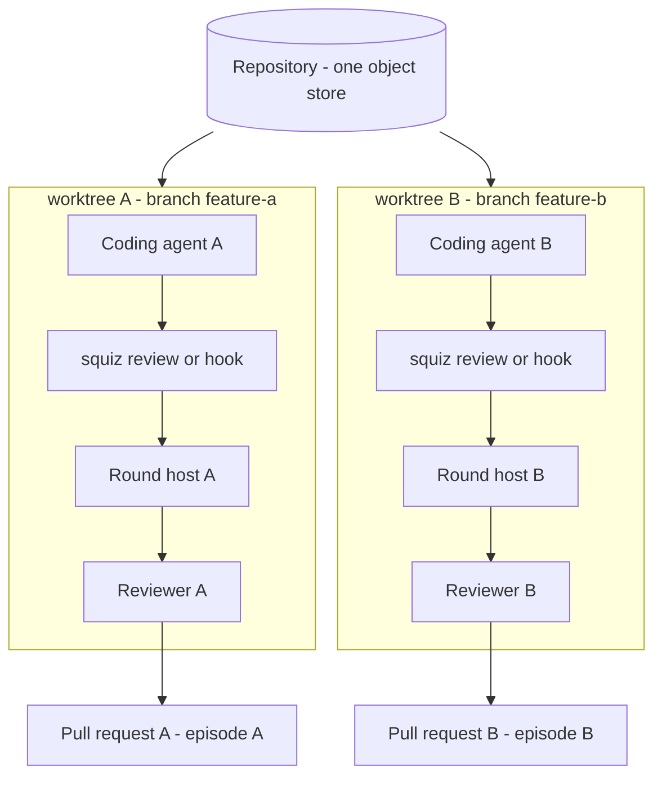

# Review Harness Specification: A Local Review Loop That Lives on the Pull Request

**Version:** 0.78 (draft)
**Status:** For review
**Owner:** TBD

---

## 1. Purpose

**Squiz is a local harness that automates code review between a coding agent and
a reviewing agent backed by different models, in a GitHub pull request.**

Agents write code faster than any person can read it, which breaks review in
two directions at once:

1. **It does not scale.** A person who reviews every change an agent produces is
   the constraint on the whole workflow.
2. **It becomes a rubber stamp.** A person who cannot keep up approves what they
   have skimmed, which is the same failure arriving quietly.

A reviewing agent reads the change and leaves its findings on the pull request,
and the two agents work through them there. A person opens a pull request that
has already been reviewed.

## 2. Dependencies

Squiz runs on the developer's machine. Four things must be installed, and every
one of them is required.

| Role | Today | Needed for |
|---|---|---|
| Git repository | `git` | The review runs against a working tree and a merge base. The repository needs a remote for a pull request to exist against. |
| Runtime | Claude Code | Runs the coding agent, whose shell tool runs `squiz review`. Fires the `Stop` and `SubagentStop` hooks, which start a review. Wakes the session that owns the work when the review is done. Distributes the harness as a plugin. |
| Reviewer | `pi`, or the GitHub Copilot CLI where `reviewer` names it | The agent that reads the change and reports what is wrong with it. It must run a different model from the coding agent. Only the reviewer the configuration names has to be installed. |
| Forge | GitHub, through an authenticated `gh` | The pull request is where the review is conducted and recorded. |

A terminal multiplexer is optional. Where tmux or Herdr is running, each
reviewer runs in a pane of it, where a person can watch it. Where neither is,
the reviewer runs detached, and a log holds its progress.

### Behaviour the design rests on

- **`gh pr comment` and `gh pr review` take a body only.** Neither accepts a
  path or a line, so every inline comment goes through `gh api`.
- **Claude Code runs a shell command under a timeout, and moves a command that
  reaches it to the background rather than stopping it.** The timeout is 120
  seconds where the agent passes none, and at most 600 where it passes one, read
  from `BASH_DEFAULT_TIMEOUT_MS` and `BASH_MAX_TIMEOUT_MS`. The agent is told the
  command moved, with the file its output goes to. Where background tasks are
  disabled the command is stopped instead, and a command a foreground subagent
  moved stops when that subagent's run ends.
- **A foreground subagent often ends its run while its moved command is still
  running, and the command is stopped with it.**
- **A command stopped from outside gets `SIGTERM`, and so does every process
  under it, in the same instant**, including one started in a session of its
  own. `SIGKILL` follows one to two seconds later for whatever ignored it.
  Moving a command to the background sends nothing.
- **Claude Code fails a subagent that makes no progress for 600 seconds, and a
  subagent waiting on a shell command is making progress.** A hook that holds a
  subagent is not. The threshold is read from
  `CLAUDE_ASYNC_AGENT_STALL_TIMEOUT_MS`.
- **A long command output reaches the agent shortened, in a way that depends on
  the shell call's exit status.**
  - A call that exits non-zero is cut to a head-and-tail excerpt of about 10,000
    characters, with no path to the rest. Over about 30,000 characters it is
    first cut to 30,000, so its real end is lost as well as its middle.
  - A call that exits 0 with a long output is saved to a file, and the agent is
    shown a preview of about 2 KB that names the file.
  - A coding agent that runs `squiz review 41; echo "EXIT=$?"` makes the call
    exit 0, so its output is never cut.
- **A process outlives Claude Code stopping a command or a hook only if it leaves
  both the command's process tree and its process group.** A double fork with
  `setsid` between the forks does. A tmux window, a Herdr pane and an agent
  `herdr agent start` started all outlive it as well, because the multiplexer's
  server is their parent, and so does a tmux server the call itself started.
- **An `asyncRewake` hook's exit 2 and a post to the session's
  `CLAUDE_CODE_MESSAGING_SOCKET` each start a turn in an idle interactive
  session**, ten minutes after its turn ended as well as one. The runtime enforces
  an `asyncRewake` hook's `timeout`, and a hook stopped at it wakes nothing. Every
  socket post reaches the agent as "Another Claude session sent a message".

### GitHub access

Permission to post comments is not enough on its own. The harness must be able
to do all of the following:

- Read a pull request: its diff, its description, and its base and head refs
- List the existing review threads and whether each one is resolved
- Create a review comment anchored to a file and a line
- Create a review comment on a file as a whole, carrying no line
- Reply inside an existing review comment thread
- Resolve a review thread, and re-open one
- Post an issue-level comment on the pull request, for the summary and for a
  round that failed

Resolving and re-opening a review thread is available only through GitHub's
GraphQL API. REST has no equivalent, so those two operations go through GraphQL.

### Identity

Every comment is posted with the credentials `gh` holds, so all of them appear
under the account that authenticated it. The reviewer, the coding agent and the
harness share one GitHub identity.

Each comment names its own author at the start of its first line, inside that
line's bold span. What follows the marker differs from comment to comment, so
the marker is the opening of the span rather than the whole of it.

| Written by | Begins |
|---|---|
| The reviewer | `**Squiz reviewer · ` |
| The coding agent | `**Squiz coding agent` |
| The harness, at close | `**Squiz review — ` |
| The harness, when a round fails | `**Squiz review failed — ` |

A comment without one of those markers was written by a person.

`**Squiz review` is itself a prefix of `**Squiz reviewer`, so the character
after the name is what separates the summary, the failure comment and a review
comment. A test for the summary that stops at the name matches every finding the
reviewer posted, and every failure.

## 3. The loop

The loop runs the review from end to end. A coding agent finishes its work on a
pull request, or runs `squiz review <number>`, and a round starts: a reviewer
reads the change in a session of its own, and its findings go onto the pull
request as threads. The session that owns the work is told the result. It works
the threads, replies and pushes, and the next round starts, until nothing is
open or the round cap is reached.

**Every trigger asks for the same review.** `squiz review <number>`, the Claude
Code hooks, a coordinator and a CI job are each a trigger. A trigger queues the
pull request's state for review and makes sure a round host is running, and does
nothing else. The round host runs the round, outside every trigger's process.

**Nothing has to reach into the coding agent's session for the loop to close.**
The pull request holds the review, and `squiz review` prints it, so any coding
agent that can run a shell command can be reviewed. Where squiz knows the
session that owns the work, it also tells that session, as The report sets out
below.

### Terminology

| Term | What it is |
|---|---|
| **Round** | One review of one state of a pull request, its head commit and the replies on the reviewer's threads: gate, review, post, decide. A round either leaves threads open for the coding agent, whose next push or reply starts the next round, or ends the episode. |
| **Episode** | Every round belonging to one pull request in one worktree. The round cap, the local state file and the summary comment are all per-episode; the review itself is per-round. |

An episode is **live** from its first round until it closes, and its reviewer is
reviewing or its coding agent is working on what the review said. It closes for
one of three reasons: nothing is left open for another round to work, the round
cap is spent, or a round reached the token bound. A round that failed closes
nothing — it posts a failure comment under § 7, and the episode stays live.

A live episode is one whose close has not been recorded. Nothing else makes an
episode live or over: not whether a round is running at this instant, because
between two rounds the coding agent is working and no round exists, and not how
long ago anything happened.

### The state file

**An episode is keyed by the number of its pull request.** Its state lives in
`.squiz/<number>/` inside the worktree. The state file holds the round count, the
cost of each round, what the episode spent on attempts that were no round,
whether the episode has reported its close and what was open at that close, and
what its rounds' comparisons established. The directory also holds:

- `rounds/<k>/`, for each round: `prompt.md`, the task prompt the reviewer is
  handed, the report file the reviewer reports into, the reviewer's session,
  `resume.txt`, the command that resumes that session, and `tree/`, the
  snapshot the reviewer reads while the round runs.
- `notes/`, the notes for the sessions that own the work, under The report.
- `host.log`, the round host's output.
- `state.lock`, held while the state file is changed.
- The reviewer's scratch space.

**Every change to the state file is made under `state.lock`.** A writer takes the
lock, reads the file, changes it, writes it, and releases the lock. A trigger
queueing a state and a round host writing its reviewing record therefore cannot
drop each other's record. The lock is held for one update and never across a
review, and it is a different file from `host.lock`. It names its holder's pid
and start time. A lock whose holder has gone is taken over. A writer that finds
the lock held by a live process, or by one that cannot be told running or gone,
waits up to a deadline of its own and never breaks the lock. A wait that runs out
is a state file that cannot be written (§ 7). Readers take no lock, because every
write replaces the file whole.

**The state file also holds one record for each state of the pull request the
episode has reviewed.** A state is two things, read when a trigger starts:

- **The head commit**, as GitHub reports it for the pull request.
- **The latest activity on the reviewer's threads.** Activity is a reply from
  anyone other than the reviewer, on a thread the reviewer opened: a comment after
  the first in that thread, carrying no `**Squiz reviewer · ` marker. The coding
  agent's replies are activity, and so is a person's. A thread a person opened
  holds no activity, whatever is said on it. The latest activity is the GitHub
  identifier of the newest such reply on the pull request, or none. An edited
  reply keeps its identifier and changes nothing. A deleted one can change which
  reply is newest, and that is a change like any other.

A new commit or a new reply is a new state. Either one means the review on record
no longer covers what the pull request now says.

Each record is in one of five states:

| State | What it records |
|---|---|
| Queued | A trigger asked for a review of this state, and no round has started it yet. |
| Reviewing | The round host running the round, and when that process started. A pid alone is reused, so the start time is what tells the round that holds it now from one that held it before. Also the round's number `k`, from the moment the round starts. Once the reviewer starts, also the reviewer's session: its backend, its pane or window where it has one, its pid and start time, the moment its time bound runs out, and its snapshot. |
| Reviewed | The result the round reached: its exit status, and the threads it left open. A round that left nothing open while a later state was queued behind it reached no close, so it records the result *reviewed clean, episode open*, with no exit status. Also the round's number `k`, which names its directory `rounds/<k>/` and so its `resume.txt`, when the round started and ended, and the reviewer's backend and pane or window. |
| Failed | The reason the round failed, and whether its owner has been sent a note about it. Also the round's number `k` and when the round started and ended, where a round started, and the reviewer's backend and pane or window, where a reviewer started. |
| Not reviewed | The episode closed before a round took this state, or a later commit or reply superseded it before its round started, and why. |

A record also names the session that owns the work, where a trigger knew it:
the session's identifier, the subagent that did the work where one did, and the
session's messaging socket where the hook found one. The Claude Code hooks
record it, and `squiz review` records none.

A record also carries the Herdr workspace the trigger ran in, from the
`HERDR_WORKSPACE_ID` in its environment, where it has one. Herdr sets it in every
pane it manages, so a hook or a `squiz review` run from the coding agent's pane
finds the coding agent's workspace. The reviewer's tab opens there (§ 4 The
reviewer session). A workspace id is a `w` and a number, such as `w2`. A value of any other shape
is not recorded, and the tab opens in the focused workspace.

**A trigger reads the record for the pull request's state before it queues
anything.** It has looked up the pull request and listed its threads by then,
because the state is read from them.

- **No record:** the trigger queues the state, and starts a round host where
  none is running.
- **Failed:** a hook queues nothing. `squiz review` queues the state again,
  because running the command is the request to retry it.
- **Reviewing**, by a round host that has gone: the trigger recovers the round, as
  The round host sets out, which records it failed. It then does what it does for
  a failed state.
- **Queued:** the trigger queues nothing, and starts a round host where none is
  running.
- **Reviewing**, by a round host that is running: the trigger queues nothing.
- **Reviewing**, by a round host no one can tell running or gone: the trigger
  recovers nothing, queues nothing and starts nothing, because recovering a round
  whose host may be alive would stop a live reviewer and remove its snapshot.
  `squiz review` exits 1 naming the host it could not check, and a hook returns.
  The next trigger checks again.
- **Reviewed, or not reviewed:** the trigger queues nothing. `squiz review`
  returns that result, with the threads read from the pull request as they stand
  now.

`squiz review` then waits, as § 7 sets out, and the hooks return at once.

**A failed state is retried only on a fresh request.** A new commit or a new
reply is a new state, with no record, and is queued like any other. The same
state is retried only by someone running `squiz review`. A hook firing on a
state that failed queues nothing, so a turn the coding agent spent reading a
failure note does not bring the failure back. Failures that spend no round, such
as a reviewer that will not start or a `gh` that cannot run, follow the same
rule.

**No failure starts a cycle.** A retry by `squiz review` that fails again posts
its failure comment, returns exit 1 to the run that asked for it, and writes no
second note. So every attempt after the first needs someone to run the command,
and a run that gets exit 1 is told not to run it again (§ 9).

**Every trigger therefore gets one review per state.** A second trigger for a state
already queued or under review finds it and queues nothing, so two firings for one
commit and the same replies post one set of threads and at most one summary. One
episode runs one round at a time. A state queued while a round of an older one runs
is reviewed next.

**A state accepted into the queue is never dropped.** It is reviewed, or it is
given a result of its own. Say state A is under review and state B, a later
commit, is queued behind it:

| A's round ends with | What happens to B |
|---|---|
| Threads open, rounds remaining | B is reviewed next, as usual. |
| Nothing open, rounds remaining | The episode does not close. A is recorded as *reviewed clean, episode open*: no exit status, no summary, and no note for its owner. B is reviewed next, and the episode closes from the last round with nothing queued behind it. A run of `squiz review` waiting on A goes on waiting, for the state the queue ends on, and returns that state's result: 0 or 3 with the close, or 2 where B left threads open. It exits 4 where its wait runs out first. |
| The round cap reached, or the token bound | The episode closes, as it must, and posts its summary. Its Notes name the cap or the bound and each state left not reviewed, whether A left threads open or nothing. B is recorded as not reviewed, with the reason. A run of `squiz review` waiting on B is handed the close, exit 0 or 3, with a line saying why B was not reviewed, and B's owner gets a note saying the same. |

The line comes right after the heading of the close the run is handed:

```
Full output: /work/squiz/.squiz/41/review.txt
Squiz reviewed PR #41 at 3f9c2e0: round 3 of 3, no new findings.
Squiz did not review PR #41 at 8d21a4f: the episode closed at the round cap, after reviewing 3f9c2e0.
```

Where the token bound closed the episode, its reason reads "the episode closed at
the token bound, after reviewing 3f9c2e0".

**A round reviews the pull request's newest state, and only that.** When its
round starts, the round host checks that the state it took is still the pull
request's: the same head commit and the same latest activity. A state the pull
request has moved past is superseded. No review runs for it, nothing is posted,
and it is recorded not reviewed with a reason naming the state that superseded
it, in the form § 5's Notes use:

```
superseded by 8d21a4f
superseded by 3f9c2e0 with different replies
```

The newer state is queued by the trigger that read it, and reviewed in its turn.
The state a round reviews is the one its result is recorded against: the reviewer
reads a snapshot of that state's head commit (§ 4 The snapshot).

The record also holds the head commit and latest activity of the state that
superseded it, because the reason names that state only by its short commit, and
other states can share a commit.

A run of `squiz review` whose own state was superseded goes on waiting, for the
state with that head and activity, and returns that state's result. Where that
state was superseded in turn, the run follows it to the next. It exits 4 where
its wait runs out first, or where no record for that state has been written yet,
as § 6 shows.

**A round decides its close and records it in one step.** It reads the queue
under `state.lock`, decides from it as the table above sets out, and writes the
close in that same update, before it posts the summary. A trigger that comes
after the close finds it and queues nothing, so no state queued while the
summary is posted is stopped by a close it arrived before.

**A state left not reviewed is named by its short head commit, and by its
replies where an earlier state has the same commit.** The earlier states are the
one the closing round reviewed and those queued ahead of it. A state with the head
of an earlier state differs from it only in its replies: a reply was added or
deleted, and the record cannot say which. Such a state is named "with different
replies". A state whose head two earlier states have is named "with different
replies a second time", one with three "with different replies a third time", and
so on. Where B has A's commit and different replies, the line reads:

```
Squiz did not review PR #41 at 3f9c2e0 with different replies: the episode closed at the round cap, after reviewing 3f9c2e0.
```

**A reply is ruled on even where no commit follows it.** A coding agent that
disputes a finding and pushes nothing asks for a review again on a new state, and
the round reads its reply and rules on the thread: `withdrawn` where the argument
holds, `open` where it does not. A reply posted while a round runs is not in that
round's state, so the next run reviews again.

**Every round counts against the round cap, whatever started it.** A round that a
reply started is a round, exactly as one a commit started. A coding agent that
answers every finding with a dispute spends the cap doing so, and the episode
closes at the cap with the disputes for a person. A run that returns a recorded
result is no round and spends nothing.

**A closed episode stays closed in its worktree.** A second episode on the same
pull request starts in another worktree on the same branch, which holds no state
for it.

What the rounds' comparisons established is three lists: the tracked paths any
round found changed, each move of `HEAD` any round found, and why a round could
take no comparison. The summary comment's Notes are composed from all three.

Each list holds an entry once, however many rounds gave it, and stops at
sixty-four entries. One round can reach that on its own, because one reading can
name more than sixty-four changed paths. An attempt that is no round spends none of
the round cap and can fail the same way on every run, so nothing bounds how many
times one episode adds to these lists either.

**A full list keeps the entries recorded first.** A later round adds to a list with
room left and adds nothing to a full one, so what an earlier round established is in
the comment the closing round posts.

### End-to-end workflow


```mermaid
flowchart TD
    A[Coding agent finishes its work,<br/>or runs squiz review 41] --> C{Pull request 41's head<br/>checked out here?}
    C -->|no| L[Name the branch and the directory,<br/>queue nothing]
    C -->|yes| K{Episode closed?}
    K -->|yes| D[Print the close, exit 0 or 3]
    K -->|no| R{Record for this commit<br/>and these replies?}
    R -->|reviewed| P[Print its result,<br/>exit as it did]
    R -->|queued, or reviewing<br/>by a live host| W[squiz review waits;<br/>a hook returns]
    R -->|reviewing, host<br/>cannot be told| U[Change nothing;<br/>squiz review exits 1]
    R -->|none| Q[Queue the state,<br/>start a round host]
    R -->|reviewing by a<br/>host that has gone| V[Recover the round:<br/>stop its reviewer,<br/>record it failed]
    V --> X
    R -->|failed| X{squiz review?}
    X -->|yes| Q
    X -->|no, a hook| Y[Queue nothing]
    Q --> W
    Q --> H[Round host starts a<br/>reviewer session]
    H --> F[Findings posted as threads<br/>on the pull request]
    F --> G{Threads open?}
    G -->|no| I[Post summary comment,<br/>record the close]
    G -->|yes, rounds remain| M[Record the open threads]
    G -->|yes, cap reached| J[Post summary comment,<br/>record the close]
    I --> N[Note and wake for the<br/>session that owns the work]
    M --> N
    J --> N
    N --> O[Owner works the threads:<br/>pushes fixes, replies]
    O --> A
```

### A round, step by step

1. **Gate on the pull request.** The trigger looks up pull request `<number>`
   and checks that its head branch is the branch checked out in the directory it
   was run in, and the round host checks again when the round starts, together
   with whether a later state has superseded the one it took (The state file).
   If the pull request is not open, or that directory has another branch or a
   detached HEAD, no review runs and nothing is posted. `squiz review` exits 1, and stderr names
   what it found:

   ```
   squiz: no review ran: PR #41's head is "feature-a", and "/work/squiz" has "main" checked out
   ```
2. **Gate on the episode and the commit.** The trigger reads the episode's state
   file. An episode that has reported its close is over: `squiz review` prints the
   close and exits as the close did, and no reviewer runs. The round cap and the
   token bound are not consulted, because an episode that is over stays over
   whatever a bound would now allow. Otherwise the trigger lists the threads, and
   the record for the pull request's state decides, as The state file sets out,
   whether the state is queued.
3. **Run the reviewer.** The round host starts the reviewer as a session of its
   own (§ 4), hands it the pull request for scope and intent together with
   the threads the reviewer itself opened on it, and lets it read directly its
   snapshot of the head commit of the state it took: files the diff did not touch, callers, and git history. At
   depth `deep` it also runs the tests.
4. **Post the findings, and act on the verdicts.** Each new finding opens a new
   review comment thread, anchored to a file and a line or to a file as a whole.
   Each verdict the reviewer returned is applied to the thread it names: `fixed`
   and `withdrawn` close the thread, `open` re-opens it or leaves it open.
5. **Record the open threads, or close.** If threads of this review are still
   open and the round cap has not been reached, the round records the result. A
   run of `squiz review` waiting on it prints the open threads and exits 2, and the
   round tells the session that owns the work (The report). A thread a person opened is counted by neither the arithmetic
   nor the output, so it never keeps the loop going and an episode ends with one
   still open. § 6 shows what is printed.
6. **Close the episode.** Otherwise, and where nothing is queued behind this
   round or the cap or the token bound is reached, the round records the close in
   the episode's state, in the same update that read the queue, and then posts
   one summary comment on the pull request. A state still queued is handled as
   the table above sets out. A run of
   `squiz review` exits 0 where nothing of this review is open, and 3 where the
   round cap or the token bound closed it with threads still open, which it
   prints. What remains open is what
   the summary reports and what a person then looks at.

Where threads are open, the coding agent works them before it asks for another
review. It replies on a thread to say what it changed, to disagree, or
to ask a question. It does not close threads. A thread closes when the reviewer's
verdict closes it, so a closed thread means the reviewer read the code as it now
stands and accepted it.

### The round cap

The cap defaults to 3 and is settable from 1 to 8. A cap of R hands open threads
back to the coding agent at most R−1 times, because round R closes the episode
whatever is still open. A cap of 1 reviews once and closes.

### What starts a round

**A round starts when a trigger queues a state and the round host takes it.**
There are two kinds of trigger:

- **`squiz review <number>`**, which the coding agent runs once it has opened its
  pull request and again after each push that works the threads. A coordinator or
  a CI job may run it as well, from a checkout of the pull request's branch. It
  waits for the review, and prints the result.
- **The Claude Code hooks**, on `Stop` and `SubagentStop`, which queue the state
  and return at once.

**The instruction to run `squiz review` reaches the coding agent two ways.**

- **In Claude Code, a skill the plugin ships.** Its description has the coding
  agent load it when it opens or updates a pull request. A Claude Code project
  needs nothing in its own files for this.
- **For any other agent, a section of the host project's `AGENTS.md`**, which
  `squiz init` adds.

§ 9 gives the text of both. Nothing forces an agent to follow either. Claude Code
loads a skill when its description matches what the agent is doing, and does not
promise to. In Claude Code the hooks start a review whether the agent follows it
or not. An agent in a runtime with no hook that never runs the command leaves a
pull request no round has read, which carries no comment with any of § 2
Identity's markers.

### The round host

**The round host runs the rounds of one episode, one at a time, outside every
trigger's process.** It is `squiz host <number>`. A trigger that queues a state
starts one where none is running, by a double fork with `setsid` between the
forks, with its standard input on `/dev/null` and its output in
`.squiz/<number>/host.log`. That is what lets it outlive the shell call or hook
that started it (§ 2).

It takes the oldest queued state, writes the reviewing record naming itself, and
runs the round as the steps above set out. It exits when nothing is left queued,
and when the worktree it serves is gone.

**One round host runs per episode.** It holds `.squiz/<number>/host.lock`, which
names its pid and start time. A host that finds the lock held by a live process
exits at once, so two triggers that each start one leave one running.

**A host that died is found by its pid and start time.** A queued state with no
live host is one no host will take, and the next trigger starts a host for it. A
reviewing record whose host has gone is a killed round, and its reviewer may
still be running: the host and the reviewer are separate processes, and a
reviewer in a pane is not the host's child.

**Recovery stops the orphaned reviewer before anything replaces it.** Every
trigger, and every round host as it starts, recovers each killed round it finds:

1. It reads the reviewer's session from the reviewing record: its backend, its
   pane or window, its pid and start time.
2. Where that reviewer is still running, it stops it as a round host stops a
   reviewer at its bound: the reviewer's process group, then the groups its shells
   recorded, then the pane. It does so whether or not the reviewer's time bound
   has passed, so an orphan past its bound is always stopped by the first
   recovery to find it.
3. It confirms that the reviewer and every recorded group are gone, by pid and
   start time and by asking the backend for the pane.
4. Only then does it remove the snapshot and record the round as failed, with
   the reason "the round host died". No failure comment is posted.

A recovery that cannot confirm the reviewer is gone leaves the snapshot and the
record as they are, and starts nothing for that state. `squiz review` exits 1
naming the process it could not stop, and the next recovery tries again.

**Nothing stops an orphan before a recovery runs.** While no host is alive, the
reviewer's time bound is enforced when the next trigger or `squiz review` runs,
and not before.

### The Claude Code hooks

**Squiz registers `squiz hook` on Claude Code's `Stop` and `SubagentStop`.**
`Stop` fires when a regular session's turn ends, and `SubagentStop` when a
subagent's does. Each firing resolves the pull request whose head is the branch
checked out in its working directory, records the session that owns the work,
queues the state as The state file sets out, and returns. It never runs a round
and never blocks the agent: it exits 0 whatever it found. Where it finds no pull
request it writes the line under step 1 naming the branch and the directory.

```json
"Stop": [
  { "hooks": [ { "type": "command", "command": "${CLAUDE_PLUGIN_ROOT}/bin/squiz hook", "asyncRewake": true, "timeout": 86400 } ] }
],
"SubagentStop": [
  { "hooks": [ { "type": "command", "command": "${CLAUDE_PLUGIN_ROOT}/bin/squiz hook" } ] }
]
```

| Event | The owner of the work it records |
|---|---|
| `Stop` | The session itself, from the payload's `session_id`, and its `CLAUDE_CODE_MESSAGING_SOCKET` where the hook's environment carries one |
| `SubagentStop` | The session that dispatched the subagent, from the payload's `session_id`, and its `CLAUDE_CODE_MESSAGING_SOCKET` where the hook's environment carries one; and the subagent, from its `agent_id` |

A subagent runs inside its parent's process and has no socket of its own, so the
socket in a `SubagentStop` hook's environment is the parent's.

The `Stop` registration runs in the background, so the session does not wait on
it. After it has queued, it stays to deliver a note, as The report sets out. The
`SubagentStop` hook returns as soon as it has queued.

**Nothing the runtime does to a hook bounds a review.** The hook only queues, so
neither the hook's timeout, nor the stall threshold, nor the hand-back that ends a
subagent in auto mode reaches the round.

A turn ending is not work being done. The hook fires on every turn, including one
that ended on a question, and queues only a state that needs a review, so a turn
that pushed nothing starts nothing. A firing for a subagent the session did not
dispatch, for a state already queued or reviewed, queues nothing.

**A `SubagentStop` firing whose `agent_type` is empty is no subagent's work.** In
an interactive session, Claude Code fires several of them after a turn ends, each
with a new `agent_id`, the parent's `session_id`, and no transcript. The hook
does nothing for one: it resolves nothing, records no owner and queues nothing.

The hook's shell does not have the plugin's `bin/` on its `PATH`, so the
registration names the binary through `${CLAUDE_PLUGIN_ROOT}`.

### The report

**The result goes to the session that owns the work and is still alive.** For a
regular session's work that is the session itself. For a subagent's work it is
the session that dispatched it: the subagent has ended, and in auto mode it has
handed back, so nothing reaches it.

When a round records its result, the round host writes a note for the owner
recorded on the state, in `.squiz/<number>/notes/<session id>/`, one file per
note, written under a temporary name and renamed into place:

```
to=60517e1f-e1dc-49b1-8e39-6fcbe686f3fb
pr=41
head=3f9c2e07b1d4a8c6e5f0923b7a1d6c4e8b2f5a90
subagent=a402ef8f56c1b2ed1
text=Squiz reviewed PR #41 at 3f9c2e0, the work of subagent a402ef8f56c1b2ed1: 2 threads are open. Run `squiz review 41` to read them.
```

The note points, and carries no finding. `subagent` is there only where a
subagent did the work. For a round that failed, the text gives the reason, names
`squiz status`, and says that a new commit, or running `squiz review` once,
retries it. A failed state gets one note, however many times it fails, and a
state not reviewed gets one saying why. A state no hook recorded an owner for gets
no note.

**Then it wakes the owner, one of two ways.** Whichever delivers a note moves it
into `delivered/` beside it, so the other does not deliver it again.

- **The messaging socket.** Where the hook recorded the owner's
  `CLAUDE_CODE_MESSAGING_SOCKET`, the round host posts the text to it, and an idle
  session starts a turn with it.
- **The `asyncRewake` waiter.** The `Stop` hook, once it has queued, waits while
  any state its session owns is queued or under review. When a note for its
  session arrives it writes the text to stderr and exits 2, which starts a turn.
  It delivers any note already waiting for its session first. Claude Code does
  not deduplicate background hooks, so a session that ends three turns has three
  waiters, and a waiter whose session has ended a later turn exits 0 without
  delivering anything. Only the newest delivers.

**A subagent's parent decides what follows.** It reads the threads with
`squiz review`, and sends the same subagent back to work them, dispatches
another, or works them itself. Squiz does not choose.

**A note no wake reached stays where it was written.** The owner learns the
result by running `squiz review` or `squiz status`, and the pull request holds it
in any case.

### Not in the first version

- **Delivering notes when a session starts.** A note waiting for a session that
  was closed is delivered only by its next `Stop` waiter, or read by pull.
- **Acknowledgement and retry rules.** A note is delivered at most once, and
  nothing retries one a wake did not reach.
- **A two-way inbox.** The coding agent answers on the pull request, and never
  through a note.

### Parallel coding agents

Each coding agent that opens a pull request works in its own git worktree on its
own branch. A branch can be checked out in only one worktree at a time, so the two
go together.

**The command reviews the worktree it is run in.** It resolves the toplevel with
`git rev-parse --show-toplevel` from its own working directory, which is the
caller's. A coding agent working in a worktree by path runs the command from that
path, and that worktree is the one reviewed. The hook runs in the subagent's
working directory, which is fixed when the subagent is dispatched.


```mermaid
flowchart TD
    R[(Repository - one object store)]

    subgraph WA [worktree A - branch feature-a]
        AS[Coding agent A] --> AH[squiz review or hook] --> AX[Round host A] --> AR[Reviewer A]
    end

    subgraph WB [worktree B - branch feature-b]
        BS[Coding agent B] --> BH[squiz review or hook] --> BX[Round host B] --> BR[Reviewer B]
    end

    R --> WA
    R --> WB
    AR --> PA[Pull request A - episode A]
    BR --> PB[Pull request B - episode B]
```

The worktrees share one object store and nothing else. Each run of the command
resolves its own working directory, so one reviewer sees one coding agent's change
and posts to one pull request. One worktree, one branch, one pull request, one
episode.

**The harness does not remove a worktree.** The coding agent is still in it when
the command returns. Whatever created the worktree removes it. The episode's
state goes with the worktree, and nothing in it outlives the worktree, because
the pull request holds the findings.

**A reviewer's snapshot is its own, so a tree two episodes share reaches neither
comparison.** One tree holds two pull requests' episodes when its `HEAD` moved to
another branch while the first episode was live. Each keeps its state under its
own number, and each reviewer reads a snapshot that only it writes.

**Two coding agents on one branch in one tree share one episode, and nothing tells
them apart.** They spend one round cap between them. Nothing detects this.

## 4. The reviewer

The reviewer is a second agent that reads the code the coding agent has just
written and reports what is wrong with it. It has no GitHub access of its own:
it reports each finding as it confirms it, and the harness turns each one into a
comment on the pull request.

### Invocation

The reviewer is a session the round host starts once per round, as The reviewer
session sets out. It reports its findings as it makes them, and a cost where its
CLI reports one. It never edits the code it is reviewing, and it holds no state
between rounds: each round is a fresh session, and everything it knows about
earlier rounds arrives in what it is handed.

Five things are handed to it:

| | |
|---|---|
| **A working directory** | A snapshot of the pull request's head commit, in a worktree of its own (The snapshot, below). The reviewer runs with this as its current directory. |
| **The pull request** | Its number, its base and head refs, its description, and the threads the reviewer opened on it, each with its replies and whether it is resolved. The harness fetches all of this and passes it in. |
| **A charter** | The standing instructions describing what a good review is. It ships with the harness and is the same every round. |
| **A depth** | How much the reviewer is allowed to do, `read` or `deep`. The two values are set out under Depth below. |
| **A thinking level** | How hard the reviewer thinks. The harness sets it every round, so the level never comes from the reviewer CLI's own configuration. The levels are listed under Configuration. |

**A configured test command reaches the reviewer in the prompt, and only at depth
`deep`.** The prompt is the only channel a project's own text arrives through:
the charter ships with the harness, and the command line is flags and tool names.
It is named there as the only test command the reviewer may run. At `read` it is
absent, because there is no shell to run it with.

**There is no file-selection or budgeting stage.** The reviewer decides what to
open, one read at a time.

### The reviewer session

**Each round's reviewer runs as a session of its own, where a person can watch
it.** The round host starts it in the first place that applies:

| Where | How the round host starts it |
|---|---|
| Herdr, where `HERDR_SOCKET_PATH` is set | `herdr tab create --cwd <snapshot> --label squiz-41-r2 --no-focus --workspace <id>` gives a pane, in the workspace the state's record names, and in the focused workspace where it names none, and `herdr pane run <pane> '<gated command line>'` types the reviewer's line into the pane's shell once the shell is at its prompt |
| tmux, where `TMUX` is set | `tmux new-window -d -n squiz-41-r2 -c <snapshot> '<command line>'` |
| Neither | As a child of the round host, with no terminal |

The command line is the one the adapter built: `pi`'s, or the Copilot adapter's
shell line, which starts Copilot. Below, "the reviewer" is that command.

**In Herdr, the start returns once the reviewer is running, and the round's
bound is all that limits the review.** `herdr pane run` types a line and returns
at once. The line is the reviewer's behind a gate, each word single-quoted:

```
'/bin/sh' '-c' '<gate>' '/tmp/squiz-gate-Xa81Qe' '400' 'pi' '--session-dir' …
```

The gate writes its pid into the gate directory, waits for a `go` file there,
and then becomes the reviewer with the same pid, group and start time. The
round host reads the pid and the reviewer's group while the gate is shut, and
only then writes `go`. So a reviewer that finishes within a second of starting is
still a review that started, and a start that fails never lets the reviewer run.
A gate left waiting gives up on its own after four times the bound on each
program the start runs, without running the reviewer. Where the reviewer's
command is not on the shell's path, the gate says so and the start fails at
once. Where the reviewer has not started 15 seconds after the line was typed,
the start fails.

**A pane's shell reads the line as typed**, so a control character in an
argument would be a key: a newline would end the line, and a tab would complete.
The round host checks the arguments before it creates the tab, and treats such a
command as a pane Herdr refused: nothing opens, and it goes on to tmux or a
child. Neither adapter's line carries one unless a path in it does.

The environment the adapter sets reaches the reviewer through `--env` and `-e`.

**The pane closes when the review ends, and the session stays resumable.** tmux
closes a window when its command exits. Herdr returns the pane to its shell when
`pi` exits, and the round host then closes it with `herdr pane close`. Each
round's `pi` writes its session to `.squiz/<number>/rounds/<k>/session/`, and the
round host writes the command that resumes it to `rounds/<k>/resume.txt`:

```
pi --session-dir .squiz/41/rounds/2/session --session 0193f2c4-7d1e-7b52-9c1a-5e2f4d8a6b31
```

`squiz status` prints it on the round's line. A person runs it from the coding
agent's worktree, which the paths are relative to. The session ran in the
snapshot, which is gone once the round ends, so `pi` does not resume it in place.
It asks to fork the session into the current directory:

```
Fork this session into current directory? [y/N]
```

Answering yes opens the reviewer's conversation in the worktree, with everything
the reviewer read and said. A conversation resumed after the round is not part
of the review. Copilot's resume line is under The Copilot adapter.

**What a person types into a `pi` reviewer's pane reaches `pi`.** It can steer
the review, and nothing records it. A Copilot reviewer's pane can be watched and
takes no input.

**The round host stops a reviewer in a pane the way it stops one it started
itself.** At the time bound it signals the reviewer's process group, then the
groups the reviewer's shells recorded, as Confinement sets out, and then it closes
the pane. It reads the reviewer's group from the backend while `pi` runs:

| Backend | Where the reviewer's group comes from |
|---|---|
| tmux | `tmux display -p -t <pane> '#{pane_pid}'`. The window's command is the one the adapter built, `pi` or the `sh` of the Copilot adapter's line, so this is that command's own pid and leads its group. |
| Herdr | The pid the gate wrote, confirmed as `foreground_process_group_id` from `herdr pane process-info`, before and after its identity is read. Its `shell_pid` is the pane's shell, whose group does not hold the reviewer. |

A pane close is not relied on to stop anything. tmux's `kill-window` sends one
`SIGHUP` to the window's command and nothing more, so a command that ignores it
runs on with the window gone. Herdr's `pane close` sends `SIGHUP`, then `SIGTERM`,
then `SIGKILL`, to every process in the pane's shell session. Neither reaches a
process in a session of its own.

**`pi` stops its own shells when it is closed or exits**, by sending `SIGKILL` to
the group of each shell it started. A process one of those shells moved into a
session of its own is reached by nothing: not the pane close, not `pi`, and not
the recorded groups, which name the shells' groups and not that session. It runs
on after the round. Nothing in this version detects it. Only `deep` grants a
shell, so only a round at `deep` can leave one.

### The snapshot

**Every reviewer reads its own snapshot of the head commit, at either depth.**
The coding agent may be editing its worktree while a round runs, so the reviewer
never reads that worktree. Before the reviewer starts, the round host adds a
detached worktree at the head commit of the state under review:

```
git worktree add --detach .squiz/41/rounds/2/tree 3f9c2e07b1d4a8c6e5f0923b7a1d6c4e8b2f5a90
```

The commit is the one GitHub reports as the pull request's head. Where the
repository does not have it yet, because it was pushed from elsewhere, the round
host fetches it first. The fetch and the add run in the part of the round before
the review, under its 30 seconds (§ 7 The review budget). The snapshot shares the
repository's object store, and `.squiz/` is gitignored, so it shows in neither the
coding agent's `git status` nor its commits.

**The snapshot holds the commit and nothing else.** It carries none of the coding
agent's uncommitted changes, which no state names, and none of its untracked
files, build output or installed dependencies.

**The round host removes the snapshot once the round has recorded its result**,
with `git worktree remove --force` and then `git worktree prune`, whatever the
round became. Removal grows with every file in the snapshot, the ones the
reviewer left behind included, so it runs after the result rather than before it,
and delays nothing a waiting `squiz review` returns. It takes no part of the
round's deadline. The round host takes the next queued state once it is done. A
snapshot a killed round left behind is removed by the recovery that finds it, once
its reviewer is confirmed gone.

**Confinement applies to the snapshot.** The tracked-file comparison is taken in
it before the reviewer starts and again when the reviewer exits. The refused
calls and the shell-group record work as before, and scratch space stays at
`.squiz/<number>/scratch/`. Nothing but the reviewer writes the snapshot, so a
change the comparison finds is the reviewer's.

**What it costs:**

- **Time and disk on every round.** Checking out every tracked file grows with
  the size of the repository, not the size of the change. The disk held at once
  is the checkout's size times the reviews running at once.
- **A limit on very large repositories.** The add runs inside the 30 seconds
  before the review, so a repository large enough that the add spends them
  cannot be reviewed. A snapshot per round does not scale to such repositories,
  and the first version accepts that.
- **A build before tests at `deep`.** The snapshot has no installed
  dependencies, so the configured test command has to install or build what it
  needs before it runs the tests. A project that names a test command at `deep`
  names one that works in a fresh checkout.

### Depth

Depth is a configuration setting controlling how much the reviewer is allowed to
do. It has two values, and `edit` and `write` are granted at neither. The tool
names below are `pi`'s; another adapter maps the same two values onto its own
CLI's names. The Copilot adapter grants `read` alone, under the names The
Copilot adapter gives.

| Depth | Tools granted | What it can answer |
|---|---|---|
| `read` *(default)* | `read`, `grep`, `find`, `ls` | Anything the code can be read for. |
| `deep` | the above, plus `bash` | Also whether the tests actually pass, whether a line was deliberate (`git log -S`, `git blame`), and whether a hypothesis holds when run. |

**The calls the reviewer reports through are granted at both depths**, alongside
the tools in the table. Depth decides how much the reviewer may read and run.
Reporting is not a depth: a reviewer with no way to report returns nothing
whatever it was allowed to look at. The three calls are named under Findings.

`deep` depends on the tracked-file comparison described under Confinement, which
is the only mechanism that catches a write made through the shell.

### Confinement

The reviewer must not change anything the coding agent would commit. Writes to
gitignored paths and to locations outside the repository are permitted, which is
what running a build and a test suite requires.

What holds this depends on the depth.

**At `read` the tool grant holds it.** The reviewer is given no tool that
writes: `edit` and `write` are withheld, and so is the shell. Nothing it can
reach for touches the tree, the reporting calls included: what a report reaches
is the round that is reading the reviewer's output, and nothing on disk.

**At `deep` the grant includes `bash`, which is itself a write primitive.** A
reviewer at `deep` can write to a tracked file, and five mechanisms bound what
follows. None is configurable, and each applies where the third column says.

| Mechanism | Guards against | Applies |
|---|---|---|
| **Scratch space.** `TMPDIR` points at `.squiz/<number>/scratch/`, which is gitignored and goes with the worktree. | A probe script or temporary file landing in the tree, where it appears in `git status` and may be committed as the coding agent's own work. | Always |
| **A non-mutating test invocation**, named in configuration. | A snapshot runner rewriting its snapshots, which turns a failing test green by editing the code under review. | Where a test command is configured |
| **Refused calls.** The reviewer's own calls are refused before they run: the `edit` and `write` tools, and the shell commands that change which commit the work sits on. | A reviewer that moves `HEAD` — `git commit`, `git commit --amend`, `git reset --soft`, `git checkout -B`, `git update-ref` — or pushes with `git push`. The comparison names a moved `HEAD` once the reviewer has exited, and a refused call never moves it. | At `deep`, where a shell is granted |
| **A comparison of `git status`, the hashes of tracked files, and `HEAD`**, taken in the snapshot before the reviewer starts and again when it exits. | A write that shows in `git status` or changes what a tracked file holds, including one made through the shell, and a `HEAD` that names another branch or another commit. | Always, in the snapshot |
| **The process group each shell records for itself**, signalled when the round ends. | A tool the reviewer started outliving the round, where the signal to the reviewer's own group does not reach it. | Where the reviewer CLI starts a shell in a group of its own |

The first three prevent, the fourth detects, and the fifth reaches what the
round's own signal does not.

**A refused call never reaches a shell**, and the reviewer reads the refusal as
that call's own error while it is still there to choose something else.

A name counts where a command runs: `grep 'git commit' file` searches and is not
refused. A word the shell builds out of quoting is left alone: `git "com"mit`
runs. So the refusals hold a reviewer acting in good faith, not one working
around them.

**A command that moves `HEAD` and is not refused is detected, and not
prevented.** `git "com"mit` is such a command. The comparison reads `HEAD` as the
branch it names and the commit that branch is at, or as the commit a detached
`HEAD` is at. A commit, an amend, a reset and a switch to another branch are each
named, though every tracked file is left exactly as it was. The round reports the
move and does not undo it.

| `HEAD` | Read as |
|---|---|
| On a branch | The branch's full ref name and its commit |
| On a branch with no commit yet | The branch's full ref name, with no commit |
| Detached | The commit |

A `HEAD` that cannot be read makes the comparison one that could not be taken,
as a tracked file that cannot be read does.

`git push` changes the remote and leaves `HEAD` where it was, so the comparison
does not see it.

Every shell the reviewer starts writes the group it leads into a file the round
names, before it runs the command it was given, so a tool started in the last
instant before the reviewer exits is recorded like any other. The file lives in
`.squiz/<number>/`, under a name that round alone uses, and it goes when the
round ends. Nothing is recorded at `read`, where no shell is granted.

**A recorded group is signalled only where the system says it is still the
round's own.** The identifier is the shell's own and is free the moment that
shell is reaped, and the space of identifiers turns over in well under one round,
so a number left unheld comes to name something else. Each shell therefore leaves
a process of the round's own in its group, under a name no other round uses, and
the round signals a group where it holds one of those and where nothing in it
predates the round.

**The round reads each group again before it kills anything outright**, because a
`SIGKILL` cannot be taken back. That reading asks something different. The group
has been signalled by then, so the process that named it as the round's own may
have answered and gone, and the processes the first reading found stand in its
place. A number cannot be handed out while anything still holds it, so a group
that still holds one of them never emptied and is the group that was signalled.

A group whose every process began after the round signalled it is left alone, so
a tool that answers `SIGTERM` by leaving a fresh process behind and exiting is not
killed outright.

A group nothing could be established about is left alone: a stranger's process
killed over a reused identifier is worse than a tool left running. Both readings
are bounded, and one cut short establishes nothing, so a system that will not
answer about a process leaves a tool running rather than holding the round open.

### Adapters

An adapter is the code that knows how to drive one reviewer CLI. There are two,
for `pi` and for the GitHub Copilot CLI, and `reviewer` in Configuration chooses
between them. A further reviewer means writing a further adapter and changing
nothing else. An adapter implements four things:

| | |
|---|---|
| `argv(opts)` | Build the command line from a working directory, a charter file, a prompt, a session directory, and the depth. |
| `confine(opts)` | Put in place whatever the CLI is handed outside its command line, and return what to add to its environment. A CLI handed nothing returns an empty environment and writes no file. |
| `read(reports)` | Report each finding and each verdict as the run makes it, from the file the reviewer reports into, and return the run's cost where the CLI reports one. A run the CLI reports as failed is told apart from one that reported no findings. |
| `grants` | Which tools the CLI is given at each depth, the calls the reviewer reports through among them. |

The harness passes `read` or `deep`, and the adapter turns that into the right
flags for its CLI. The adapter must not choose for itself.

**An adapter may ship files its CLI runs**, where reporting a finding needs one:
an extension the CLI loads, or a server it starts. Each is the adapter's own, it
is named on the command line `argv` builds, and the names it registers are in
`grants`. Nothing above the adapter knows it exists. The `pi` adapter ships an
extension, and the Copilot adapter ships a server.

**Every reporting call is checked by the harness's own report checks, whatever
serves it.** They decide what a report must carry, and refuse one the harness
could not compose a comment or a mutation from. A CLI that validates a call
against its schema first, as `pi` does, may convert an argument before the checks
see it. A CLI that validates nothing, as Copilot does, hands the checks the
arguments exactly as the model sent them, so the checks are the only validation
the call gets. The schema the model is shown guides the model and guards
nothing.

**A finding reaches the harness as `read` reads it out of the report file, and
so does the run's cost.** An adapter whose CLI has no way to report a finding
before the run ends reports them all at the end, which is a working adapter whose
rounds keep nothing when they are killed.

An adapter whose CLI reports its cost only once the run is over writes the cost
into the file then. A run stopped before that writes none, and has no cost.

**A reviewer CLI must exit on `SIGTERM`, and so must every process it starts.**
That is what the time bound rests on: the round signals the reviewer's process
group and waits a grace before escalating, and a command stopped from outside
may never reach its own escalation. A CLI that ignores `SIGTERM` runs on
after the round that started it, spending against the model API with no episode
left to record it. An adapter for such a CLI is not one this harness can hold.

**The exit status does not say how a run ended.** A CLI can exit 0 when it was
stopped, as Copilot does. A run declared its review finished where the report
file holds the finish, and the round knows when it stopped a run itself, because
the stop is its own. Nothing else is read for it.

**A CLI that starts a shell tool in a group of its own puts that tool outside
that signal.** The round signals the reviewer's group, and a shell the CLI
detached leads a group that is not it. `confine` is where such an adapter
delivers the line its CLI runs inside every shell, which is what has each shell
record the group it leads. What the round then does with those groups is under
Confinement. Copilot starts every shell this way, which matters at `deep` alone.

### The `pi` adapter

The adapter `reviewer` chooses by default. It builds this command line:

```bash
pi --session-dir .squiz/<number>/rounds/<k>/session \
   --no-approve \
   --no-extensions --extension <reporting-extension> \
   --tools read,grep,find,ls,report_finding,report_verdict,finish_review \
   --thinking medium \
   --append-system-prompt <charter-file> \
   @.squiz/<number>/rounds/<k>/prompt.md
```

**The task prompt reaches `pi` as a file.** The round writes it to
`rounds/<k>/prompt.md` before `pi` starts, and `pi` reads the file an `@`
argument names into its first message, wrapped in a tag that names the file:

```
<file name="/…/.squiz/41/rounds/2/prompt.md">
# Review pull request #41
…
</file>
```

`pi` exits 1 where the file is missing. The prompt itself has newlines, and a
Herdr pane's shell reads the line as typed, where a newline or a tab is a key,
so no argument on this line carries either.

In a pane `pi` runs interactively, with the pane as its standard input and
output. Detached, the round host adds `--print` and gives it `< /dev/null`. With
stdin inherited, `pi` in print mode blocks forever and emits nothing: no output,
no error, no exit. This holds whether or not any tool is enabled.

`--extension` names the file that registers the three reporting calls. It ships
with the adapter, and `pi` compiles it and the modules it imports when it loads
it. The call refuses a report the harness could not compose a comment or a
mutation from, and the refusal reaches the reviewer as that call's error.

`--no-extensions` turns off discovery, so the extension named on the command
line is the only one loaded. An extension installed on the machine or sitting in
the tree under review could otherwise register a tool under a reporting call's
name and take the round's reports.

**The line every shell runs before its command is a setting rather than a flag**,
so the adapter writes `pi`'s settings itself. It makes a directory of its own
under `.squiz/<number>/` and points `PI_CODING_AGENT_DIR` at it. Every entry of
the user's own configuration directory is linked into that one, and
`settings.json` alone is written afresh: the user's, with the recording line
added.

The whole of `pi`'s configuration resolves against that variable, not the
settings alone: its credential, its model catalogue, and the binaries it puts on
the shell's path. A directory holding the settings alone would be a reviewer with
no credential, reviewing on a model nobody chose. The links are followed rather
than replaced, so a token `pi` refreshes through one lands in the user's own file.
Nothing is written at `read`, where no shell is granted and there is nothing to
record.

`--no-approve` untrusts the tree under review, so none of its own `.pi/`
configuration reaches `pi`. Without it `pi` merges a trusted project's
`.pi/settings.json` over the user's global settings, and a trust decision saved
against any directory above the worktree trusts the worktree. A shell command
prefix of its own replaces the recording line outright, and then no shell records
anything.

A shell command prefix the project configured still runs. The adapter resolves it
the way `pi` resolves it — the project's where the tree sets one, the user's own
otherwise — and writes the recording line in front of it. Nothing else of the
project's applies.

**The reviewer's reports reach the round through a file, not through `pi`'s
output.** In a pane, `pi`'s output is the screen. The extension appends one line
to `.squiz/<number>/rounds/<k>/reports.jsonl`, which `SQUIZ_REPORTS` names, for
each of these, in the order they happen:

- every report a call accepted, as the extension accepted it;
- every call it refused, with the refusal;
- every assistant message's usage and `stopReason`, with its `errorMessage` where
  it has one;
- the finish, when `finish_review` is called;
- an unfinished end, when the agent settles with no finish recorded.

The adapter reads the file as it grows, so the round holds what the reviewer has
at every moment of the run rather than only at the end of it.

**A report is the value the call accepted.** `pi` converts an argument to the
type the schema declares before the call runs, so the arguments the model sent
and the value the call accepted can differ wherever a conversion rescued a
report. The extension records the accepted value, which is what the reviewer was
told had landed.

A round's cost is the sum of its assistant messages' usage, because cost arrives
once per message rather than once per run. `pi` prices the run itself from a
local catalogue, so a model the catalogue does not cover reports a zero cost
against a non-zero token count. The adapter returns the token count alongside the
cost, which is what tells that case apart from a round that cost nothing.

**A round's cost is marked a floor wherever the run's end cannot confirm it as
a total.** A floor is at least what the round spent, and may be less. Three
things leave it unconfirmed:

- **The file's last line is not a message's usage.** Every run ends on an
  assistant message, so a file ending on a report, a refusal or the finish is
  still owed one. A finish proves nothing here. The closing message comes after
  it, and where the file refuses that message's usage, nothing can be written to
  say so.
- **The time bound stopped the reviewer.** A request in flight at the stop was
  spent and is never reported, whatever the file ends on.
- **A line of the file could not be read, or the file could not be read to its
  end.** A last line with no newline is such a line. What was not read may have
  been a message's usage, so the sum may be missing that spend, whatever lines
  follow it.

A round that ran the reviewer twice has a floor where either run does.

An assistant message carries a `stopReason`, and a value of `error` on one of
them does not mean the run failed: `pi` retries a failed request, so a round that
completes a review can carry errored messages among its working ones. Each
carries zero usage, and the cost sum is unaffected.

The run reached no reviewer where no assistant message carries a `stopReason` of
`stop` and no finish was recorded. The reason sits in the errored message's
`errorMessage`. The adapter reports that rather than a review it could not read,
and does not start a second run, because `pi` has already retried the request
itself.

A finished review is a review whatever the messages around it stopped for, so
the run of a completed review need carry no assistant message that stopped for
an answer.

**The extension ends the reviewer.** Interactive `pi` waits for input once its
agent settles, indefinitely, so the extension ends it two ways:

- **After `finish_review`**, it records the finish and calls `ctx.shutdown()`,
  which `pi` defers until it is idle, so the reviewer writes its closing message
  first.
- **On `agent_settled` with no finish recorded**, it records an unfinished end
  and calls `ctx.shutdown()`.

**The round is over when the reviewer's process has exited, or when the time
bound stops it.** What arrives between the finish and the exit is part of the
review: `pi` answers the calls of one message in whatever order they complete, so
a report of the message that finished the review can be answered after the call
that finished it.

**The round's time bound is the only thing that ends a run the reviewer does
not.** A reviewer that reports its review complete and then does not stop is
killed at the bound, exactly as one that reported nothing is.

**A round holding the reviewer's declaration is the review it declared, whatever
ended the run.** The declaration is read before any stop reason, on the path
where the bound ended the run as well as the path where the process exited. A
reviewer that finishes a moment before the deadline and writes its closing
message past it has reviewed, and a round that read the stop instead would keep
the findings and throw the review away.

**A line of the report file the adapter cannot read fails the round, declaration
or not.** The reviewer was told that report had landed, so a line that cannot be
read is not a review that came back one finding short. It is read as output the
adapter could not read, on both paths, so the same file comes to the same thing
whether the run stopped or hung. The reports that were read stand either way.

`pi` discovers and loads `AGENTS.md` and `CLAUDE.md` on its own, so the host
project's conventions reach the reviewer without the charter carrying them.

`--tools` sets the grant, and it filters the extension's calls the same way it
filters the built-in tools. The list above is `read`; `deep` adds `bash`. A name
the grant does not carry is dropped with exit status 0 and an empty stderr, so a
grant short of a reporting call leaves the reviewer no way to report and says
nothing about it.

`--thinking` sets the reasoning effort, and is on every command line at both
depths. Without it `pi` takes the level from the user's own settings, and the
review a change gets depends on the machine it ran on. A level `pi` does not
recognise is not taken silently: it warns on stderr and is otherwise ignored,
which leaves the round thinking at the level those settings hold.

### The Copilot adapter

The adapter for the GitHub Copilot CLI, which a project chooses with
`"reviewer": "copilot"`. It grants depth `read` alone. What `deep` would need
from it is the last part of this section.

#### The command line

The line the round starts is one shell line, which `argv` builds:

```bash
sh -c 'copilot -p "$(cat .squiz/<number>/rounds/<k>/prompt.md)" \
         --no-ask-user --allow-all-tools \
         --available-tools=view,grep,glob,squiz-report_finding,squiz-report_verdict,squiz-finish_review \
         --no-custom-instructions \
         --disable-builtin-mcps \
         --additional-mcp-config "$0" \
         --allow-all-mcp-server-instructions \
         --reasoning-effort medium \
         --usage-output-file .squiz/<number>/rounds/<k>/session/usage.json \
       && printf "{\"type\":\"usage\",\"usage\":%s}\n" "$(tr -d "\n" < .squiz/<number>/rounds/<k>/session/usage.json)" \
          >> <reports-file>' \
  '{"mcpServers":{"squiz":{"type":"local","command":"<node>","args":["<server>"],"env":{"SQUIZ_REPORTS":"<reports-file>","SQUIZ_CHARTER":"<charter-file>"},"tools":["*"]}}}'
```

The line is shown wrapped. As `argv` builds it, the script is one argument with
no newline in it, every path is absolute, and the MCP configuration travels as
the script's `$0`, so its quotes need no escaping inside the script. `<node>` is
the Node the harness runs on, and `<server>` is the reporting server the adapter
ships, by absolute path.

The environment adds three variables:

- `COPILOT_HOME`, pointing at the round's session directory,
  `.squiz/<number>/rounds/<k>/session/`, which `confine` creates empty;
- `COPILOT_ALLOW_ALL`, set to the empty string, which Copilot reads as off;
- `COPILOT_MODEL`, the user's default model, where the user has one
  (Keeping the project and the user out).

**The task prompt is read from its file by the shell, not carried on the line.**
`-p` takes the prompt as one argument, which the shell builds with `cat` as
Copilot starts. The quotes around `$(…)` keep it one word and expand nothing
inside it. No newline from the prompt reaches the line a Herdr pane's shell
reads.

**The charter reaches Copilot's system prompt through the reporting server.**
The server reads the charter file `SQUIZ_CHARTER` names, and returns it as the
`instructions` of its answer to `initialize`. Copilot puts a server's
initialization instructions into the system prompt for the servers it
allowlists, and for every server under `--allow-all-mcp-server-instructions`,
which the adapter passes. Two fallbacks stand behind it, in order:

1. A custom agent in the adapter's `COPILOT_HOME` whose instructions are the
   charter, chosen with `--agent`.
2. The charter ahead of the task prompt in the first message, as
   `"$(cat <charter-file> <prompt-file>)"`.

**The usage reaches the report file only where Copilot exits 0 by itself.**
`&&` appends it as one usage line, written by one `printf`, with the file's
newlines taken out so that it is one line of JSON. Copilot has stopped the
reporting server by then, so nothing else is writing the file.

**Copilot runs with `-p` in a pane and detached alike.** In a pane it prints
each call and its answer as text, then its usage, and exits by itself once the
reviewer's last message is written. `-i` is never used: it waits at its prompt
once the work is done, and no flag or extension ends it. Detached, the round
hands the shell `/dev/null` as standard input, as it does `pi`, and Copilot
inherits it.

| Flag | What it does for the round |
|---|---|
| `--no-ask-user`, `--allow-all-tools` | Copilot runs to the end with nobody to answer it. `--allow-all-tools` lets the granted tools run without asking, and `-p` requires it. |
| `--available-tools` | The grant. A tool outside it is disabled, and the model is not shown it. |
| `--no-custom-instructions` | Keeps the tree's `AGENTS.md`, `.github/copilot-instructions.md` and `.github/instructions/` out of the system prompt. These load whether or not the folder is trusted. |
| `--disable-builtin-mcps` | The GitHub MCP server is not started for a reviewer that has no GitHub access of its own. |
| `--additional-mcp-config` | Starts the reporting server. |
| `--allow-all-mcp-server-instructions` | Puts the reporting server's instructions, the charter, into the system prompt. |
| `--usage-output-file` | Where Copilot writes the run's usage as it exits. |
| `--reasoning-effort` | The thinking level, on every command line. |

The tree's `AGENTS.md` still reaches the reviewer, by the charter's instruction
to read it, which it does with `view`.

`--reasoning-effort` takes `thinking` as it is, except that `off` is `none`.

**The reviewer runs on the user's default model.** The adapter passes no
`--model`. Copilot keeps the user's default as `model` in the user's own
`settings.json`, under `~/.copilot/`, or under the `COPILOT_HOME` the user set.
`confine` reads that one setting and returns it as `COPILOT_MODEL`, which
`copilot help environment` lists as setting the model. Nothing is written into
the adapter's `COPILOT_HOME` for it. Where the round host's own environment
already carries `COPILOT_MODEL`, that is the user's default and `confine` leaves
it. Where the user has neither, the round runs on whatever Copilot falls back
to. The later `model` setting maps to the same variable.

#### Keeping the project and the user out

**`COPILOT_HOME` is the adapter's own, and holds no trusted folders.** Copilot
runs a project's hooks and starts its MCP servers only in a folder it trusts,
and it trusts a folder below any folder it was told to trust. The snapshot sits
inside the coding agent's worktree, so a user who trusted the project would have
trusted every snapshot. Under the adapter's `COPILOT_HOME`, Copilot trusts
nothing, and none of the tree's hooks or MCP servers runs. The credential is in
the system's credential store rather than in `COPILOT_HOME`, so the reviewer
still signs in.

`COPILOT_ALLOW_ALL` set to exactly `true` trusts the working directory whatever
`COPILOT_HOME` holds. `copilot help environment` says an empty value turns it
off, so the adapter sets it to the empty string rather than leaving whatever the
round host inherited.

`-p` never opens the folder-trust dialog, so no answer to it is ever needed.
`--add-dir` is never passed, because it loads the skills and agents of the
directory it names as trusted configuration.

**Skills are kept out by the grant.** A tree's `.github/skills/` and
`.claude/skills/` load whether or not the folder is trusted. The grant leaves out
`skill`, and with it disabled no skill reaches the reviewer.

**None of the user's own Copilot configuration reaches the reviewer except its
model**: not its effort level, its hooks, its MCP servers or its skills. The harness
sets the reasoning effort on the command line every round, and the user's MCP
servers and hooks are code that would run with the round's environment.

#### The grant

| Depth | Tools granted |
|---|---|
| `read` | `view`, `grep`, `glob`, and the three reporting calls |
| `deep` | Not granted. The configuration refuses `deep` |

The reporting calls are named `<server>-<call>` under `--available-tools`, so
the grant carries `squiz-report_finding`, `squiz-report_verdict` and
`squiz-finish_review`. The model may be shown a granted tool under another name,
as `grep` is shown as `rg` to some models, and the grant still holds it.

At `read` the grant is the whole of the confinement, as Confinement sets out.
Nothing is refused by pattern, so the run's refusals are always zero.

#### The reporting server

**The three reporting calls are served by an MCP server the adapter ships.**
Copilot starts it from `--additional-mcp-config` and talks to it over standard
input and output, in newline-delimited JSON-RPC. Its answer to `initialize`
carries the charter as its `instructions`. The server lists the three calls
with the schemas the report checks declare, and it answers each call as `pi`'s
extension does. It writes the same lines to the report file that
`SQUIZ_REPORTS` names, so the round reads the file as it reads `pi`'s.

**The server applies the report checks to every call, because Copilot validates
none.** Copilot hands the server the arguments exactly as the model sent them:
a severity outside the schema's `enum`, a missing `headline`, a `line` written as
the string `"12"`. The checks refuse each one, and the server answers with
`isError: true` and the refusal as its text. Copilot hands that to the model as
the call's own error, and the model can make the call again. Nothing converts an
argument first, so the value a report records is always what the model sent.

The server exits when its standard input closes, and on `SIGTERM` and `SIGHUP`.
Copilot sends it `SIGTERM` as it exits, and `SIGHUP` where a signal reached
Copilot's own pid rather than its group.

The report file carries no assistant message's usage line while the run goes
on, because Copilot reports no usage per call.

#### How the run ends and is read back

**Copilot exits by itself once the reviewer's last message is written**, whether
or not the reviewer finished its review. The finish in the report file is what
says it did. A run that exits with no finish recorded is a review that stopped
without finishing, as § 7 sets out, unless it reached no model at all.

**The shell records what the run spent once Copilot has exited 0.** It appends
the usage file Copilot wrote to the report file, whole, as one usage line:

```json
{"type":"usage","usage":{"totalNanoAiu":535970000,"modelMetrics":{"gpt-5-mini":{"requests":{"count":5,"cost":0},"usage":{"inputTokens":60586,"outputTokens":521,"cacheReadTokens":48128,"cacheWriteTokens":0,"reasoningTokens":64}}}, …}}
```

The adapter's read takes three figures from that line:

| Figure | Read as |
|---|---|
| Tokens | The sum, over every model in `modelMetrics`, of `inputTokens` and `outputTokens`. `inputTokens` already holds cache reads and cache writes. |
| AI credits | `totalNanoAiu`, at 10⁹ to a credit. |
| Messages | The sum, over every model, of `requests.count`. |

A Copilot round has no dollar figure. AI credits are shown where `totalNanoAiu`
is there. A usage line whose `usage` carries no token counts the read can sum is
a plan that reports no usable cost: the round records no cost for it, and reads
the rest of the line as the table below does.

Where Copilot could not be started at all, the shell exits 127 having written
nothing to the report file, and its stderr says `copilot` was not found.
Detached, the round adds that stderr to the reason, as it does for any reviewer
whose run completed no message. In a pane, stderr is the screen, and the reason
names no cause. Where Copilot exits non-zero, or writes no usage file, nothing is
appended.

**What the read concludes:**

| The file holds | The run |
|---|---|
| A finish | Reviewed |
| No finish, and a usage line counting at least one request | Stopped without finishing |
| No finish, and no usage line or one counting no request | Completed no message |

**A Copilot round records a cost only where Copilot ended by itself and its
usage line carried token counts.** That cost is Copilot's own total, and is never
marked a floor. A round with no usage line, one whose line carried no token
counts, and one the round stopped all record no cost: not a floor, and not a
figure.

#### Stopping

**`sh` leads the reviewer's group.** It is the tmux window's command, the
program Herdr's gate becomes, and the child the round host starts detached.
Copilot is its child, and the reporting server is Copilot's, all in that group.
Nothing on the line traps a signal.

The round stops a Copilot reviewer as it stops any other: `SIGTERM` to that
group, then `SIGKILL` after the grace for whatever is left.

- **`sh` exits on `SIGTERM`**, which it does not trap, so the append after `&&`
  never runs.
- **Copilot exits on `SIGTERM` at once, and exits 0.** It writes its usage file
  and stops the reporting server as it goes. Nothing reads that file.
- **The reporting server exits on the `SIGTERM` that reaches the group.**
- **After `SIGKILL` nothing is written**, by Copilot or by `sh`.

So a round the round stopped, either way, leaves no usage line, and records no
cost. At `read` Copilot starts no shell, so nothing it started leaves the
group.

#### Resuming

Copilot keeps its session under `COPILOT_HOME`, in
`session-state/<session id>/`. The adapter reads the session's
identifier from there, and the round writes the command that resumes it to
`resume.txt`:

```
COPILOT_HOME=.squiz/41/rounds/2/session copilot --resume=99b4a257-0666-4e1f-a9a2-94d9c79b14be
```

The pane prints the same identifier on its `Resume` line before it closes.

#### Not established

These were not measured:

- **Whether `COPILOT_MODEL` chooses the reviewer's model** under the adapter's
  `COPILOT_HOME`, and what Copilot falls back to where it is not set. § 2
  requires the reviewer to run a different model from the coding agent, and
  nothing here makes sure of it.
- **Whether an empty `COPILOT_ALLOW_ALL` turns trust off**, as `copilot help
  environment` says, and whether an empty value survives a tmux window's or
  Herdr pane's command line rather than being dropped. Only `true` was run.
- **Whether the charter reaches the system prompt by the server's
  `instructions`** under `--allow-all-mcp-server-instructions`, then by a custom
  agent chosen with `--agent`. Neither route was run, and the first message is
  what is left where both fail. Whether a charter in the first message holds the
  reviewer as one in the system prompt does was not measured either.
- **Whether Copilot stays in `sh`'s process group.** In every run measured,
  Copilot was the pane's own command and led its group. Started by `sh`, a
  Copilot that made a group of its own would be outside the round's signal.
- **Whether the usage file is one line or several.** The shell takes its
  newlines out either way.
- **Whether every model takes every `--reasoning-effort` level**, and what
  Copilot does with one a model does not.
- **A prompt the size of one argument.** Linux limits a single argument to
  128 KiB, and a prompt carrying many threads can be longer.
- **What a run that reached no model reports**: its exit status, whether it
  writes a usage file, and where Copilot puts the reason. Until that is
  measured, such a run is read as completing no message, without the reason.
- **Whether `reasoningTokens` is part of `outputTokens`**, as it is in `pi`.
- **Whether the resume line resumes from the coding agent's worktree**, after
  the snapshot is gone, and whether it opens the folder-trust dialog there.
- **Copilot detached with `/dev/null` as standard input, and Copilot in a Herdr
  pane.** The pane runs were in tmux.

**`deep` waits for M11, and needs two things this section does not have.**

- **A record of each shell's group.** Copilot runs each shell call as
  `/bin/bash --norc --noprofile -c '<command>'`, leading a session of its own,
  so the round's signal to the reviewer's group never reaches it. Copilot
  signals its shells as it exits, and that is all that does: a shell that ignores
  `SIGTERM` and `SIGHUP` outlives Copilot, and so does every shell after
  `SIGKILL`. Copilot's nearest to `pi`'s shell prefix is `--bash-env`, which
  enables `BASH_ENV`. Whether bash reads that file under `--norc --noprofile` is
  not measured.
- **Refusals the round can count.** `--deny-tool='shell(git commit)'` refuses a
  git subcommand wherever it is the command, with git's options before it and
  inside a compound line, a subshell or a command substitution. A flag needs
  the `:*` form, as in `shell(git reset --soft:*)`, and `shell(git checkout -B)`
  matches nothing, so `git checkout` would be refused whole. `env git commit`,
  `sh -c 'git commit'` and `git "com"mit` each run, and `git switch -C` matches
  none of the patterns. A refusal reaches the model as the call's own error, with
  `"code": "denied"`, in Copilot's event stream and in
  `session-state/<session id>/events.jsonl`. It never reaches the report file,
  so the round would count none of them.

### Charter

The standing rules:

- Read the pull request description for the intent and the declared scope of the
  change. A finding that contradicts something the description declares out of
  scope is not a finding.
- Report correctness bugs, convention violations, security problems, and tests
  that assert nothing.
- Do not report formatting, naming, import order, anything the compiler catches,
  or speculation. "Consider whether" means there is no finding.
- Verify before reporting. Read the file, grep the callers, and run the test
  where the depth grants a shell. A finding that could have been checked with
  the tools you were given and was not is not reportable.
- Read what the project treats as authoritative. `AGENTS.md` names it, and it is
  the authority on intended behaviour. It extends what counts as a finding; it
  does not change these rules, the requirement to verify, or the shape of a
  comment.
- Report each finding with the call for it, as soon as it is confirmed. A
  finding held back until the end of the review is a finding lost if the review
  is cut short.
- Finish the review with the call for that, once, after the last finding and the
  last verdict, and finish it even where there was nothing to report.
- **On every thread you were handed:** return a verdict, one call each. The coding agent's replies say where to look; they never settle
  anything. Re-read the code as it now stands and rule from that.
- The suggested fix is one way to address a finding. Rule on whether the defect
  is gone, not on whether the suggestion was taken.
- Scope a finding to `line` where a single line owns the defect, and anchor it to
  a line the change touched. This is the normal case. Where the defect is
  somewhere the change did not touch, anchor to the changed line that caused it
  and name the other location in the body.
- Scope a finding to `file` only where no single line owns the defect, or where
  the change touched the file but left no line to anchor to. It carries the file
  and no line.
- Scope a finding to `change` only where no single file owns the defect. It
  carries neither a file nor a line.

### Findings

The reviewer reports two things each round: each finding as it confirms it, and
a verdict on every thread it was handed. It makes three calls, and returns
nothing any other way. A last message is not read.

| Call | |
|---|---|
| Report a finding | One finding, carrying the fields below. Made as soon as the finding is confirmed. |
| Report a verdict | One ruling on one thread, naming the thread by the identifier it was handed under. One ruling per thread: a second on the same thread is refused. |
| Finish the review | The review is complete. Made once, after the last finding and the last verdict, and made even where there was nothing to report. |

**A call whose arguments are not the shape a finding takes is refused where it
is made**, and the reviewer is told what was wrong with it. The round keeps
every other report of that round: one malformed finding costs that finding and
nothing else. What the reviewer does after a refusal is its own: the call can be
made again.

**A round keeps every finding reported before it ended, however it ended.** A
round killed at its time bound keeps what it was told; so does a round whose
reviewer never finished its review, and so does one whose reviewer reported three
findings and then could not reach its model again. None of them is a review: what
the reviewer never got to is not a thing the round has, and § 7 records each as
the failure it was.

**The call that finishes the review is what tells an empty review from an
unfinished one.** A round that reported nothing and finished found nothing,
which is a result. A round that reported nothing and did not finish reached the
end of nothing, which is a failure. No count of findings separates the two.

The pull request holds the record, so a finding carries only what composes a
comment and what the harness needs in order to route it:

- `scope` — `line`, `file` or `change`, which decides inline, file-level or
  general.
- `file` and `line` — the changed line the comment is anchored to. A finding
  scoped to a file carries the file alone, and one scoped to the change as a
  whole carries neither.
- `severity` — `high`, `medium`, or `low`.
- `headline` — the problem, named in one line.
- `reasoning` — the bullets beneath the headline, one point each.
- `suggestedFix` — what to do about it.
- `reference` — optional. A quoted convention, or something the reviewer could
  not check.

| Severity | |
|---|---|
| `high` | Wrong now, or a security problem, or it breaks a written convention. |
| `medium` | Wrong under conditions this change makes reachable, or a test that would pass with the code under it deleted. |
| `low` | Real, narrow, and survivable. |

Every finding holds the work whatever its severity. Severity orders the
findings; it does not decide whether they count. The order runs `high` to
`low`, and findings of one severity keep the order the reviewer reported them
in.

Every round hands the reviewer the threads the reviewer itself opened, and it
reports one verdict for each. It rules by reading the code as it now stands.

A thread is the reviewer's own when the comment that opened it carries the
reviewer's marker from § 2. A thread a person replied to is still the reviewer's
own, because the comment that opened it is the finding. The reviewer's resolved
threads go over beside its open ones, because re-opening a thread is a verdict
and a verdict only reaches a thread that was handed over.

The threads are the whole of what the reviewer knows about the rounds before it,
so they go over in every round rather than from the second round on. A pull
request carries the threads of every episode that has run on it, and the first
round of a second episode is handed them. The first round of a first episode is
handed none, because there are none yet.

A thread a person opened is left alone. It is not handed over, no verdict is
applied to it, and nothing in the loop reads or answers it.

| Verdict | What it means | The harness |
|---|---|---|
| `fixed` | The defect is gone. | Closes the thread |
| `withdrawn` | There was no defect. The coding agent's argument was accepted. | Closes the thread |
| `open` | The defect is still there. | Re-opens the thread, or leaves it open |

A thread the reviewer returns no verdict for is treated as `open`, where the
reviewer finished its review. Where the review did not finish, such a thread is
left in the state it was handed over in. The reviewer was silent about every
thread it never reached, and the default would read that silence as a ruling on
code it had not read.

Every finding posted as a thread ends its episode in one of four states. The
reviewer names the first two; the harness reads the last two off the thread when
the episode closes.

| Status | What it means | Needs a person |
|---|---|---|
| `fixed` | The defect was there and is gone. | No |
| `withdrawn` | There was no defect. | No |
| `open` | Still unresolved at the close of the episode, with no reply from the coding agent. | Yes |
| `disputed` | Still unresolved at the close of the episode, and the coding agent replied. There is a disagreement for a person to settle. | Yes |

### The comment format

Every comment follows one template: the marker and a headline naming the problem
with the severity visible, the reasoning as bullets rather than paragraphs, and
a suggested fix.

```markdown
**Squiz reviewer · high — Card can be placed off-screen once the explanation expands**

- `placeCard()` clamps against `window.innerHeight` before the expand animation
  runs, so a card that grows past the fold keeps its pre-expansion offset.
- Triggers at 150% zoom or above, on an entry with three or more senses.

**Suggested fix:** re-run `placeCard()` from the animation's completion
callback, and clamp against the card's measured height rather than its initial
height.

> `AGENTS.md`: re-run placement whenever the card's height changes.
```

The reference at the end is optional: a quoted convention, or a note about
something the reviewer could not check. Delete it and the comment must still
stand.

### Pull request comments

A finding's `scope` decides where its comment goes. The reviewer sets it,
because it is a judgement about what the finding is about rather than about
where a line falls.

- **Inline**, for a finding scoped to `line`. It becomes a review comment thread
  anchored to a file and a line that the change touched. This is the normal case
  and the preferred one.
- **File**, for a finding scoped to `file`. It is about a file rather than any
  line of it, or about a file the diff carries without a line to anchor to. It
  becomes a review comment thread on the file, carrying no line.
- **General**, for a finding scoped to `change`. It is about the change as a
  whole rather than about any line of it — that the feature duplicates one the
  project already has, or that the approach is wrong. It goes into the summary
  comment.

The reviewer reads beyond the diff by design: untouched files, callers, history.
A finding it makes there is still scoped to `line`, and it is anchored to the
changed line that caused it, with the affected file and line named in the body.
The reviewer does not go looking for the affected line to anchor to, and GitHub
would refuse an anchor outside the diff in any case.

An anchor is one line. A finding about several lines names the one a reader
would point at when explaining the defect, which is where it is visible rather
than where the construct begins or ends. The charter carries that instruction,
since it is a judgement the reviewer makes.

An anchor the harness cannot place is posted on the file instead, with
`file:line` written in the text. Where the diff does not carry the file either,
the finding is reported as general and the summary's Notes records that it could
not be anchored.

A finding scoped to `file` is reported general on the same terms: where the diff
does not carry its file, the finding goes to Notes carrying the file alone. What
the diff carries decides where a comment can hang, and the scope the reviewer
chose does not change that.

A file-scoped comment is a thread. It is resolved, re-opened and ruled on the
way an inline one is, and it carries across rounds.

A general finding is reported once and then forgotten. It is a line of text in
the summary comment rather than a thread, so nothing records whether it was
fixed, and no later round rules on it.

## 5. The summary

One comment is posted on the pull request when an episode closes. It carries the
status of every finding and the cost of the review.

The comment is never edited or replaced. A second episode on the same pull
request posts a second comment, and the comments accumulate as a history of the
review passes.

**An episode reports its close once.** The round that closes it posts the
comment, and then writes the close to the episode's state. Every path that ends an
episode writes it, the paths that end one with no comment included.

A round that leaves threads open for the coding agent posts no summary and records
no close, because the comment is the close of the episode rather than the end of a
round. A round the reviewer failed posts no summary either: it reached no decision
about the episode, and counts taken from a review that did not finish would read
as counts from one that did. It posts the failure comment under § 7 instead.

A run that finds the round cap or the token bound already spent closes the
episode without running a reviewer. A bound lowered between runs reaches this: the
episode reviewed, its last round left threads open, and the next run ends it. The
run lists the episode's threads, posts the summary comment from them and from what
the episode recorded, and prints the open ones. It exits 3 where any are open and 0
where none are, as any close does.

An episode that ran no round at all reaches this too, when its failed attempts
spent the token bound. Such an attempt may still have posted the findings it
salvaged, so the run lists the threads the same way. Where any of the reviewer's
threads are on the pull request, it posts the summary, prints the open ones, and
exits 3 or 0 as any close does. Only where there are none does it post no summary,
exit 0, and say on stderr that the episode closed before any round ran.

### What the comment carries

Three blocks, in this order.

1. **The counts and what the review spent.** Rounds run, findings raised, how
   many ended `fixed`, `withdrawn`, `open` and `disputed`, and the tokens each
   round spent with the episode's total, followed by the dollars where the
   reviewer's CLI priced the model, and the AI credits where it reported
   those. Findings raised counts every thread of the
   episode, and every finding of the closing round that no thread holds. The
   findings that no thread holds carry no status. Every thread of the episode is
   counted because the threads persist on the pull request. Only the closing
   round's findings that no thread holds are counted, because nothing carries one
   of those from one round to the next.
2. **The findings that need a person.** Every `open` finding and every
   `disputed` one, each with its headline and where it sits: `file:line` for a
   thread anchored to a line, and the file alone for one anchored to the file.
   When there are none, the comment says so in one line.
3. **Notes.** Anything else a person reviewing the pull request should know:
   findings about the change as a whole, each with its headline; a finding the
   harness could anchor to neither a line nor a file, with its `file:line`; a
   finding whose comment could not be posted at all, with the location the
   finding carries; a tracked file that changed while the reviewer ran; a `HEAD`
   that moved while the reviewer ran, with what it was and what it became; a
   round that could take no comparison, with why; a round whose review the time
   bound cut short, with the round's number and the bound; and a cap or bound
   that ended the episode early, with each queued state it left not reviewed.

A finding whose comment could not be posted is in Notes because nothing else on
the pull request holds it. The reviewer confirmed it and the harness lost it, so
a comment that left it out would read as a review that found nothing there.

A round that could not tell says so, rather than saying nothing. Its comparison
has three answers and not two: a tracked file changed or `HEAD` moved, neither
happened, or no comparison could be taken. A comment that renders "none" and
"could not tell" alike reports a review nothing checked as a review that found
nothing wrong.

**The Notes items from the comparison cover every round of the episode, not the
round that closed it.** A round that leaves threads open posts no summary, so a
file it found changed, or a `HEAD` it found moved, is named in the closing round's
comment or nowhere.

Each move of `HEAD` a round found is a line of its own, naming both ends as the
comparison read them:

```markdown
- `HEAD` moved while the reviewer ran: from a detached HEAD at 3f9c2e07b1d4a8c6e5f0923b7a1d6c4e8b2f5a90 to a detached HEAD at 8d21a4f6c3b9e0d7a5f2c8b1e4d9a6c3f7b0e258
```

**A round whose review the time bound cut short is a line of its own.** Its
findings are on the pull request like a finished review's, so nothing else tells
a person that the reviewer stopped before it had read everything it meant to.
The round is a failed one and closes no episode, so the line is written by the
round that closes the episode later, from the episode's state:

```markdown
- The review was cut short by the 900-second time bound in round 2, and the round kept only the findings it had reported by then
```

**A cap or bound that left queued states not reviewed is one line, naming the
bound and each of those states.** It takes the place of the line the bound
writes where nothing was queued. Each state is named as § 3 The state file names
it:

```markdown
- The episode ended at its round cap rather than with nothing left open, and did not review 8d21a4f or 8d21a4f with different replies
- The episode ended at the token bound with nothing left open, and did not review 3f9c2e0 with different replies
```

The second is a last round that left nothing open, with a state queued behind it
that the bound left no round for.

### The format

```markdown
**Squiz review — 3 rounds, 7 findings**

Fixed 2 · Withdrawn 1 · Open 2 · Disputed 1
48,200 tokens over 3 rounds: 20,100, 16,400, 11,700 · $0.0134

**Needs a person**

- `packages/sync/src/queue.ts:134` — Retry backoff resets on every enqueue (open)
- `packages/sync/src/session.ts:57` — Clock skew is read as token expiry (disputed)
- `packages/sync/src/retry.ts` — Every path here is dead once the queue lands (open)

**Notes**

- About the change as a whole: the retry queue duplicates the scheduler already
  in `packages/sync/src/scheduler.ts`, which nothing calls
- The reviewer changed `packages/sync/src/queue.test.ts` in its snapshot while it ran
```

Notes is omitted when there is nothing to report.

Each round is written to the episode's local state file as the review finishes,
before anything is posted, and its posting time is added once posting ends:

```json
{ "dollars": 0.0134, "tokens": 20100, "messages": 9, "elapsedSeconds": 901.2, "cutShortAtSeconds": 900, "postingSeconds": 4.3 }
```

- `dollars` and `tokens` are what the round spent, the dollars being zero where
  the reviewer's CLI did not price the model. `messages` is how many assistant
  messages the two cover, or for Copilot how many model requests. A round with no
  cost, which only a Copilot round can be, carries none of the three.
- `credits` is the AI credits the round spent, where the reviewer's CLI
  reported them, as Copilot does. It is absent for a `pi` round.
- `elapsedSeconds` is the wall clock from starting the reviewer to having it
  stopped, to a tenth of a second. A round that ran the reviewer twice counts
  both runs.
- `cutShortAtSeconds` is the time bound the round ran under, present only where
  the bound ended a review the reviewer had not finished.
- `postingSeconds` is the wall clock from the first call of the posting reserve to
  the last, to a tenth of a second. It is absent where the round posted nothing,
  and where the round was stopped before posting ended.
- `floor` is `true` where the round's cost is a floor (§ 4, The `pi` adapter),
  and absent where it is a total. A Copilot round never carries it.

A state file written before `elapsedSeconds`, `cutShortAtSeconds`,
`postingSeconds`, `floor` and `credits` existed has none of them, and reads back
as rounds with no timing, no cut, no credits, and costs that are totals. A field that is there and
does not hold a value of the right kind makes the file unreadable, like any
other.

The comment leads with the tokens, because every reviewer reports them and not
every reviewer is priced. A model run on a subscription has no dollar figure at
all, and the line carries none for it. Where some rounds were priced and others
were not, the dollar total covers the rounds that carry one.

**A Copilot round carries AI credits in place of dollars**, to two decimal
places. Copilot reports no dollars, so the line shows none for its rounds, and
never shows zero dollars for them:

```markdown
31,400 tokens over 2 rounds: 18,200, 13,200 · 0.84 AI credits
```

Where some rounds carry credits and others dollars, the line gives both totals,
each covering the rounds that carry it.

A round that completed no assistant message is given as unknown rather than as
zero. Nothing it spent was reported, and zero would say it spent nothing.

**A round with no cost has no figure in the line**, neither a zero nor a floor.
The line covers the rounds that have one, and says how many those are:

```markdown
18,200 tokens over 1 of 2 rounds · 0.36 AI credits
```

Where no round of the episode has a cost, the comment carries no spend line.

**A figure that is a floor reads "at least".** That is a round whose cost is a
floor, and every total of an episode holding one, its tokens, its dollars and
its credits alike. An episode none of whose rounds is a floor reads as the format above
shows. Here the second of two rounds is a floor:

```markdown
At least 36,500 tokens over 2 rounds: 20,100, at least 16,400 · at least $0.0105
```

A round the time bound killed is one such round. It reports its **last tracked
spend**, which covers the assistant messages that completed, and the message in
flight when the reviewer was killed was spent and never reported. A Copilot
round the bound stopped has no cost, and so no figure. A floor round
that completed no assistant message is given as unknown, and the totals beside it
are still marked, because what it spent is in none of them.

## 6. Commands

Everything the harness ships to be run: one binary, one slash command, and one skill.

### The `squiz` binary

A plugin's `bin/` is added to the Bash tool's `PATH` while the plugin is
enabled, so a coding agent in Claude Code runs the binary by name. How `squiz`
reaches the `PATH` of any other coding agent is not specified.

| Command | Run by | What it does |
|---|---|---|
| `squiz review <number>` | The coding agent, a coordinator, a CI job | Reviews pull request `<number>` once for each head commit and each new reply on the reviewer's threads, waits for the review, and prints what is open. |
| `squiz status` | A person, a coordinator | Lists the reviews running and finished in every worktree of the repository. |
| `squiz init` | A person | Adds the review section under § 9 to the host project's `AGENTS.md`, for coding agents other than Claude Code. |
| `squiz hook` | Claude Code | The `Stop` and `SubagentStop` entry point, named in `hooks.json`. Queues the review of the pull request for its working directory and returns, as § 3 sets out. |
| `squiz host <number>` | A trigger, never a person | The round host (§ 3). |
| `squiz threads` | The coding agent | Lists the open threads on the pull request for the current branch. Each line carries the thread's identifier, where the thread is, and the severity and headline of the finding on it. |
| `squiz reply <id> <text>` | The coding agent | Replies in a thread. |

```
2 open threads on #185
PRRT_kwDOUEd2qM6mPuUP scratch/paging/pages.ts:26 high — pageCount drops the partial last page
PRRT_kwDOUEd2qM6mPuVO scratch/paging/pages.ts:34 high — pageAt starts every page one page too far
```

A thread whose first comment carries none of § 2 Identity's markers was opened by
a person rather than by the reviewer. It is no finding, and its line is the
identifier and the location alone.

`<id>` is whatever `squiz threads` printed for that thread. It round-trips
between the two commands, and is short enough for an agent to copy. It leads the
line and is printed undecorated, so a line splits into the identifier and the
rest of it at the first space.

### `squiz review`

`squiz review <number>` runs from the worktree pull request `<number>`'s branch is
checked out in. It acts on the record for the pull request's state as § 3 The
state file sets out, and waits for the review within one deadline for the whole
invocation (§ 7). The exit status says what the coding agent does next:

| Exit | What it means | What the coding agent does |
|---|---|---|
| 0 | Nothing of this review is open. The episode is closed, and its summary is on the pull request. | Finishes. |
| 2 | Threads are open, and rounds remain. | Works the threads, pushes what it changed and replies, and runs the command again. |
| 3 | The round cap or the token bound closed the episode with threads still open, and they are printed. | Finishes, and says what is open. A person takes it from here. |
| 4 | Still reviewing. The run's deadline came before the review of this state was done, before the review of a state queued behind a clean one, or before the review of the state that superseded this one. The round goes on in the round host. | Runs the command again. |
| Anything else | The review could not run. | Reports the lines on stderr. |

Exit 4 is neither an outcome nor a failure: nothing about the pull request was
decided, and nothing went wrong. Exit 1 is the status for a review that could not
run. Every status outside the table reads the same way as 1, so a command that could not be started, or that
crashed past the harness's own trap, is never read as a result.

**stdout carries the outcome and stderr carries what failed.** A run that exits 0,
2, 3 or 4 prints its outcome on stdout, and § 7 The command's stderr sets out what
it adds on stderr. A run that exits 1 prints nothing on stdout.

**The first line names a file holding the whole output.** A run that exits 0, 2,
3 or 4 writes everything it prints on stdout to `.squiz/<number>/review.txt`, and
prints that path first. The file is replaced on every run. Claude Code can hand
the agent less than the command printed, as § 2 sets out, so several open threads
can be missing from what the agent sees.

A file that cannot be written leaves the outcome and its status as they are. The
path line still names it, and stderr adds one line:

```
squiz: the output could not be written to /work/squiz/.squiz/41/review.txt: EACCES: permission denied
```

Each open thread is printed as its `squiz threads` line, followed by the thread's
comments indented by two spaces. The first comment is given without its first
line, which the `squiz threads` line already carries.

Threads open, exit 2:

```
Full output: /work/squiz/.squiz/41/review.txt
Squiz reviewed PR #41 at 3f9c2e0: round 1 of 3, 2 new findings.

2 threads are open:

PRRT_kwDOL7tYbc5abcd1 packages/sync/src/queue.ts:134 high — Retry backoff resets on every enqueue
  - `enqueue()` calls `resetBackoff()` on every call, so a busy queue never backs off.
  - Reachable whenever a retry is pending and a new item arrives.

  **Suggested fix:** reset the backoff only when the queue was empty.

PRRT_kwDOL7tYbc5abcd2 packages/sync/src/session.ts:57 medium — Clock skew is read as token expiry
  - `isExpired()` compares the server's `exp` against the local clock with no margin.

  **Suggested fix:** allow the skew the server documents before reading a token as expired.

  **Squiz coding agent**

  The server bounds skew at two seconds, and `clock.ts:12` already allows for it.

Fix what applies, and reply on each thread with `squiz reply <id> <text>` to say
what you changed or why you disagree. Commit and push what you changed, then run
`squiz review 41` again.
```

A run handed a result it did not produce says so in the line after the path, and
prints the threads as they stand on the pull request now:

```
Full output: /work/squiz/.squiz/41/review.txt
Squiz already reviewed PR #41 at 3f9c2e0: round 1 of 3, 2 new findings.
```

Nothing open, exit 0:

```
Full output: /work/squiz/.squiz/41/review.txt
Squiz reviewed PR #41 at 8d21a4f: round 2 of 3, no new findings.

Nothing is open. The review is closed, and its summary is on the pull request.
```

Closed with threads open, exit 3:

```
Full output: /work/squiz/.squiz/41/review.txt
Squiz reviewed PR #41 at 77e0f19: round 3 of 3, no new findings.

The round cap is reached. The review is closed with 1 thread open, and its summary
is on the pull request. A person takes it from here.

PRRT_kwDOL7tYbc5abcd2 packages/sync/src/session.ts:57 medium — Clock skew is read as token expiry
  …
```

Where the token bound closed the episode, the second paragraph begins "The token
bound is reached" instead.

Still reviewing, exit 4. A run whose deadline arrived while its state's round
ran:

```
Full output: /work/squiz/.squiz/41/review.txt
Squiz is still reviewing PR #41 at 3f9c2e0. Run `squiz review 41` again to wait for it.
```

A run whose state is queued behind the round of an older one:

```
Full output: /work/squiz/.squiz/41/review.txt
Squiz is reviewing PR #41 at 3f9c2e0 first, and 8d21a4f is next. Run `squiz review 41` again to wait for it.
```

A run whose own state was reviewed clean while a later one was queued, and whose
wait ran out before the episode closed. Exit 0 and the line about the summary
come only with the close itself:

```
Full output: /work/squiz/.squiz/41/review.txt
Squiz found nothing open in PR #41 at 3f9c2e0, and is reviewing 8d21a4f before it closes the review. Run `squiz review 41` again to wait for it.
```

A run whose own state was superseded before a round took it (§ 3 The state
file), and whose wait ran out before the newer state's round ended. The newer
state is named as the reason for superseding names it:

```
Full output: /work/squiz/.squiz/41/review.txt
Squiz is reviewing PR #41 at 8d21a4f instead of 3f9c2e0. Run `squiz review 41` again to wait for it.
```

A run on an episode that has already closed, exit 0 or 3 as the close was:

```
Full output: /work/squiz/.squiz/41/review.txt
Squiz's review of PR #41 closed after 2 rounds, with nothing open. No round runs again in this worktree.
```

Where it closed with threads open, exit 3, the line counts them and the threads
follow, each as exit 3 prints it:

```
Full output: /work/squiz/.squiz/41/review.txt
Squiz's review of PR #41 closed after 3 rounds, with 2 threads open. No round runs again in this worktree.

PRRT_kwDOL7tYbc5abcd2 packages/sync/src/session.ts:57 medium — Clock skew is read as token expiry
  …
```

The review could not run, exit 1, on stderr. A round that failed prints the
reason its failure comment gives, then each thing the comment lists, then where
the comment went:

```
squiz: review failed: the reviewer was stopped at the time bound of 900 seconds, after reporting 2 findings
squiz: `HEAD` moved while the reviewer ran: from a detached HEAD at 3f9c2e07b1d4a8c6e5f0923b7a1d6c4e8b2f5a90 to a detached HEAD at 8d21a4f6c3b9e0d7a5f2c8b1e4d9a6c3f7b0e258
squiz: the failure is posted on PR #41
```

A round that could post none of its findings prints the same way:

```
squiz: review failed: round 2 found 3 findings and could not post them to PR #41
squiz: the failure is posted on PR #41
```

A run that failed before any round, or could not reach GitHub, prints one line:

```
squiz: no review ran: PR #41's head is "feature-a", and "/work/squiz" has "main" checked out
squiz: no review ran: PR #41 is closed
squiz: no review ran: whether round host 4242 for PR #41 is still running could not be told: ps did not answer within 2000ms
```

Where the round's comparison found that `HEAD` moved while the reviewer ran, the
output of a run that exits 2 or 3 ends with a paragraph naming both ends:

```
`HEAD` moved while the reviewer ran: from a detached HEAD at 3f9c2e07b1d4a8c6e5f0923b7a1d6c4e8b2f5a90 to a detached HEAD at 8d21a4f6c3b9e0d7a5f2c8b1e4d9a6c3f7b0e258. The move was in the reviewer's snapshot, which is removed after the round, and the coding agent's worktree is as it was.
```

Every number and every thread in the output is computed from what the round read
back from the pull request, so the coding agent can check each one there.

### `squiz status`

`squiz status` lists every review recorded in any worktree of the repository,
one line per pull request state, newest first. It starts nothing and asks
nothing of GitHub.

```
PR    Commit   Replies  State      Started           Elapsed  Result                                      Session           Worktree                          Resume
#41   9e01b2c  OmQx7a   queued     —                 —        —                                           —                 .claude/worktrees/agent-a5336e10  —
#41   8d21a4f  OmQx7a   reviewing  07:13:05          3m 12s   —                                           tmux squiz-41-r3  .claude/worktrees/agent-a5336e10  —
#41   3f9c2e0  OmQx7a   reviewed   07:06:02          2m 40s   1 thread open                               tmux squiz-41-r2  .claude/worktrees/agent-a5336e10  pi --session-dir .squiz/41/rounds/2/session --session 0193f2c4-7d1e-7b52-9c1a-5e2f4d8a6b31
#38   a1b2c3d  —        failed     2026-10-04 06:40  8m 00s   the reviewer was stopped at the time bound  detached          .claude/worktrees/agent-a077fff7  pi --session-dir .squiz/38/rounds/1/session --session 0193f1a0-2c4b-7e9d-8f3a-1b6c5d7e9f02
```

Each column holds:

- **Replies:** the latest activity the state was read with, as the last six
  characters of its identifier, or `—` for none.
- **State:** the record's state, with two readings of a reviewing record. One
  whose round host has gone, by its pid and start time, is `killed` until a
  recovery records it failed. One whose host cannot be told running or gone is
  `reviewing`, and its Result is "the round host could not be checked:", then
  why. A state the episode closed before reviewing is `not reviewed`.
- **Started:** when the round started, in local time. A round started today
  shows the time of day, and one started on another day shows the date and the
  minute. A reviewing record shows its reviewer's start once the reviewer has
  started, and its round host's start before then.
- **Elapsed:** the time so far for a review that is running, and the time from
  start to end for one that finished. A killed review, and a record that holds
  no round times, show `—`.
- **Result:** for a failed state, the reason its failure comment gives. For a
  state not reviewed, why not. For a reviewed state, how many of the reviewer's
  threads it left open, and "review closed" where it closed the episode.
- **Session:** the backend and the label of the reviewer's tab or window,
  `squiz-<number>-r<k>` as § 4 The reviewer session opens it, with `k` the
  round's number its record keeps. A record that keeps no `k` shows the backend
  alone. A detached reviewer is `detached`, and a state with no reviewer
  started is `—`.
- **Worktree:** the worktree's path relative to the main worktree, `.` for the
  main worktree itself.
- **Resume:** the content of the round's `rounds/<k>/resume.txt` once the round
  is over, or `—`.

The order is newest first by what the records carry, because a queued record
carries no time:

1. Episodes with a state queued or under review come first.
2. Then episodes by the latest start or end time any of their records carries.
3. Then by the higher pull request number.

Within an episode, the newest state comes first, in the reverse of the order the
state file keeps them.

Every cell is one line. A line break in a reason, with the whitespace around it,
is printed as one space, so each state keeps its one line.

A state file that cannot be read gets a line of its own on stderr, naming the
pull request, the worktree and what was wrong, and every other worktree is still
listed. A worktree git lists that is gone from disk holds no records and prints
nothing. Where nothing is recorded anywhere, stdout says so:

```
No review is recorded in any worktree of this repository.
```

That line is printed only where every state file was read. Where one could not
be and no other state was listed, stdout is empty, so an unread record is never
taken for none.

### `squiz init`

`squiz init` adds the review section § 9 gives to the `AGENTS.md` at the root of
the repository, creating the file where there is none. Where the section is
already there it changes nothing and says so.

```
squiz: added the review section to AGENTS.md
squiz: AGENTS.md already has the review section; nothing changed
```

### The setup check

`/squiz doctor` is a slash command, run by a person. It reports which of the
dependencies is missing or unauthenticated, and how the instruction to run
`squiz review` reaches a coding agent: whether the plugin's skill is loaded, and
whether `AGENTS.md` has the review section. Where neither is there, it says no
coding agent is told to run the command. The reviewer it checks for is the one
`reviewer` names, `pi` or `copilot`.

## 7. Failure modes

**Every failure the harness controls ends the command with a status the coding
agent can read.** A run that could not review exits 1. A failure that leaves the
round's outcome standing keeps the outcome's status, 0, 2 or 3, and adds a line on
stderr.

**A failure is always announced, on the pull request where GitHub can be
reached.** Silence must never read as a clean review. A round that fails posts a
failure comment, and a closing round's problems go into the summary comment. The
command's stderr carries the same reason, and is the only channel for what could
not be posted.

**What ran and answered is reported by its answer.** Where `gh` ran and said what
was wrong, that is what the round reports: the status it exited with, and the
first line of what it wrote. A `gh` that could not be run at all is a different
failure with a row of its own, and the two are never collapsed into one.

**A call whose request never arrived did nothing that was asked of it.** A call's
body reaches `gh` on its standard input, and `gh` can answer before it has read
all of it. A call that ends that way is a failure and never a call that did what
was asked. Where `gh` exited non-zero, the failure reported is what `gh` said.
Where it exited 0, the failure reported is GitHub not having been reached. A
comment the harness only believes it created is a finding lost for good, because
nothing retries one.

| Failure | Behaviour |
|---|---|
| The reviewer is not installed | Exit 1, and the failure comment and stderr name the reviewer that could not be started. This recurs every round until someone fixes it, so it is reported as a setup problem rather than as a bad round. A missing Copilot arrives instead as a Copilot adapter run that completed no message, because the line the round starts is `sh`, and is reported as a setup problem by the row below. |
| The reviewer runs, exits cleanly, and completes no message | Exit 1, and what the reviewer reported before its provider gave out is posted. A credential the provider refuses arrives here rather than above, because the reviewer starts and answers. The failure comment and stderr carry the reason the reviewer gave. Not retried, because the reviewer already retried the request itself. Reported as a setup problem rather than as a bad round. An errored message in a round that completed others is a retry rather than a failure. |
| The reviewer's output cannot be read, and no retry recovers it | Exit 1, and what the reviewer reported before its output stopped being readable is posted. The failure comment and stderr say the review did not run. A retry whose output cannot be read either and a first attempt that left no time for a retry both arrive here. |
| The reviewer stops without finishing its review | Retried once, where the round has time left for one. Both attempts post what the reviewer reported before it stopped. A review that was never finished and an honest finding of nothing are distinguished before anything is posted. Exit 1 where the retry does not finish either, with a failure comment saying the review was never finished. |
| The reviewer exceeds the review budget | Exit 1, unless the round holds the reviewer's declaration, as the end of this row says. The reviewer process is killed, what it reported before the kill is posted, and the failure comment and stderr say how many findings arrived. The round is recorded as a failed round rather than a clean one, whatever it posted. A round that already holds the reviewer's declaration is the review it declared instead, because the review was finished before the bound was reached, unless one of its reports could not be read back. That round posts no failure comment, and exits 0, 2 or 3 as its outcome says. |
| The command is stopped from outside | The coding agent's tool or a person ends `squiz review` while it waits. The round runs in the round host, outside the command's process tree and group, and goes on. The next run returns its result. |
| The round host dies | The reviewing record names a host that has gone, so the round reads as killed. The next trigger or round host to find it stops the orphaned reviewer and its recorded shell groups, confirms they are gone, removes the snapshot, and records the round failed, as The round host under § 3 sets out. What the reviewer reported is not posted, and no failure comment is posted. The state is retried by a new commit or reply, or by `squiz review`. |
| No pane can be opened | Where tmux or Herdr refuses to open a pane, the round host starts the reviewer detached, and the round goes on. |
| No wake reaches the owner of the work | The note stays in `.squiz/<number>/notes/`. The owner learns the result from `squiz review` or `squiz status`, and the pull request holds it. |
| GitHub is unreachable | Exit 1 and nothing is posted, the failure comment included. stderr is the channel. A later round reads the same code and makes the same comments, so nothing is stored to retry. Where the episode ends having posted nothing, stderr says so. |
| `gh` cannot be run at all | Exit 1, nothing posted, the failure comment included, and no review runs. stderr names the call that needed it and says `gh` could not be run. A `gh` that is missing fails this way every round until someone installs it. |
| The calls before the review run out of time | Exit 1, and no review runs. A snapshot that the fetch and the add could not make within the part is this row too. The failure comment and stderr say which call had nothing left, where the posting reserve can still reach GitHub. A lookup that ran out of time is never read as a branch with no pull request. |
| The threads on the pull request cannot all be listed | Exit 1, and no review runs. The failure comment and stderr say so. The pages that arrived are dropped with the rest. A reviewer handed a subset of the threads rules on a subset, and the round then applies verdicts that close nothing while reading as a round that settled everything. |
| Some comments post and others fail | The comments that landed stay, the round exits as its outcome says, and stderr says how many could not be posted. A later round makes the rest again. |
| No finding posts | A round that found findings and posted none of them is a failed round, whatever its verdicts did: exit 1, recorded failed with the reason "round 2 found 3 findings and could not post them to PR #41", and a failure comment where GitHub takes one. It posts no summary and does not close the episode, so a new commit, a new reply or a run of `squiz review` retries it. |
| The posting reserve runs out before the findings are posted | Exit 1, and the findings are reported on stderr as unposted rather than as comments that landed. No failure comment is posted, because the reserve it would be posted in is spent. Nothing is attempted past the end of the reserve. |
| The summary comment cannot be posted | The close is a close still rather than a round the harness failed, and the command exits 0 or 3 as the close does. stderr says the episode closed without its summary, and names what GitHub answered or that the reserve was spent. Nothing is retried: posting is a create, so a second attempt is a second comment. |
| The episode closes before any round ran | An episode whose failed attempts spent the token bound before any round reaches this. It closes as § 5 says: with the summary, the open threads and exit 3 or 0 where those attempts left any of the reviewer's threads, and with exit 0 and a line on stderr where they left none. |
| The close cannot be written to the episode's state | Exit 1, and no summary is posted, because the close is written before the summary. The findings and verdicts the round posted stand, and the failure comment and stderr name the write that failed. The episode then reads as one still open: the next run of the command reviews the pull request again. Nothing else can be read from a state file that took no close, and a run that guessed the episode was over would drop the only report of a review that did run. |
| The round cannot write its reviewing record | Exit 1, and no review runs. A round nothing records is one a second trigger cannot find, and would run a second time beside. |
| The local state file cannot be read or written | Exit 1. The harness stops reviewing, and the failure comment and stderr give the underlying error rather than the word "failed". A read that fails ends the run before a reviewer starts; a write that fails does so after the review, where it also stops what the round found from being posted. |
| The harness itself throws | Trapped at the top level, exit 1, on stderr only. A throw leaves nothing the round can trust to compose a comment from. |
| The round cap is reached | Exit 3, or 0 where nothing is open. Findings still unresolved stay open, and the summary comment reports them. |
| The token bound is reached | Exit 3, or 0 where nothing is open. The episode closes without starting another round, and the summary comment reports that the bound was reached rather than reporting the round as one the reviewer failed. |

### The failure comment

A round that fails posts one issue-level comment on the pull request saying so. It
names what failed, and lists what else the round established: a tracked file that
changed or a `HEAD` that moved while the reviewer ran, and a comparison that
could not be taken. A round that salvaged findings
says how many it posted as threads.

```markdown
**Squiz review failed — the reviewer was stopped at the time bound of 900 seconds, after reporting 2 findings**

Both findings are posted as threads. The review is still open. A new commit or reply, or running `squiz review` again, retries it.

- `HEAD` moved while the reviewer ran: from a detached HEAD at 3f9c2e07b1d4a8c6e5f0923b7a1d6c4e8b2f5a90 to a detached HEAD at 8d21a4f6c3b9e0d7a5f2c8b1e4d9a6c3f7b0e258
```

The reason on the first line is the reason the command prints on stderr, word for
word, and each item of the list is a line there too, as § 6 shows.

The failure comment is posted in the posting reserve, after the salvaged findings,
under the same deadline. It is never edited, and each failed round posts its own.
Where GitHub cannot be reached, or the reserve is spent, nothing is posted, and
stderr is the only channel.

A run that ends at the gate posts no failure comment: a pull request whose branch
is not checked out there is not one this run can say anything about. A run that
waited for another's round, or was handed a result already recorded, posts
nothing of its own.

### The command's stderr

The command writes one line on stderr for each thing that failed: the lines a run
that exits 1 ends on, and the line a run adds where something failed without
changing its outcome. The outcome itself, the open threads included, is on stdout
as § 6 shows. Both reach the coding agent as its shell tool's output.

```
squiz: round 3 found 3 findings and could not post them to PR #142
squiz: no review ran: HEAD is detached in "/work/squiz", so no pull request has it as its head
squiz: the review of PR #142 closed without its summary: GitHub answered 502
squiz: the failure could not be posted on PR #142: GitHub answered 502
```

A run with nothing that failed writes nothing on stderr.

A line is a pointer rather than a report, and stderr must not grow into a second
output format. What a person needs to read about a failure is in the failure
comment.

### The review budget

The review budget bounds a review two ways. Both are configurable.

| Bound | Default | When it is reached |
|---|---|---|
| **Time**, per round | 900 seconds | The reviewer is stopped, the round records that the bound cut it short, and it posts the findings reported before the stop. |
| **Tokens**, per round | 10,000,000 | The episode closes without starting another round. |

A `pi` reviewer killed at the time bound yields a cost as well as its findings.
The assistant messages that completed carry their own, and the round records
that sum as its last tracked cost. The findings and the figure are read
from the same moment of the run, so a round never reports a cost from one moment
beside findings from another.

**What a failed round salvaged goes on the pull request, and the round is a
failed round still.** The findings the reviewer confirmed are posted and the
verdicts it reported are applied, in the posting reserve and under the same
deadline a finished review's posting runs under. None of that decides what the
round became. The outcome is the reviewer's own, the cost is the floor the
failure left, and the round neither hands threads back to the coding agent nor
closes the episode over what it managed to put up. A round that posted two findings and
then reported itself as a review that succeeded would be worse than one that
posted nothing at all.

A failed round that confirmed nothing has no findings to post and no verdicts to
apply. It still posts its failure comment under § 7.

**A round runs in the round host, so no caller's timeout bounds it.** It has
three parts, each bounded on its own:

| Part | How long | What runs in it |
|---|---|---|
| Before the review | At most 30 seconds | The pull request lookup, the threads listing, the diff, and the fetch and add that make the snapshot |
| The review | The time bound | The reviewer |
| Posting | A reserve of 60 seconds | The findings, the verdicts, the summary comment and the failure comment |

Stopping the reviewer runs after the moment the review had to be over by, and a
reviewer that ignores the signal spends the grace and the kill there. The
readings it takes of the groups its shells recorded are bounded as well, so
nothing about stopping a round is unbounded. That overrun comes out of the
posting reserve: a round whose reserve is spent by the time it has findings
posts nothing and says so.

**`squiz review` waits within one deadline of 540 seconds**, counted from the
moment it starts. Claude Code gives a shell command at most 600 seconds, and the
minute between covers the process starting and stopping. Everything the run does
counts against the deadline: the gate, the threads listing and the wait.

- **A run whose state's round ends before its deadline returns that round's
  result**, 0, 2 or 3, or exits 1 with the reason the round recorded where it
  failed. It posts no second failure comment.
- **A run whose deadline arrives first exits 4.** Its state is queued or under
  review, so the round goes on, and the next run returns it.

**A part is one deadline every call inside it runs under, and a call with
nothing left on it is not made at all.** How many calls a part holds is not
known in advance: the threads listing pages, and one finding is a create and up
to twenty pages of read-back. A bound on each call bounds every call and none of
them together, so a part bounded that way is no bound.

**No single call to GitHub may take more than 30 seconds.** A call that hangs
spends the time belonging to every other call in its part. A call that reaches either bound is
treated as GitHub being unreachable, so the round exits 1 and the comments that
landed stay.

This bound is not configurable. It is not a budget a project chooses but a
guard on the part it runs in.

**The token bound is on one round rather than on the episode.** A round whose
tokens reached it closes the episode. The episode's own ceiling follows from the
round cap: a cap of R rounds with a bound of B tokens is an episode of R × B,
which is 30,000,000 tokens at the default cap of 3 and 80,000,000 at the largest
cap the configuration accepts.

The tokens an attempt spent count whether or not the attempt was a round. An
attempt that failed before it was a round may still have completed paid
responses, and what it spent is measured against the bound as a ledger of its
own. Without that, a reviewer that burned a bound's worth and reported nothing
would be handed another round to do it again.

The bound is read before a round starts, and again when a round records what it
spent. It stops the next round rather than the running one, because a round
already running is never killed for its tokens. **What the bound does is detect a
round that ran away, not prevent one.** The round that reaches it has already
spent whatever it spent, which may be more than the bound, and the time bound is
the only thing that caps a single round.

**The token bound holds a Copilot round that has a cost as it holds a `pi`
one.** Such a round records what it spent as it ends, which is when the bound is
read again, so the bound stops the next round on the same terms. A Copilot round
with no cost counts nothing against the bound, and the time bound is what caps
it. Its tokens are input and
output together, the input counting cache reads and writes, as `pi`'s total
does, so one bound means the same thing whichever CLI reviews.

The bound counts tokens because tokens are what both reviewer CLIs report for
every model they run. Dollars and AI credits are recorded beside them and
reported in the summary comment, and they bound nothing.

## 8. The project

Squiz is its own repository, not a directory inside a host project.

### Language

Squiz is written in TypeScript and runs on Node. Node strips the types and runs
the `.ts` files as they are, so there is no build step and no compiled output.

- **Erasable syntax only.** No `enum`, no parameter properties, no namespaces. A
  union of string literals stands where an enum would.
- **Types are checked by `tsc --noEmit` in CI.** Stripping does not check them.
- **Node 24 or later.** The setup check reports the version.
- **macOS and Linux.** Squiz detaches its round host, finds its processes again
  and stops them through Unix process calls: `ps`, `setsid`, process groups and
  signals. On Windows it runs under WSL.
- **`bin/squiz` is a shell shim.** Node decides to strip types from the `.ts`
  extension, so the entry point cannot be an extensionless Node file. The shim
  execs the real one.

There are no runtime dependencies. Everything outside the process is a
subprocess: `git`, `gh`, `ps`, and the reviewer's own CLI. `ps` answers two
questions the runtime has no call for: when a process started, and what is
running in a process group.

### Structure

The layout is a Claude Code plugin, which is also how it is distributed. The
plugin is the package, so there is no separate packaging step.

```
.claude-plugin/plugin.json   manifest: name, version, description
hooks/hooks.json             the Stop and SubagentStop registrations, the Claude Code triggers
commands/                    slash commands; the setup check is the first
skills/squiz-review/SKILL.md the instruction to run squiz review, for a Claude Code coding agent
bin/                         the CLI, on the Bash tool's PATH while enabled
charter.md                   the standing review instructions, shipped as one file
src/
  cli.ts                     the entry point bin/squiz execs, one subcommand each
  config/                    .squiz.json, its defaults and its ranges
  review/                    the squiz review entry point, what it prints and exits with, and squiz status
  hook/                      the Stop and SubagentStop trigger, which resolves the pull request and queues the review
  host/                      the round host, which takes queued states and runs their rounds
  sessions/                  starting and finding a session, closing its pane, reading a hook's payload, and the note and its wake; no review knowledge
  loop/                      episode state, round cap, verdict decisions
  worktree/                  toplevel resolution, the reviewer's snapshot, and reading its tracked files
  reviewers/                 one adapter per reviewer CLI, pi/ and copilot/, what each hands its CLI, and the report checks they share
  github/                    the pull request, threads, replies, resolve and re-open, summary
  findings/                  the finding contract, how one is read as the reviewer reports it, severity, the anchor validator, and where a finding's comment goes
docs/specs/                  this document
docs/notes/                  durable facts learned by building
```

`src/` is organised by what a thing is about rather than by which command
reaches it. Several commands share `github/`, and `cli.ts` maps a subcommand to
the directory that does the work.

**`src/sessions/` knows nothing about reviews.** It starts a command as a
session, finds it again by pid and start time, closes its pane, reads a hook's
payload into the session that stopped and the session that owns it, and writes
and delivers a note. Nothing in it names a pull request, a round or a finding,
and it imports nothing from the rest of `src/`, so it can be lifted out whole if
a second tool needs it. A test will read its imports and fail on any that reaches
into the rest of `src/`.

A test sits beside the code it tests, named for it: `src/config/config.ts` is
tested by `src/config/config.test.ts`. One `include` then covers the code and
its tests together, and a directory lists what it holds beside how it is
checked.

### What ships

**P0** has to exist for the harness to do its job at all. **P1** is expected,
and the loop works without it. **P2** is possible, and nothing is built for it
until something asks.

| | | |
|---|---|---|
| **P0** | The command and the loop | `squiz review <number>`, the pull request gate, the record per head commit and latest reply, the round cap, the exit statuses and what is printed with each, and the time bound on the reviewer |
| **P0** | The review skill | The skill that tells a Claude Code coding agent to run `squiz review` and work what it prints |
| **P0** | The Claude Code hooks | The `Stop` and `SubagentStop` registrations, which resolve the pull request for their worktree, queue the review and return |
| **P0** | The round host | `squiz host`, started by a double fork, which runs an episode's rounds one at a time and is found again by pid and start time |
| **P0** | The reviewer session | A fresh reviewer per round in a tmux or Herdr pane, or detached, whose pane closes at the end and whose session stays resumable |
| **P0** | The report | The note for the session that owns the work, and its wake by the messaging socket or the `asyncRewake` waiter |
| **P0** | The `pi` adapter | The command line, the extension the reviewer reports through and the report file it writes, the read of that file, and the `read` grant |
| **P0** | Scratch space | `TMPDIR` points at `.squiz/<number>/scratch/` |
| **P0** | The charter | The standing rules handed to the reviewer every round |
| **P0** | The finding contract | `file`, `line`, `severity`, the body fields, the rule routing a finding inline, onto its file, or general, and the per-thread verdicts |
| **P0** | The GitHub client | Finding the pull request whose head is a branch, creating a thread anchored to a file and a line or to a file as a whole, reading the threads already on a pull request with their replies and resolved state, resolving and re-opening through GraphQL, and posting the summary comment |
| **P0** | The coding agent's commands | `squiz threads` and `squiz reply`, which are how the coding agent works the threads |
| **P0** | The summary comment | The counts, the cost, what needs a person, and the notes, composed when the episode closes |
| **P0** | The failure comment | What failed and what else the round established, posted by a round that fails, with the same reason the command prints |
| **P0** | The command's stderr | The one line that carries a failure GitHub could not be told about. Without it a round that cannot reach GitHub says nothing about why |
| **P0** | The episode state file | Round count, per-round cost, what the episode spent on attempts that were no round, whether its close has been reported, keyed by the pull request's number and living in the worktree |
| **P1** | Depth `deep` | The `bash` grant. It ships with the tracked-file comparison, and with the record each shell writes of the group it leads, or not at all |
| **P1** | The tracked-file comparison | `git status`, the hashes of tracked files, and `HEAD`, taken before the reviewer starts and again when it exits. What `deep` depends on |
| **P1** | A non-mutating test invocation | Named in configuration, so running the tests cannot rewrite the code under review. Reachable only at `deep` |
| **P1** | `squiz status` | The reviews running and finished in every worktree, for a person and a coordinator |
| **P1** | The token bound | 10,000,000 tokens a round, read before a round starts and again when one records what it spent |
| **P1** | The setup check | A slash command that names which of the dependencies is missing or unauthenticated, and whether the skill or the `AGENTS.md` section tells a coding agent to run `squiz review` |
| **P1** | `squiz init` | Adds the review section to `AGENTS.md`, for coding agents other than Claude Code |
| **P1** | A second reviewer adapter | The Copilot adapter: its shell line, the reporting server and the charter it serves, the `read` grant, the read of its usage line in tokens and AI credits, and `reviewer` in configuration |
| **P1** | A finding anchored to a range | `start_line` alongside `line`, so a finding about several lines highlights all of them. The anchor validator would have to hold each hunk's span, which it does not today, and the reviewer would have to return a range worth reading |
| **P2** | A GitHub App identity | The harness posts as its own bot rather than as the account that authenticated `gh`. Configured by the host project, which installs the App and holds its key |
| **P2** | The reviewer's model in configuration | A `model` setting, so a project chooses the model its reviewer runs on, defaulting to the user's default |
| **P2** | Tracking findings scoped to the change as a whole | Today they are reported in the summary comment and carried no further |
| **P2** | A record other than a pull request | The pull request is one implementation behind an interface, and the identity a comment is posted under is the one whatever holds the record supplies |
| **P2** | A person in the review cycle | What the loop does with a thread a person opened, beyond leaving it alone |
| **P2** | A check that says a review is in progress | A status on the pull request that is not green while an episode is running, so the change does not read as ready to merge mid-review |

Nothing at P2 gets an interface built for it in advance.

### Prerequisites

Facts the design rests on that have not been established. Each is settled before
the part that rests on it is built, and each result is written as a finding in
`docs/notes/`.

These are settled, each measured in nested `claude` sessions:

- A subagent waiting on a shell command is not failed by the stall threshold.
- A subagent told to pass the longest timeout passes it.
- A subagent given only the § 9 text runs the command again on exit 2, works the
  threads in between, and stops on 0, 1 and 3.
- A subagent loads the plugin's skill once it opens a pull request, with nothing
  in its brief naming it.
- A command stopped from outside, and every process under it, gets `SIGTERM`, and
  `SIGKILL` one to two seconds later.
- A process started by a double fork with `setsid`, and a tmux or Herdr pane,
  outlive the call that started them.
- An `asyncRewake` exit 2 and a post to the messaging socket each wake an idle
  interactive session.
- An interactive `pi` in a pane, with squiz's grant and extension, reviews as the
  headless one does, and exits when the extension shuts it down.
- A subagent shown a shortened `squiz review` output reads the file its first
  line names, and works every thread.
- A `SubagentStop` hook's environment carries the parent's
  `CLAUDE_CODE_MESSAGING_SOCKET`, and a post to it from a process outside the
  hook's tree wakes the idle parent, with or without
  `CLAUDE_CODE_MESSAGING_TOKEN`.

This is settled by measurement on one machine:

- A snapshot of 63,424 tracked files adds in 4.6 to 6.1 seconds and removes in
  2.9.
- What a tmux window close and a Herdr pane close reach, and where each backend
  reports the reviewer's group, as § 4 The reviewer session sets out. Measured
  with stand-ins and `pi` 0.85.1, with no model call.

These are settled for the Copilot reviewer, measured against Copilot CLI 1.0.91
on macOS, in short runs of at most seven model calls:

- Copilot reports tokens and AI credits once a run, in `--usage-output-file`,
  and nothing per call. A run stopped by `SIGTERM` still writes the file, and
  one stopped by `SIGKILL` writes none.
- `copilot -i` waits at its prompt once it is done. `copilot -p` in a tmux pane
  prints its work as text and exits 0 by itself.
- A folder below a trusted folder is trusted, and runs the tree's hooks and MCP
  servers. A `COPILOT_HOME` holding no trusted folders, with
  `COPILOT_ALLOW_ALL` unset, keeps them out, and the run still signs in.
  `--no-custom-instructions` keeps out the tree's instructions, and leaving
  `skill` out of `--available-tools` keeps out its skills.
- Copilot validates no MCP call against its schema, and hands the model a
  server's `isError` answer as the call's error.
- Copilot exits 0 on `SIGTERM`, and stops its MCP server and its shells as it
  exits. Each shell leads a session of its own, so one that ignores the signal,
  and every one after `SIGKILL`, outlives Copilot.
- `--deny-tool='shell(git commit)'` refuses a git subcommand wherever it is the
  command, and not after `env`, inside `sh -c`, or built from quoting.

These remain open:

- **What installing dependencies before tests at `deep` adds to a round.**
- **What a snapshot costs on a repository of several hundred thousand files.**
- **Linux.** The detach and pane probes ran on macOS alone, and so did every
  Copilot run, whose credential was in macOS's own credential store.
- **Copilot in a Herdr pane.** The Copilot pane runs were in tmux.
- **Whether a shell under Copilot can record its group.** `--bash-env` enables
  `BASH_ENV`, and whether bash reads it under `--norc --noprofile` was not run.
  Copilot at `deep` waits for it.
- **Whether Copilot reports usage during a long run.** Its stream's
  `session.usage_checkpoint` was seen only once a run, just before the end, and
  every run was short.
- **`--max-ai-credits`.** Copilot's own cap on a session's credits was not
  tried.
- **The rest of the Copilot adapter's open questions**, listed at the end of
  § 4 The Copilot adapter: the model, the empty `COPILOT_ALLOW_ALL`, the
  charter's route to the system prompt, Copilot's group under `sh`, effort
  levels per model, the size of one argument, a run that reaches
  no model, `reasoningTokens`, resuming, and a detached run.
- **GitHub Copilot CLI, as a coding agent.** Its documentation lists `agentStop`
  and `subagentStop` hooks. Whether they fire, whether `subagentStop` names the
  parent session, and whether anything can wake an idle session from outside are
  not established.

## 9. Adoption

### Installing

Squiz is a Claude Code plugin and installs from a marketplace, which is a
`.claude-plugin/marketplace.json` in a git repository. A private repository
works.

```
/plugin marketplace add <owner>/<repo>
/plugin install squiz@<marketplace>
```

`/plugin uninstall squiz` removes it.

### Getting started

Three things in the host project, the last one optional.

1. Add `.squiz/` to `.gitignore`. It holds each episode's state file and the
   reviewer's session storage.
2. Allow `squiz` in the project's Claude Code permissions, so the coding agent
   is not prompted every time it starts a round or works a thread.
3. **Optional.** `.squiz.json`, to change any of the settings below. Every one
   has a working default, so a project that writes none still runs. The `test`
   setting is read only at depth `deep`, where it names the non-mutating command
   the reviewer runs instead of one it infers for itself.

Running the coding agent inside tmux or Herdr puts each reviewer in a pane
beside it.

Then run `/squiz doctor`.

**A Claude Code coding agent is told to run `squiz review` by the plugin's skill,**
`skills/squiz-review/SKILL.md`, which the install brings with it:

```markdown
---
name: squiz-review
description: Run squiz's review of a pull request and work what it finds. Load this after opening a pull request and after every push to one, before reporting the work done.
---

# Reviewing a pull request with squiz

Run `squiz review <number>` from the worktree the pull request's branch is
checked out in. It runs a review and waits for it, which takes several minutes.
Give the Bash call a `timeout` of 600000. If the command is moved to the
background anyway, wait for it to finish and read its output before you do
anything else.

- **Exit 0:** nothing is open. You are done.
- **Exit 2:** threads are open, and the command prints them. Its first line names
  a file holding the whole output. Where what you were shown is cut short, read
  that file. Fix what applies, reply on each thread with `squiz reply <id> <text>`
  to say what you changed or why you disagree, commit and push what you changed,
  and run `squiz review <number>` again. A reply is reviewed even with no new
  commit.
- **Exit 3:** the review closed with threads still open. Do not run it again. Say
  in your report which threads are open.
- **Exit 4:** squiz is still reviewing. Run `squiz review <number>` again.
- **Exit 1, or anything else:** the review could not run, or it failed. Put the
  lines it printed in your report, and do not run it again.
```

**Any other coding agent is told by a section of `AGENTS.md`**, which
`squiz init` adds:

```markdown
## Review

After you open a pull request, and after every push to it, run
`squiz review <number>` from the worktree its branch is checked out in. It runs a
review and waits for it, which takes several minutes, so give the command your
shell tool's longest timeout. If the command is moved to the background anyway,
wait for it to finish and read its output before you do anything else.

- **Exit 0:** nothing is open. You are done.
- **Exit 2:** threads are open, and the command prints them. Its first line names
  a file holding the whole output. Where what you were shown is cut short, read
  that file. Fix what applies, reply on each thread with `squiz reply <id> <text>`
  to say what you changed or why you disagree, commit and push what you changed,
  and run `squiz review <number>` again. A reply is reviewed even with no new
  commit.
- **Exit 3:** the review closed with threads still open. Do not run it again. Say
  in your report which threads are open.
- **Exit 4:** squiz is still reviewing. Run `squiz review <number>` again.
- **Exit 1, or anything else:** the review could not run, or it failed. Put the
  lines it printed in your report, and do not run it again.
```

`AGENTS.md` also carries the conventions a reviewer cannot derive from reading
code, and it can point at whatever else the project treats as authoritative. The
reviewer reads it for those. Without them the review still finds correctness
bugs, security problems and tests that assert nothing, and reports no convention
violations.

A project that runs coding agents in parallel gives each one its own worktree on
its own branch. Squiz does not create them, and does not remove them.

### Configuration

`.squiz.json`, at the root of the repository.

| Setting | Default | |
|---|---|---|
| `reviewer` | `pi` | The reviewer CLI, `pi` or `copilot` |
| `rounds` | 3 | The round cap, settable 1 to 8 |
| `depth` | `read` | `deep` adds the shell, and requires the tracked-file comparison |
| `test` | none | The non-mutating command that runs the tests |
| `timeout` | 900 | Seconds one round's reviewer may run, settable 60 to 3,600 |
| `tokens` | 10,000,000 | Tokens one round may spend, settable 100,000 to 10,000,000 |
| `thinking` | `medium` | How hard the reviewer thinks, one of `off`, `minimal`, `low`, `medium`, `high`, `xhigh`, `max` |

`timeout` is the time bound on the review part of a round, which runs in the
round host. No caller's timeout limits it, so it is a guard against a reviewer
that runs away rather than a fit to a window. A review that reaches it is cut
short and says so. The review budget names the parts of a round.

`tokens` is the review budget's other bound. The review budget says what it
counts, when it is read, and what an episode's ceiling comes to under a given
round cap.

`reviewer` chooses the adapter, and nothing else changes with it. `copilot`
needs the GitHub Copilot CLI installed and signed in. Under it, the reviewer
runs on the user's default Copilot model, and nothing else of the user's own
Copilot configuration reaches it, as § 4 The Copilot adapter sets out. A
`model` setting, letting a project choose the reviewer's model and defaulting to
the user's default, is a later addition. `thinking` reaches Copilot as its reasoning
effort, with `off` given as `none`.

A setting outside its range, or of a type the table does not give it, is
rejected with an error naming the setting, the value given and what was
expected. A key the table does not name is rejected the same way, with an error
saying it is not a setting and listing the settings there are. A `.squiz.json`
that cannot be read or parsed is a failure the harness controls, so the command
exits 1 and its stderr names it.
